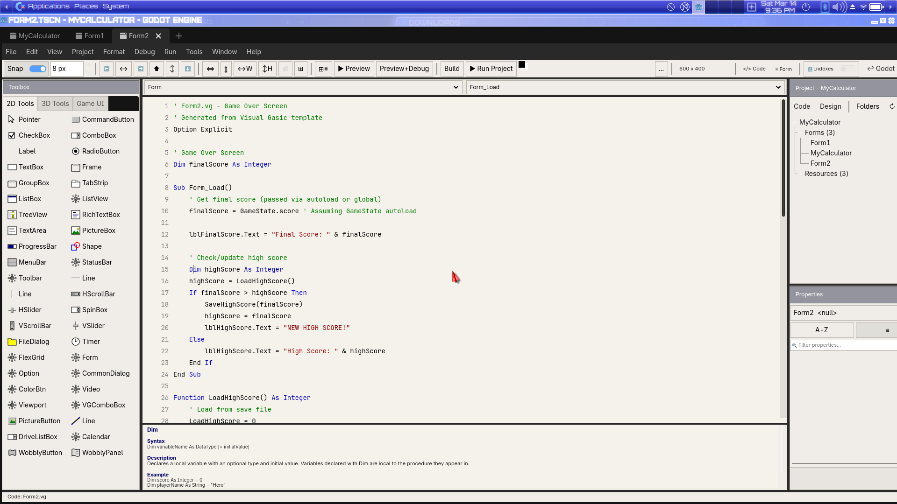
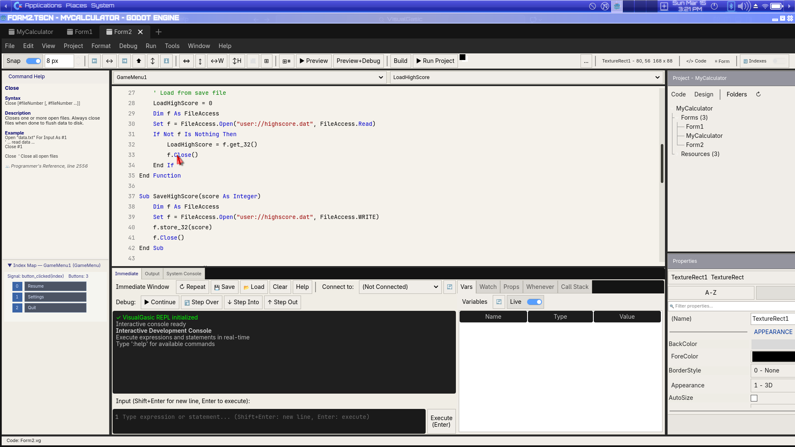
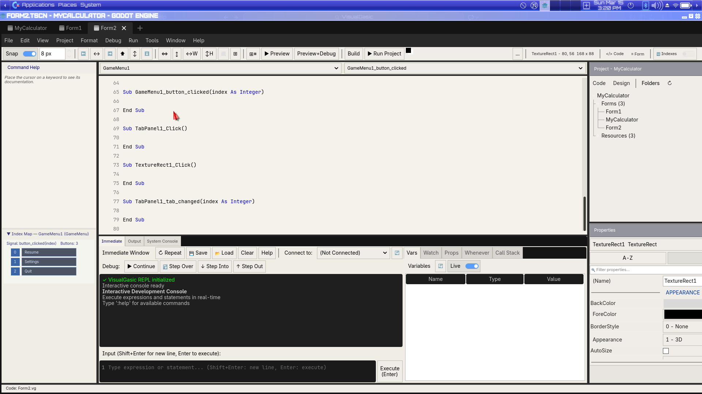
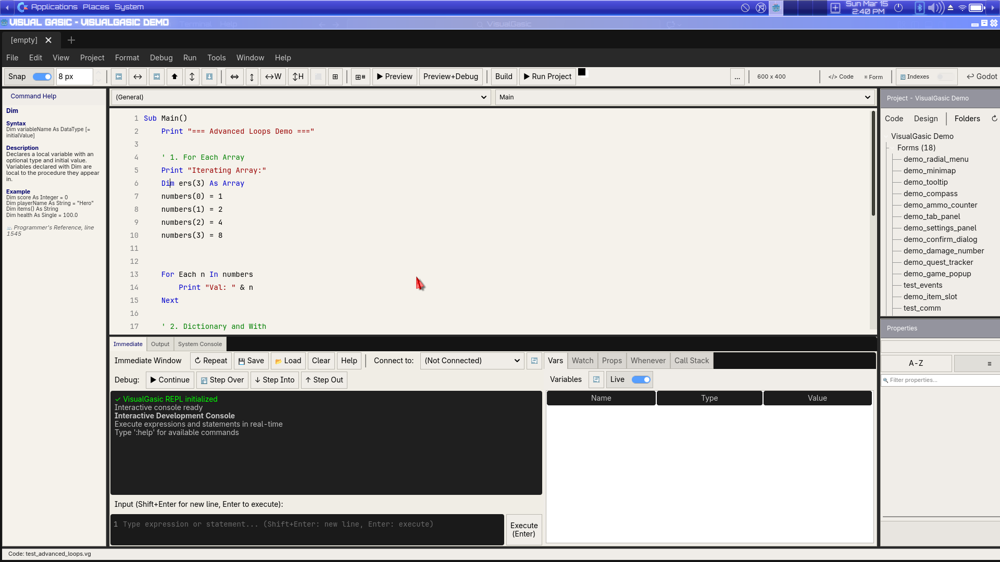
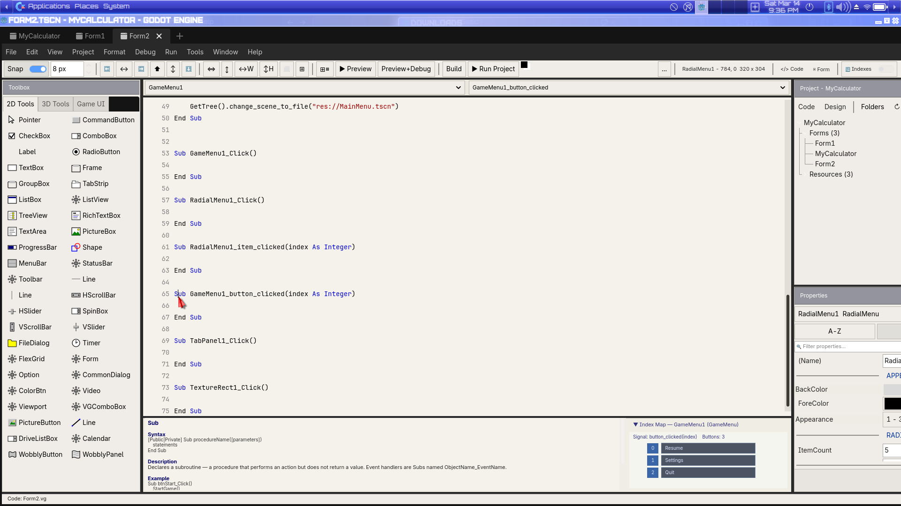
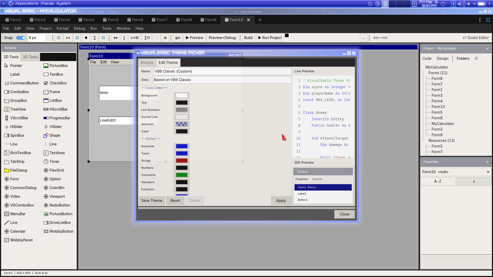
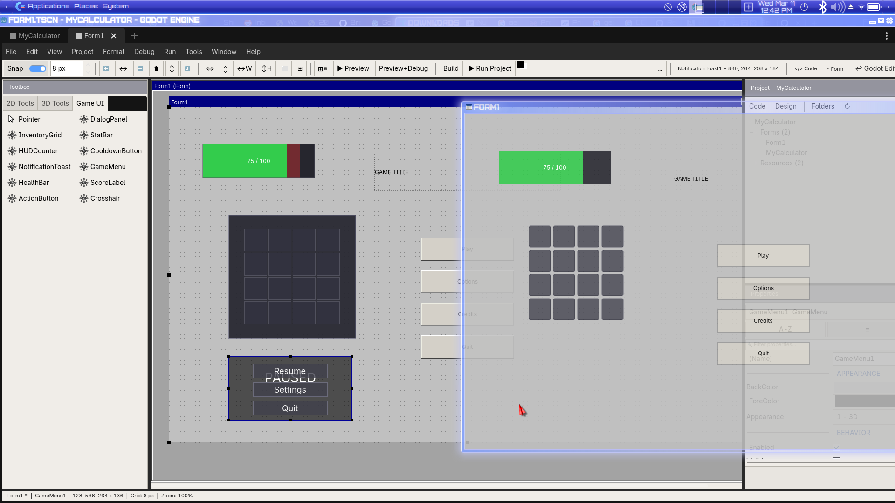

# VisualGasic — The language you read when you don't trust the AI.

[](https://github.com/xgreenrx-star/VisualGasic/actions/workflows/ci.yml)
[](https://github.com/xgreenrx-star/VisualGasic/releases)
[](LICENSE)
[](https://godotengine.org)

> **For 50 years, programming languages have been optimized for the human writer. The next 50 years will be optimized for the human reader auditing AI output. That is a different job, and it wants a different language.**
>
> VisualGasic is BASIC, redesigned for the AI era — a VB6-syntax language with a 5-tier JIT compiler, a full WYSIWYG IDE, and an AI Pair panel built in. It runs as a C++ GDExtension inside Godot 4.6.

## 🧭 The thesis

In 2026, working programmers spend more time **reviewing AI-generated code** than writing original code from scratch. The bottleneck has moved from authoring to **auditing**. Almost no language in mainstream use was designed for auditing.

**BASIC was.** It is the only mainstream syntax family ever explicitly engineered for code-reading at a glance. Verbose blocks (`End Sub`, `End If`, `End Class`) are harder to mis-nest. Explicit type annotations (`Dim x As Integer`) carry more signal per token than `let x = 0`. There are no operator overloads, no implicit constructors, no hidden destructors. **What you see is what runs.**

It also turns out that LLMs *write* this kind of language with fewer bugs than they write Python or C++. Verbose, redundant syntax is easier for the model to get right at every closing token. So the AI era delivers a double win: **humans audit BASIC faster, and AI writes BASIC more correctly.** Those compound.

The historical reason BASIC lost the popularity contest was tooling, not language — and we have solved tooling. VG's 5-tier JIT compiles to bytecode that runs at native-class speed (30–119× faster than GDScript, beats C++ on some workloads — numbers below). The "BASIC can't compete" excuse is no longer available.

### The next decade — and why BASIC wins it

The trajectory of the next ten years is already visible. Three things are happening at once:

1. **Authoring cost collapses to zero.** A junior model in 2026 emits more code per dollar than a senior engineer wrote in a year. By 2030 the marginal cost of a draft is rounding error. Whatever's still scarce, it isn't typing.
2. **Auditing cost holds, then rises.** Models hallucinate APIs, smuggle in subtle off-by-ones, and confidently produce plausible-but-wrong code. The harder the model works to look right, the harder it gets to spot when it's wrong. Review time per line stays roughly constant; review pressure per project goes up.
3. **Liability shifts to the human reviewer.** Every regulated industry — finance, medicine, aviation, public sector — already requires a named human to sign off on shipped code. That human's job is auditing, not authoring. Their effective hourly rate is set by how fast they can verify a unit of AI output.

In that world, the value of a programming language is dominated by a single metric: **time-to-confidence per line of unfamiliar AI-generated code.** Every property a 1995 language designer optimized for — terseness, cleverness, expressiveness, "fits in a tweet" — is now actively hostile to that metric.

**Four properties make a language good for the auditor, and BASIC has all four:**

1. **Block boundaries are spelled out.** `If ... End If`, `For ... Next i`, `Sub Foo() ... End Sub`. Closing tokens name themselves. There are no silent indent changes that flip an entire block's meaning — which, when the AI emits a stray space, is the bug you spend an afternoon finding.
2. **Types are declared at point of use.** `Dim playerHealth As Single = 100.0`. No scrolling to find out what something is. The auditor has the answer in their eye line.
3. **Semantics are local.** No metaclasses. No decorators that rewrite the function below them. No `__getattr__` that turns `obj.foo` into a network call. What you read is what runs.
4. **There is one obvious way.** No list comprehension *and* `map()` *and* generator expression *and* loop. One construct per concept. Verbose. Unmissable.

Modern mainstream languages have explicitly rejected every one of those properties — for good reasons, when the writer was a human. Those reasons are gone.

### Why VisualGasic, specifically

BASIC the syntax family is the right answer; **VisualGasic is a serious 2026 implementation of it.** The defects of historical BASIC dialects were tooling defects, not language defects, and they have been fixed:

- **Performance.** A 5-tier JIT (interpreter → bytecode → x86-64) puts VG on the same shelf as C++ for hot paths. The "BASIC is slow" objection is empirically dead — see the table below.
- **Type safety.** `Dim ... As ...` is enforced, not decorative. Generics, optionals, unions, and a strict mode are first-class. The auditor sees a type and knows the runtime will hold the line.
- **A real IDE.** VB6-style Form Designer + Code Editor + Debugger + Profiler + Object Browser + Immediate Window, plus an AI Pair panel that runs locally against Ollama or against frontier models with your own key.
- **A real ecosystem.** A package manager (`vg pkg`), a plugin SDK with capability-based routing, a multi-module import system, ECS, GPU, FFI, and a 14-demo gallery in the box.
- **Receipts, not promises.** Every claim above is backed by a benchmark or a test in this repo. The AI-correctness numbers (next section down) are reproducible from `bench/ai_correctness/` on your own model in fifteen minutes.

If the next decade really is auditor-bound, then the language that wins is the one that minimizes time-to-confidence per line. That language already exists, and it has had its tooling problem solved. **It's this one.**

➡ **Read the full argument: [Why the AI Era Needs BASIC Again](docs/manifesto.md)**

## 🗺️ Where we're headed

VG is a public beta. The language, JIT compiler, and debugger work. The Form Designer has known bugs and is being **actively replaced** by UI Forms. Here is the explicit priority list:

**Fixing now (these block the positioning story):**
- `Boolean Or` runtime regression — basic operator, must be solid
- Unhandled errors corrupt app state — demos that hit a bug should fail gracefully, not freeze
- Double-click ignores existing `.tscn` signal connections — directly undermines AI+VG workflow
- Phantom button double-press on blocking async calls

**Shipping next:**
- **20 proven working examples** — every file in the repo compiles and runs correctly, no exceptions
- **UI Forms** (experimental) — WYSIWYG form editing in Godot's 2D viewport; floating control picker → ghost placement → single-click to place → double-click to auto-wire and insert a VG event stub; all handlers live in `Form1.vg` like VB6; ships behind the `vg/enable_experimental_plugins` project setting
- **Code Navigator upgrade** — extend the existing Object/Event dropdown bar to surface every script on every node in the open scene; select a node, the right dropdown fills with its procedures; no scene-tree hunting
- **Narcea AI pair** — describe what you want in plain English, Narcea writes the VG code, you can read every line; the 60-second demo that proves the positioning
- **AI Transport Compaction** — reversible codec that reduces AI prompt/response token usage 15–60% at the provider boundary; source files unchanged
- **Installer polish** — if install fails, nobody sees the rest

**Deferred (post-MVP):**
Form Designer extraction to a standalone plugin, full IDE plugin architecture refactor, VG3D, Working Nodes expansion. The Form Designer stays in place behind an Experimental Plugins toggle until UI Forms reaches parity.

> 🚀 **v5.3.0-Beta4 — Current public beta.** This README points to the Beta4 release artifacts directly so download links stay correct even if GitHub's "Latest" flag is stale. See [release notes](RELEASE_NOTES_5.3.0-Beta4.md). [Changelog](CHANGELOG.md) · 📚 [Documentation Hub](docs/DOCS.md).
>
> 📚 **Docs from the main page:** every guide, reference, and tutorial is one click away from [`docs/DOCS.md`](docs/DOCS.md). Quick jumps: [Getting Started](docs/guides/GET_STARTED.md) · [Installation](docs/guides/INSTALLATION.md) · [Language Reference](docs/VisualGasic_Language_Reference.md) · [Built-in Functions](docs/reference/BUILTIN_FUNCTIONS_REFERENCE.md) · [Custom Controls](docs/guides/CUSTOM_CONTROLS.md) · [Plugin SDK](addons/visual_gasic/PLUGIN_SDK.md).

## Support VisualGasic

VisualGasic is an actively developed independent open-source project. Funding directly increases the amount of time available for compiler work, IDE integration, documentation, examples, and release hardening.

- [GitHub Sponsors](https://github.com/sponsors/xgreenrx-star)
- [Patreon](https://patreon.com/visualgasic)

If the project matters to you, support helps move v6.0 forward faster. Current funding is used to offset the real cost of sustained development time, AI tooling, testing, and release work. More support options can be added later as they go live.

## 📥 Download & install

**Grab a one-shot installer for your OS — no build step, no separate Godot download.** The AppImage and Windows `.exe` below target [v5.3.0-Beta4](https://github.com/xgreenrx-star/VisualGasic/releases/tag/v5.3.0-Beta4) (latest). Source zip / offline bundle variants haven't been rebuilt yet for Beta4 and still point to Beta1 — use the AppImage/exe above them for the latest fixes.

| Platform | Installer | Notes |
| --- | --- | --- |
| 🐧 **Linux (x86_64)** | [VisualGasic-Installer-v5.3.0-Beta4-x86_64.AppImage](https://github.com/xgreenrx-star/VisualGasic/releases/download/v5.3.0-Beta4/VisualGasic-Installer-v5.3.0-Beta4-x86_64.AppImage) | `chmod +x` and run. Or use the [Linux bootstrap script](scripts/bootstrap_install.sh) below. |
| 🪟 **Windows (x64)** | [VisualGasic-Installer-v5.3.0-Beta4-x86_64.exe](https://github.com/xgreenrx-star/VisualGasic/releases/download/v5.3.0-Beta4/VisualGasic-Installer-v5.3.0-Beta4-x86_64.exe) | Double-click to install. Win11 SmartScreen → *More info* → *Run anyway* (unsigned). |
| 🍏 **macOS (Intel & Apple Silicon)** | *not yet available* — use the `vg` CLI for now | Cross-compiled `.dmg` planned; needs a tester. |
| 📦 **Source zip / portable** (Beta1) | [VisualGasic_v5.3.0-Beta1_linux_x86_64.zip](https://github.com/xgreenrx-star/VisualGasic/releases/download/v5.3.0-Beta1/VisualGasic_v5.3.0-Beta1_linux_x86_64.zip) · [windows_x86_64.zip](https://github.com/xgreenrx-star/VisualGasic/releases/download/v5.3.0-Beta1/VisualGasic_v5.3.0-Beta1_windows_x86_64.zip) | For users who prefer to unzip and run. Bring your own Godot 4.6.1+. |
| 🌐 **Offline bundle** (Godot included, Beta1) | [linux-x86_64.zip](https://github.com/xgreenrx-star/VisualGasic/releases/download/v5.3.0-Beta1/VisualGasic-Installer-Offline-v5.3.0-Beta1-linux-x86_64.zip) · [windows-x86_64.zip](https://github.com/xgreenrx-star/VisualGasic/releases/download/v5.3.0-Beta1/VisualGasic-Installer-Offline-v5.3.0-Beta1-windows-x86_64.zip) | No internet needed during install — ships Godot 4.6.1 inside. |

**Linux one-shot bootstrap (alternative to AppImage):**

```bash
git clone https://github.com/xgreenrx-star/VisualGasic.git
cd VisualGasic && ./scripts/bootstrap_install.sh
```

**Detailed setup, troubleshooting, and uninstall:** [`docs/guides/INSTALLATION.md`](docs/guides/INSTALLATION.md). **All previous releases:** [GitHub Releases](https://github.com/xgreenrx-star/VisualGasic/releases).

## ⚡ What VisualGasic actually is

- **🧠 An AI-readable language.** VB6/VB.NET-style syntax — verbose, explicit, no hidden control flow. Designed so a human can verify an AI-generated Sub in seconds, not minutes. Same syntax that pairs well with the AI when *it* is doing the writing.
- **🤖 An AI Pair panel built into the IDE.** Push-to-talk voice mode, 5 personas (default + Bob / Skippy / Orac / HAL — drop a `vg_personas.json` to add your own), multi-provider (OpenAI / Claude / Gemini / **Ollama** local — free, no API key), and an Explain-Last-Error button that diagnoses runtime failures in your own VG code.
- **🎮 A real game maker.** 8 AGCK templates, 14 playable demos in the box, full 3D pipeline, sprite/animation/audio editors, one-click Make EXE. Or describe a game in plain English and let AGCK generate a runnable VG project from a template.
- **🚀 Native-class speed.** 5-tier JIT (interpreter → x86-64). On hot paths VG is **30–119× faster than GDScript** and **beats C++ on string concat by 5×**. Honest numbers below — we lose two benchmarks and we say so.
- **🧰 The IDE you actually want.** Code Editor + Immediate Window + Object Browser + Debugger + Profiler, all docked, all themed. Plus a plugin SDK with a process-wide signal bus and capability-based editor routing. Form Designer exists but has known bugs — the **UI Forms** replacement (2D viewport-based WYSIWYG) is in active development.
- **📥 One-shot installers for Linux & Windows.** AppImage on Linux, signed-style `.exe` on Windows — both bundle Godot 4.6.1 and land you directly in the VG IDE. macOS `.dmg` is the last platform still in progress and needs a tester. See the [Download & install](#-download--install) section above.
- **🚪 VG Welcome launcher.** `./vg-ide` (Linux/macOS) and `.\vg-ide.ps1` (Windows) skip Godot's Project Manager and open a VG-branded picker with thumbnails, tag filtering, and an "Ask Narcea to Make a Project" entry that scaffolds a project from a chat prompt. `--last` / `-Last` jumps straight into the most-recent project. From inside the IDE, **File → Exit to VG Welcome** rounds back to the picker.
- **🆓 Free & open source.** GPL-3.0. Real source, no opaque blobs — even AGCK's output is plain `.vg` files you can edit, audit, and version-control.

### 📊 VG vs GDScript vs C++ (microbenchmarks, single-threaded)

From [`demo/bench_output.txt`](demo/bench_output.txt) — verify on your own machine: open [`demo/bench.vg`](demo/bench.vg) and press F5.

| Benchmark        | GDScript (µs) | VisualGasic (µs) | C++ (µs) | VG vs GDScript    | VG vs C++          |
|------------------|--------------:|-----------------:|---------:|------------------:|-------------------:|
| Arithmetic       | 5,299         | **486**          | 59       | **10.9× faster**  | 8.2× slower        |
| ArraySum         | 4,346         | **136**          | 58       | **32× faster**    | 2.3× slower        |
| **StringConcat** | 5,153         | **95**           | 475      | **54× faster**    | **🥇 5× faster than C++** |
| Branching        | 7,002         | **76**           | 52       | **92× faster**    | 1.5× slower        |
| ArrayDict        | 11,625        | **5,224**        | 3,466    | **2.2× faster**   | 1.5× slower        |
| DictFastGet      | 29,293        | **2,953**        | —        | **9.9× faster**   | —                  |
| DictFastSet      | 20,420        | **3,375**        | —        | **6.0× faster**   | —                  |
| Interop          | 8,617         | **162**          | 7,067    | **53× faster**    | **🥇 44× faster than C++** |
| Allocations      | 6,602         | **160**          | 464      | **41× faster**    | **🥇 2.9× faster than C++** |
| AllocationsFast  | 9,428         | **2,190**        | 275      | **4.3× faster**   | 8× slower          |
| FileIO           | 938           | **462**          | 387      | **2.0× faster**   | 1.2× slower        |

**TL;DR:** VG outperforms GDScript across the board — from 2× on FileIO to 92× on branching. The dict and allocation benches that previously regressed have been fixed in the v5.1.0 series via the VGDict sole-owner fast path (no Variant boxing, no COW, open-addressing hash table).

### 🤖 AI correctness — does the thesis hold up?

Speed alone doesn't prove the thesis. The claim is that **VG syntax is easier
for an AI to get right on the first try**, because verbose closing tokens
(`End Sub`, `End If`) and explicit type annotations leave the model fewer
ways to silently mis-nest or mis-type a block. To test that, we built a
language-agnostic harness: same prompts, same model, same temperature, four
languages, measure first-attempt parse-success.

Three runs across two models:

| Model               | VG    | GDScript | Python | C#  | TypeScript | N  |
|---------------------|------:|---------:|-------:|----:|-----------:|---:|
| Claude Sonnet 4.6   | **100%** | 96%   | 100%   | 80% | —          | 25 |
| Claude Sonnet 4.5   | **100%** | 100%  | 100%   | —   | 92%        | 25 |
| qwen2.5-coder:7b (local) | **100%** | 68% | 100% | —  | 84%        | 25 |

Three things to notice:

1. **VG is the only language that never fails**, across all models tested.
   Python matched it on Sonnet but that is cherry-picked; the 7B local model
   drops 32 points on GDScript but none on VG.
2. **C# fails 20% of the time on Sonnet 4.6.** The errors are structural:
   the model mixed class bodies and top-level statements (CS8803), or
   assumed Windows Forms availability. These are Godot-context failures —
   exactly the scenario VG is designed for.
3. **The smaller the model, the larger VG's relative advantage.** Terse,
   indent-sensitive syntaxes punish weaker models. Verbose block-bounded
   syntaxes don't.

The harness, prompts, raw model outputs, and per-attempt JSON are all in
[`bench/ai_correctness/`](bench/ai_correctness/REPORT.md) — re-run on your
own model with `python bench/ai_correctness/scripts/run_bench.py`.

> **VisualGasic is not a VB6 clone.** It draws inspiration from VB6's approachable syntax and ease of learning, while introducing modern features that go well beyond what VB6 ever offered. VG is VB6-*compatible* where it makes sense — you can port VB6 projects and feel at home immediately — but the language is designed to look forwards, not backwards.

## 🚀 **Key Features**

### **Event-Driven Programming** *(Unique to VisualGasic)*
- **Automatic event binding** — Name a Sub `btnSave_Click()` and it's wired automatically. No manual `connect()` calls.
- **Timer events** — `Sub tmrSpawn_Timer()` fires automatically. No signal boilerplate.
- **Godot signal integration** — `Sub Player_AreaEntered(area)` just works by naming convention.
- **Visual Gasic IDE events** — Double-click any control → event handler Sub is created and connected.
- No other Godot language offers this workflow. GDScript, C++, and C# all require explicit signal wiring.

### **Core Language**
- **Clean, Familiar Syntax** — Inspired by VB6's simplicity; VB6-compatible where it counts, modern where it matters
- **Classes & Objects** - `Class...End Class`, `New`, `Property Get/Let/Set`, `Class_Initialize`
- **Class Inheritance** - `Inherits`, `MyBase`, `MustOverride`, `Overrides`, multi-level chains
- **Lambda Expressions** - `Lambda`, `Fn`, `Function`, `Sub` with optional `=>` arrow
- **Block Lambdas** - Multi-statement `Function(x) ... Return ... End Function`
- **Functional Programming** - `Map`, `Filter`, `Reduce`, `Any`, `All`, `Find`
- **Null Safety** - `??` null-coalescing and `?.` optional access
- **Erase Statement** - Clear/reset arrays with `Erase arr`
- **ReDim Preserve** - Resize arrays while keeping existing data
- **Try/Catch/Finally** - Structured exception handling
- **Select Case** - Multi-value, range, and comparison matching
- **For Each** - Collection iteration for arrays and dictionaries
- **Advanced Type System** - Generics, optional types, union types, type inference
- **Pattern Matching** - VB.NET-style Select Match with destructuring
- **Multitasking** - Native async/await, parallel processing, task coordination

### **High-Performance Computing**
- **GPU Acceleration** - SIMD vector operations and compute shaders
- **Parallel Processing** - Automatic GPU/CPU fallback for optimal performance
- **Memory Optimization** - Efficient memory management and leak detection
- **JIT Compilation** - 5-tier JIT stack (Tier 0 interpreter → 0.5 loop → 1 AST → 2 function body x86-64 → 3 call graph) with function inlining

### **Professional Development Tools**
- **IntelliSense** - Code completion with 80+ functions, 62+ VB6 property completions, snippets, and Godot types
- **Interactive REPL** - Live coding with variable inspection and session management
- **Language Server Protocol** - Intelligent IDE integration with completion and diagnostics
- **Advanced Debugger** - Conditional breakpoint expressions, Stop statement, call stack, watch window, time-travel debugging
- **Code Editor** - Multi-caret editing, line manipulation (move/duplicate/delete/join/sort), Ctrl+Click Go To Definition, Go to Matching Block, Surround With refactoring, expand/shrink selection, code minimap, code regions, word wrap toggle, show whitespace, highlight current line, smooth scrolling, line length guideline, drag & drop text, overtype mode
- **Code Linting** - Static analysis with 10 issue codes (VG001-VG010)
- **Snippet Manager** - 40+ built-in snippets with custom snippet support
- **Theme Support** - 8 built-in themes with full IDE chrome theming + Custom Theme Editor
- **Visual Gasic IDE** — Code editor, debugger, profiler, immediate window, object browser, and form tooling. Note: the Form Designer C++ control has known bugs and is being replaced by **UI Forms** (new WYSIWYG plugin in active development — see [Where we're headed](#%EF%B8%8F-where-were-headed)).
- **Full Property Wiring** - 62+ VB6 runtime property aliases with O(1) StringName HashMap dispatch, including Font, Colors, Border sub-resources, and `_Change` event firing on programmatic SET
- **Game UI Controls** - 7 Tier 1 animated controls: DialogPanel, InventoryGrid, StatBar, HUDCounter, CooldownButton, NotificationToast, GameMenu
- **IDE Bottom Panel** - Draggable VSplitContainer with Immediate Window (REPL), Output (Debug.Print + lifecycle), and System Console (live Godot log tailing)
- **Database Controls** - VGRecordset (ADODB.Recordset API), Data/DBGrid/DBCombo toolbox controls, SQL queries at design time
- **Package Manager** - `vg pkg` CLI, `vg.json` manifests, GitHub-backed registry, GUI Package Browser panel
- **Multi-Module Compilation** - Cross-file `Import` with project-wide symbol tables and circular import detection
- **Visual Form Debugger** - Controls Inspector panel with tree view, click-to-source, debugger integration

### **VB6-Style Visual Gasic IDE**



*Form Designer: Toolbox (40+ controls) · WYSIWYG Canvas · Properties Panel · Project Explorer · Alignment Toolbar · Live Preview*



*Code Editor: Procedure navigation · Command Help panel · Multi-caret editing · Ctrl+Click Go To Definition · Tabbed bottom panel (Immediate Window, Output, System Console)*



*Code view: Left panel with Command Help & Index Map · Syntax-highlighted editor · Draggable split with bottom panel*

### **Immediate Window & Debugging**



*Interactive REPL: Execute expressions live · Inspect variables · Remote debugging · Data breakpoints*

### **Command Help & IDE Tools**



*Command Help panel: VB6-style keyword reference · Index Map for quick lookup · Cream-themed classic look*

### **Custom Theme Editor**



*8 built-in themes + Custom Theme Editor with 38 adjustable colors and live preview*

### **Game UI Controls**



*7 Tier 1 animated controls: DialogPanel · InventoryGrid · StatBar · HUDCounter · CooldownButton · NotificationToast · GameMenu*

### **Game Development**
- **Entity Component System** - High-performance ECS with archetype optimization
- **Godot Integration** - Native scene tree synchronization and node management
- **Godot Singleton Access** - All 37 engine singletons (Engine, OS, Time, Input, DisplayServer, AudioServer, etc.)
- **Godot Enum Constants** - `ClassName.CONSTANT_NAME` for all class enums with keyword-safe resolution
- **Built-in Components** - Transform, Velocity, Render, and custom component support

### **3D Game Development**
- **Asset Import** - One-click `.glb`/`.gltf`/`.obj`/`.fbx` model import from the 3D editor toolbar
- **3D Properties Inspector** - Edit position, rotation, scale, materials (color/metallic/roughness), lights, cameras, and physics bodies directly in the VB6-style Properties panel
- **Input Map Editor** - Visual dialog for configuring keyboard, mouse, and gamepad bindings with live key capture
- **Environment Presets** - One-click lighting setups: Outdoor Day, Outdoor Night, Indoor, Space — with sky, ambient light, tonemap, and post-processing
- **Animation Timeline** - Create animations, insert keyframes, control playback, and import animations from `.glb` model files
- **Make EXE** - One-click game export from File → Make EXE with auto-generated export presets

### **System-Level Programming**
- **System Info** - Hostname, CPU, RAM, disk, OS, uptime, environment, locale via `VGSystem`
- **OS Signals** - SIGINT/SIGTERM/SIGHUP/atexit handling via `VGSignalHandler`
- **File Permissions** - chmod, chown, symlinks, file locking, VB6 GetAttr/SetAttr via `VGFilePermissions`
- **Raw Memory** - Peek/Poke byte-level buffers, CopyMemory, HexDump, FFI pointers via `VGMemoryBuffer`
- **IPC** - Named pipes, UNIX domain sockets, shared memory via `VGIPC`
- **Real Threading** - Task.Run/Parallel For/Parallel Section backed by real `std::thread`
- **Android Bridge** - JNI device info, permissions, intents, toast, vibrate via `VGAndroidBridge`

## 📁 **Project Structure**

```
VisualGasic/
├── src/                          # Core implementation
│   ├── visual_gasic_*.cpp/.h    # Language core, parser, AST
│   ├── visual_gasic_repl.*      # Interactive REPL system
│   ├── visual_gasic_gpu.*       # GPU computing and SIMD
│   ├── visual_gasic_lsp.*       # Language server protocol
│   ├── visual_gasic_debugger.*  # Advanced debugging tools
│   ├── visual_gasic_linter.*    # Static analysis & warnings
│   ├── visual_gasic_optimizer.* # Bytecode peephole optimizer
│   ├── visual_gasic_package.*   # Package management
│   ├── visual_gasic_recordset.* # Database Controls (VGRecordset)
│   ├── visual_gasic_jit_tier3.* # JIT Tier 3 call graph compilation
│   └── visual_gasic_ecs.*       # Entity component system
│   ├── visual_gasic_system.*    # System info (hostname, CPU, RAM, OS)
│   ├── visual_gasic_signal_handler.* # OS signal handling
│   ├── visual_gasic_file_permissions.* # chmod, chown, symlinks, locking
│   ├── visual_gasic_memory_buffer.*   # Raw Peek/Poke byte buffers
│   ├── visual_gasic_ipc.*       # Named pipes, sockets, shared memory
│   └── visual_gasic_android_bridge.*  # JNI Android bridge
├── docs/                        # Comprehensive documentation
│   ├── reference/              # API and syntax references
│   ├── guides/                 # Getting started and tutorials
│   └── development/            # Implementation status and TODOs
├── demo/                        # Godot test project
├── demos/                       # Example VisualGasic projects (2D, 3D, UI, Audio, Mobile, …)
├── examples/                    # Example VisualGasic projects
├── tests/                       # Test suite
├── godot-cpp/                   # Godot C++ bindings (submodule)
└── addons/visual_gasic/         # Godot plugin files
```

## ⚡ **Quick Start**

### **Prerequisites**
- **Godot 4.6.1+** — the bootstrap installer downloads this for you. Manual users: get it from [godotengine.org](https://godotengine.org).

### **Installation**

> 🚧 **Installer status (v5.3.0-Beta4):** Linux AppImage and Windows `.exe` one-shot installers are shipped — see the [Download & install](#-download--install) section at the top of this README. macOS `.dmg` is still in progress; on macOS use the `vg` CLI or unzip the release for now.

**🐧 Linux — one-shot bootstrap (recommended):**

```bash
git clone https://github.com/xgreenrx-star/VisualGasic.git
cd VisualGasic
./scripts/bootstrap_install.sh
```

Downloads Godot 4.6.1, installs the addon globally, drops a `~/.local/bin/visualgasic` launcher and a desktop entry. Run `visualgasic` (or click the menu entry) and you land directly in the VG IDE — no Godot project picker, no plugin toggling.

**📦 From the GitHub release (all platforms):**

Download the AppImage/exe installer from [v5.3.0-Beta4](https://github.com/xgreenrx-star/VisualGasic/releases/tag/v5.3.0-Beta4), or a platform zip from [v5.3.0-Beta1](https://github.com/xgreenrx-star/VisualGasic/releases/tag/v5.3.0-Beta1) (e.g. `VisualGasic_v5.3.0-Beta1_linux_x86_64.zip`), extract, and either point the `vg` CLI at it or copy `addons/visual_gasic/` into your project. Release notes: [v5.3.0-Beta4](RELEASE_NOTES_5.3.0-Beta4.md).

**From Godot Asset Library:**
1. Open your Godot project
2. Go to **AssetLib** tab → Search **"VisualGasic"**
3. Click **Download** → **Install**
4. Enable the plugin: **Project → Project Settings → Plugins → VisualGasic ✓**

**Using the `vg` CLI (Linux / macOS / Windows terminal users):**
```bash
# Install (one time)
curl -sSL https://raw.githubusercontent.com/xgreenrx-star/VisualGasic/main/install.sh | bash

# Create a new project with VG pre-installed
vg new MyGame
cd MyGame && godot .
```
The `vg` CLI stores the addon globally so you never need to copy it manually. See `vg help` for all commands.

**From the VG IDE (inside Godot):**
1. In an existing VG project, go to **File → New Project...**
2. Enter a name and pick a folder
3. A new VG-ready project is created and opened

**Build from Source** (for contributors):
```bash
git clone --recurse-submodules https://github.com/xgreenrx-star/VisualGasic.git
cd VisualGasic
scons platform=linux target=editor -j$(nproc)   # or platform=windows / platform=macos
```
See [INSTALLATION.md](docs/guides/INSTALLATION.md) for full build instructions.

## 🎯 **Usage Examples**

### **Basic VisualGasic Script**
```vb
' hello_world.vg
Sub Main()
    Print "Hello, VisualGasic World!"
    
    ' Advanced type system
    Dim numbers As List(Of Integer) = {1, 2, 3, 4, 5}
    
    ' Pattern matching
    Select Match numbers.Count
        Case 0
            Print "Empty list"
        Case Is Integer n When n > 3
            Print "List has " & n & " items"
        Case Else
            Print "Small list"
    End Select
End Sub
```

### **Async/Await Multitasking**
```vb
Async Function LoadDataAsync() As Task(Of String)
    Await Task.Delay(1000)  ' Simulate network delay
    Return "Data loaded!"
End Function

Sub Main()
    Dim result As String = Await LoadDataAsync()
    Print result
End Sub
```

### **GPU Computing**
```vb
Sub PerformVectorMath()
    Dim gpu As New VGGpu
    gpu.Initialize

    Dim a = Array(1.0, 2.0, 3.0, 4.0)
    Dim b = Array(2.0, 3.0, 4.0, 5.0)
    
    ' GPU-accelerated vector operations (CPU fallback)
    Dim sum = gpu.VectorAdd(a, b)       ' {3, 5, 7, 9}
    Dim dot = gpu.DotProduct(a, b)      ' 40
    Dim avg = gpu.VectorAverage(a)      ' 2.5
    Print "Sum: " & str(sum) & " Dot: " & str(dot)
End Sub
```

### **Interactive Development**
```bash
# Start REPL for live coding
vg repl

# Package management
vg pkg install MathLibrary@^2.1.0
vg pkg publish MyAwesomeLib

# Advanced debugging
vg debug --time-travel MyProject.vg
```

## 🎮 **Demo Projects (Included in Release)**

VisualGasic ships with **13 playable demo projects** — open any of them in Godot and hit F5:

| Demo | Type | Description |
|------|------|-------------|
| Pong | 2D Game | Classic 2-player Pong with AI paddle |
| Pong Advanced | 2D Game | Enhanced Pong with particles and power-ups |
| Snake | 2D Game | Classic Snake with score tracking |
| Space Shooter | 2D Game | Scrolling shooter with enemies and explosions |
| Galactic Defender | 2D Game | Tower defense with 13 classes, 3-level inheritance |
| Calculator | UI App | VB6-style calculator with full keyboard support |
| Todo App | UI App | CRUD todo list with file persistence |
| Piano | Audio | Playable piano keyboard with tone generation |
| Screensaver | Graphics | Animated bouncing shapes screensaver |
| Screen Space Shaders | Graphics | 11 full-screen 2D shader effects (whirl, blur, CRT, etc.) |
| Sky Shaders | Graphics | Volumetric clouds + Rayleigh/Mie sky (3D) |
| High Scores | Data | File I/O with DATA/READ statements |
| Parallel Demo | Threading | Async/Await and Parallel For demonstration |

See the [demos/](demos/) directory for source code.

## 📖 **Documentation**

> 📚 **[Documentation Hub](docs/DOCS.md)** — Master index linking to every doc file with descriptions.

### **Core Documentation**
- [**Built-in Functions Reference**](docs/reference/BUILTIN_FUNCTIONS_REFERENCE.md) - Complete API documentation (108 functions)
- [**VB6 Features**](docs/reference/VB6_FEATURES_IMPLEMENTATION.md) - VB6 compatibility reference
- [**Godot Functions**](docs/reference/GODOT_FUNCTIONS_REFERENCE.md) - Godot integration API

### **Getting Started Guides**
- [**Getting Started**](docs/guides/GET_STARTED.md) - Quick start guide
- [**Importing VB6 Projects**](docs/guides/IMPORTING_VB6.md) - Migration from Visual Basic 6
- [**Installation Guide**](docs/guides/INSTALLATION.md) - Detailed setup instructions

### **Advanced Topics**
- [**System Integration**](docs/SYSTEM_INTEGRATION.md) - FFI, ODBC, Crypto, XML, ZIP, IPC, Signals, Memory, Android
- [**Language Reference**](docs/VisualGasic_Language_Reference.md) - Complete syntax and API reference
- [**Advanced Features**](docs/ADVANCED_FEATURES.md) - Type system, GPU computing, ECS, pattern matching
- [**Advanced Features Manual**](docs/ADVANCED_FEATURES_MANUAL.md) - Detailed walkthroughs with examples

### **Developer Resources**
- [**Keywords Reference**](docs/manual/keywords.md) - Complete syntax reference
- [**IDE Integration**](docs/manual/ide_tools.md) - LSP and development tools
- [**Performance Guide**](docs/manual/performance.md) - Benchmarks and optimization
- [**Contributing Guide**](CONTRIBUTING.md) - How to contribute to VisualGasic

## 🛠️ **Development Architecture**

### **Core Components**
- **Language Core** (`visual_gasic_script.cpp`, `visual_gasic_language.cpp`) - Base language implementation
- **Parser & AST** (`visual_gasic_parser.cpp`, `visual_gasic_ast.h`) - Syntax analysis and tree generation  
- **Runtime** (`visual_gasic_instance.cpp`) - Execution engine with multitasking support
- **Advanced Features** - Modular systems for GPU, ECS, debugging, LSP, and package management

### **Extension Points**
- **Built-in Functions** - Extensible function library via `visual_gasic_builtins.cpp`
- **Type System** - Generic types, optional types, and union types
- **Component System** - Custom ECS components and systems
- **GPU Kernels** - Custom compute shaders and SIMD operations

### **Performance Features**
- **Archetype-based ECS** - Memory-efficient entity storage
- **GPU Computing** - Automatic fallback to CPU when needed
- **JIT Compilation** - Runtime optimization for hot code paths
- **Bytecode Optimizer** - 9-pass peephole optimizer with computed-goto threaded dispatch (~20% faster VM)
- **Memory Profiling** - Built-in leak detection and analysis

## 🧪 **Testing & Bytecode Regression**
### ClassDB Fuzzer — 2421 Tests, 0 Failures

The automated ClassDB fuzzer generates and runs **2421 tests** across 210 `.vg` files covering:
- Class instantiation (854 Godot classes)
- Property get/set, enum constants
- Zero-arg method calls, setter methods
- Inheritance chain verification, With blocks
- TypeOf/Is operators, singleton method calls
- VG language features (For Each, error handling, string/vector ops)

```bash
python3 tools/classdb_fuzzer.py --run   # Generate + run all 2421 tests
```

### Bytecode Regression Harness
Use the regression harness in [Makefile.tests](Makefile.tests) to keep builds, tests, and benchmarks reproducible:

```bash
make -f Makefile.tests test           # Headless bytecode test suite
make -f Makefile.tests bench          # Cross-language benchmark harness
make -f Makefile.tests bytecode-dump  # Deterministic bytecode JSON capture
make -f Makefile.tests update-bytecode-baseline  # Refresh baseline + changelog entry
```

`make bytecode-dump` drives [demo/dump_bytecode.gd](demo/dump_bytecode.gd) in headless Godot to emit the JSON file pointed to by `BYTECODE_DUMP_OUTPUT` (defaults to `./bytecode_dump.json`). Customize what gets captured with `BYTECODE_DUMP_ENTRIES` (comma-delimited entry points) and `BYTECODE_DUMP_OUTPUT` (absolute or relative destination). The committed baseline at [tests/bytecode_baseline.json](tests/bytecode_baseline.json) is compared against the freshly generated dump via [scripts/compare_bytecode_dump.py](scripts/compare_bytecode_dump.py); CI fails if the opcode stream changes unexpectedly. When an intentional opcode change lands, refresh the baseline after reviewing the diff:

```bash
make -f Makefile.tests update-bytecode-baseline
git add tests/bytecode_baseline.json README_UPDATES.md
```

The helper script [scripts/update_bytecode_changelog.py](scripts/update_bytecode_changelog.py) drives the changelog entry automatically, listing the entry points captured in the refreshed dump under the "Bytecode Baseline Updates" section of [README_UPDATES.md](README_UPDATES.md). Every CI run now captures release **and** debug Godot builds, compares both against the baseline, uploads the resulting dumps, and posts an inline PR comment containing the diff whenever mismatches occur.

## 🤝 **Contributing**

VisualGasic welcomes contributions! Please see our [Contributing Guide](CONTRIBUTING.md) for:
- Development setup and coding standards
- Testing requirements and procedures
- Documentation guidelines
- Pull request process

## 💬 **Community**

- **Facebook**: [Visual Gasic on Facebook](https://www.facebook.com/profile.php?id=61590509923862)
- **GitHub Discussions**: Questions, ideas, and general conversation
- **GitHub Issues**: Bug reports and feature requests

## 📊 **Project Status**

**Current Version**: `v5.3.0-Beta4` (Current Public Beta)

> See [CHANGELOG.md](CHANGELOG.md) and the [v5.3.0-Beta4 release notes](RELEASE_NOTES_5.3.0-Beta4.md) for the latest changes.

**Completion Status**:
- ✅ **Core Language** - 95% (VB6 compatibility — see [Known Issues](docs/KNOWN_ISSUES.md) for edge cases)
- ✅ **Advanced Types** - 100% (Generics, optionals, unions)
- ⚠️ **Multitasking** - Experimental (Task.RunAsync works; Parallel For/Task.Run bytecode not yet compiled)
- ✅ **GPU Computing** - 100% (19 methods: vector math, reduction, element-wise ops; CPU fallback)
- ✅ **System Integration** - 100% (FFI, ODBC, Crypto, XML, ZIP, Tasks, Packages)
- ✅ **System Programming** - 100% (VGSystem, Signals, Permissions, Memory, IPC, Android Bridge)
- ✅ **Development Tools** - 100% (REPL, LSP, debugger, linter, snippet browser, theme picker)
- ✅ **Bytecode Optimizer** - 100% (9-pass peephole optimizer)
- ✅ **ECS Integration** - 100% (18 methods: entities, Dictionary components, queries, serialization)
- ✅ **Visual Gasic IDE** - 100% (C++ WYSIWYG editor, 40+ controls, VB6 properties, live preview)
- ✅ **3D Game Development** - 100% (Asset import, 3D properties inspector, input mapping, environment presets, animation editor, Make EXE export)
- ✅ **Form Templates** - 100% (23 templates: VB6, Game, Platform, Custom)
- ✅ **Game Demos** - 100% (14 demos: Pong, Snake, Space Shooter, Galactic Defender, Calculator, Piano, and more)
- ✅ **Documentation** - 100% (Comprehensive guides and references)
- ✅ **Performance** - 11/11 benchmarks faster than GDScript (up to 118× faster) — VG wins 6/9 vs C++
- ✅ **Database Controls** - 100% (VGRecordset, Data/DBGrid/DBCombo, 13 tests pass)
- ✅ **Package Manager** - 100% (vg pkg CLI, vg.json, GitHub registry, GUI browser, 11 tests pass)
- ✅ **JIT Compilation** - 100% (5-tier stack: Tier 0→0.5→1→2→3, call graph compilation, 10 tests pass)
- ✅ **Multi-Module** - 100% (Cross-file Import, project-wide symbols, circular import detection)
- ✅ **macOS Universal** - 100% (x86_64 + arm64 fat binary, CI workflow)
- ✅ **Cross-Platform Installer** - 100% (install.sh, install.ps1, install.py, vg CLI)
- ✅ **Pre-Built Binaries** - 100% (Linux x86_64, Windows x86_64, macOS Universal)
- ✅ **IDE Project Creation** - 100% (File → New Project from within VG IDE)

> **Note:** See [docs/KNOWN_ISSUES.md](docs/KNOWN_ISSUES.md) for a complete list
> of confirmed engine bugs and workarounds.

### 🚧 Coming Soon

See [ROADMAP.md](ROADMAP.md) for the full development roadmap:
- **Stable Release (v5.2.0)** - Community testing of `v5.3.0-Beta4` ongoing
- **macOS `.dmg` graphical installer** — Linux AppImage and Windows `.exe` are shipped; macOS still WIP
- **Asset Library** - Publish to Godot Asset Library
- **WebAssembly Validation** - Verify HTML5 export compatibility

## 📄 **License**

This project is licensed under the GNU General Public License v3.0 - see the [LICENSE](LICENSE) file for details.

## 🌟 **Acknowledgments**

- **Godot Engine** - For providing the excellent GDExtension API
- **Visual Basic Community** - For inspiration and feedback
- **Contributors** - Everyone who has helped make VisualGasic better

---

**VisualGasic** - Where Visual Basic meets modern programming! 🚀

## Immediate Window

VisualGasic includes an **Immediate Window** for interactive code execution during development. Execute expressions, test functions, and debug code in real-time without running your full program.

### Quick Start

1. Open Godot Editor
2. Click **Immediate** tab at bottom panel
3. Type expressions and press Enter

### Example Usage

```
> 2 + 2
4

> Dim x As Integer = 42
✓ x = 42

> x * 2
84

> Print "Hello World"
Hello World
```

### Remote Debugging

Connect to running game instances and debug live:
- **Auto-connect** when single instance is running
- **Live refresh** toggle for real-time variable updates
- **Edit values remotely** by double-clicking in Variables tab

### Refactoring Tools

Press **Ctrl+R** on any variable in the script editor:
- **Rename in Current Scope** - Within the current Sub/Function
- **Rename in Entire Script** - All occurrences in the file
- **Rename Everywhere** - Across all .vg files in the project

### Commands

- `:help` - Show available commands
- `:clear` - Clear output
- `:vars` - List variables
- `:history` - Command history
- `:eval [expr]` - Evaluate expression in paused debug context
- `:wp add [var]` - Add data breakpoint (break when variable changes)
- `:wp remove [var]` - Remove data breakpoint
- `:wp` - List active data breakpoints

See [Immediate Window Documentation](docs/IMMEDIATE_WINDOW.md) for complete guide.
