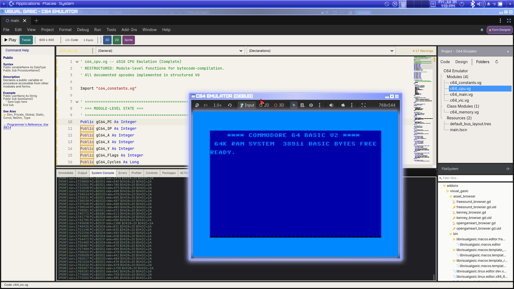

# VisualGasic 5.3.0-Beta3 Release Notes

**Release Date:** July 31, 2026
**Status:** Beta (Feature Complete, Early Adopter Testing)
**Previous Release:** [5.3.0-Beta2](https://github.com/xgreenrx-star/VisualGasic/releases/tag/v5.3.0-Beta2) (July 15, 2026)
**Target Engine:** Godot 4.6.1
**Platforms:** Linux x86_64, Windows x86_64 (desktop)

---

## Overview

VisualGasic 5.3.0-Beta3 is a performance-and-correctness release built around two brand-new full hardware emulator demos — a **Commodore 64** (6510 CPU, VIC-II, CIA1/CIA2, real KERNAL/BASIC ROMs) and a **Game Boy Advance** (ARM7TDMI/Thumb) — that surfaced and fixed a dense cluster of real interpreter bugs no synthetic test had caught. It also ships cross-module bytecode compilation for imported Subs, the new `MemoryBuffer` buffer type and optimizer hints, a `Global` keyword, cross-file class `Import`, `Exit While`, and a measured ~21–40% reduction in call/hot-path overhead. This release stays within Milestone **M1–M5** scope (M5 Narcea AI pair groundwork continues).

**Key numbers:** 777/777 regression assertions passing (98 files, up from 763) · 54 corpus examples passing (up from 44) · 2 new full hardware emulator demos.

---

## What's New Since 5.3.0-Beta2

### 🎮 New Demo — Commodore 64 Emulator

`demos/C64_Emulator/` is a from-scratch software C64: all 151 documented 6510 opcodes, a full 64KB address space with ROM/RAM bank switching, a VIC-II graphics chip (raster timing, border/interior rendering, raster IRQs), CIA1/CIA2 I/O (timers, keyboard matrix), and the **real KERNAL and BASIC V2 ROMs** running unmodified. It boots all the way to the `**** COMMODORE 64 BASIC V2 ****` banner and a working `READY.` prompt.

Building it surfaced (and fixed) a chain of real emulation bugs:

- **`BlitImage` silent no-op** — passing `Rect2`/`Vector2` (float) instead of `Rect2i`/`Vector2i` to `BlitImage` silently produced a zero-size copy. The VIC/GPU framebuffer was never reaching the screen texture in *either* new emulator demo. Fixed by switching both to `BlitImage`'s plain-integer 8-arg overload.
- **VIC-II frame-wipe race** — the renderer wiped the whole framebuffer with border color every raster wrap, and the display trigger snapshotted it before the new frame's scanlines redrew the interior, so the screen only ever showed a solid border color.
- **38-column mode black gap** — VIC-II's CSEL=0 narrow text window vacated an 8px strip per side that nothing repainted.
- **Border/viewport mismatch** — `_Draw()` used physical monitor resolution instead of the actual game window size to compute its scale factor, so only a sliver of the framebuffer was ever visible.
- **Boot-stub stack corruption (the big one)** — the boot stub used `SP=$FD` instead of replicating the real hardware's `LDX #$FF : TXS` reset sequence. A `JSR` return address landed exactly where the KERNAL's `INITMEM` zero-page-copy routine writes, corrupting the return address and silently skipping the startup banner via a bogus warm-start. Root-caused via cycle-by-cycle PC tracing; fixed by replicating the real reset sequence.

```vg
' Fixed boot stub excerpt — real hardware reset order matters
Mem_Write &HC000, &HA2   ' LDX #$FF
Mem_Write &HC001, &HFF
Mem_Write &HC002, &H9A   ' TXS  (SP=$FF before any JSR)
```

**Known, not a bug:** clearing KERNAL's RAM-test (RAMTAS) at boot is slow — the emulator currently runs at ~600–700 cycles/sec versus real PAL hardware's ~985,000 cycles/sec (the AST-interpretation-speed issue tracked separately, see `/memories/repo/vg_bytecode_perf.md`). This is a genuine performance target for a future release, not a rendering defect.

### 🕹️ Demo Fixes — Game Boy Advance Emulator

`demos/GBA_Emulator/` (added earlier this cycle) received a batch of correctness fixes from real-ROM testing: Thumb opcode bit-field decoding bugs, ARM CPU core bugs, class-instance field-visibility bugs, same-class sibling method call resolution, `_Draw` Object comparison, calls to non-existent builtins (`HasMember`/`PropertyGet`/`ArrayLen`), and a new **Load ROM...** button with a `FileDialog` picker.

### ⚡ Added — Cross-Module Bytecode Compilation for Imported Subs

Subs and Functions defined in `Import`'d `.vg` files now compile to bytecode via a new per-module cache instead of always falling back to the slower AST tree-walk interpreter. A whole-module pre-scan finds `MemoryBuffer` globals wherever they're declared (not just in the currently-compiling Sub), and a new cross-module union of buffer-var names lets a module-level `MemoryBuffer` be assigned in one module and correctly indexed from a Sub compiled out of a different one. Found and fixed while validating this against the C64 emulator's shared framebuffer.

### 🚀 Performance — Call Overhead and Hot-Path Cleanup

- `call_internal()` now caches call-site resolution — measured **~21% reduction** in real call overhead.
- Removed 2 unconditional per-instruction calls from the CPU emulator's hot step loop — measured **~40% throughput gain** in that loop.
- New `FunctionCall` micro-benchmark added; current baseline shows VG at ~458× GDScript's call overhead — tracked as ongoing perf work, not a regression.

### ✨ Added — Buffer Type and Optimizer Hints (#4, #5)

`Dim buf As New MemoryBuffer(N)` now compiles to 10 dedicated buffer opcodes for direct `PackedByteArray` access without Variant-dispatch overhead, plus 3 new optimizer-hint opcodes (`OP_HINT_ACCUMULATOR`, `OP_HINT_LOOP_COUNTER`, `OP_HINT_PURE_CALL`) as runtime-NOP markers for future optimizer/fusion passes.

### ✨ Added — `Global` Keyword, Cross-File Class `Import`, `Exit While`

```vg
Global Const MAX_PLAYERS As Integer = 4   ' readable by bare name from any script

Import "shapes.vg"
Dim s As New Square()                     ' Class defined in shapes.vg now works
```

`Exit While` is now supported end-to-end (tokenizer, parser, compiler, both evaluators).

### 🤖 Added — DeepSeek AI Provider, Narcea Agent Progress (M5)

DeepSeek joins Ollama, OpenAI, Claude, Gemini, Codeium, and Amazon Q as a Narcea AI Pair provider. Continued groundwork on Narcea AI agent scaffolding (M5, due Oct 15).

### 🛠 Fixed — Miscellaneous

- Fixed Godot 4.6 strict-typing parse errors in editor plugin GDScript.
- Removed a stray `file.png` accidentally generated by a headless editor test run.

---

## Screenshot



*The C64 Emulator demo running in the Godot editor, VIC-II framebuffer live in the debug window — the real KERNAL/BASIC boot banner and `READY.` prompt, confirming the boot-stub stack-corruption fix.*

---

## Recap: What Shipped in 5.3.0-Beta2 (July 15, 2026)

For context, Beta2 shipped:
- **Critical Python bridge int/float decode fix** — Godot's JSON parser was silently collapsing every number to float
- **`IsNot` operator** — full VB.NET-style negated reference/type comparison
- **ByRef write-back fix** — expression-level calls like `result = DoubleAndReturn(val)` now correctly update `val`
- Two new AI providers (Codeium, Amazon Q), Python bridge + C++ FFI demos, Narcea AI Pair floating window, a *Thrust* (1986) tribute demo, and a documentation overhaul

Full details in [CHANGELOG.md](CHANGELOG.md#530-beta2---2026-07-15).

---

## GDScript Differences

VisualGasic is a GDExtension, not a fork of GDScript — the two languages coexist in the same project and can call into each other. If you're coming from GDScript, these resources cover the practical differences:

| Resource | What it covers |
|---|---|
| [GDScript ↔ VisualGasic Quick Reference](docs/GODOT_PROGRAMMING_MANUAL.md#gdscript-vs-vg) | Side-by-side syntax tables: script structure, variable declarations, node access ($Node vs GetNode), functions/subs, signals, control flow, and more |
| [Why VisualGasic — Advantages Over GDScript](docs/guides/VG_ADVANTAGES_OVER_GDSCRIPT.md) | 19 capability categories GDScript does not have at all or only partially |
| [Competitive Advantages — Godot-Rejected Features We Ship](docs/COMPETITIVE_ADVANTAGES.md) | The strategic story behind features like exception handling and abstract classes |

**Performance:** VG's bytecode/JIT engine beats GDScript on all 11 published micro-benchmarks (30–119× on hot paths) while keeping BASIC-style readability — see [performance.md](docs/manual/performance.md) for full methodology. (Pure function-call overhead remains a known weak spot — see the `FunctionCall` benchmark above — and is active perf work.)

---

## Known Limitations

### 🔴 Outgoing PyCall Argument Typing

VG bare numeric literals inside `Array(...)` still arrive in Python as `float`, not `int`. Workaround: `Array(CInt(0), CInt(5))`. Tracked as v6.1 Polish.

### 🔴 AST Evaluator Missing Godot Type-Constructor Dispatch

Calling `Vector2i(...)`, `Rect2i(...)`, `Color(...)`, etc. from a Sub that has fallen back to AST interpretation throws `Sub or Function not defined` — the bytecode compiler's type-constructor table has no AST-evaluator equivalent yet. Not yet fixed; see `.github/copilot-instructions.md`.

### 🟡 C64 Emulator Boot Speed

Clearing the KERNAL RAM test at boot takes 20-30+ minutes of real time at current interpreter speed (~600-700 cycles/sec vs. real hardware's ~985,000). This is a genuine performance target, not a correctness bug — see `/memories/repo/vg_bytecode_perf.md`.

### 🧪 UI Forms — Experimental

The Form Designer, Properties Inspector, and Immediate Window remain **mothballed pending v6.0 stability** and are opt-in only (`vg/enable_experimental_plugins = true`).

---

## Installation

### Linux

**Option 1: AppImage (Recommended)**
```bash
wget https://github.com/xgreenrx-star/VisualGasic/releases/download/v5.3.0-Beta3/VisualGasic-Installer-v5.3.0-Beta3-x86_64.AppImage
chmod +x VisualGasic-Installer-v5.3.0-Beta3-x86_64.AppImage
./VisualGasic-Installer-v5.3.0-Beta3-x86_64.AppImage
```

**Option 2: Bootstrap Script**
```bash
curl -sSL https://raw.githubusercontent.com/xgreenrx-star/VisualGasic/main/scripts/bootstrap_install.sh | bash
```

### Windows

```powershell
Invoke-WebRequest -Uri "https://github.com/xgreenrx-star/VisualGasic/releases/download/v5.3.0-Beta3/VisualGasic-Installer-v5.3.0-Beta3-x86_64.exe" -OutFile installer.exe
.\installer.exe
```

### Manual (any platform)

1. Extract `VisualGasic_v5.3.0-Beta3_<platform>_x86_64.zip` into your project's `addons/` folder
2. **Project → Project Settings → Plugins → VisualGasic** → Enable
3. Restart Godot

Full setup guide: [docs/getting_started/installation.md](docs/getting_started/installation.md)

---
