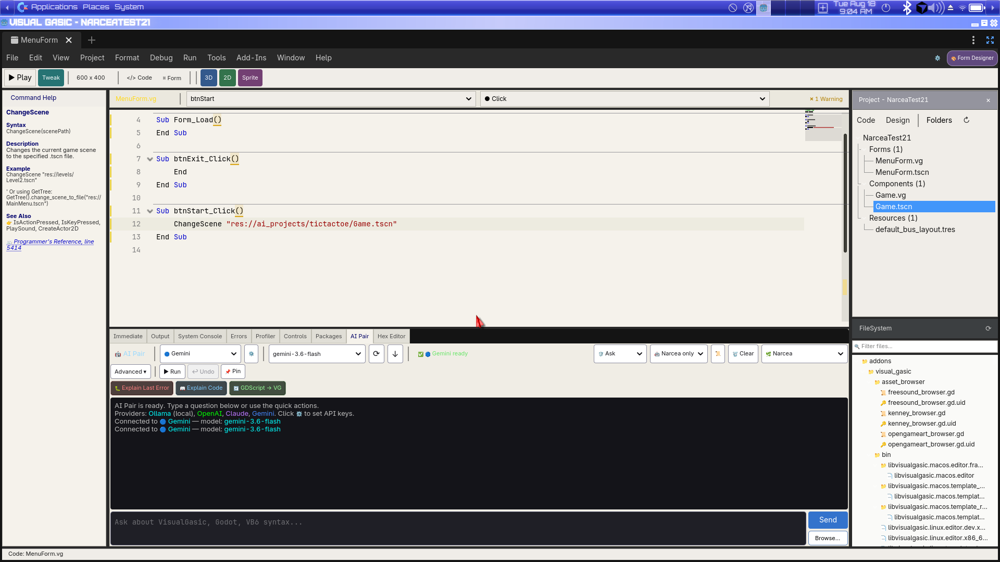
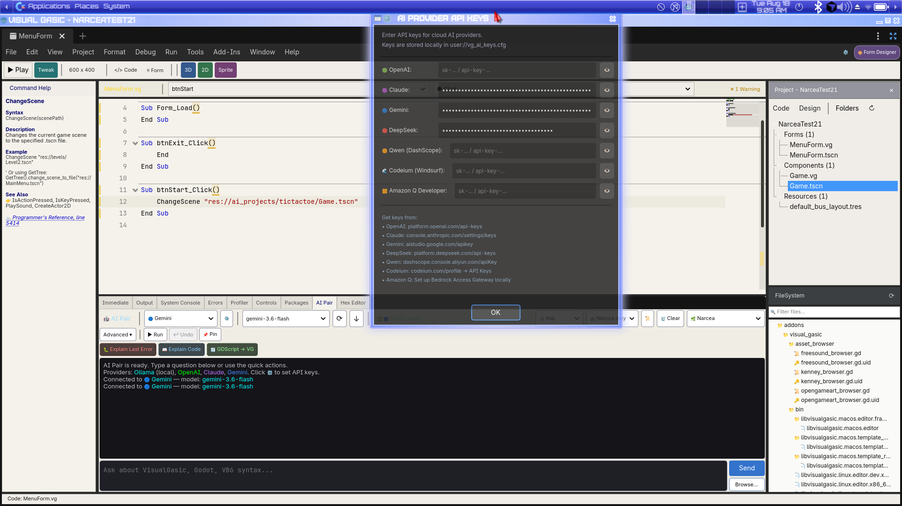

# VisualGasic 5.3.0-Beta6 Release Notes

**Release Date:** August 18, 2026  
**Status:** Beta (Feature Complete, Early Adopter Testing)  
**Previous Release:** [5.3.0-Beta5](https://github.com/xgreenrx-star/VisualGasic/releases/tag/v5.3.0-Beta5) (August 16, 2026)  
**Target Engine:** Godot 4.6.1  
**Platforms:** Linux x86_64, Windows x86_64 (desktop)

---

## Overview

VisualGasic 5.3.0-Beta6 is a **language correctness and Asset Library hardening** release. The standalone **`End`** command works again (Exit buttons no longer crash), VB6 **`""` string escapes** parse correctly, conversion builtins handle string input properly, and a new **Programmer's Reference runtime gate** runs in CI so reference examples stay aligned with the parser.

**Key numbers:** 856/856 regression assertions · 47/47 corpus examples (with expected output) · 332/332 reference examples parse-clean · End/DoEvents/Throw runtime-verified.

---

## Screenshots

### Narcea hybrid form — `End` and `ChangeScene` working



### AI Provider keys dialog



### IDE surfaces


---

## What's New Since 5.3.0-Beta5

### Fixed — `End` and Critical Builtins

- **`End`** — VB6 program termination via `SceneTree.quit()`.
- **`DoEvents`, `Throw`, `LoadForm`, `ChangeScene`** — dispatch gaps closed.
- **VB6 `""` in strings** — tokenizer treats doubled quotes as escaped characters.
- **`CInt`/`CLng`/`CDbl`/`CSng`/`CBool`** — explicit conversion builtins with string parsing.
- **`Deg2Rad` / `Rad2Deg`** — math aliases for 3D/bone docs.
- **Godot 4.6 OptionButton** — `VGGodotCompat.connect_popup_preshow()` fixes editor boot errors.

### Added — Reference Quality Gates

- **`scripts/run_command_reference_gate.sh`** — CI-enforced parse gate for all reference entries.
- **`scripts/run_asset_library_smoke.sh`** — fresh-install smoke path.
- **Nightly workflow** — optional full example execution with log artifacts.
- **Docs aligned** — `Whenever Section`, `Join` bracket arrays, `Nav.NextPos`.

Full changelog: [CHANGELOG.md](CHANGELOG.md#530-beta6---2026-08-18)

---

## Installation

### Linux

**Option 1: AppImage (Recommended)**
```bash
wget https://github.com/xgreenrx-star/VisualGasic/releases/download/v5.3.0-Beta6/VisualGasic-Installer-v5.3.0-Beta6-x86_64.AppImage
chmod +x VisualGasic-Installer-v5.3.0-Beta6-x86_64.AppImage
./VisualGasic-Installer-v5.3.0-Beta6-x86_64.AppImage
```

**Option 2: Bootstrap Script**
```bash
curl -sSL https://raw.githubusercontent.com/xgreenrx-star/VisualGasic/main/scripts/bootstrap_install.sh | bash
```

### Windows

```powershell
Invoke-WebRequest -Uri "https://github.com/xgreenrx-star/VisualGasic/releases/download/v5.3.0-Beta6/VisualGasic-Installer-v5.3.0-Beta6-x86_64.exe" -OutFile installer.exe
.\installer.exe
```

### Manual (any platform)

1. Extract `VisualGasic_v5.3.0-Beta6_<platform>_x86_64.zip` into your project's `addons/` folder  
2. **Project → Project Settings → Plugins → VisualGasic** → Enable  
3. Restart Godot  

Full setup: [docs/getting_started/installation.md](docs/getting_started/installation.md) · [Documentation Hub](docs/DOCS.md) · [Getting Started](docs/guides/GET_STARTED.md) · [Language Reference](docs/VisualGasic_Language_Reference.md)

Download: [v5.3.0-Beta6 release page](https://github.com/xgreenrx-star/VisualGasic/releases/tag/v5.3.0-Beta6)
