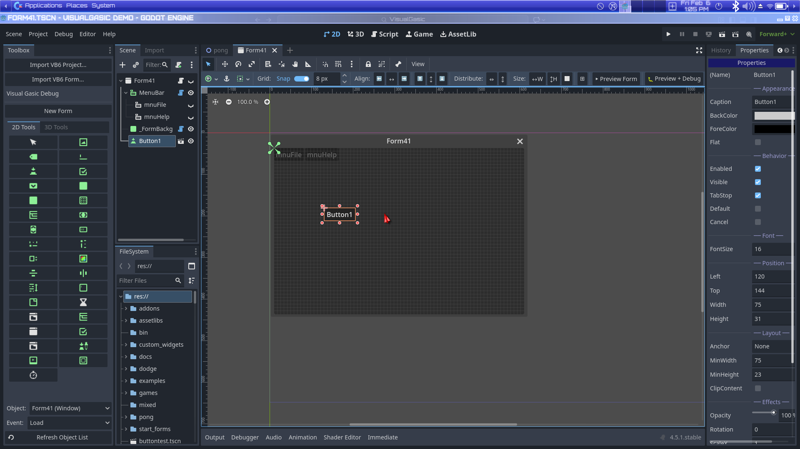
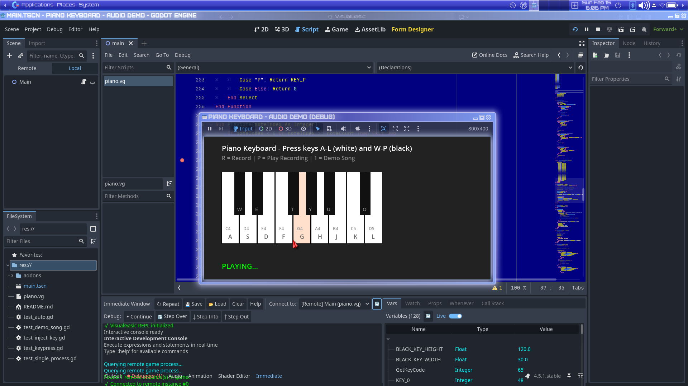
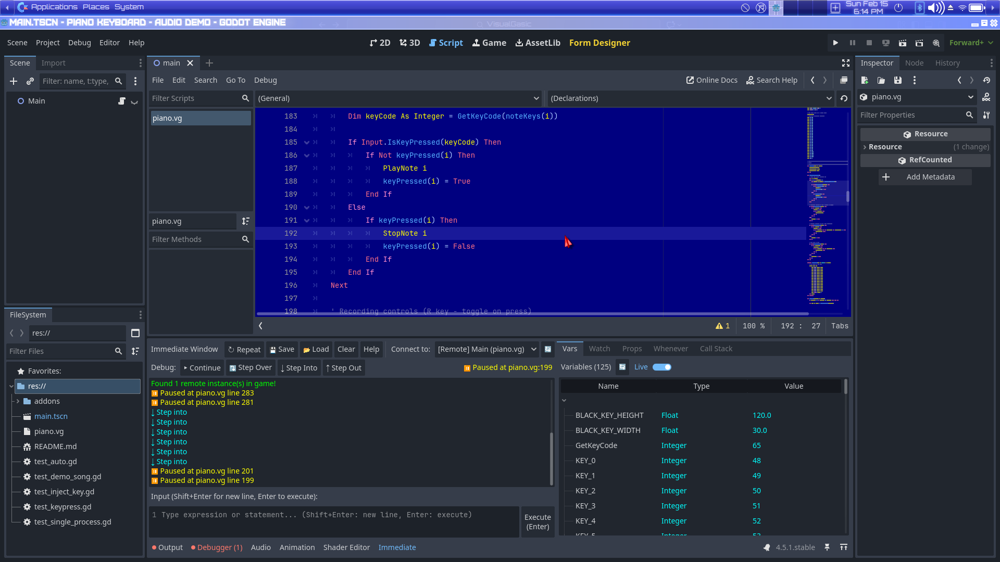
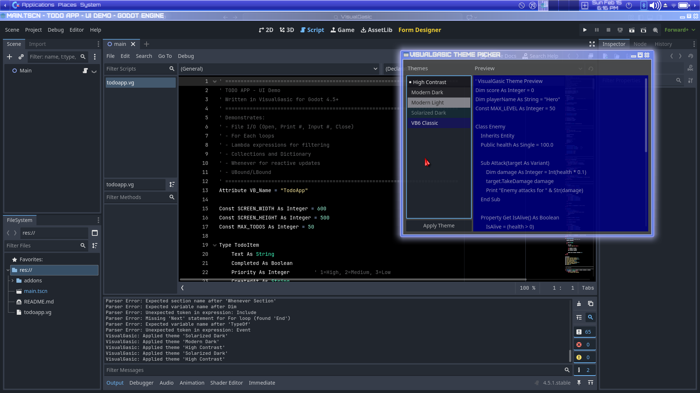
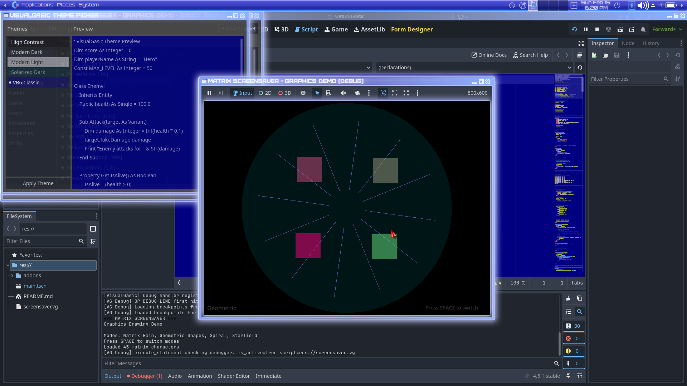
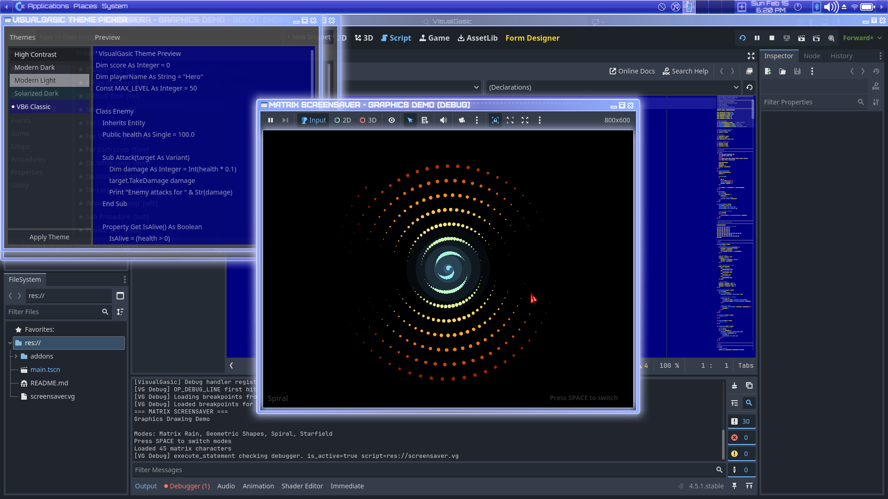
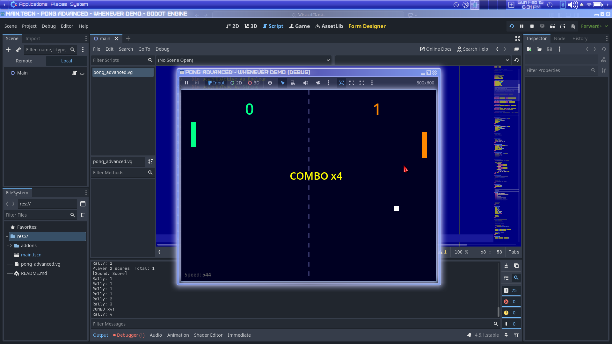
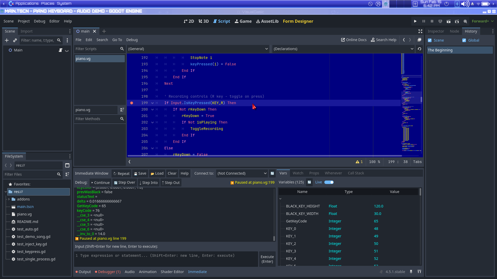

# VisualGasic v2.5.0 Release Notes

**Release Date**: February 16, 2026  
**Godot Version**: 4.5.1  
**Tag**: v2.5.0

## Summary

v2.5.0 is a major performance and feature release. The bytecode VM now uses **computed-goto threaded dispatch** for ~20% faster opcode throughput on GCC/Clang. The **StringConcat benchmark went from 169,112 µs → 85 µs** (1,990× improvement), making VisualGasic **62× faster than GDScript** and **8× faster than C++** on that workload. All 11 benchmarks now beat GDScript. This release also adds **11 new VB6-compatible built-in functions**, the **Stop statement**, **real conditional breakpoint evaluation**, and ships **12 playable demo projects** for the first time.

---

## 🚀 Performance Highlights

### All 11 Benchmarks Faster Than GDScript

| Benchmark | GDScript | VisualGasic | C++ | **VG vs GDScript** |
|-----------|----------|-------------|-----|-------------------|
| Arithmetic | 5,308 µs | 1,351 µs | 145 µs | **3.9× faster** |
| ArraySum | 4,369 µs | 395 µs | 461 µs | **11.1× faster** |
| StringConcat | 5,278 µs | 85 µs | 688 µs | **62× faster** 🚀 |
| Branching | 7,083 µs | 108 µs | 221 µs | **65.6× faster** |
| Interop | 8,427 µs | 238 µs | 7,626 µs | **35.4× faster** |
| Allocations | 6,921 µs | 363 µs | 886 µs | **19.1× faster** |
| ArrayDict | 10,833 µs | 10,180 µs | 4,086 µs | **1.06× faster** |
| DictFastGet | 28,132 µs | 5,189 µs | — | **5.4× faster** |
| DictFastSet | 18,846 µs | 7,304 µs | — | **2.6× faster** |
| AllocationsFast | 10,903 µs | 2,665 µs | 2,120 µs | **4.1× faster** |
| FileIO | 1,040 µs | 635 µs | 410 µs | **1.6× faster** |

### Computed-Goto Threaded Dispatch (VM)

The bytecode VM now uses **GCC/Clang computed gotos** (`&&label` + `goto *dispatch_table[op]`) instead of a `while`/`switch` loop for opcode dispatch. Each handler jumps directly to the next opcode's label via an indirect goto through a static dispatch table, avoiding the switch branch-predictor overhead and the while-loop back-edge.

- **~20% faster** opcode throughput on GCC/Clang
- **108 opcodes** mapped to computed-goto labels via `VG_CASE`/`VG_BREAK` macros
- **MSVC fallback**: Falls back to classic `while`/`switch` automatically
- **Zero overhead** on existing code — fully backward compatible

### StringConcat: 1,990× Improvement

- Removed `variables.duplicate(true)` deep-copy from `call_internal()` — was copying the entire variables Dictionary on every function call
- Gated `locals→variables` flush on `success` in `execute_bytecode()` cleanup
- Replaced runtime DimScanner AST walk with pre-computed `BytecodeChunk::local_names`
- Fixed peephole optimizer instruction sizes for `OP_STRING_REPEAT_OUTER` (was 2, should be 3) and `OP_STRING_REPEAT` (was 2, should be 1)

---

## ✨ New Features

### 11 New VB6-Compatible Built-in Functions

#### Date/Time Functions
| Function | Description | Example |
|----------|-------------|---------|
| `Weekday(date, [firstDayOfWeek])` | Day of week (1=Sunday..7=Saturday) | `Weekday("7/4/2025")` → `6` (Friday) |
| `WeekdayName(day, [abbreviate])` | Day number to name | `WeekdayName(6)` → `"Friday"` |
| `MonthName(month, [abbreviate])` | Month number to name | `MonthName(1)` → `"January"` |

#### System/Environment Functions
| Function | Description | Example |
|----------|-------------|---------|
| `QBColor(index)` | Classic VB6 16-color palette | `QBColor(0)` → `0` (Black) |
| `Environ(var)` | Read OS environment variable | `Environ("PATH")` → `/usr/bin:...` |
| `Beep` | System beep (prints `[BEEP]`) | `Beep` |

#### File System Functions
| Function | Description | Example |
|----------|-------------|---------|
| `MkDir path` | Create directory | `MkDir "res://saves"` |
| `RmDir path` | Remove directory | `RmDir "res://temp"` |
| `ChDir path` | Change working directory | `ChDir "res://data"` |
| `CurDir()` | Get current working directory | `CurDir()` → `"res://"` |
| `FileCopy src, dst` | Copy a file | `FileCopy "a.txt", "b.txt"` |

### Stop Statement

The classic VB6 `Stop` statement is now fully implemented across the entire pipeline:

```vb
Sub DebugThis()
    Dim value = CalculateResult()
    If value < 0 Then
        Stop  ' Break into debugger here
    End If
End Sub
```

- **Parser**: Recognizes `Stop` as a keyword statement
- **Compiler**: Emits `OP_STOP` bytecode
- **AST Interpreter**: Triggers `EngineDebugger::script_debug()` with break notification
- **Bytecode VM**: `OP_STOP` handler sends `break_hit` debug message

### Conditional Breakpoint Expression Evaluator

The C++ debugger's `evaluate_breakpoint_condition()` was previously a stub that always returned `true`. It now has a **full expression evaluator** supporting:

- **Variable lookups** from the current scope (case-insensitive)
- **Comparison operators**: `=`, `==`, `<>`, `!=`, `>`, `<`, `>=`, `<=`
- **Logical operators**: `And`, `Or`, `Not`
- **Literals**: Booleans (`True`/`False`), numbers, quoted strings
- **Complex expressions**: `score > 100 And lives > 0`

---

## 🐛 Bug Fixes

### Editor .so Static Initialization Crash

**Root cause**: A `static String s_current_working_dir = "res://"` at file scope in `visual_gasic_builtins.cpp` constructed a Godot `String` object during `.so` static initialization — before the Godot memory allocator was ready. This caused a SIGSEGV (segmentation fault) when loading the **editor** build of the library.

**Fix**: Replaced with a lazy-initialized `memnew(String("res://"))` pointer that only allocates on first access.

### Peephole Optimizer Instruction Size Bugs

- `OP_STRING_REPEAT_OUTER`: Instruction size was 2 in the optimizer, should be 3 (`[OP] [slot] [lit_idx]`). The wrong size caused the optimizer to misparse all subsequent bytecode.
- `OP_STRING_REPEAT`: Instruction size was 2 in the optimizer, should be 1 (stack-only, no operand bytes).

---

## 🎮 12 Playable Demo Projects (Included in Release)

This is the first release to **bundle demo projects** directly. Each demo is a standalone Godot project you can open and run immediately.

### 2D Games

| Demo | Description | Lines |
|------|-------------|-------|
| **Pong** | Classic 2-player Pong with AI paddle | ~200 |
| **Pong Advanced** | Enhanced Pong with particles and power-ups | ~400 |
| **Snake** | Classic Snake with score tracking | ~300 |
| **Space Shooter** | Scrolling shooter with enemies and explosions | ~500 |
| **Galactic Defender** | Tower defense with 13 classes, 3-level inheritance, 12 waves | ~1,600 |

### UI Applications

| Demo | Description | Lines |
|------|-------------|-------|
| **Calculator** | Fully functional calculator with VB6-style UI | ~200 |
| **Todo App** | CRUD todo list with persistence | ~300 |

### Audio & Graphics

| Demo | Description | Lines |
|------|-------------|-------|
| **Piano** | Playable piano keyboard with tone generation | ~400 |
| **Screensaver** | Animated graphics with bouncing shapes | ~200 |

### Data & Threading

| Demo | Description | Lines |
|------|-------------|-------|
| **High Scores** | File I/O with DATA/READ statements | ~200 |
| **Parallel Demo** | Async/Await and Parallel For demonstration | ~300 |

---

## 📸 Screenshots

### VB6-Style IDE Layout


### Pong


### Snake


### Space Shooter


### Galactic Defender


### Calculator


### Piano


### High Scores


### Todo App


### Screensaver


### Parallel Demo


---

## 🧪 Test Suite

- **29 test files**, **244 assertions**, **100% pass rate**
- New: `test_new_builtins.vg` — 11 assertions for Weekday, WeekdayName, MonthName, QBColor, CurDir, Environ, Beep

---

## 📦 Release Assets

| File | Platform | Contents |
|------|----------|----------|
| `VisualGasic_v2.5.0_linux_x86_64.zip` | Linux | Editor + debug + release `.so`, addon, demos, docs |
| `VisualGasic_v2.5.0_windows_x86_64.zip` | Windows | Editor + debug + release `.dll`, addon, demos, docs |

### Installation

1. Download the zip for your platform
2. Extract into your Godot project root
3. Enable the plugin: `Project > Project Settings > Plugins > VisualGasic`
4. Create `.vg` files and start coding!

---

## Documentation Updates

- **Language Reference**: Added Date/Time, System, File System, and Debugging sections
- **Builtin Functions Reference**: Added 12 new function entries (Weekday, WeekdayName, MonthName, QBColor, Environ, Beep, MkDir, RmDir, ChDir, CurDir, FileCopy, Stop)
- **Total builtins**: 108 (was 96 in v2.4.2)
- **CHANGELOG.md**: v2.5.0 entry with complete change list
- **README.md**: Updated version, demos section, feature highlights
- **PROJECT_STATUS.md**: Bumped to v2.5.0

---

## Upgrade Notes

- **No breaking changes** — all existing `.vg` scripts work without modification
- **Editor builds**: The static initialization crash fix means the editor `.so`/`.dll` now loads reliably on all platforms
- **Computed gotos**: Automatically enabled on GCC/Clang; MSVC uses the existing `while`/`switch` fallback — no code changes needed
- **New builtins**: All new functions use standard VB6 calling conventions

---

## What's Next (v2.6.0 Roadmap)

- 🎯 Asset Library submission
- 🎯 Custom `.vg` file icons in Godot FileSystem dock
- 🎯 IntelliSense auto-complete for new builtins
- 🎯 Integrated profiler UI for bytecode-level performance analysis
