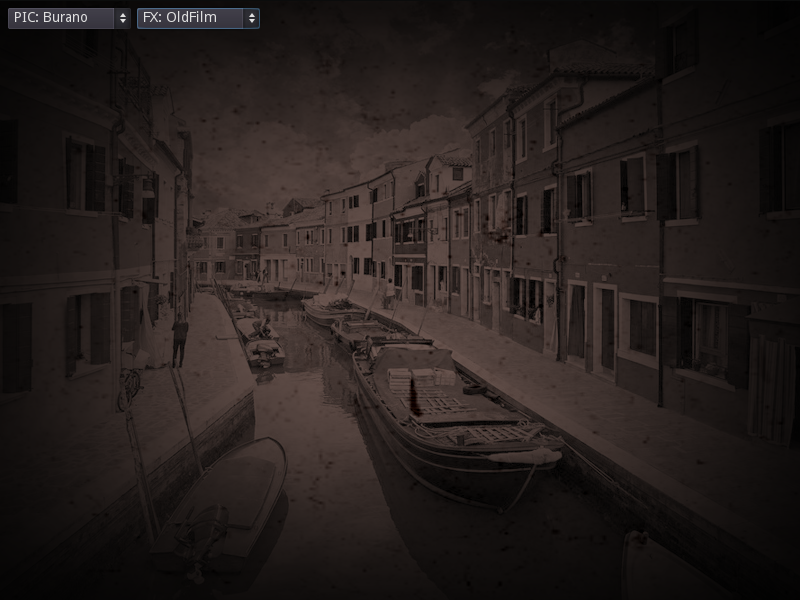

# VisualGasic v3.3.0 — Language Enhancements Release

**Release Date**: March 1, 2026  
**Platforms**: Linux x86_64, Windows x86_64, macOS (universal)  
**Godot**: 4.5+ (tested on 4.6.1)

---

## What is VisualGasic?

**VisualGasic is not a VB6 clone.** It is a modern, forward-looking programming language for the Godot Engine that draws inspiration from VB6's legendary approachability — the simple syntax, the ease of learning, the RAD workflow — and builds something new on that foundation.

If you know VB6, you'll feel at home in minutes. But VisualGasic goes far beyond VB6 with features like lambda expressions, async/await, pattern matching, null-safe operators, GPU computing, generics, a JIT-compiled bytecode engine, and now — 18 new language enhancements that make VG more expressive than ever.

**VisualGasic is VB6-compatible where it counts, but designed to look forwards, not backwards.**

### Highlights

- 🚀 **Faster than GDScript** on every benchmark (2×–118×), ties native C++ on branching
- 🎨 **Form Designer** — full VB6-style WYSIWYG with 40+ controls, Properties panel, Toolbox
- ⚡ **Event-driven** — name a Sub `btnSave_Click()` and it's wired automatically
- 🧠 **JIT Compiler** — hot loops compile to native x86-64 machine code
- 📦 **55 demos included** — games, shaders, system tools, language showcases, and 4 converted official Godot demos

---

## Converted Godot Demos

This release ships with 4 official Godot Engine demos converted to VisualGasic, proving that real Godot projects run naturally in VG:

### Screen Space Shaders (11 shader effects, converted from Godot demo)


*Old Film effect — one of 11 screen-space shaders running in VisualGasic*


*Whirl distortion shader — Select Case dispatches shader changes in VG*

### Sky Shaders (Volumetric clouds, converted from Godot demo)


*Volumetric clouds and physical sky — 3D MeshInstance3D + shader parameters controlled by VG code*

### Also Included
- **2D Platformer** (Godot official) — 9 VG scripts: player, enemy, gun, bullet, level, coin, GUI, pause menu
- **Squash the Creeps** (Godot official) — 4 VG scripts: main, mob, player, score label

---

## v3.3.0 New Features

### 18 Language Enhancements

#### String Interpolation
```vb
Dim name = "World"
Print $"Hello, {name}!"          ' Hello, World!
Print $"2 + 2 = {2 + 2}"        ' 2 + 2 = 4
```

#### Count() Function
```vb
Dim arr = Array(10, 20, 30)
Print Count(arr)                  ' 3
Print Count("Hello")             ' 5
```

#### Print Semicolons + Spacing
```vb
Print "A"; " "; "B"; " "; "C"   ' A B C (no newlines between)
Print "Score:"; Spc(5); score    ' Score:     42
Print "Name:"; Tab(20); name     ' Name:              Alice
```

#### Array and Dictionary Literals
```vb
Dim fruits = ["Apple", "Banana", "Cherry"]
Dim config = {"host": "localhost", "port": 8080}
```

#### For Each With Index
```vb
For Each item With Index i In collection
    Print $"{i}: {item}"
Next
```

#### For Each Over Strings
```vb
For Each ch In "Hello"
    Print ch; " ";               ' H e l l o
Next
```

#### Bitwise Operations
```vb
Print BitAnd(12, 10)             ' 8
Print BitOr(12, 10)              ' 14
Print BitXor(12, 10)             ' 6
Print BitShiftLeft(1, 4)         ' 16
Print BitShiftRight(16, 2)       ' 4
Print BitNot(0)                  ' -1
```

#### Math Functions
```vb
Print Ceiling(3.2)               ' 4
Print Floor(3.8)                 ' 3
Print Atan2(1, 1)                ' 0.785...
Print Math.PI                    ' 3.14159...
Print Math.E                     ' 2.71828...
Print Math.Tau                   ' 6.28318...
```

#### StringBuilder
```vb
Dim sb = NewStringBuilder()
sb.Append "Hello"
sb.Append " "
sb.Append "World"
Print sb.ToString()              ' Hello World
Print sb.Length                   ' 11
sb.Replace "World", "VG"
Print sb.ToString()              ' Hello VG
```

#### Regular Expressions
```vb
Print RegExp.Test("abc123", "\d+")           ' True
Dim matches = RegExp.Execute("foo 42 bar 99", "\d+")
Print matches                                 ' ["42", "99"]
Print RegExp.Replace("Hello World", "World", "VG")  ' Hello VG
```

#### Static Local Variables
```vb
Function Counter() As Integer
    Static count As Integer
    count = count + 1
    Counter = count
End Function
' Persists across calls: 1, 2, 3, ...
```

#### Swap Statement
```vb
Dim a = 10, b = 20
Swap a, b
Print a; b                       ' 20 10
```

#### Assert Statement
```vb
Assert 1 + 1 = 2, "Basic math works"
Assert Count(arr) > 0, "Array is not empty"
```

#### On n GoTo / GoSub
```vb
On choice GoTo Label1, Label2, Label3
On index GoSub Handler1, Handler2
```

#### Resume / Resume Next
```vb
On Error GoTo ErrHandler
' ... code ...
Exit Sub
ErrHandler:
    Resume Next                  ' Skip the error and continue
```

#### Get# / Put# Binary I/O
```vb
Open "data.bin" For Binary As #1
Put #1, , myData
Get #1, , result
Close #1
```

#### Enum Improvements
```vb
Enum Direction
    North = 0
    East = 1
    South = 2
    West = 3
End Enum

Print Direction.North            ' 0
Print Direction.Parse("South")   ' 2
Print Direction.ToString(3)      ' West
Dim vals = Direction.Values()    ' Array of all members
```

#### VB6 Intrinsic Constants + Convenience Functions
```vb
Print "Line 1" & vbCrLf & "Line 2"
Print "Col1" & vbTab & "Col2"

Dim copied = Array.Copy(original)
Dim filled = Array.Fill(5, 0)
Print StrContains("Hello World", "World")  ' True
Print StrRepeat("-", 20)                   ' --------------------
Sleep 100                                  ' Pause 100ms
```

---

## What's in the Package

| Component | Files |
|-----------|-------|
| **Plugin** | `addons/visual_gasic/` — editor plugin, Form Designer, IntelliSense, themes |
| **Binaries** | Linux (.so), Windows (.dll), macOS (.framework) — editor + release for each |
| **Demos** | 55 `.vg` files across 31 project folders including 4 converted Godot demos |
| **Documentation** | Language Reference, Builtin Functions Reference, guides, tutorials |
| **Examples** | 45 Form examples, standalone code samples |
| **Tutorials** | App Development (Calculator), Game Development (Pong), TileMap |

## Platform Support

| Platform | Editor | Export Template | Status |
|----------|--------|-----------------|--------|
| Linux x86_64 | ✅ | ✅ | Primary development platform |
| Windows x86_64 | ✅ | ✅ | Cross-compiled via MinGW |
| macOS (universal) | ✅ | ✅ | Cross-compiled |

## Test Results

- **481/483** assertions pass (2 pre-existing symlink permission test failures)
- **Zero regressions** from v3.2.0
- All 18 new features verified via `demo/v330_features.vg`

---

## Upgrading from v3.2.0

Drop-in replacement. Copy the new `addons/visual_gasic/` folder over your existing one. All existing `.vg` scripts are fully compatible — no code changes required.

## Installation

1. Download the release package
2. Copy the `addons/visual_gasic/` folder into your Godot project
3. Enable the plugin: Project → Project Settings → Plugins → VisualGasic → ✅ Enable
4. Create `.vg` files and start coding

## Links

- **Repository**: [github.com/xgreenrx-star/VisualGasic](https://github.com/xgreenrx-star/VisualGasic)
- **Language Reference**: [docs/VisualGasic_Language_Reference.md](docs/VisualGasic_Language_Reference.md)
- **Builtin Functions**: [docs/reference/BUILTIN_FUNCTIONS_REFERENCE.md](docs/reference/BUILTIN_FUNCTIONS_REFERENCE.md)
- **Demos**: [demos/README.md](demos/README.md)
