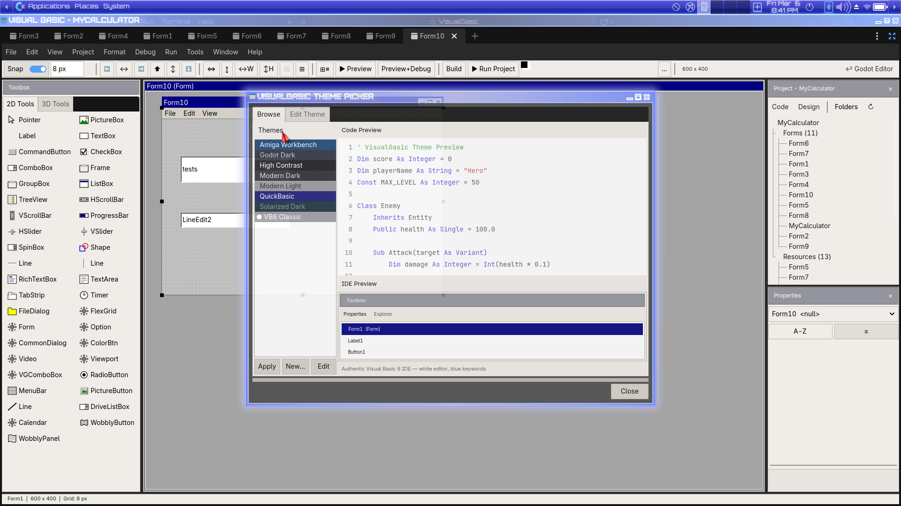
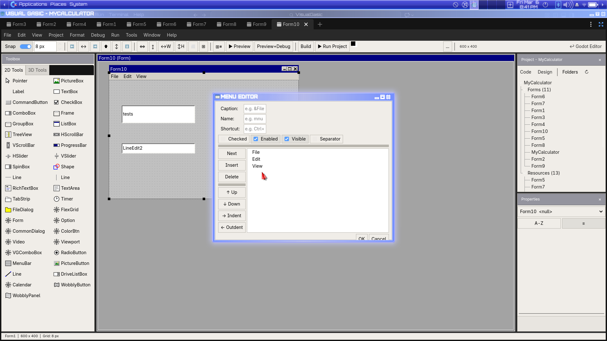
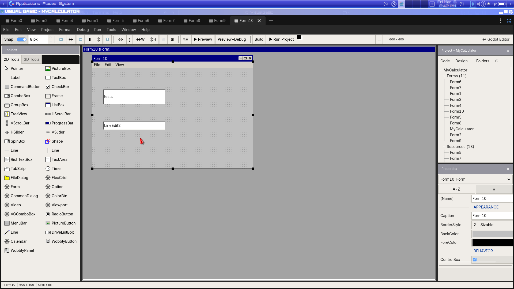

# VisualGasic v3.5.0 Beta 2 — IDE Polish Release

**Release Date**: March 6, 2026  
**Platforms**: Linux x86_64, Windows x86_64  
**Godot**: 4.5+ (tested on 4.6.1)

---

## What is VisualGasic?

**VisualGasic** is a modern, event-driven programming language for the Godot Engine inspired by Visual Basic 6's legendary approachability. It features a full Form Designer, JIT compiler, auto event wiring, and 66 demo projects.

---

> ## ⚠️ BETA — READ THIS FIRST
>
> This is a **beta release** focused on IDE polish, new tools, and VB6-authentic theming.
> The core language, compiler, and JIT are stable. The IDE and Form Designer continue
> to be polished based on real-world testing.
>
> **This is not production-ready software.** Please use it to experiment, learn, build
> prototypes, and help us find bugs.

---

## What's New in v3.5.0-beta2

### 🎨 Custom Theme Editor

The Theme Picker now has a full **Edit Theme** tab where you can customize every aspect of the IDE's appearance and save it as a custom theme.

*Browse tab: select from 8 built-in themes with live Code Preview and IDE Preview*

*Edit tab: 38 color pickers organized into Code Editor, Syntax, and IDE Chrome categories with real-time preview*

**Features:**
- **38 adjustable color properties** organized into three categories:
  - *Code Editor* (6): background, text, line numbers, current line, selection, caret
  - *Syntax Highlighting* (15): keywords, types, strings, numbers, comments, operators, functions, built-ins, variables, constants, properties, errors, warnings
  - *IDE Chrome* (17): panel backgrounds, borders, headers, tabs, buttons, toolbox, accent, tooltips
- **Live preview** — both Code Preview and IDE Preview update in real-time as you adjust colors
- **New/Save/Delete/Reset** buttons for managing custom themes
- **Built-in theme protection** — editing a built-in theme automatically creates a custom copy
- Themes persist between sessions via `VGThemeManager.save_user_themes()`

### 🎭 8 Built-in IDE Themes

The theme system now includes complete **IDE chrome theming** — not just code colors, but the entire IDE frame (panels, headers, tabs, buttons, toolbox).

*Amiga Workbench theme — orange/blue/white retro chrome with authentic code colors*

**Built-in themes:**
| Theme | Style | Description |
|-------|-------|-------------|
| VB6 Classic | Light | White background, blue keywords, green comments — authentic VB6 IDE |
| QuickBasic | Dark | Blue background, yellow/cyan text — the classic DOS QB4.5 look |
| Godot Dark | Dark | Matches Godot's native dark theme |
| Amiga Workbench | Retro | Orange/blue/white — Workbench 1.x inspired |
| Modern Dark | Dark | Contemporary dark theme with purple/teal accents |
| Modern Light | Light | Clean, bright modern look |
| High Contrast | Dark | Maximum contrast for accessibility |
| Solarized Dark | Dark | Ethan Schoonover's iconic Solarized palette |

### 🔍 Object Browser

A new **Object Browser** dialog accessible from **Tools → Object Browser** lets you explore the Godot class hierarchy interactively.

*Object Browser — browse classes, methods, properties, signals, and constants*

- Browse all Godot engine classes in a searchable list
- View methods, properties, signals, and constants for any class
- See method signatures with parameter types
- Filterable search box
- VB6-style cream themed dialog

### 📋 Project Properties Dialog

**Project → Project Properties** now opens a proper dialog for viewing and editing project settings.

*Project Properties dialog with project name, main scene, and description fields*

### 🍔 Menu Editor Fixes

The **Menu Editor** (accessible by right-clicking a MenuBar) now renders correctly with the VB6 cream theme instead of dark Godot defaults.

*Menu Editor with VB6-style theming — proper cream background, readable text*

### 📝 Snippet Browser

The **Snippet Browser** dialog now uses the VB6 cream theme for consistent appearance.

*Snippet Browser — 40+ code snippets with proper VB6 theming*

---

## All Changes Since v3.4.1

### New Features
- **Custom Theme Editor** — full Edit Theme tab with 38 color pickers and live preview
- **8 IDE themes** with full chrome theming (VB6 Classic, QuickBasic, Godot Dark, Amiga Workbench, Modern Dark, Modern Light, High Contrast, Solarized Dark)
- **Object Browser** — Tools → Object Browser for exploring Godot class hierarchy
- **Project Properties dialog** — Project → Project Properties now functional

### Bug Fixes — IDE Theming
- **Theme Picker** rebuilt with Code Preview + IDE Preview panels and VB6 cream dialog theme
- **VB6 Classic** code theme fixed — was showing QuickBasic (blue bg/yellow text), now shows authentic VB6 (white bg/blue keywords/green comments)
- **Menu Editor** dark colors fixed — now uses full VB6 cream theme
- **New Custom Control dialog** dark colors fixed — VB6 cream theme applied
- **Snippet Browser** dark colors fixed — VB6 cream theme applied
- **Project Properties dialog** dark colors fixed — VB6 cream theme applied

### Bug Fixes — Form Designer
- **Font size consistency** — font size now flows correctly from WYSIWYG editor to all rendering paths (canvas, preview, export)
- **Font size mismatch** between VB6 canvas and Godot preview resolved
- **Dark controls in Form Preview Window** fixed — VB6 Classic Theme applied
- **MenuBar preview rendering** improved in Form Designer
- **MenuBar round-trip** — name mismatch and lost PopupMenu children fixed
- **Empty MenuBar stripping** — auto-remove empty default MenuBars from .tscn

### Bug Fixes — Menus & Dialogs
- **Ghost blank rows** in VB6 menus (File, Edit, Debug) removed
- **File → Open Project** menu item was a no-op — now functional
- **New Module dialog** garbled text fixed
- **project_properties.gd** was missing — added and symlinked

### Infrastructure
- **godot-cpp submodule** updated: test bindings helper, API 4.5.1, vgename corruption fix

---

## What's Included

- **66 demo projects** — 2D games, 3D, shaders, audio, UI apps, threading, networking
- **4 ported official Godot demos** — Screen Space Shaders, Sky Shaders, 2D Platformer, Squash the Creeps
- **Custom Controls system** — build your own .tscn controls and drag them onto forms
- **Form Designer** — full VB6-style WYSIWYG with 40+ controls, Properties panel, Toolbox, live preview
- **JIT Compiler** — hot loops compile to native x86-64 (2×–118× faster than GDScript)
- **IntelliSense** with 80+ completions, snippets, and Godot type awareness
- **Debugger** with conditional breakpoints, watch window, call stack, and time-travel debugging
- **Theme Editor** with 8 built-in themes and custom theme creation
- **Object Browser** for exploring the Godot class hierarchy
- **108 built-in functions** (string, math, file I/O, date/time, collections)
- **481 tests passing**
- **Linux and Windows binaries** included

---

## Install

1. Download the release ZIP for your platform
2. Extract and copy `addons/visual_gasic/` into your Godot project folder
3. Open **Project → Project Settings → Plugins** → Enable **"Visual Gasic"**
4. Create `.vg` files and start coding — or use **File → New Form** in the Form Designer

---

## Upgrade from v3.4.1

1. Back up your project
2. Delete your existing `addons/visual_gasic/` folder
3. Copy the new `addons/visual_gasic/` from the release ZIP
4. Re-enable the plugin if needed
5. Your `.vg` files and `.tscn` forms are fully compatible — no migration needed

---

## Known Issues

- macOS builds not included in this release (coming in next beta)
- Theme Editor font settings (font name, size, bold keywords) are stored in VGTheme but not yet exposed in the editor UI
- Custom themes are saved per-project, not globally

---

## Links

- **GitHub**: https://github.com/xgreenrx-star/VisualGasic
- **License**: MIT
- **Previous Release**: [v3.4.1 Release Notes](RELEASE_NOTES_v3.4.1.md)
- **First Beta**: [v3.2.0-beta1 Release Notes](RELEASE_NOTES_v3.2.0-beta1.md)
