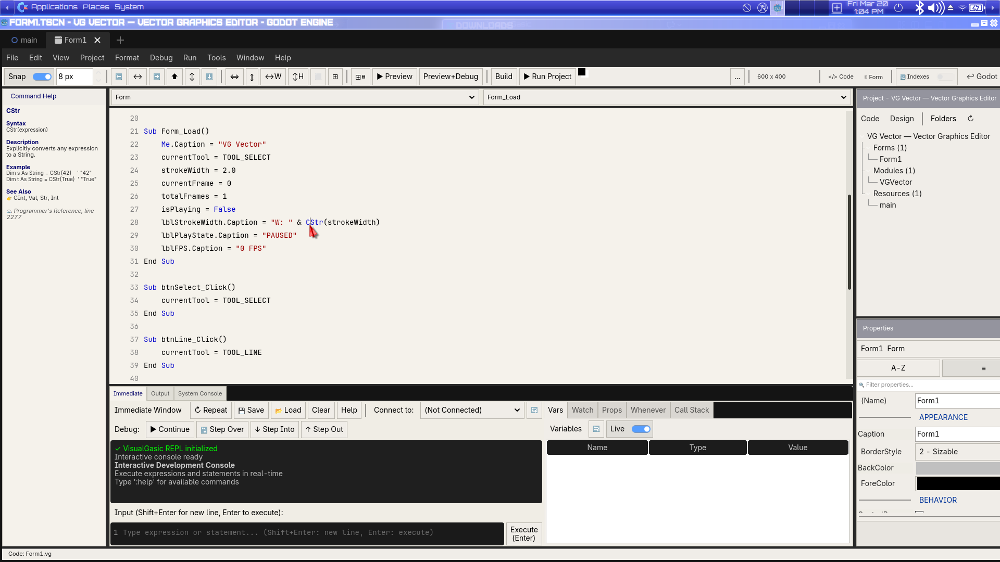
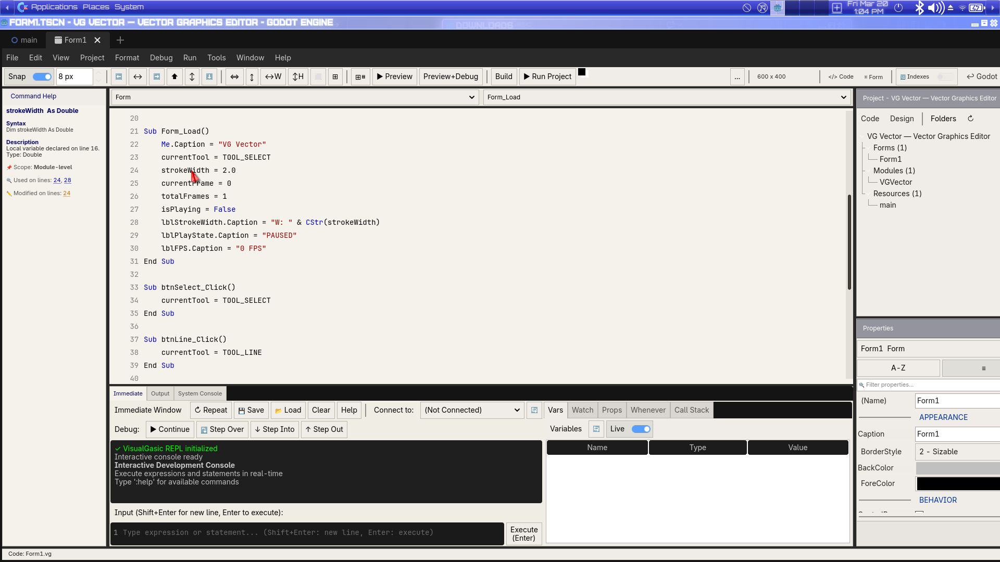
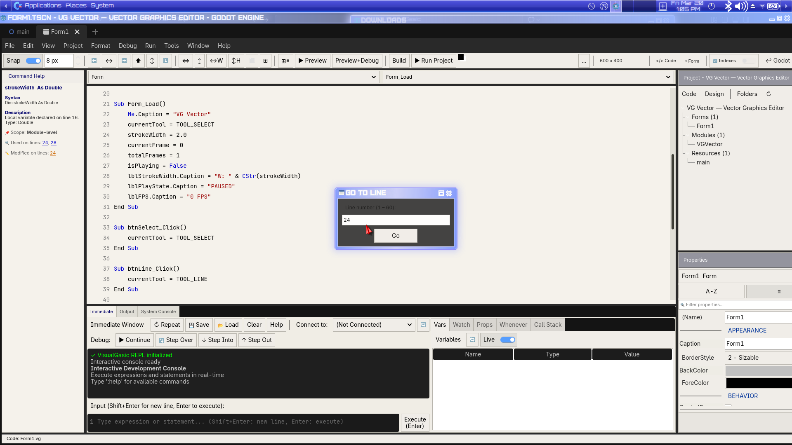
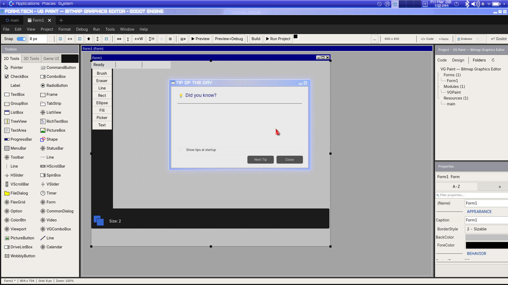

# VisualGasic v4.2.0-beta6 — Drawing APIs, VB6 Parity & macOS Support

**Release Date**: March 20, 2026  
**Platforms**: Linux x86_64, Windows x86_64, macOS x86_64 *(new!)*  
**Godot**: 4.5+ (tested on 4.6.1)

> ⚠️ **Beta Release** — This is a pre-release for testing. Not all demo projects have been verified. We're looking for beta testers! Please report issues on GitHub.

---

## What is VisualGasic?

**VisualGasic** is a modern, event-driven programming language for the Godot Engine inspired by Visual Basic 6's legendary approachability. It features a full Form Designer, JIT compiler, auto event wiring, and 22 standalone demo projects.

---

## What's New in v4.2.0-beta6

This is a massive release with **35 commits** touching 123 files — covering Image-based drawing APIs, VB6 command parity, IDE enhancements, documentation overhaul, and the first-ever macOS build.

### Screenshots

*Command Help panel now shows variable types, Const values, and user-defined Sub/Function signatures*

*IntelliSense-powered Command Help with full parameter hints*

*Ctrl+G Go To Line dialog for quick navigation*

*Type/End Type with fixed-length strings, strict type checking, and IntelliSense*

*All 13 VB6 financial functions: FV, PV, NPV, IRR, PMT, IPmt, PPmt, Rate, NPer, SLN, SYD, DDB, DB*

---

## 🎨 Drawing & Image APIs

A complete Image-based drawing system for pixel-level rendering:

- **Image-based rendering pipeline** — VGPaint rewritten from PictureBox to direct Image manipulation for deterministic pixel-perfect rendering
- **FloodFillImage** — Native C++ flood fill with 4-connected BFS, instant even on large canvases
- **DrawImageLine / DrawImageCircle / DrawImageRect / DrawImageEllipse** — Native C++ drawing primitives operating directly on Godot Image objects
- **DrawImageText** — 5×7 bitmap font renderer that draws real text glyphs on Image (no UI nodes needed)
- **SetImagePixel / GetImagePixel** — Direct pixel access for custom rendering
- **Bresenham line algorithm** — Correct thick-line rendering with configurable brush width
- **VGPaint overhaul** — Full tool suite: Pencil, Line, Rectangle, Circle, Ellipse, Fill, Text, Eraser with proper mouse release handling, ellipse preview, and InputBox for text entry

### VGPaint Bug Fixes
- Fixed brush size not applying to all tools
- Fixed shape tool release using wrong coordinates
- Fixed ellipse preview while actively drawing
- Fixed mouse release not finalizing line/shape tools
- Reduced default canvas from 640×480 → 160×120 with skip-white optimization for performance

---

## 🔧 VB6 Compatibility — 18 New Commands

Major push toward VB6 feature parity:

### New String Functions
`Space()`, `String$()`, `StrReverse()`, `StrConv()`, `InStrRev()`, `Replace()`, `Filter()`, `Join()`, `Split()` (already existed but now fully VB6-compatible)

### New Math/Conversion Functions
`Fix()`, `Sgn()`, `Oct$()`, `Hex$()` (extended), `IsEmpty()`, `IsNull()`, `TypeName()`, `VarType()`

### New Operators
`Eqv` (logical equivalence) and `Imp` (logical implication) — the final two missing VB6 logical operators

### Type/End Type Enhancements
- **Fixed-length strings**: `Dim name As String * 20`
- **Strict type checking**: Type members enforce declared types at assignment
- **IntelliSense support**: Type members appear in autocomplete with type annotations

### All 13 VB6 Financial Functions
| Function | Description |
|----------|-------------|
| `FV()` | Future Value |
| `PV()` | Present Value |
| `NPV()` | Net Present Value |
| `IRR()` | Internal Rate of Return |
| `PMT()` | Payment |
| `IPmt()` | Interest Payment |
| `PPmt()` | Principal Payment |
| `Rate()` | Interest Rate |
| `NPer()` | Number of Periods |
| `SLN()` | Straight-Line Depreciation |
| `SYD()` | Sum-of-Years' Digits Depreciation |
| `DDB()` | Double-Declining Balance |
| `DB()` | Fixed-Declining Balance |

---

## 🖥️ IDE Improvements

### Command Help Panel — 8 Enhancements
- **Variable type display** — hovering variables shows their declared type
- **Const value display** — hovering constants shows their compile-time value
- **User Sub/Function signatures** — hovering user-defined routines shows full parameter signatures
- **Ctrl+G Go To Line** — classic VB6 keyboard shortcut for line navigation
- **Improved keyword help** — better descriptions for control flow and loop keywords
- **Context-sensitive help** — help updates as cursor moves through code

### Properties Panel
- **Auto-populate on form load** — Properties panel fills immediately when a form opens (no manual click needed)
- **Fixed `<null>` dropdown** — control dropdowns no longer show `<null>` entries

### Project Explorer
- **Resources section** — expanded to show project resources with duplicate filtering
- **Stray file filtering** — non-project files no longer appear in the resource list

### Immediate Window
- **Fixed 0px collapse** — Immediate Window no longer collapses to zero height; enforces 80px minimum on the bottom panel
- **Shrinkable** — minimum size propagation broken so the panel can be resized smaller

### Form Designer
- **Auto-open forms** — forms open automatically when switching to Form Designer view
- **Double-click opens designer** — double-clicking a .vg file in Project Explorer opens the Form Designer
- **Parser bug fixes** — improved handling of edge cases in .vg file parsing

---

## 🐛 Critical Bug Fixes

| Fix | Details |
|-----|---------|
| **Segfault fix** | `static inline const String` in headers → `static constexpr const char*` (static String initialization order crash) |
| **Focus-loss dialog** | Removed C++ file writes from `_save_external_data()`, `_get_window_layout()`, `_make_visible(false)` — no more "files modified outside Godot" dialog on every Alt+Tab |
| **Bytecode 16-bit widening** | Constant pool indices widened from 8-bit to 16-bit across entire bytecode system (was silently truncating programs with >256 constants) |
| **InputBox native dialog** | InputBox now uses native OS dialogs (zenity/kdialog on Linux) instead of AcceptDialog |
| **Do/While loop limit** | Safety limit raised from 10,000 → 10,000,000 (matching For loops) |

---

## 📚 Documentation Overhaul

- **Table of Contents** added to all 10 reference documents
- **Alphabetical Indexes** added to all 10 reference documents (302 entries in Language Reference alone)
- **Drawing & Image API docs** — comprehensive parameter tables, examples, and usage guides added to all manuals
- **Native drawing docs** — detailed descriptions for all FloodFill/DrawImage*/SetImagePixel builtins
- **Generated via** `tools/generate_doc_indexes.py` — idempotent script for maintaining doc indexes

---

## 🍎 macOS Support (New!)

First-ever macOS build, cross-compiled using osxcross with MacOSX 14.5 SDK:

- `libvisualgasic.macos.editor.framework` — Editor plugin
- `libvisualgasic.macos.template_debug.framework` — Debug export template
- `libvisualgasic.macos.template_release.framework` — Release export template

> **Note**: macOS builds are cross-compiled from Linux and have not been tested on actual macOS hardware. Beta testers with Macs are especially welcome!

---

## ⚠️ Known Issues & Demo Status

### Demo Projects

22 standalone demo projects are included in `demos/`. **Not all demos have been fully verified** in this beta release:

| Category | Projects | Status |
|----------|----------|--------|
| **2D Games** | Pong, Pong Advanced, Snake, Space Shooter, Galactic Defender, Platformer, Platformer (Godot port) | ✅ Core games working |
| **3D Games** | Squash the Creeps (Godot port) | ✅ Working |
| **Audio** | Piano, VGMusic | ⚠️ Needs verification |
| **Graphics** | VGPaint, VGVector, VGMovie, Screensaver, Screen Space Shaders, Sky Shaders | ⚠️ VGPaint reworked this release — needs testing |
| **UI** | Calculator, TodoApp | ✅ Working |
| **Networking** | VGTerminal | ⚠️ Needs verification |
| **Threading** | ParallelDemo | ⚠️ Thread + scene-tree API crashes possible (known issue) |
| **Data & Files** | HighScores | ⚠️ Needs verification |
| **Utilities** | DocGen Example | Code-only (no scene files) |

### Open Bugs (7 remaining)

1. `On Error GoTo` partially implemented in bytecode VM — use AST interpreter mode for error handling
2. Dictionary `.Count` property requires parentheses in bytecode mode: `.Count()` 
3. Dictionary `Keys()` indexing — use `For Each` instead of index-based access
4. `ToByteArray()` returns Godot PackedByteArray — may need casting in some contexts
5. Task scope cloning is by-design — read results via `task.Result`
6. Thread + scene-tree interaction can crash — don't call scene-tree APIs from worker threads
7. `"Task"` is a reserved word — use `TaskObj` as variable name

---

## Commits in this release (35)

| Commit | Description |
|--------|-------------|
| `c637e77` | Fix 'files modified outside Godot' dialog on every focus loss |
| `fa520b5` | Add Table of Contents and Alphabetical Indexes to all 10 documentation files |
| `ef1a92e` | Command Help: 8 enhancements + Ctrl+G Go To Line |
| `e3c43b5` | Command Help: show variable types, const values, and user Sub/Function signatures |
| `e71bf15` | Fix segfault: replace static inline String with constexpr const char* |
| `412c6f8` | Type/End Type enhancements + all 13 VB6 financial functions |
| `301e2b6` | VB6 compatibility: implement 18 missing commands + Eqv/Imp operators |
| `10b2b1a` | Document DrawImageLine width param; add VB6 Line alias |
| `a82db3a` | Fix Line tool: extend native DrawImageLine with optional brush width |
| `bc4f29e` | Revert "Fix line/shape tool release: restructure event flow" |
| `7890c17` | Fix line/shape tool release: restructure event flow instead of compound condition |
| `ef5e40a` | Fix shape tool release: use motion-tracked coords instead of ev.position |
| `41a9577` | Sync demo/VGPaint.vg with demos/ copy (release handler + bitmap text fixes) |
| `81b31f6` | Fix mouse release handling in VGPaint: finalize all tools properly |
| `6430264` | Add DrawImageText native builtin: 5×7 bitmap font renders real text glyphs on Image |
| `f39a73f` | Expand native drawing docs: detailed descriptions, parameter tables, examples |
| `23a6b23` | Add FloodFillImage & DrawImage* builtins to all reference docs |
| `11f0ac5` | Fix InputBox: use native OS dialog (zenity/kdialog) instead of AcceptDialog |
| `0d33d25` | Native FloodFillImage for instant fill, fix InputBox dialog (text tool) |
| `1a72b4d` | Fix ellipse preview while drawing, fix InputBox in bytecode VM expression path |
| `b1945a1` | Fix SetImagePixel dispatch in AST interpreter, add native DrawImage* builtins |
| `f9ed07f` | Fix VGPaint: brush size, tool drawing, performance overhaul |
| `08ca121` | Fix VGPaint: full word labels, Bresenham safety, DrawRect outline bugs |
| `a133025` | Fix Do/While loop safety limit: 10,000 → 10,000,000 (match For loops) |
| `7126107` | Add drawing & Image API docs to manuals, IntelliSense, and Command Help panel |
| `ed25da7` | Add comprehensive drawing & Image APIs; rewrite VGPaint with Image-based rendering |
| `7533629` | Fix VGPaint demo: reduce canvas 640×480→160×120, skip-white optimization, fix mouse coord scaling |
| `a75ca72` | Fix Project Explorer Resources section: expand, filter duplicates, skip stray files |
| `8bf6cb5` | Fix Properties panel: auto-populate on form load, fix \<null\> dropdown |
| `19d6b0c` | Fix Immediate Window collapsed to 0px: set 80px minimum on bottom panel |
| `b4ff4fd` | Fix Immediate Window not shrinkable: break minimum size propagation |
| `c41a52c` | Reduce Immediate Window minimum height so it can be shrunk smaller |
| `1bdb340` | Fix form designer: auto-open forms, double-click opens designer, parser bug fixes |
| `f5137f3` | Add Form1.tscn + Form1.vg pairs for 5 application demos |
| `b145764` | Widen constant pool indices from 8-bit to 16-bit across entire bytecode system |

---

## What's Included

- **22 standalone demo projects** — 2D games (Pong, Snake, Space Shooter, Galactic Defender, Platformer), 3D (Squash the Creeps), shaders, audio, UI apps, threading, networking, and more
- **5 application demos** — VG Terminal (BBS client), VG Paint (MS Paint clone), VG Vector (vector editor), VG Movie (.VGV player), VG Music (live coding synthesizer)
- **4 ported official Godot demos** — Screen Space Shaders, Sky Shaders, 2D Platformer, Squash the Creeps
- **Custom Controls system** — build your own .tscn controls with a wizard and drag them onto forms
- **Form Designer** — full VB6-style WYSIWYG with 40+ controls, Properties panel, Toolbox, live preview
- **JIT Compiler** — hot loops compile to native x86-64 (2×–118× faster than GDScript on benchmarks)
- **IntelliSense** with 80+ completions, snippets, and Godot type awareness
- **Debugger** with conditional breakpoints, watch window, call stack, and time-travel debugging
- **126+ built-in functions** (string, math, file I/O, date/time, collections, drawing, financial, and more)
- **Immediate Window** with interactive REPL, remote debugging, and data breakpoints
- **Linux, Windows, and macOS binaries** included

---

## Install

1. Download the release zip for your platform
2. Copy `addons/visual_gasic/` into your Godot project folder
3. Open Project → Project Settings → Plugins → Enable "Visual Gasic"
4. Create `.vg` files and start coding

---

## Call for Beta Testers

This is a **beta release**. We need help testing:

- 🍎 **macOS users** — First-ever macOS build, completely untested on real hardware
- 🎮 **Demo projects** — Not all 22 demos have been verified end-to-end
- 🖌️ **VGPaint** — Major rewrite with Image-based rendering; needs thorough testing
- 💰 **Financial functions** — All 13 functions implemented but need real-world validation
- 🔧 **VB6 commands** — 18 new commands need edge-case testing

Please report issues at: https://github.com/xgreenrx-star/VisualGasic/issues

---

## Links

- **GitHub**: https://github.com/xgreenrx-star/VisualGasic
- **License**: MIT
