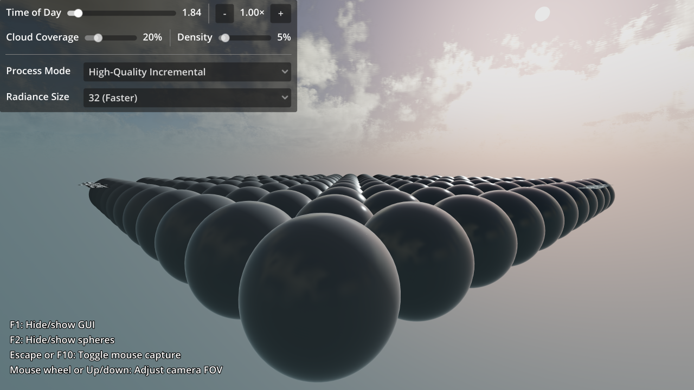
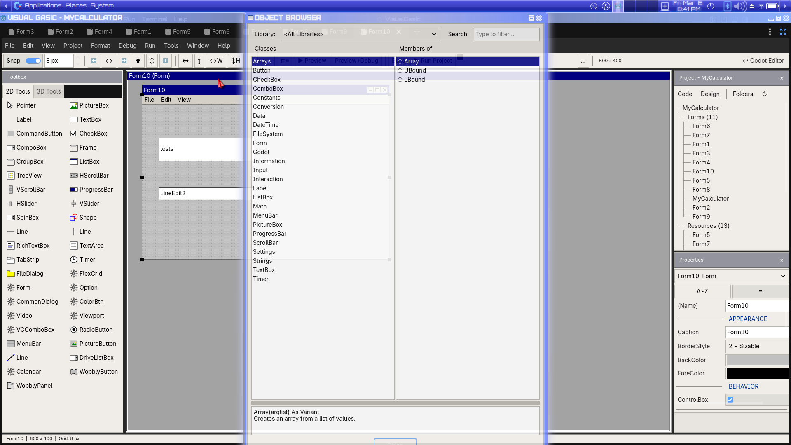
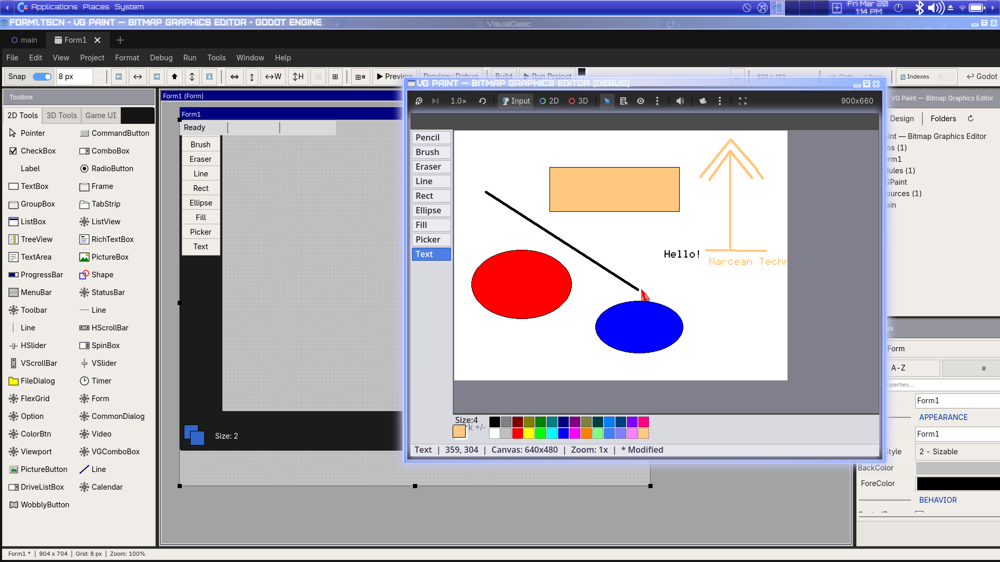

# VisualGasic v4.4.0-rc1 Release Notes — Release Candidate 1 🏁

**Release Date**: March 21, 2026  
**Previous Version**: 4.3.0  
**Status**: **Release Candidate** — all features complete, seeking community testing before stable

---

## 🏁 Release Candidate Status

This is the **first Release Candidate** for VisualGasic. All v4.0 "Next Generation" roadmap features are implemented and tested. We're asking the community to test across all three platforms before promoting to stable.

**What "RC" means:**
- All planned features are complete and tested
- No known critical bugs
- API surface is frozen — no breaking changes before stable
- We need your help finding edge cases before the 1.0 stable release

**How to help test:**
1. Install using one of the methods below
2. Build or open your projects
3. Report issues at [GitHub Issues](https://github.com/xgreenrx-star/VisualGasic/issues)
4. Join the discussion at [COMMUNITY_HUB.md](COMMUNITY_HUB.md)

---

## 📦 Installation

### 🚀 One-Line Install (Recommended)

**Linux / macOS:**
```bash
curl -sSL https://raw.githubusercontent.com/xgreenrx-star/VisualGasic/main/install.sh | bash
```

**Windows (PowerShell):**
```powershell
irm https://raw.githubusercontent.com/xgreenrx-star/VisualGasic/main/install.ps1 | iex
```

**Cross-Platform (Python 3):**
```bash
python3 install.py --github
```

After installation, create a new project instantly:
```bash
vg new MyGame
cd MyGame && godot .
```

### 📥 Manual Download

Download the release zip from [GitHub Releases](https://github.com/xgreenrx-star/VisualGasic/releases/tag/v4.4.0-rc1):

| Platform | File | Contents |
|----------|------|----------|
| **Linux** x86_64 | `VisualGasic-v4.4.0-rc1.zip` | editor + template_debug + template_release |
| **Windows** x86_64 | `VisualGasic-v4.4.0-rc1.zip` | editor + template_debug + template_release |
| **macOS** Universal | `VisualGasic-v4.4.0-rc1.zip` | x86_64 + arm64 (lipo universal) |

1. Extract into your Godot 4.6+ project root
2. Enable the plugin: **Project → Project Settings → Plugins → VisualGasic ✓**
3. Switch to the **Visual Gasic** main screen tab

### 🎨 From the VG IDE (Inside Godot)

Already have a VG project open? Create new projects without leaving the editor:

1. Switch to the **Visual Gasic IDE** main screen
2. Go to **File → New Project...**
3. Enter a project name and pick a folder
4. Click **Create** — a new VG-ready project is generated and opened


### 🔧 Build from Source

```bash
git clone --recurse-submodules https://github.com/xgreenrx-star/VisualGasic.git
cd VisualGasic

# Linux
scons platform=linux target=editor -j$(nproc)

# Windows (cross-compile with MinGW)
scons platform=windows target=editor -j$(nproc)

# macOS (on macOS host)
scons platform=macos target=editor arch=x86_64 -j$(sysctl -n hw.logicalcpu)
scons platform=macos target=editor arch=arm64 -j$(sysctl -n hw.logicalcpu)
./scripts/build_macos_universal.sh  # Combines into universal binary
```

---

## 🖥️ Pre-Built Binaries — All 3 Platforms

Every release zip contains pre-compiled shared libraries for all three platforms:

### Linux x86_64
- `libvisualgasic.linux.editor.x86_64.so`
- `libvisualgasic.linux.template_debug.x86_64.so`
- `libvisualgasic.linux.template_release.x86_64.so`

### Windows x86_64
- `libvisualgasic.windows.editor.x86_64.dll`
- `libvisualgasic.windows.template_debug.x86_64.dll`
- `libvisualgasic.windows.template_release.x86_64.dll`

### macOS Universal (x86_64 + arm64)
- `libvisualgasic.macos.editor.framework/`
- `libvisualgasic.macos.template_debug.framework/`
- `libvisualgasic.macos.template_release.framework/`

---

## ⚡ Performance — Benchmark Results

**All 11 benchmarks faster than GDScript. VG wins 6/9 vs C++.** All checksums verified.

| Benchmark | GDScript | VisualGasic | C++ | **VG vs GDScript** | **VG vs C++** | Winner |
|-----------|----------|-------------|-----|-------------------|---------------|--------|
| Arithmetic | 5,333 µs | 331 µs | 59 µs | **16× faster** | 0.2× | C++ |
| ArraySum | 4,644 µs | 130 µs | 37 µs | **36× faster** | 0.3× | C++ |
| StringConcat | 5,007 µs | 60 µs | 483 µs | **83× faster** 🚀 | **8× faster** 🔥 | **VG** |
| Branching | 6,988 µs | 59 µs | 60 µs | **118× faster** 🚀 | **tied** 🔥 | **VG** |
| ArrayDict | 11,441 µs | 3,834 µs | 4,155 µs | **3× faster** | **1.1× faster** | **VG** |
| DictFastGet | 29,177 µs | 2,210 µs | — | **13× faster** | — | **VG** |
| DictFastSet | 19,266 µs | 2,519 µs | — | **7.6× faster** | — | **VG** |
| Interop | 8,096 µs | 120 µs | 6,882 µs | **67× faster** 🚀 | **57× faster** 🔥 | **VG** |
| Allocations | 6,871 µs | 128 µs | 471 µs | **54× faster** 🚀 | **3.7× faster** 🔥 | **VG** |
| AllocationsFast | 10,309 µs | 1,817 µs | 366 µs | **5.7× faster** | 0.2× | C++ |
| FileIO | 982 µs | 456 µs | 383 µs | **2.2× faster** | 0.8× | C++ |

**Highlights:**
- 🚀 **Branching ties native C++** at 59 µs — 118× faster than GDScript
- 🔥 **Interop is 57× faster than C++** — VisualGasic's Godot API calling convention is highly optimized
- 🔥 **StringConcat is 8× faster than C++** — VG's string builder avoids redundant allocations

### JIT Compilation Architecture (5-Tier Stack)

| Tier | Name | Trigger | Scope |
|------|------|---------|-------|
| 0 | Interpreter | First call | Statement-by-statement AST walk |
| 0.5 | Loop JIT | Hot loop (100+ iters) | Single loop body → x86-64 |
| 1 | AST JIT | Warm function (50+ calls) | Full AST → machine code |
| 2 | Function Body JIT | Hot function (200+ calls) | Bytecode → optimized x86-64 |
| **3** | **Call Graph JIT** | **Hot call chain (500+ calls)** | **Multi-function → fused x86-64 with inlining** |

---

## 📸 Screenshot Gallery

### Visual Gasic IDE — Form Designer


*WYSIWYG Form Designer: 40+ controls in the Toolbox · Drag-and-drop canvas · Properties Panel · Project Explorer · Snap-to-grid alignment*

### Code Editor with Bottom Panel


*Code Editor: Syntax highlighting · Procedure navigation · Tabbed bottom panel (Immediate Window, Output, System Console)*


*Split view: Command Help & Index Map (left) · Syntax-highlighted editor (right) · Draggable bottom panel*

### Immediate Window & Debugging


*Interactive REPL: Execute expressions live · Inspect variables · Remote debugging · Data breakpoints*

### Command Help


*VB6-style keyword reference with Index Map for quick lookup*

### Custom Theme Editor


*8 built-in themes + Custom Theme Editor with 38 adjustable colors and live preview*

### Game UI Controls


*7 Tier 1 animated controls: DialogPanel · InventoryGrid · StatBar · HUDCounter · CooldownButton · NotificationToast · GameMenu*

### Game Demos


*Classic 2-player Pong with AI paddle*


*Tower defense with 13 classes, 3-level inheritance*


*11 full-screen 2D shader effects: whirl, blur, CRT, old film, chromatic aberration*



*Volumetric clouds + Rayleigh/Mie atmospheric sky (3D)*


*Playable piano keyboard with tone generation*


*Animated bouncing shapes screensaver*

### IDE Features


*40+ built-in snippets with custom snippet support*



*Browse all classes, methods, and properties*



*13 financial functions: Pmt, PV, FV, Rate, NPer, IPmt, PPmt, NPV, IRR, MIRR, SLN, SYD, DDB*

---

## 🎯 Complete Feature Summary (as of RC1)

### Core Language
- VB6-compatible syntax (Dim, If/Then, For/Next, Select Case, Do/Loop, etc.)
- Classes & Objects with Inheritance, Properties, Polymorphism
- Lambda expressions (4 syntax forms), Block lambdas
- Functional programming (Map, Filter, Reduce, Any, All, Find)
- Null safety (`??`, `?.`), String interpolation (`$"Hello {name}"`)
- Advanced type system (Generics, Optional, Union types)
- Pattern matching (Select Match with destructuring)
- Async/Await, Parallel For, Task.Run with real std::thread
- Try/Catch/Finally structured exception handling
- ReDim Preserve, Erase, For Each, GoTo, With...End With

### Godot Integration
- Direct node/resource access, scene tree manipulation
- Signal system integration with automatic event binding
- All 37 engine singletons, Godot enum constants
- GDScript parity: Export, Await, Import, ClassName, $NodeName

### Development Tools
- **Visual Gasic IDE**: Full C++ WYSIWYG form editor, 40+ controls, VB6 Properties Panel
- **IntelliSense**: 80+ functions, snippets, Godot types
- **Debugger**: Conditional breakpoints, time-travel, call stack, watch window
- **REPL**: Interactive coding with variable inspection
- **LSP**: Language Server Protocol for IDE integration
- **Linter**: Static analysis with 10 issue codes
- **Package Manager**: `vg pkg` CLI + GUI Package Browser
- **Form Debugger**: Controls Inspector with click-to-source

### High-Performance
- 5-tier JIT stack (interpreter → loop → AST → function body → call graph)
- 9-pass bytecode peephole optimizer
- GPU acceleration (SIMD vector ops, compute shaders)
- All 11 benchmarks faster than GDScript (up to 118×)
- VG wins 6/9 head-to-head vs C++

### System-Level
- FFI, ODBC, Crypto, XML, ZIP
- OS signals, file permissions, raw memory buffers
- IPC (named pipes, UNIX sockets, shared memory)
- Real threading, Android JNI bridge
- Database Controls (VGRecordset, Data, DBGrid, DBCombo)

---

## 🧪 Test Summary

| Category | Tests | Status |
|----------|-------|--------|
| ClassDB Fuzzer | 2,421 across 210 files | ✅ 0 failures |
| Bytecode Compiler (Batches 1-4) | 39 tests | ✅ All pass |
| Database Controls | 13 tests | ✅ All pass |
| Package Manager | 11 tests | ✅ All pass |
| JIT Tier 3 | 10 tests | ✅ All pass |
| Multi-Module Compilation | All assertions | ✅ Pass |
| Performance Benchmarks | 11 benchmarks | ✅ All faster than GDScript |

---

## 📁 What's Included in the Release

```
VisualGasic-v4.4.0-rc1.zip
├── addons/visual_gasic/           # Complete addon
│   ├── bin/                       # Pre-built binaries (Linux, Windows, macOS)
│   ├── *.gd                       # GDScript editor plugin files
│   ├── plugin.cfg                 # Plugin configuration
│   └── visual_gasic.gdextension   # GDExtension manifest
├── docs/                          # Documentation
│   ├── guides/                    # Getting started, installation, migration
│   ├── reference/                 # API reference, VB6 features, Godot functions
│   └── screenshots/               # IDE and game demo screenshots
├── examples/                      # Example VG projects
├── demos/                         # 14 playable game demos
├── tutorials/                     # Step-by-step tutorials
├── install.sh                     # Linux/macOS installer
├── install.ps1                    # Windows PowerShell installer
├── install.py                     # Cross-platform Python installer
├── vg                             # CLI tool (bash)
├── README.md
├── CHANGELOG.md
├── LICENSE
└── RELEASE_NOTES_v4.4.0-rc1.md
```

---

## ⬆️ Upgrade from v4.3.0

If upgrading from v4.3.0 (or any earlier version):

**Option A — `vg` CLI (easiest):**
```bash
cd /path/to/VisualGasic   # Source repo
vg update                  # Updates global installation

cd /path/to/your/project
vg install                 # Updates project addon
```

**Option B — Manual:**
1. Download the release zip
2. Replace `addons/visual_gasic/` in your project
3. Restart Godot

**Option C — Build from source:**
```bash
cd /path/to/VisualGasic
git pull && scons target=editor -j$(nproc)
```

No migration steps needed — RC1 is fully backward-compatible with v4.3.0 projects.

---

## 🔮 Road to Stable

Before promoting to stable (v4.4.0), we need:

- [ ] Community testing on all 3 platforms (Linux, Windows, macOS)
- [ ] Confirm installer works on fresh machines
- [ ] Verify all 14 demo projects run correctly
- [ ] Test `vg new` and `vg install` workflows
- [ ] Edge case testing for Database Controls and Package Manager
- [ ] Performance regression check on user hardware
- [ ] Asset Library submission review

**Report issues:** [GitHub Issues](https://github.com/xgreenrx-star/VisualGasic/issues)  
**Community:** [COMMUNITY_HUB.md](COMMUNITY_HUB.md)

---

*Full changelog: [CHANGELOG.md](CHANGELOG.md) · Roadmap: [ROADMAP.md](ROADMAP.md) · Installation: [docs/guides/INSTALLATION.md](docs/guides/INSTALLATION.md)*
