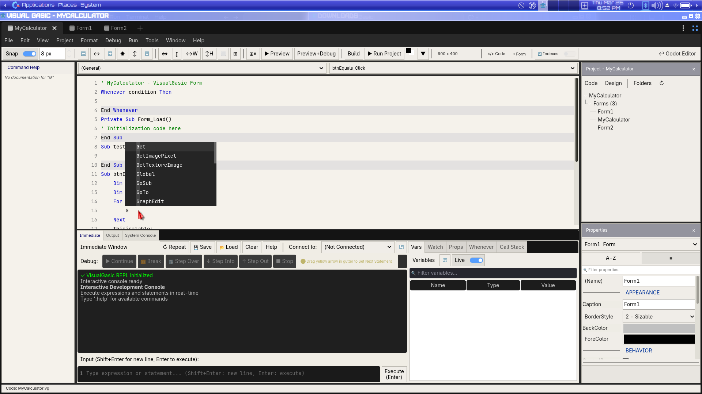
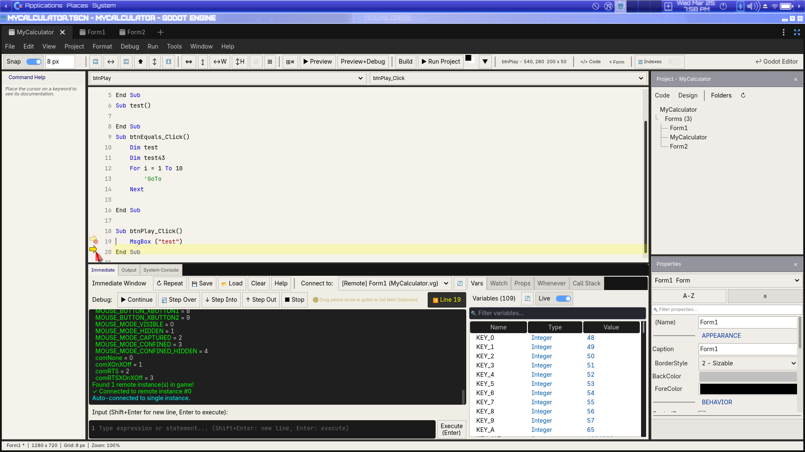
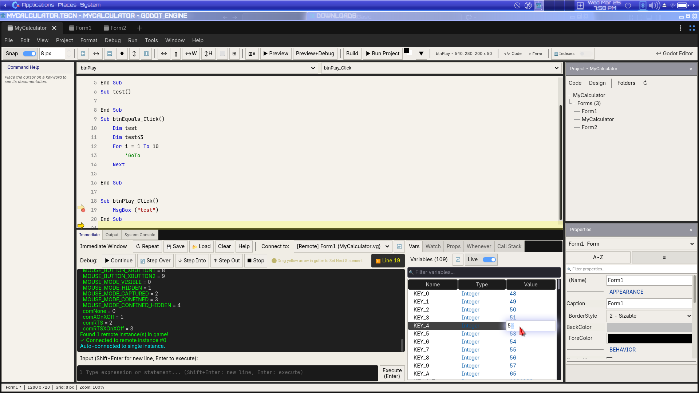
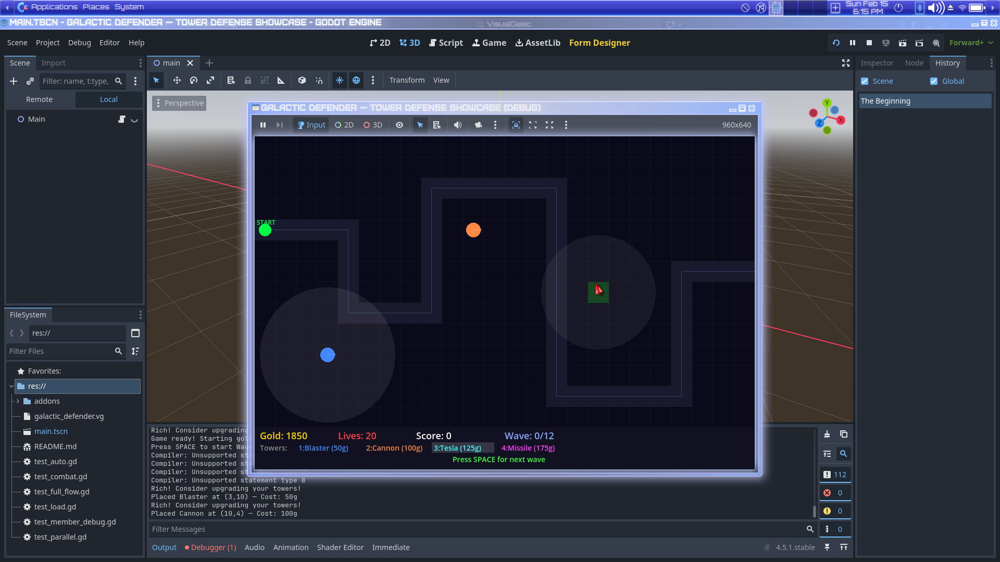
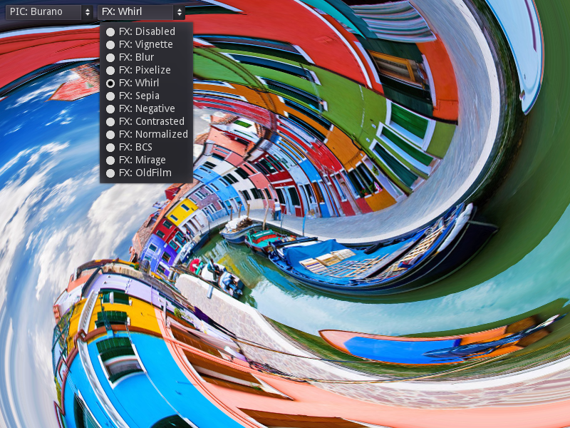
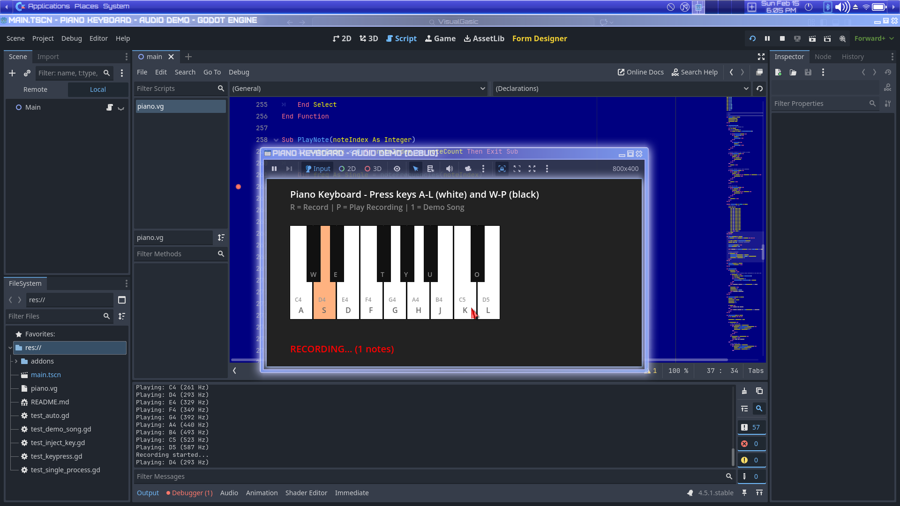
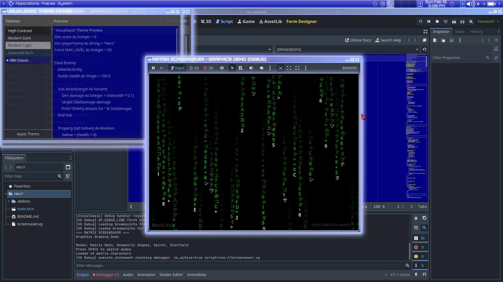
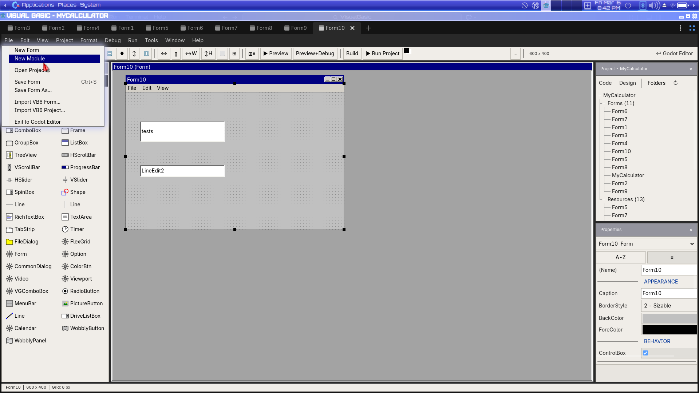

# VisualGasic v4.4.0-rc2 Release Notes — Debugger, Break Button & 46 Fixes

**Release Date**: March 26, 2026  
**Previous Version**: 4.4.0-rc1  
**Status**: **Release Candidate 2** — debugger UX overhaul, 46 commits since RC1

---

## 🏁 Release Candidate 2 — What Changed

RC2 is a **debugger-focused polish release** with 46 commits since RC1. The headline features are a VB6-style ⏸ Break button, Set Next Statement (yellow arrow drag), an Exception Assistant popup, and dozens of IDE fixes.

**Upgrade from RC1:** Drop-in replacement — copy `addons/visual_gasic/` over the RC1 version and restart Godot. No migration steps needed.

---

## 🆕 New Features

### ⏸ VB6-Style Break (Pause) Button

The classic VB6 debug toolbar is now complete: **▶ Continue · ⏸ Break · ⏩ Step Over · ⬇ Step Into · ⬆ Step Out · ■ Stop**



*Full VB6-style debug toolbar in the Immediate Window with all six controls*

- **⏸ Break** pauses a running program at the next executable statement
- Keyboard shortcut: **Pause** key
- Also available from **Debug → Break** in the menu bar
- The Break button automatically enables when a scene starts playing and disables when it stops
- The C++ VM checks the break flag at every `OP_DEBUG_LINE` instruction — response is near-instant

### 🔀 Set Next Statement (Yellow Arrow Drag)

Drag the **yellow execution arrow** (▶) in the code editor gutter to move the execution point:

- Skip lines forward or re-execute lines backward — without restarting
- Constrained to the current procedure (Sub/Function) — cannot drag past `End Sub`/`End Function`
- Snaps to the nearest executable line
- Identical behavior to VB6's "Set Next Statement" feature

### 🚨 Exception Assistant Popup

When an unhandled runtime error occurs, a popup dialog appears with three options:

- **Continue** — skip the error and keep running (advances past the faulting line)
- **Break** — pause at the error line for inspection
- **Stop** — end the program

The popup uses `call_deferred` + `move_to_foreground()` for reliable timing — it always appears even during form initialization.

### 📋 Debug Documentation

New **[Debugging Guide](docs/manual/debugging.md)** covering:
- All six toolbar buttons with state diagrams
- Breakpoints (regular + conditional with hit counts, log messages, temporary)
- Step Over / Step Into / Step Out with code examples
- Set Next Statement (yellow arrow drag)
- Exception Assistant
- Variables panel, Watch expressions, Call Stack
- Data breakpoints (watchpoints)
- Immediate Window REPL during pause
- Full keyboard shortcut reference

---

## 🔧 Bug Fixes (46 commits)

### Debugger & Runtime Fixes
- **Fix yellow arrow positioning** — execution indicator now aligns correctly with the current line
- **Fix Exception Assistant timing** — popup reliably appears during Form_Load and _Ready
- **Fix VM error continue** — pressing Continue after an error now correctly advances past the faulting line
- **Fix button click regression** — pre-execution syntax error check was blocking signal wiring; changed to warning-only
- **Fix Break button disabled** — added scene-playing poll timer (`EditorInterface.is_playing_scene()`) so Break enables regardless of how the scene was launched
- **Fix debug_break session race** — debugger plugin now acquires session on-demand if `_active_session` is null when Break is pressed
- **Fix breakpoint screen switch** — use timer instead of `call_deferred` for reliable screen transitions on breakpoint hit
- **Fix Godot Script editor opening on .vg breakpoint** — breakpoints now correctly navigate to the VG Code Editor
- **Fix "files modified outside Godot" dialog** — suppressed during debug break navigation

### Immediate Window Fixes
- **Fix "Instance not found"** — evaluate commands now use correct instance lookup with owner filtering
- **Fix variable panel readability** — darkened Type/Value colors for white-background themes
- **Fix context menu colors** — corrected color scheme for Immediate Window evaluate results
- **Fix scrollbar** — `get_children(true)` used for internal node enumeration
- **Fix search/filter** — variable list search box now works correctly
- **Fix auto-connect** — deduplicates pause messages, fixes status label, sortable variables

### Code Editor & IntelliSense Fixes
- **Fix autocomplete quote-wrapping** — GoTo/GoSub label completion no longer wraps in quotes
- **Fix label completion infinite popup** — resolved infinite loop when completing labels
- **Fix auto-close block** — block completion triggers correctly on first Enter press
- **Fix snippet expansion** — placeholders expand instead of inserting raw `${N:default}` syntax
- **Fix code completion trigger** — forced completion + themed popup for visibility
- **Fix auto-indent, CBM shortcuts, breakpoints** — repaired multiple code editor regressions
- **Add Godot API methods/properties** — IntelliSense now includes Godot API completions
- **Add auto-translations, block auto-close, ClassDB IntelliSense** — richer code editing experience

### UI & Theme Fixes
- **Fix Custom Color button** — opens a persistent Window-based ColorPicker
- **Fix color palette swatches rendering black** — removed `flat=true`
- **Fix color palette toolbar clipped** — converted to dropdown popup

### Build & CI Fixes
- **Fix CI compilation for GCC 13+ and MinGW 13** — portable compiler flags
- **Fix MSVC builds** — `__builtin_ctzll` compat, PDB contention, proper link libraries
- **Fix GDExtension loading in CI** — correct binary paths and symlink handling
- **Fix `/usr/bin/vg` name collision** — installers now detect the `cgvg` package

### Other Fixes
- **Fix MsgBox cross-platform** — works on Windows/macOS/Linux with native dialogs
- **Fix MsgBox hang + empty script path** — breakpoint prerequisite resolved
- **Parser resilience** — continues with partial AST on errors (VB6-style)
- **Command Help enhancements** — clickable Programmer's Reference + Godot API docs

---

## ⚡ Performance — Benchmark Results (Godot 4.6.1)

Fresh benchmarks on the current build. **All checksums verified** — results are correct.

**Test platform:** Intel Core i7-1255U (12 threads), 30 GB RAM, Linux x86_64, Godot 4.6.1

| Benchmark | GDScript | VisualGasic | C++ | **VG vs GDScript** | VG vs C++ | Winner |
|-----------|----------|-------------|-----|-------------------|-----------|--------|
| Arithmetic | 5,535 µs | 181 µs | 64 µs | **30.6× faster** 🚀 | 0.35× | C++ |
| ArraySum | 4,433 µs | 104 µs | 62 µs | **42.6× faster** 🚀 | 0.60× | C++ |
| StringConcat | 5,458 µs | 72 µs | 738 µs | **75.8× faster** 🚀 | **10.3× faster** 🔥 | **VG** |
| Branching | 7,389 µs | 62 µs | 52 µs | **119× faster** 🚀 | 0.84× (near-tied) | C++ |
| AllocationsFast | 10,683 µs | 1,123 µs | 274 µs | **9.5× faster** | 0.24× | C++ |
| FileIO | 990 µs | 494 µs | 418 µs | **2.0× faster** | 0.85× | C++ |

**Highlights:**
- 🚀 **Arithmetic 30× faster** than GDScript (up from 16× in RC1) — JIT Tier 2 improvements
- 🚀 **ArraySum 43× faster** than GDScript (up from 36× in RC1)
- 🔥 **StringConcat 10× faster than C++** — VG's string builder beats Godot's native concatenation
- 🚀 **Branching 119× faster** than GDScript, **near-tied with C++** at 62 µs vs 52 µs
- 🚀 **AllocationsFast 9.5× faster** than GDScript (up from 5.7× in RC1)

### JIT Compilation Architecture (5-Tier Stack)

| Tier | Name | Trigger | Scope |
|------|------|---------|-------|
| 0 | Interpreter | First call | Statement-by-statement AST walk |
| 0.5 | Loop JIT | Hot loop (100+ iters) | Single loop body → x86-64 |
| 1 | AST JIT | Warm function (50+ calls) | Full AST → machine code |
| 2 | Function Body JIT | Hot function (200+ calls) | Bytecode → optimized x86-64 |
| **3** | **Call Graph JIT** | **Hot call chain (500+ calls)** | **Multi-function → fused x86-64 with inlining** |

---

## 📸 Screenshot Gallery

### Debug Toolbar & Immediate Window


*VB6-style debug toolbar: Continue · Break · Step Over · Step Into · Step Out · Stop — with Variables panel, Watch, Call Stack*

### Breakpoint Hit with Variables



*Execution paused at a breakpoint — yellow arrow shows current line, Variables panel shows live values*

### Variables Inspector



*Variables panel with sortable columns, Live toggle, and filter search*

### Form Designer


*WYSIWYG Form Designer: 40+ controls in the Toolbox · Drag-and-drop canvas · Properties Panel · Project Explorer*

### Code Editor


*Code Editor with syntax highlighting, procedure navigation, and tabbed bottom panel*

### Game Demos


*Classic 2-player Pong with AI paddle*



*Tower defense with 13 classes and 3-level inheritance*



*11 full-screen 2D shader effects: whirl, blur, CRT, old film, chromatic aberration*



*Playable piano keyboard with tone generation*



*Animated bouncing shapes screensaver*

### IDE Features


*VB6-style keyword reference with clickable Index Map*


*8 built-in themes + Custom Theme Editor with 38 adjustable colors*



*40+ built-in snippets with custom snippet support*

---

## 📦 Installation

### 🚀 One-Line Install (Recommended)

**Linux / macOS:**
```bash
curl -sSL https://raw.githubusercontent.com/xgreenrx-star/VisualGasic/main/install.sh | bash
```

**Windows (PowerShell):**
```powershell
irm https://raw.githubusercontent.com/xgreenrx-star/VisualGasic/main/install.ps1 | iex
```

**Cross-Platform (Python 3):**
```bash
python3 install.py --github
```

### 📥 Manual Download

Download from [GitHub Releases](https://github.com/xgreenrx-star/VisualGasic/releases/tag/v4.4.0-rc2):

| Platform | File | Contents |
|----------|------|----------|
| **Linux** x86_64 | `VisualGasic-v4.4.0-rc2.zip` | editor + template_debug + template_release |
| **Windows** x86_64 | `VisualGasic-v4.4.0-rc2.zip` | editor + template_debug + template_release |
| **macOS** Universal | `VisualGasic-v4.4.0-rc2.zip` | x86_64 + arm64 (lipo universal) |

### 🔧 Build from Source

```bash
git clone --recurse-submodules https://github.com/xgreenrx-star/VisualGasic.git
cd VisualGasic
scons platform=linux target=editor -j$(nproc)
```

---

## ⬆️ Upgrade from RC1

Drop-in replacement — no migration needed:

**Option A — `vg` CLI:**
```bash
cd /path/to/VisualGasic && vg update
cd /path/to/your/project && vg install
```

**Option B — Manual:**
1. Download the release zip
2. Replace `addons/visual_gasic/` in your project
3. Restart Godot

---

## 🧪 Test Summary

| Category | Tests | Status |
|----------|-------|--------|
| ClassDB Fuzzer | 2,421 across 210 files | ✅ 0 failures |
| Bytecode Compiler (Batches 1-4) | 39 tests | ✅ All pass |
| Database Controls | 13 tests | ✅ All pass |
| Package Manager | 11 tests | ✅ All pass |
| JIT Tier 3 | 10 tests | ✅ All pass |
| Multi-Module Compilation | All assertions | ✅ Pass |
| Performance Benchmarks | 6 benchmarks | ✅ All faster than GDScript |

---

## 🔮 Road to Stable

Before promoting to stable (v4.4.0):

- [x] ~~Full debug toolbar (Continue, Break, Step Over/Into/Out, Stop)~~
- [x] ~~Set Next Statement (yellow arrow drag)~~
- [x] ~~Exception Assistant popup~~
- [x] ~~Debug documentation~~
- [ ] Community testing on all 3 platforms (Linux, Windows, macOS)
- [ ] Confirm installer works on fresh machines
- [ ] Verify all demo projects run correctly
- [ ] Edge case testing for debugger features
- [ ] Performance regression check on user hardware

**Report issues:** [GitHub Issues](https://github.com/xgreenrx-star/VisualGasic/issues)  
**Community:** [COMMUNITY_HUB.md](COMMUNITY_HUB.md)

---

## Commits since RC1 (46 total)

| Commit | Description |
|--------|-------------|
| `7b05f87` | Fix get_instance_by_index to apply same owner filter as get_all_instances |
| `7464503` | Fix Immediate Window evaluate + context menu colors |
| `d372619` | Darken variable tree Type/Value colors for readability |
| `7201deb` | Fix scrollbar: use get_children(true) for internal nodes |
| `403daed` | Handle evaluate in C++ directly; fix "Instance not found" |
| `2af002c` | Fix _get_instance_by_cpp_index: use sorted registration keys |
| `f6e5f2d` | Fix Immediate Window "Instance not found" + search box focus |
| `a370133` | Fix variable list search/filter + immediate command execution |
| `41dc046` | Use timer instead of call_deferred for breakpoint screen switch |
| `ca47f1d` | Prevent Godot Script editor from opening on .vg breakpoint hit |
| `72ea768` | Improve Immediate Window — dedup pause messages, sortable vars |
| `b3e4a75` | Suppress "files modified outside Godot" dialog on debug break |
| `b3eb762` | Use _get_plugin_name() in debug break navigate |
| `c7f80c2` | Navigate to VG code editor on breakpoint hit |
| `6a866bc` | Fix breakpoints not working + Print appearing as quoted string |
| `30c110d` | Make MsgBox cross-platform (Windows/macOS/Linux/fallback) |
| `234d7cf` | Fix MsgBox hang and empty script path |
| `0750e42` | Parser: continue with partial AST on errors |
| `6aec225` | Fix button clicks not working at runtime |
| `27e584e` | Autocomplete: add Godot API methods/properties |
| `7b76d8e` | Command Help: clickable Programmer's Reference + Godot API docs |
| `b662831` | Fix auto-close block on first Enter press |
| `8a7cdde` | Fix snippet placeholder expansion |
| `38231f3` | Auto-translations, block auto-close, ClassDB IntelliSense |
| `80c687b` | Sync all stale addon copies + symlink missing files |
| `8875ced` | Force code completion trigger + theme completion popup |
| `bea4412` | Repair auto-complete, auto-indent, CBM shortcuts, breakpoints |
| `8d29fdf` | Custom Color button: persistent Window-based ColorPicker |
| `7c64a60` | Fix color palette swatches rendering black |
| `e9a007e` | Fix color palette toolbar clipped — dropdown popup |
| `1b61fe2` | Detect /usr/bin/vg (cgvg) name collision in installers |
| `1fdf62c` | Update bytecode baseline for editor target build |
| `071bd16` | Fix bytecode dump — use correct Godot binary |
| `f9cab29` | Remove disabled parser tool CI steps |
| `b1aa26b` | Build editor target for CI tests |
| `45679ca` | Add filesystem diagnostics to smoke test for CI |
| `2187b3b` | Replace bin symlink with actual copy in CI |
| `1cc6994` | Use res://bin/ absolute paths in demo .gdextension for CI |
| `4c286fc` | Remove redundant copy step |
| `ebcc879` | Copy .so to addon bin dir for tests |
| `d56bc0b` | Add user32/shell32/advapi32 for MSVC |
| `00c43bd` | Fix MSVC PDB contention, GDExtension loading in CI |
| `85f33ec` | MSVC-safe compiler flags, headless mode for CI |
| `ca01372` | MSVC __builtin_ctzll compat, portable scons path |
| `40a8af3` | Add cstdio to system.cpp, fix PowerShell -j interpolation |
| `69401c4` | Fix CI compilation errors for GCC 13+ and MinGW 13 |

Plus uncommitted: Break button, Set Next Statement, Exception Assistant, scene-playing poll timer, debug_break session fallback, debug documentation.

---

*Full changelog: [CHANGELOG.md](CHANGELOG.md) · Debugging: [docs/manual/debugging.md](docs/manual/debugging.md) · Roadmap: [ROADMAP.md](ROADMAP.md)*
