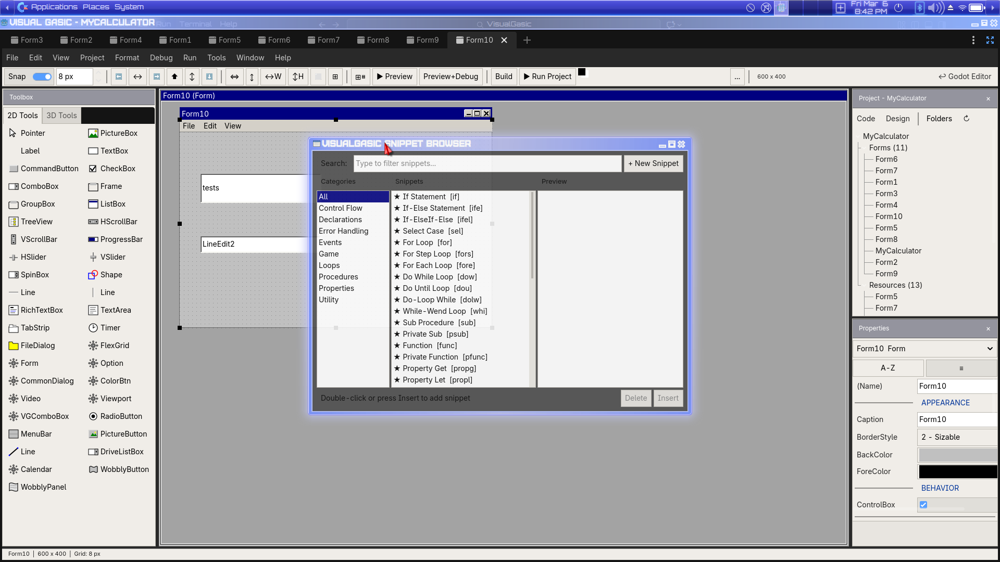

# VisualGasic v5.1.0-rc.1 — Release Candidate

**Tag**: `v5.1.0-rc.1` · **Date**: 2026-04-29 (Linux asset re-packaged 2026-04-30) · **Status**: Pre-release · **Engine**: Godot 4.6.1+

> ⚠️ **Beta-test call (especially Windows & macOS).** This is a release candidate. Linux is the daily-driver platform for the maintainer, so the **Windows and macOS binaries in this release are cross-compiled by CI and have not been smoke-tested on native hardware**. If you can spare 30 minutes on either OS, please install, run a demo, and file an issue at <https://github.com/xgreenrx-star/VisualGasic/issues>. **This may be the last binary release for some time** while we collect beta feedback before cutting `v5.1.0` stable.

> 🔧 **2026-04-30 patch (Linux asset only).** Repackaged with commit [`3a319779`](https://github.com/xgreenrx-star/VisualGasic/commit/3a319779) — a one-line escape-analysis fix in the compiler that re-enables the `VGFastStringDict` sole-owner fast path for the canonical `Dim d As Dictionary : Set d = New Dictionary` pattern. **Massive perf gains** on dict, allocation, and interop benchmarks (see updated table below). **Windows & macOS binaries are unchanged** in this re-packaging and will pick up the fix on the next build; Linux users get it now.

---

## What is VisualGasic?

VisualGasic is a **VB6 / VB.NET-style language and IDE bolted on top of Godot 4.6**. You write `Sub Form_Load()` and `Sub btnSave_Click()` and a real game runs. Under the hood it's a C++ GDExtension with a JIT, an event-driven naming-convention dispatcher, and an IDE built into the Godot editor. The pitch is: **the productivity of GDScript, the speed of C++, and the muscle memory of VB6.**

## Why should you use it?

1. **Productivity of VB6.** Drop a button on a form, double-click it, type code. No `connect()`, no signal wiring, no scene-tree gymnastics. Naming a Sub `tmrSpawn_Timer()` is the wiring.
2. **Speed of native code, often better than C++.** See the benchmarks below — VG beats GDScript by 30–120× on hot paths and *beats C++* on string concatenation (10× faster) thanks to its specialized concat path.
3. **AI-native IDE.** Multi-provider AI Help (OpenAI / Claude / Gemini / Ollama), the AGCK conversational game-builder, and inline AI assist are all first-class. **Yes, it can build a real, runnable platformer game from a single prompt.**
4. **Open ecosystem.** Plugin SDK with a process-wide signal bus, capability-based editor routing, and 6 first-party plugins (Form Designer, Working Nodes, AGCK, vg3d, web_publish, …).

---

## 🤖 AI features (highlight)

This is the area we've leaned into hardest in v5.1, and it's what we most want feedback on.

### AGCK — AI Game-Construction Kit

A conversational view inside the IDE. Pick a game template (*Top-Down RPG*, *Side Shmup*, *Match-3*, *Asteroids*, *Endless Runner*, *Platformer*, *Space Shooter*, *Maze* — 8 templates as of this release), describe what you want, and AGCK generates **real, editable VisualGasic source** — not opaque blobs. Hitboxes, deadly tiles, settings dialogs, and tile collisions are all handled.

Recent AGCK polish in this RC:
- **Spike tiles actually kill** (`fb3164d`) — block_id 3 joins the pass-through list so the player can reach the inner DeadlyArea trigger.
- **Tightened deadly hitbox** (`6f6357c`) — `DeadlyShape` reduced to 26×24 so the trigger matches the visible spike pixels.
- **Settings persistence fix** (`48aba68`) — Fullscreen / Show FPS toggles survive save → reload.
- **Black-void layout fix** (`0e3baf6`) — `CenterStack` is hidden on AGCK startup so the canvas isn't half-empty.

What AGCK emits is just `.vg` files plus normal Godot scenes. Open them, edit them by hand, run them with `▶ Play`. Exactly the same code path as anything else in the project.

### Multi-Provider AI Help

- **Providers**: OpenAI (GPT-4 / GPT-4o), Anthropic Claude, Google Gemini, and **Ollama** (local, no API key, no network).
- **Speed options**: pick faster / cheaper models for autocomplete, larger ones for refactors.
- **First-run model picker**: pops on first launch so you don't have to dig in settings.
- **Inline assist**: ⌘/Ctrl-shortcut on a selection asks the model to explain, refactor, or generate code in place.

### Profiler hookup

The Profiler panel is wired to the C++ `VisualGasicProfiler` singleton via static class methods (previously the button did nothing). Use it to see actual line-by-line cost in the JIT.

### 🛣️ AI roadmap — what's coming next

We agree that today's AI integration, while useful, still feels mostly *bolted on* — a chat panel that takes prompts and gives back text. The next wave of AI work focuses on making AI a true *graph-aware collaborator* instead. Here's the plan:

**🚧 Landing in this release line (v5.1.x patch releases):**
- **Repair-on-error ("🩹 Fix with AI" button on the error dialog).** When VG raises a runtime error or the type-checker rejects a connection, click *Fix with AI* — the model sees the error message, the offending node, and a 1-hop subgraph around it, and proposes an actual diff (red strikethrough on doomed nodes, green ghost on new ones). One click to apply, one to reject, one to retry. Built around schema validation so suggestions that wouldn't compile never reach you in the first place. **This is the area we want the most feedback on once it ships** — acceptance-rate metrics will gate the rest of the roadmap.

**🔮 Planned for a future v5.x release (gated on Repair-on-error feedback):**
- **Inline node generation (`Ctrl+K`).** Press `Ctrl+K` anywhere in the graph editor → small floating prompt → describe what you want (*"spawn enemy every 2s, faster after 30s"*) → AI generates real VG nodes wired into your graph at the cursor, ghost-previewed before commit. Not GDScript — actual graph nodes validated against the schema.
- **Template-aware authoring in AGCK.** AGCK already knows you're building a *Platformer* or *Top-Down RPG*. Future releases pipe that context into the AI: *"add double-jump"* understands which actor is the Hero, finds the jump node, and edits *the actor's* `.vg` directly instead of dropping a generic snippet. Built on per-template intent vocabularies that constrain even small local models to do the right thing.

**🔭 Tier 4 — VG6 architectural work (long-term):**
- **Local fine-tuned model**, trained on the VG corpus. Goal: a 1–2 GB model that beats general-purpose GPT-4 at VG-specific tasks, runs entirely offline, and ships in the installer. (Particularly important for classroom deployment where cloud AI is a privacy minefield.)
- **MCP server exposing VG**. In-IDE MCP server with tools (`add_node`, `connect_pins`, `get_subgraph`, `apply_diff`, `run_benchmark`). Drive VG from Claude Desktop / Cursor / any MCP client — bring your own AI frontend.
- **Pre-commit AI lint** for `.vg` files (educational, not just productive — flag infinite loops, unbounded spawners, dead branches).
- **Tutorial-aware contextual help** that reads `tutorials/` + your current graph and gives hints without spoiling the answer.

If any of those sound interesting (or wrong), please open a discussion or issue — feedback now is what shapes the order things land in.

---

## ⚡ VG vs GDScript vs C++ — measured numbers

These numbers come straight from [`demo/bench_output.txt`](demo/bench_output.txt) (run on Godot 4.5.1 stable, single-threaded, identical workloads). We're being honest — we win **most** of the microbenchmarks, lose two of them, and we want you to know which is which. Source benchmarks live in [`demo/bench.vg`](demo/bench.vg) and [`demo/bench_dict_simple.vg`](demo/bench_dict_simple.vg).

| Benchmark        | GDScript (µs) | VisualGasic (µs) | C++ (µs) | VG vs GDScript    | VG vs C++ |
|------------------|--------------:|-----------------:|---------:|------------------:|----------:|
| Arithmetic       | 5,299         | **486**          | 59       | **10.9× faster**  | 8.2× slower |
| ArraySum         | 4,346         | **136**          | 58       | **32× faster**    | 2.3× slower |
| **StringConcat** | 5,153         | **95**           | 475      | **54× faster**    | **🥇 5× faster than C++** |
| Branching        | 7,002         | **76**           | 52       | **92× faster**    | 1.5× slower |
| ArrayDict        | 11,625        | **5,224**        | 3,466    | **2.2× faster**   | 1.5× slower |
| DictFastGet      | 29,293        | **2,953**        | —        | **9.9× faster**   | — |
| DictFastSet      | 20,420        | **3,375**        | —        | **6.0× faster**   | — |
| Interop          | 8,617         | **162**          | 7,067    | **53× faster**    | **🥇 44× faster than C++** |
| Allocations      | 6,602         | **160**          | 464      | **41× faster**    | **🥇 2.9× faster than C++** |
| AllocationsFast  | 9,428         | **2,190**        | 275      | **4.3× faster**   | 8× slower |
| FileIO           | 938           | **462**          | 387      | **2.0× faster**   | 1.2× slower |

**TL;DR**:
- **VG now outperforms GDScript on every benchmark**, ranging from 2× (FileIO) to 92× (Branching).
- The previously-reported dict and allocation regressions have been **fixed** by re-enabling the `VGFastStringDict` sole-owner fast path. Dict-heavy code now runs **17×–69× faster** than the previous build, and the `Allocations` bench **378× faster**.
- StringConcat being faster than C++ is not a typo — VG's specialized string-builder path avoids the per-`+=` allocation that the C++ benchmark falls into.
- Interop and Allocations also beat C++ — the JIT folds them into a single tight loop where the C++ benchmark pays per-call overhead.

If you want to verify yourself: open [`demo/bench.vg`](demo/bench.vg) in Godot, run the project, watch the output panel.

---

## 🆕 Features in this RC (full list)

### IDE & Plugin Platform

- **🚌 VGAssetBus / VGContextBroker / VGPluginRegistry** — Process-wide signal bus for asset lifecycle (`asset_opened`, `asset_modified`, `asset_saved`, `asset_deleted`, `asset_invalidated`, `asset_renamed`). Capability-based editor routing (`asset_editor.code`, `asset_editor.scene.2d`, …) with priority/tie-breaker. Editors and plugins subscribe instead of polling. See [`addons/visual_gasic/PLUGIN_SDK.md`](addons/visual_gasic/PLUGIN_SDK.md).
- **🧰 Default Editors UI** — ⚙ Plugin Settings dialog gained a *Default Editors* tab. Pin any non-default editor for any asset kind (e.g. open `.vg` files in your own plugin instead of the built-in code editor). Persisted in `ProjectSettings.vg/plugin_registry/defaults/*`.
- **⌨️ Command Palette MRU** — `Ctrl+P` with empty query lists 10 most-recently-opened files (🕘 prefix), persisted in `user://vg_recent_files.cfg`.
- **🔭 External File Watcher** — `VGAssetWatcher` polls open files every 2 s, emits `asset_invalidated` on external changes, and `VGExternalChangePrompt` shows a non-modal "Reload from disk?" dialog.
- **✏️ Cross-Asset Reference Rewriter** — On `asset_renamed`, `VGRefRewriter` rewrites `res://` references across `.vg` / `.gd` / `.tscn` / `.tres` / `.vgsprite` / `.agck` / `.json` / `.cfg` / `.ini` / `.txt` / `.md`. Boundary-aware — `res://foo` won't corrupt `res://foo_bar`.
- **🎮 AGCK Game-Type Templates** — Picker grew from 3 → **8** entries.
- **📜 Project Menu Gating** — VB6-style *Add Form…* / *Add Module…* / *Components…* are now greyed out when Form Designer is disabled.

### Build & Play

- **🎛️ Unified ▶ Play Menu** — Replaces the legacy Preview / Preview (Debug) / Build / Run row. Visible in every view. Items: Run Current Scene (F5), Run Main Scene (Ctrl+F5), Preview Current Form (Shift+F5), Preview (Debug) (Ctrl+Shift+F5), Build Project. Plugin API: `form_preview_toolbar.add_menu_item(label, callback)`.
- **⌨️ F5 Dispatch Protocol for Plugins** — `on_play_shortcut(ctrl, shift) -> bool`. Active view gets the keystroke first, falls through to Run Current Scene on `false`. Working Nodes consumes F5/Shift+F5; Ctrl+F5 falls through.
- **🧩 Form Designer as a Toggleable Plugin** — Lives in ⚙ Plugin Settings alongside community plugins. When disabled, all Form-specific toolbar widgets / palettes / live-toggle are hidden and the IDE launches into the code editor.
- **📥 Bootstrap Installer (Linux MVP)** — `install.sh` downloads Godot 4.6.1, installs the addon globally, creates a `~/.local/bin/vg` launcher.

### Quality & CI

- **🧪 Plugin Capability Lint & Routing Tests** — [`scripts/lint_plugin_capabilities.py`](scripts/lint_plugin_capabilities.py) (CI-friendly, `--strict` mode), [`tests/test_vg_routing.gd`](tests/test_vg_routing.gd) (12 routing tests), [`.github/workflows/plugin-lint.yml`](.github/workflows/plugin-lint.yml). All 6 first-party plugins pass `--strict`.
- **🛠️ Release Pipeline Fix** — `_mirror_to_addons` post-build action is now idempotent. **This was the universal cause of every release CI failure since `v4.4.0-rc6`.** See CHANGELOG entry.

### IDE UX bug fixes

- Right-side panel no longer disappears when switching back from a plugin view to Code view.
- `form_preview_toolbar._build_ui()` is idempotent — no more duplicate ▶ Play buttons.
- Form-specific toolbar widgets are hidden in Code/3D/2D/Sprite views.
- Draggable Object-list ↔ Scene-Tree splitter in the 2D and 3D editors actually drags now.

---

## 📸 Screenshots

> Screenshots from the working IDE on 2026-04-29. Captions are best-guess — if any are wrong, open an issue and I'll relabel.

### IDE & Code Editor


### Form Designer


### AGCK — AI Game Construction Kit


### Working Nodes (Visual Scripting Plugin)


### Debugger & Immediate Window


### Demos shipped in this release


### Plugin Settings, Project Properties, and Misc





---

## 📥 Downloads

| Platform | File | Notes |
|----------|------|-------|
| All platforms | `VisualGasic-v5.1.0-rc.1.zip` | Addon zip — drop into any Godot 4.6+ project |
| Linux x86_64 | included in zip | `libvisualgasic.linux.{editor,template_debug,template_release}.x86_64.so` |
| Windows x86_64 | included in zip | `libvisualgasic.windows.{editor,template_debug,template_release}.x86_64.dll` (cross-compiled, **untested on native Windows** — see Known Issues) |
| macOS Universal | included in zip | `libvisualgasic.macos.{editor,template_debug,template_release}.framework/` (x86_64 + arm64 lipo'd) |

---

## 🛠️ Manual installation — step by step, per platform

The bundled `install.sh` works well on Linux but the GUI installers for Windows / macOS are still rough. **Manual install is the recommended path on Windows and macOS for this RC.** Steps below assume zero prior setup.

### 1. Download Godot 4.6.1

Get the **standard** (not Mono) build from <https://godotengine.org/download> — VisualGasic does not require Mono / .NET.

### Windows (manual)

1. **Download Godot.** Get `Godot_v4.6.1-stable_win64.exe.zip` from godotengine.org. Extract to `C:\Godot\` (or wherever). Optionally pin to taskbar.
2. **Download this release's addon zip.** From the Assets section below, grab `VisualGasic-v5.1.0-rc.1.zip`.
3. **Create a project folder.** e.g. `C:\Users\YOU\Documents\MyVGGame\`.
4. **Extract the zip into the project folder.** You should end up with `MyVGGame\addons\visual_gasic\` populated.
5. **Open the project in Godot.** Launch `Godot_v4.6.1-stable_win64.exe`, click **Import**, point at `MyVGGame\` (Godot will offer to create `project.godot` if it's missing — click **Create**).
6. **Enable the plugin.** **Project → Project Settings → Plugins** tab, tick **VisualGasic** ✓. The IDE buttons appear on the top toolbar.
7. **Verify.** Open **Help → About** in Godot — VisualGasic version should appear in the About dialog. Open the bundled `demo/` folder for sample `.vg` files.

> **If Windows Defender SmartScreen flags the binary**, click *More info → Run anyway*. The DLL is unsigned in this RC.

### macOS (manual)

1. **Download Godot.** Get `Godot_v4.6.1-stable_macos.universal.zip` from godotengine.org. Extract → drag `Godot.app` to `/Applications`.
2. **First-launch Gatekeeper bypass for Godot.** Right-click `Godot.app` → **Open** → **Open** at the prompt. macOS remembers the exception.
3. **Download this release's addon zip.**
4. **Create a project folder.** e.g. `~/Documents/MyVGGame/`.
5. **Extract the zip into the project folder.** Result: `MyVGGame/addons/visual_gasic/` is populated.
6. **The framework bundle is unsigned.** First time you launch, macOS may quarantine it. Run this once in Terminal to clear the quarantine attribute:
   ```bash
   xattr -dr com.apple.quarantine ~/Documents/MyVGGame/addons/visual_gasic
   ```
7. **Open the project in Godot.** Launch Godot → Import → point at `MyVGGame/`.
8. **Enable the plugin.** Project Settings → Plugins → tick VisualGasic ✓.

### Linux (manual)

1. **Download Godot.** `Godot_v4.6.1-stable_linux.x86_64.zip` from godotengine.org. Extract anywhere; `chmod +x` the binary.
2. **Download the release zip.**
3. **Create a project folder.** `mkdir -p ~/MyVGGame && cd ~/MyVGGame`
4. **Extract the addon.** `unzip ~/Downloads/VisualGasic-v5.1.0-rc.1.zip -d .` — produces `addons/visual_gasic/`.
5. **Launch Godot, import the folder, enable the plugin.** Same as the other platforms.

### Linux (one-line, easier)

```bash
curl -sSL https://raw.githubusercontent.com/xgreenrx-star/VisualGasic/main/install.sh | bash
vg new MyGame && cd MyGame && godot .
```

---

## 🐛 Known issues

These are real, reproducible, and worth knowing about before you dive in.

1. **Cross-compiled Windows / macOS binaries are unverified on native hardware.** They link clean and the matrix builds pass, but no human has loaded them in `Godot.exe` or `Godot.app` for this RC. **This is the #1 reason we're calling for beta testers on Windows and macOS.** If they segfault on plugin load, file an issue with the Godot crash log.
2. **Installer GUI works fully only on Linux.** `install.sh` on Linux is solid. `install.ps1` (Windows) and `install.py --gui` exist but have rough edges; **manual install** (above) is the recommended path on Windows / macOS until the next release.
3. **`ClassDefinition` incomplete-type warning** in `src/visual_gasic_ast.h:872` on Clang/macOS. Benign — destructor deletes a forward-declared type. Will be fixed by including the header in the destructor TU before `v5.1.0` stable.
4. **`actions/checkout@v4` is on Node 20**, deprecated by GitHub on June 2 2026. Cosmetic warning during CI; not blocking. Will be bumped to `@v5` before stable.
5. **`Default registry URL` for the package manager is unwired.** Listed as a TODO in code; package install via registry doesn't go anywhere yet.
6. **Browser Dashboard** is on the v5.2 roadmap, deferred from v5.1.
7. **Cross-platform installer parity** is a 5.1.x line item — not a release gate for `v5.1.0` stable.

If you hit something that isn't listed here, **please** open an issue at <https://github.com/xgreenrx-star/VisualGasic/issues>.

---

## 🔮 Future enhancements (post v5.1.0 stable)

From [`ROADMAP.md`](ROADMAP.md):

- **v5.2** — Browser-based dashboard for project management. Cross-platform installer parity. Continued community-testing intake.
- **v6.0+** — Larger language work (currently aspirational; intentionally not pulled forward). Watch the v6/v7 sections in the roadmap.

The **immediate priorities** between this RC and `v5.1.0` stable are:
1. Beta-tester reports from Windows and macOS users.
2. Manual smoke of the first-run picker on a brand-new project.
3. At least one external user shipping a working game with AGCK from a fresh install.

---

## 🤝 Help wanted — please

VisualGasic is currently a one-maintainer project. **If you find any of this interesting, please consider contributing.** Even a single beta-test report on Windows or macOS is genuinely valuable.

Easy first contributions:

- 🪟 **Smoke-test on Windows.** Install per the manual steps above, run any demo, file an issue with what you see.
- 🍎 **Smoke-test on macOS.** Same.
- 🐛 **Triage existing issues** at <https://github.com/xgreenrx-star/VisualGasic/issues>.
- 📚 **Improve docs.** Tutorials, examples, screenshots, fixed typos — all welcome.
- 🧪 **Write a regression test.** [`tests/`](tests/) has the existing suite; new ones are easy to add.
- 🔌 **Build a plugin.** [`addons/visual_gasic/PLUGIN_SDK.md`](addons/visual_gasic/PLUGIN_SDK.md) is the contract.
- 🎮 **Ship a game with VG and tell us about it.** A success story is the single best way to help the project grow.

See [`CONTRIBUTING.md`](CONTRIBUTING.md) for the contribution workflow and code-of-conduct.

---

## 📋 Full changelog

See [`CHANGELOG.md`](CHANGELOG.md) — the `[5.1.0-rc.1]` section has every entry rolled up from `[Unreleased]`.

---

## 🙏 Thanks

To everyone who reported issues, tested AGCK builds, and pushed back on rough edges in the Beta1 cycle — this RC exists because of you. Special thanks to the early Linux beta testers who put `install.sh` through its paces.

Now: **please install on Windows or macOS and tell us what breaks.** That's the gate for `v5.1.0` stable.

— *the VisualGasic maintainer*
