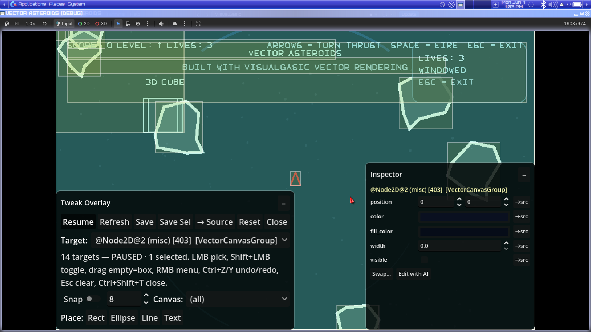
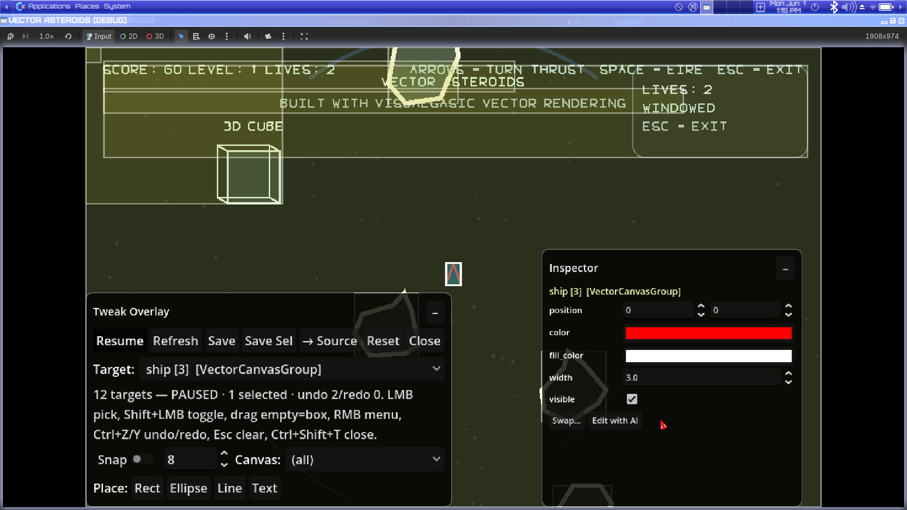
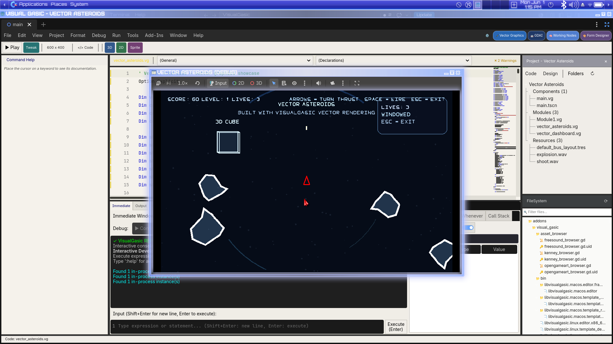
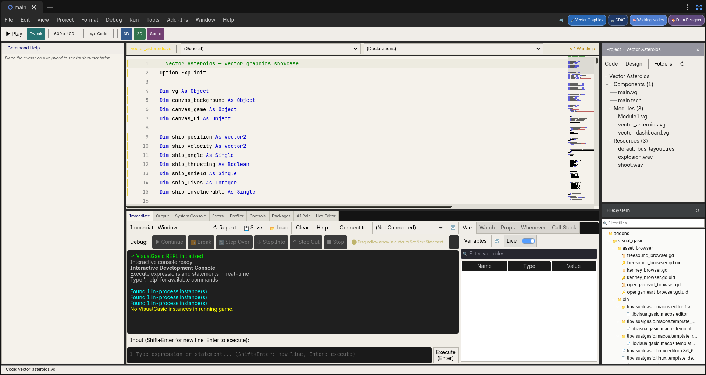

# VisualGasic v5.2.0-Beta3 — Release Notes

**Released:** June 1 2026  
**Status:** Public beta (Linux x86_64 + Windows x64)  
**Codename:** *Tweak It, Don't Type It*

Third beta on the 5.2 line. This one is focused on the **2D Scene Editor**
and the **Tweak Overlay**: you can now reshape the scene tree by drag-and-drop,
instance child scenes, swap node types in place, and — the headline — tweak
the colors of any running vector-graphics `.vg` and **write the change back to
the source file** in one click.

Performance is unchanged from Beta2: VG remains **2–92× faster than GDScript**
on the published microbenchmarks.

> 🍏 **macOS:** still unchanged from Beta1 — Linux + Windows only for 5.2.

---

## 🎬 See It In Action

> **[▶ Watch the VisualGasic Demoscene — YouTube](https://youtu.be/TODO)**

A 165-second procedural demoscene written entirely in VG — **zero external
assets, one `.vg` file.** Five effects, live chiptune, all rendered through
`VGVectorCanvas2D`:

- **Starfield** — 600 perspective-projected star streaks, BPM-driven speed,
  Lissajous camera drift, warp-rush into the torus
- **Torus** — full wireframe rotation with heartbeat kick-drum pulse and
  BPM-accelerating colour cycle; arrives from the starfield and explodes
  into plasma
- **Plasma** — 40×23 HSV colour-wave grid locked at 200 BPM
- **Credits** — helix-orbit logo + sine-wave text scroller
- **Title card** — wave title, border frame, corner accents, fade-in/out

### The Tweak Overlay demo

The video shows the **Tweak Overlay** (`Ctrl+Shift+T`) in use on **live
procedurally generated graphics** — the plasma wave, torus wireframe,
starfield tint, and credits logo are all being adjusted in real time while
the chiptune plays. The five named `BeginGroup`/`EndGroup` blocks
(`PlasmaA`, `PlasmaB`, `TorusColor`, `StarsColor`, `LogoColor`) expose
themselves as live colour pickers in the overlay panel.

Hitting **→ Source** patches the chosen colour directly into the `.vg`
source line — so what you hear and see while tweaking is exactly what ends
up committed to the file. No re-typing, no guessing hex values.

The entire demo is at [`game_projects/demoscene_intro/demo.vg`](game_projects/demoscene_intro/demo.vg)
and can be run headlessly or recorded with Godot's built-in movie writer:

```bash
./Godot_v4.6.1-stable_linux.x86_64 \
  --path game_projects/demoscene_intro \
  --fixed-fps 60 \
  --write-movie demoscene_intro.avi
```

---

## ⚠️ Known issues

- **VGMusic (Bosca Ceoil) requires a restart to work** — unchanged from
  Beta2. Close VisualGasic and reopen it; Bosca works on the second launch.

---

## 🎨 Tweak Overlay — Source write-back (D3 MVP)

The Tweak Overlay (`Ctrl+Shift+T` while a `.vg` is running) lets you pick
any drawn shape and edit its color, position, rotation, and scale live.
Beta3 closes the loop: changes can now be **written back into the `.vg`
source**.

- **New `→ Source` button** in the overlay toolbar. Press it and the
  selected color tweak is patched into the originating line of the `.vg`
  file via `VGTweakSource.patch_property`.
- Supports both `Color(r, g, b)` / `Color(r, g, b, a)` literal forms and
  the named constant form (`Color.RED`, `Color.CORNFLOWER_BLUE`, etc.).
- Handles the four color properties the runtime exposes: `color`,
  `fill_color`, `modulate`, `self_modulate`.
- **Non-destructive on failure:** if the source line can't be matched
  cleanly, the runtime tweak is kept in the JSON tweak bag so nothing is
  lost. Other properties (position, scale, rotation, …) continue to
  persist in `user://vg_tweaks.json` / `res://.vg_tweaks.json` exactly
  as in Beta2.
- The runtime stamps every draw command with `__src_file`, `__src_line`,
  and `__src_ord` attribution so the patcher knows which line in which
  file to edit.

A new headless test (`tests/run_d3_patch_test.gd`) covers 11 patch
scenarios end-to-end, including the no-Color-on-line and unsupported-
property paths.

> See [docs/guides/TWEAK_OVERLAY.md](docs/guides/TWEAK_OVERLAY.md) for
> the full keyboard / mouse cheatsheet, persistence model, and the
> complete list of supported D3 properties.

### 🐛 Tweak Overlay — asteroid / multi-command ghosting fix

When a clicked draw command belonged to a `BeginGroup` / `EndGroup` block
— e.g. an asteroid built from a fill polygon **plus** an outline polyline
— the overlay used to move only the topmost sibling. The other commands
stayed put, leaving "ghost" geometry behind and a stretched selection
rectangle covering both.

- Clicks on a grouped command now select the **whole group** so dragging
  moves every sibling together.
- Hold **`Alt`** at click time to fall back to single-command picking
  when you want to recolor just the outline.
- `VectorCanvas.get_target_bounds()` was added so group selection
  rectangles track live position overrides instead of snapping to the
  static base geometry.

---

## 🧩 2D Scene Editor — Instance Child Scene

Right-click the scene tree → **Instance Child Scene…** (or click the 🔗
button in the tree action row) to add an existing `.tscn` as a nested
scene under the selected node.

- The instance is parented to the selected `Node2D` (or the scene root)
  and positioned at the view center.
- Names auto-uniquify to avoid collisions.
- `_save_scene` was hardened so the saver writes
  `[node ... instance=ExtResource(…)]` instead of flattening the instance
  into editable overrides. `Node.duplicate()` now uses
  `DUPLICATE_USE_INSTANTIATION` and ownership is set non-recursively.

## 🛠️ 2D Scene Editor — Drag-Reparent + Change Type

The scene tree now accepts **drag-and-drop reparenting**.

- Drop **onto** a row → the dragged node becomes a child of that row.
- Drop **between** rows → the dragged node becomes a sibling at that index.
- Global transforms are preserved when both source and new parent are
  `Node2D`, so visuals don't jump.
- A cycle guard blocks dropping a node onto itself or its descendants;
  name collisions auto-uniquify.

A new **Change Type…** context-menu entry converts the selected node
between common 2D classes — `Node2D`, `Sprite2D`, `AnimatedSprite2D`,
`Area2D`, `StaticBody2D`, `RigidBody2D`, `CharacterBody2D`, `Camera2D`,
`Path2D`, `PathFollow2D`, `Marker2D` — copying the common Node2D /
CanvasItem properties and re-parenting all children onto the new node at
the same tree index.

---

## 📦 Make EXE — preset preservation across platforms

`File → Make EXE…` used to rewrite `export_presets.cfg` from scratch on
every build, which silently wiped any preset for a different platform —
build Linux, then Web, and your Linux preset was gone.

Beta3 parses out all other presets, preserves them verbatim, and
renumbers them after the active preset. Building Linux then Web (or vice
versa) now keeps **both** configurations side by side.

A new headless test (`tests/run_multi_preset_test.gd`) covers the merge
logic with 11 assertions.

---

## 💡 65 Tip-of-the-Day entries

The IDE's tip-of-the-day rotation grew from 30 to **65** entries, now
including:

- Alt+click selects an individual draw command inside a group in the
  Tweak Overlay.
- The full Tweak Overlay docs link
  ([docs/guides/TWEAK_OVERLAY.md](docs/guides/TWEAK_OVERLAY.md)).
- Pointers to the new 2D Scene Editor shortcuts.

---

## 📚 Documentation & manuals

All docs live in the repo and are updated for Beta3. The Tweak Overlay
guide is new this release.

| Document | What it covers |
|---|---|
| [Tweak Overlay Guide](docs/guides/TWEAK_OVERLAY.md) | **New** — full live-tweaking workflow: mouse + keyboard cheatsheet, toolbar reference, group promotion, Alt+click escape hatch, persistence model, D3 supported props, related links |
| [Language Reference](docs/VisualGasic_Language_Reference.md) | Complete A–Z reference for every keyword, statement, function, and namespace verb |
| [Documentation Index](docs/DOCUMENTATION_INDEX.md) | Navigable index of all docs, guides, and tutorials |
| [Getting Started — Installation](docs/getting_started/installation.md) | Install scripts, manual setup, `vg` CLI |
| [Getting Started — Introduction](docs/getting_started/introduction.md) | What VG is and why you'd use it |
| [Godot Programming Manual](docs/GODOT_PROGRAMMING_MANUAL.md) | Using Godot APIs from VG code |
| [Command Quick Reference](docs/reference/commands.md) | Concise control-flow + namespace wrappers table |
| [Godot Functions Reference](docs/reference/GODOT_FUNCTIONS_REFERENCE.md) | All Pass 1–6 namespace verbs with signatures |
| [Builtin Functions Reference](docs/reference/BUILTIN_FUNCTIONS_REFERENCE.md) | Print, Input, MsgBox, file I/O, math, etc. |
| [Controls Reference](docs/reference/CONTROLS_REFERENCE.md) | All 40+ toolbox controls and their IDE properties |
| [Migration Guide (VB6/VBA)](docs/guides/MIGRATION_GUIDE.md) | Moving existing VB6 or VBA code to VG |
| [Importing VB6 Projects](docs/guides/IMPORTING_VB6.md) | Using the VB6 → VG importer |
| [Form Designer Guide](docs/WINFORMS_FORM_GUIDE.md) | Designing forms in the IDE |
| [Immediate Window](docs/IMMEDIATE_WINDOW.md) | The REPL/debugger window |
| [Advanced Features Manual](docs/ADVANCED_FEATURES_MANUAL.md) | Multitasking, FFI, JIT, threading and more |
| [IDE Shortcuts](docs/manual/IDE_SHORTCUTS.md) | Every keyboard shortcut in the IDE |
| [AGCK Manual](docs/manual/AGCK_MANUAL.md) | Game template designer reference |
| [Bosca Ceoil Manual](docs/manual/BOSCA_CEOIL_MANUAL.md) | VGMusic / Bosca integration |
| [Sprite Editor Manual](docs/manual/SPRITE_EDITOR_MANUAL.md) | Built-in sprite editor |
| [Hex Editor Manual](docs/manual/HEX_EDITOR_MANUAL.md) | Built-in hex editor |
| [VG vs GDScript](docs/guides/VG_ADVANTAGES_OVER_GDSCRIPT.md) | 19 capabilities VG has that GDScript does not |
| [Release Process](RELEASE_PROCESS.md) | How VG versions and tags releases |
| [Contributing](CONTRIBUTING.md) | How to contribute |
| [Security Policy](SECURITY.md) | Reporting vulnerabilities |

---

## 🐛 Bug fixes

- **Tweak Overlay asteroid ghosting** — see Tweak Overlay section above.
- **Two `Cannot infer the type` parse errors** in `vg_tweak_overlay.gd`
  and `vg_tweak/vg_tweak_inspector.gd` (loop-variable type inference
  under Godot 4.6.1 strict mode) — fixed with explicit type annotations.

---

## 📸 Screenshots

**Tweak Overlay — picking a grouped asteroid live.** Vector Asteroids
paused at runtime; the overlay shows 14 targets, one group selected
(`@Node2D@2 (misc) [403] [VectorCanvasGroup]`), and the Inspector
exposes `position`, `color`, `fill_color`, `width`, `visible` — each
with a `→src` button that patches the originating `.vg` line.  


**Tweak Overlay — the ship recolored to red.** The `ship` group is
selected; setting `color` to red in the Inspector recolors the
triangular ship live. Pressing **`→ Source`** writes the change back
into `vector_asteroids.vg` as a `Color.RED` (or `Color(1, 0, 0)`)
literal on the originating line.  


**VG IDE running vector_asteroids.vg with the play window beside the
code editor.** Shows the new top-bar **Tweak** button next to **Play**,
the Vector Graphics plugin badge, and the live Immediate Window.  


**IDE source view of the asteroids project.**  


> The full Tweak Overlay shortcut reference, including all mouse modifiers
> and keyboard shortcuts that are new this release, lives in
> [docs/guides/TWEAK_OVERLAY.md](docs/guides/TWEAK_OVERLAY.md).

Beta2 screenshots remain accurate for the Form Designer, AI Pair,
Hex Editor, VGMusic, Welcome shell, and Web Publish surfaces — see
[RELEASE_NOTES_v5.2.0-Beta2.md](RELEASE_NOTES_v5.2.0-Beta2.md#-screenshots).

---

## 🧪 Test suite

| Suite | Result |
|---|---|
| `.vg` test suite | **91 files / 707 assertions / 707 passed / 0 failed / 0 errors** |
| GDScript test suites | **12 suites / 308 passed / 0 failed** |
| D3 source-patch tests (new) | **11 / 11 passed** |
| Multi-preset export tests (new) | **11 / 11 passed** |
| Addon parse-check sweep | All Beta3-touched files clean |

Verify locally:

```bash
bash run_test_suite.sh
```

D3 patch test (requires the addon — run from a project that symlinks it):

```bash
cp tests/run_d3_patch_test.gd test_proj/
./Godot_v4.6.1-stable_linux.x86_64 --headless --path test_proj --script res://run_d3_patch_test.gd
rm test_proj/run_d3_patch_test.gd
```

---

## 📦 Downloads

| Platform | One-click installer | Portable zip | Offline bundle (Godot bundled) |
|---|---|---|---|
| 🐧 Linux x86_64 | `VisualGasic-Installer-v5.2.0-Beta3-x86_64.AppImage` | `VisualGasic_v5.2.0-Beta3_linux_x86_64.zip` | `VisualGasic-Installer-Offline-v5.2.0-Beta3-linux-x86_64.zip` |
| 🪟 Windows x64 | `VisualGasic-Installer-v5.2.0-Beta3-x86_64.exe` | `VisualGasic_v5.2.0-Beta3_windows_x86_64.zip` | `VisualGasic-Installer-Offline-v5.2.0-Beta3-windows-x86_64.zip` |
| 🍏 macOS | *not available for 5.2 — open an issue* | — | — |

The AppImage / `.exe` installers handle everything: they download Godot
4.6.1 if needed, install the addon, and register the `vg` CLI. The
offline bundles include a Godot 4.6.1 download so no internet is required
after unpacking.

**Or install from the command line:**

```bash
# Linux / macOS
curl -sSL https://raw.githubusercontent.com/xgreenrx-star/VisualGasic/main/install.sh | bash

# Windows (PowerShell)
irm https://raw.githubusercontent.com/xgreenrx-star/VisualGasic/main/install.ps1 | iex

# Cross-platform (Python)
python3 install.py --github --tag v5.2.0-Beta3
```

After install:

```bash
vg new MyGame
cd MyGame && godot .
```

---

## 🐞 Known limitations (unchanged)

- macOS builds are paused for the 5.2 line.
- The Android plugin is a **preview**.
- D3 source write-back is **color-only** in this MVP — position/scale/
  rotation continue to persist via the JSON tweak bag.
- **VGMusic / Bosca Ceoil requires a restart** — see top of page.

---

## 🙏 Help needed

Beta3 introduces a new write-back path into your `.vg` source files. The
two areas most likely to behave differently on your setup:

1. **Tweak Overlay → Source on your projects** — open one of your own
   vector `.vg` files, run it, recolor a shape, hit **`→ Source`**, and
   check the diff. Does it pick the right line? Does it round-trip on
   re-run? Reports of both successful patches and "it kept it in the
   JSON bag" no-op cases are useful.
2. **2D Scene Editor drag-reparent** — drop nodes onto and between rows
   in your existing scenes. Anything jump? Anything refuse to drop that
   should be legal? Cycle-guard ever wrong?

File issues at the issue tracker. One-liner "it worked" / "it broke"
comments on the release page are also welcome.

Thanks to everyone who tested Beta2.
