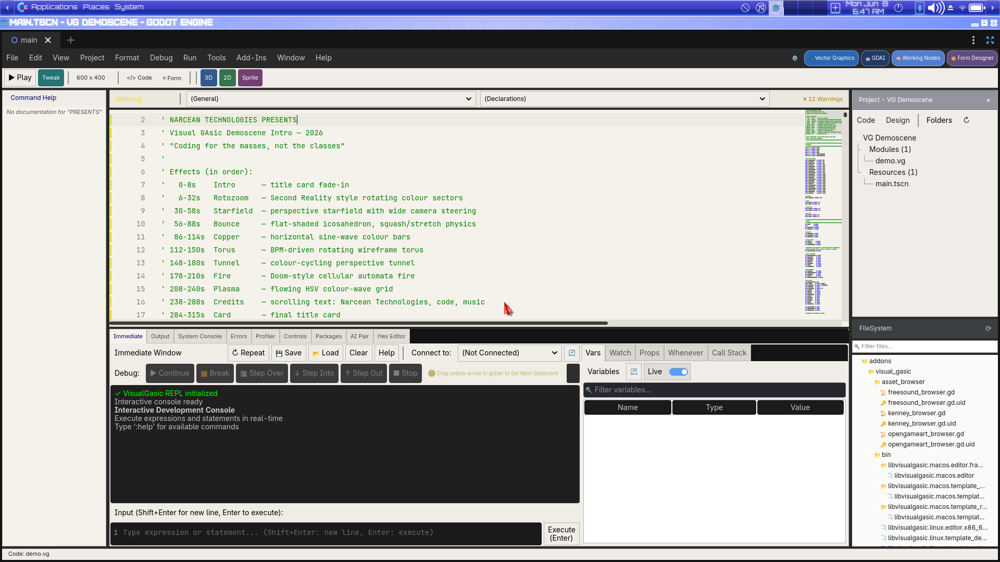
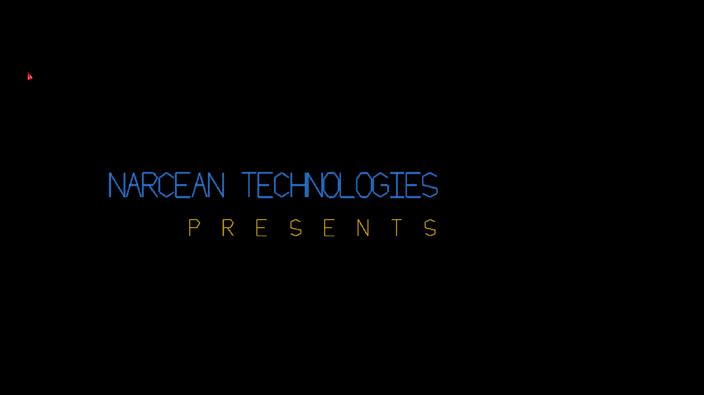
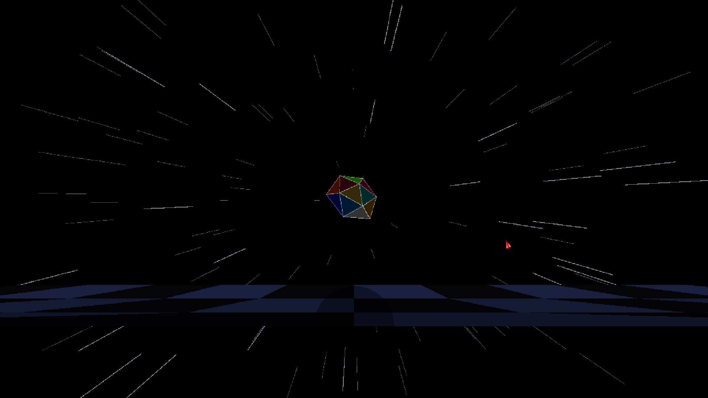
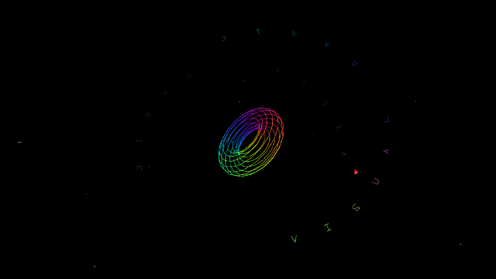
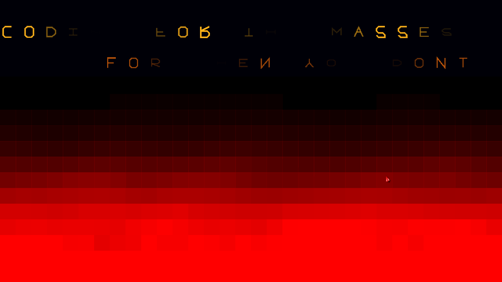
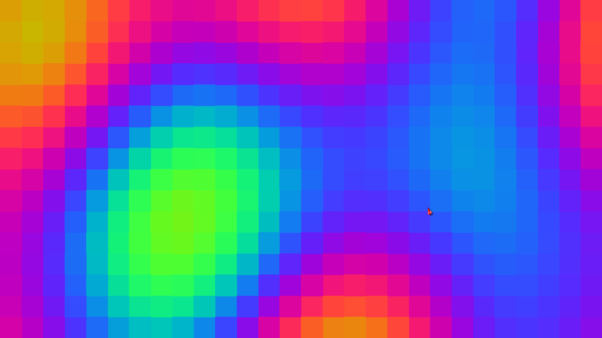
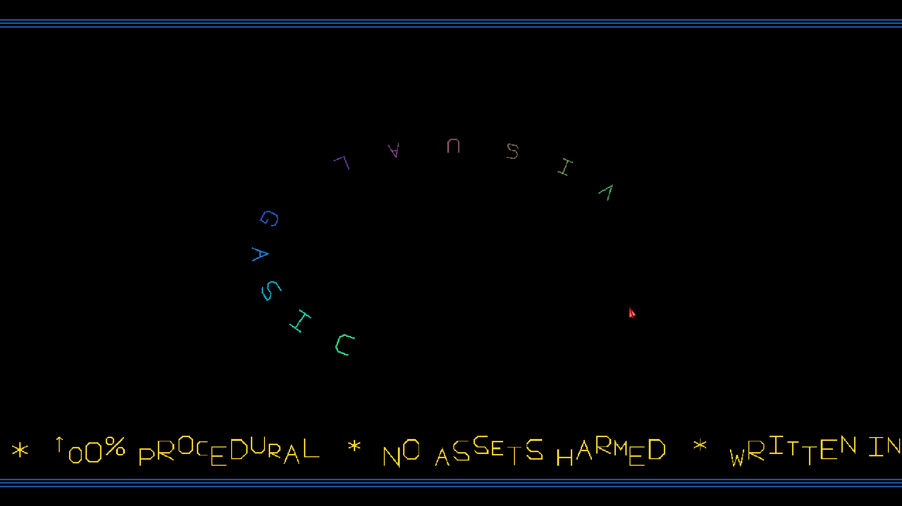

# VisualGasic v5.2.0-Beta4 — Release Notes

**Released:** June 8 2026  
**Status:** Public beta (Linux x86_64 + Windows x64)  
**Codename:** *Flip It, Const It*

The demoscene release. Beta4 ships the completed **VG Demoscene Intro** — a
5-minute procedural demo written entirely in one `.vg` file — alongside two
new `VGVectorCanvas2D` C++ methods, a VB6 language correctness fix, and a
full autocomplete + API coverage pass for all canvas methods.

Performance is unchanged: VG remains **2–92× faster than GDScript** on the
published microbenchmarks (visible in the demo's copper-bar speed test scene).

> 🍏 **macOS:** still unchanged from Beta1 — Linux + Windows only for 5.2.

---

## 🎬 See It In Action

> **[▶ VisualGasic Demoscene — Completed Demo (YouTube)](https://youtu.be/H1fGWK1kxcA)**

> **[▶ Making of the Demoscene (YouTube)](https://www.youtube.com/watch?v=pNtBU2Enk1s)**

A 5-minute procedural demoscene written entirely in VG — **zero external
assets, one `.vg` file, 100% procedural.** Ten effects, live chiptune
(OpenMPT S3M tracker), all rendered through `VGVectorCanvas2D`:

| Scene | Effect |
|---|---|
| 0–6s | **Intro** — "Narcean Technologies Presents" title fade |
| 6–32s | **Rotozoomer** — circular water-drop ripple puddles, counter-rotating grids |
| 30–58s | **Starfield** — 600 perspective star streaks, BPM-driven speed, warp rush |
| 56–88s | **Bounce** — flat-shaded icosahedron with physics + screen-filling explosion |
| 88–106s | **Copper Bars** — sine-wave colour bars + VG vs GDScript speed race, shatters to pieces |
| 106–144s | **Torus** — BPM-heartbeat wireframe torus with double helix text fabric |
| 144–176s | **Tunnel** — 36-ring perspective dot tunnel, vanishing-point glow |
| 178–210s | **Fire** — cellular automata fire + `DrawVectorTextFlip` coin-tumble scroller |
| 208–240s | **Plasma** — 40×23 HSV colour-wave grid |
| 238–318s | **Credits + Card** — helix logo, sine wave scroller, title card |

The demo is at [`game_projects/demoscene_intro/demo.vg`](game_projects/demoscene_intro/demo.vg).
Run it:

```bash
# Windowed (borderless fullscreen)
./Godot_v4.6.1-stable_linux.x86_64 --path game_projects/demoscene_intro

# Record to AVI (frame-perfect, 60fps)
./Godot_v4.6.1-stable_linux.x86_64 \
  --path game_projects/demoscene_intro \
  --fixed-fps 60 \
  --write-movie demoscene_intro.avi

# Compress for YouTube
ffmpeg -i demoscene_intro.avi -c:v libx264 -preset slow -crf 18 \
  -vf "scale=1280:720" -c:a aac -b:a 192k -pix_fmt yuv420p \
  demoscene_intro_yt.mp4
```

---

## ✨ New canvas API — `DrawVectorTextFlip`

```vb
Call canvas.DrawVectorTextFlip(text, x_offset, base_y, time, color, scale, width, char_spacing, flip_speed, flip_wave, font_name)
```

Each letter spins on its **horizontal axis** — a head-over-heels tumble /
coin-flip effect. Under the hood each glyph's Y coordinates are squished
around the glyph's vertical midpoint by `cos(time × flip_speed + i × flip_wave)`,
which runs the full −1..1 range so letters pass through upside-down. Brightness
tracks `squish²` so edge-on letters fade smoothly to invisible.

| Parameter | Default | Notes |
|---|---|---|
| `flip_speed` | `0.9` | Radians/s. `2.8` ≈ visible 2s tumble cycle |
| `flip_wave` | `0.38` | Phase offset per character (rad). Spreads the wave across the word |
| `char_spacing` | `52.0` | Pixels between character centres |

Used in the demoscene fire scene to scroll `"CODING FOR THE MASSES NOT THE CLASSES"` and `"FOR WHEN YOU DONT TRUST AI"` above the flames.

---

## ✨ New canvas API — `PushIdentity`

```vb
Call canvas.PushIdentity()
' ... Translate / Rotate / Scale ...
Call canvas.PopTransform()
```

Pushes a fresh identity transform onto the stack — the VB-friendly alternative
to `PushTransform(Transform2D(1,0,0,1,0,0))`. No raw matrix construction needed.
Typical pattern:

```vb
Call canvas.PushIdentity()
Call canvas.Translate(Vector2(cx, cy))
Call canvas.Rotate(angle)
Call canvas.Scale(Vector2(zoom, zoom))
' draw geometry centred at (0,0) — arrives transformed at (cx,cy)
Call canvas.PopTransform()
```

---

## 🧩 Canvas autocomplete coverage

All `VGVectorCanvas2D` methods are now declared in the GDScript subclass
(`vector_canvas.gd`) and static helper (`vg_vector_api.gd`). Previously
the following were C++-only and invisible to Godot's autocomplete:

- `DrawVectorTextWave` / `DrawVectorTextHelix` / `DrawVectorTextFlip` (new)
- `DrawLines` / `DrawRects` / `DrawRectsUniform`
- `DrawPlasmaCells` / `DrawTorusWireframe` / `DrawSpriteLines`
- `SetAdditiveBlend` / `SetBatchMode`
- `MakeGlowTexture` / `MakeRadialGlowTexture`
- `PushIdentity` (new)

They are now listed in the Godot editor's completion popup and type-checked
correctly when called from GDScript.

---

## 🔧 Language fix — `Const` inside `Sub` now works

```vb
Sub _Process(ByVal delta As Single)
    Const MaxSpeed As Single = 400.0   ' ← now works; VB6-compatible
    Const NRings   As Integer = 36
    ...
End Sub
```

Previously `Const` declarations inside a Sub/Function body were silently
ignored or caused a parse error. They are now scoped correctly to the
procedure — matching VB6 behaviour. Module-level `Const` was always
supported and is unchanged.

---

## 🔧 Audio fix — movie writer mix rate

When recording with `--write-movie`, the audio stream was captured at
22050 Hz (the project's audio server rate) but the AVI container
sometimes reported 44100 Hz, causing pitch/speed drift in the recording.
Fixed: the audio server mix rate is now explicitly set to 22050 Hz to
match the SoundGen synthesiser rate, and the movie writer target rate
is explicitly locked to match. Recordings are now pitch-perfect.

---

## 📸 Screenshots

**The demoscene source open in the VG IDE.** The scene timeline comment
block (lines 7–17) documents all 10 effects and their time ranges.
Project tree shows `demo.vg` as the only source file — no assets, no
scenes beyond the root `main.tscn`.



**Intro card — "Narcean Technologies Presents".** Vector text rendered
with `DrawVectorText`, no bitmap fonts.



**Bounce + starfield scene.** Flat-shaded icosahedron with 600 BPM-driven
star streaks filling the corners. Starfield fades out cleanly before the
copper bars start.



**Torus scene.** Rainbow wireframe torus rotating in space with
`DrawTorusWireframe`; helix text letters orbiting via `DrawVectorTextHelix`.



**Fire scene with `DrawVectorTextFlip`.** Cellular automata fire fills
the lower screen; the new coin-tumble text effect scrolls the taglines
above the flames.



**Plasma scene.** 40×23 HSV colour-wave grid rendered via `DrawPlasmaCells`.



**Credits scene.** "VISUAL GASIC" helix logo with sine-wave bottom scroller
("100% PROCEDURAL * NO ASSETS HARMED * WRITTEN IN VB-STYLE BASIC…").



Beta3 screenshots remain accurate for the Tweak Overlay, Form Designer,
AI Pair, 2D Scene Editor, and all other surfaces — see
[RELEASE_NOTES_v5.2.0-Beta3.md](RELEASE_NOTES_v5.2.0-Beta3.md#-screenshots).

---

## 🧪 Test suite

| Suite | Result |
|---|---|
| `.vg` test suite | **91 files / 707 assertions / 707 passed / 0 failed / 0 errors** |
| GDScript test suites | **12 suites / 308 passed / 0 failed** |
| Demo parse check | `demo.vg` — **0 errors** |

Verify locally:

```bash
bash run_test_suite.sh

# Demoscene parse check
cd game_projects/demoscene_intro
timeout 8 ../../Godot_v4.6.1-stable_linux.x86_64 --headless --path . main.tscn 2>&1 | grep "errors:"
```

---

## 📚 Documentation

| Document | What it covers |
|---|---|
| [Language Reference](docs/VisualGasic_Language_Reference.md) | Complete A–Z reference for every keyword, statement, function, and namespace verb |
| [Documentation Index](docs/DOCUMENTATION_INDEX.md) | Navigable index of all docs, guides, and tutorials |
| [Tweak Overlay Guide](docs/guides/TWEAK_OVERLAY.md) | Live-tweaking workflow, keyboard/mouse cheatsheet, source write-back |
| [Getting Started — Installation](docs/getting_started/installation.md) | Install scripts, manual setup, `vg` CLI |
| [VGVectorCanvas2D API](addons/visual_gasic/plugins/vector_graphics/README.md) | Full canvas method reference |

---

## 📦 Downloads

| Platform | One-click installer | Portable zip | Offline bundle (Godot bundled) |
|---|---|---|---|
| 🐧 Linux x86_64 | `VisualGasic-Installer-v5.2.0-Beta4-x86_64.AppImage` | `VisualGasic_v5.2.0-Beta4_linux_x86_64.zip` | `VisualGasic-Installer-Offline-v5.2.0-Beta4-linux-x86_64.zip` |
| 🪟 Windows x64 | `VisualGasic-Installer-v5.2.0-Beta4-x86_64.exe` | `VisualGasic_v5.2.0-Beta4_windows_x86_64.zip` | `VisualGasic-Installer-Offline-v5.2.0-Beta4-windows-x86_64.zip` |
| 🍏 macOS | *not available for 5.2 — open an issue* | — | — |

The AppImage / `.exe` installers handle everything: they download Godot
4.6.1 if needed, install the addon, and register the `vg` CLI. The
offline bundles include a Godot 4.6.1 download so no internet is required
after unpacking.

**Or install from the command line:**

```bash
# Linux / macOS
curl -sSL https://raw.githubusercontent.com/xgreenrx-star/VisualGasic/main/install.sh | bash

# Windows (PowerShell)
irm https://raw.githubusercontent.com/xgreenrx-star/VisualGasic/main/install.ps1 | iex

# Cross-platform (Python)
python3 install.py --github --tag v5.2.0-Beta4
```

After install:

```bash
vg new MyGame
cd MyGame && godot .
```

---

## ⚠️ Known issues

- **VGMusic (Bosca Ceoil) requires a restart to work** — unchanged from
  Beta2. Close VisualGasic and reopen it; Bosca works on the second launch.
- macOS builds are paused for the 5.2 line.
- The Android plugin is a **preview**.
- Tweak Overlay source write-back is **color-only** in this MVP.

---

## 🙏 What to test

1. **Run the demoscene** — `./Godot_v4.6.1 --path game_projects/demoscene_intro`.
   Does it run smoothly? ESC exits, Space skips scenes.
2. **`DrawVectorTextFlip`** — try it in your own canvas project with different
   `flip_speed` and `flip_wave` values.
3. **`Const` inside `Sub`** — if you had workarounds (`Dim x As Single = 400.0`
   instead of `Const x As Single = 400.0`), you can now use the proper form.
4. **Canvas autocomplete** — type `canvas.Draw` in the IDE and confirm all
   new methods appear in the popup.

File issues at **https://github.com/xgreenrx-star/VisualGasic/issues**.

Thanks to everyone who tested Beta3.
