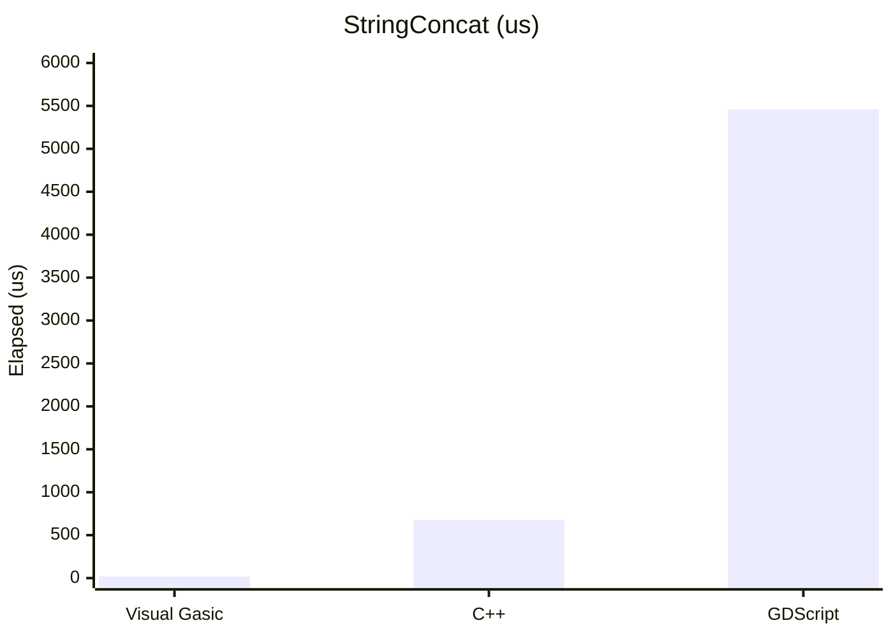
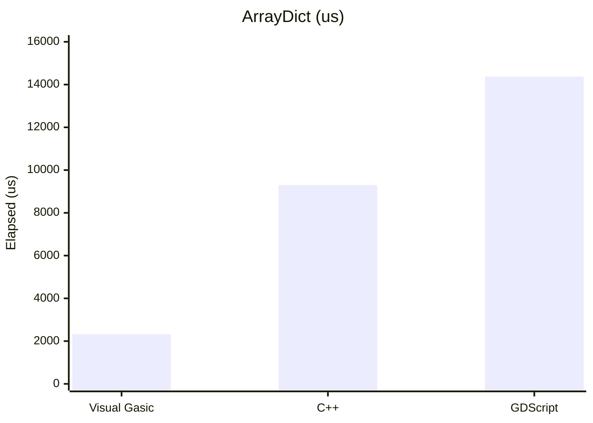
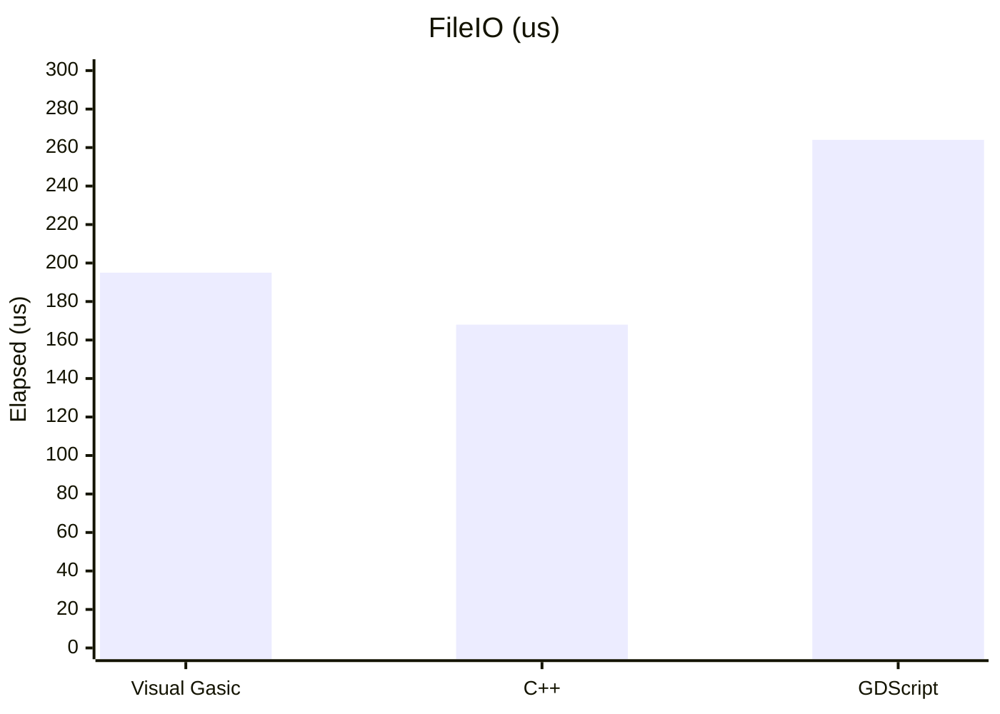

# VisualGasic Advanced Features Manual

## Table of Contents
1. [Advanced Type System](#advanced-type-system)
2. [Pattern Matching](#pattern-matching)
3. [GPU Computing](#gpu-computing)
4. [Interactive REPL](#interactive-repl)
5. [Advanced Debugging](#advanced-debugging)
6. [Package Management](#package-management)
7. [Entity Component System](#entity-component-system)
8. [Language Server Protocol](#language-server-protocol)
9. [Performance Snapshot](#performance-snapshot)

---

## Performance Snapshot

VisualGasic targets high performance in tight loops and engine interop while keeping Gasic-style ergonomics. Below is a snapshot from the built‑in benchmark suite (Godot 4.5.1 headless). Full results and methodology are in [docs/manual/performance.md](docs/manual/performance.md).







## Advanced Type System

### Generics
VisualGasic supports full generic programming with type parameters and constraints:

```gasic
' Generic function with type parameter
Function Process(Of T)(data As T) As T
    Return data
End Function

' Generic with constraints
Function Sort(Of T Where T Implements IComparable)(arr As T()) As T()
    ' Sorting implementation using IComparable.CompareTo
    For i As Integer = 0 To arr.Length - 2
        For j As Integer = i + 1 To arr.Length - 1
            If arr(i).CompareTo(arr(j)) > 0 Then
                Dim temp As T = arr(i)
                arr(i) = arr(j)
                arr(j) = temp
            End If
        Next
    Next
    Return arr
End Function

' Generic class
Class DataContainer(Of T)
    Private items As T()
    
    Sub New(capacity As Integer)
        ReDim items(capacity - 1)
    End Sub
    
    Function Get(index As Integer) As T
        Return items(index)
    End Function
    
    Sub Set(index As Integer, value As T)
        items(index) = value
    End Sub
End Class

' Usage
Dim numbers As New DataContainer(Of Integer)(10)
numbers.Set(0, 42)
Dim value As Integer = numbers.Get(0)

Dim names As New DataContainer(Of String)(5)
names.Set(0, "Hello")
Dim name As String = names.Get(0)
```

### Optional Types
Handle null values safely with optional types:

```gasic
' Optional type declaration
Function GetUserInput() As String?
    ' May return Nothing
    If SomeCondition Then
        Return "User Input"
    Else
        Return Nothing
    End If
End Function

Dim name As String? = GetUserInput()

' Check if value exists
If name.HasValue Then
    Print "Hello, " & name.Value
Else
    Print "No name provided"
End If

' Null coalescing operator
Dim displayName As String = name ?? "Anonymous"

' Safe navigation
Dim length As Integer? = name?.Length
```

### Union Types
Store multiple possible types in a single variable:

```gasic
' Union type declaration
Dim result As Integer | String | Boolean

result = 42
result = "Hello World"
result = True

' Type checking
If result Is Integer Then
    Print "It's a number: " & CInt(result)
ElseIf result Is String Then
    Print "It's text: " & CStr(result)
ElseIf result Is Boolean Then
    Print "It's boolean: " & CBool(result)
End If

' Pattern matching with union types
Select Match result
    Case Is Integer i
        Print "Number: " & i
    Case Is String s
        Print "Text: " & s
    Case Is Boolean b
        Print "Boolean: " & b
End Select
```

### Type Inference
Let the compiler determine types automatically:

```gasic
' Type inference in variable declarations
Dim count = 42              ' Inferred as Integer
Dim message = "Hello"       ' Inferred as String
Dim isValid = True          ' Inferred as Boolean
Dim numbers = {1, 2, 3}     ' Inferred as Integer()

' Type inference in function returns
Function CreateList()
    Return New List(Of String)()  ' Return type inferred as List(Of String)
End Function

' Type inference with generics
Dim container = New DataContainer(Of Integer)(10)  ' Type inferred from constructor
```

---

## Pattern Matching

### Core Pattern Matching
Advanced pattern matching with Select Match statements:

```gasic
Function ProcessValue(value As Object) As String
    Select Match value
        Case 0
            Return "Zero"
        Case 1, 2, 3
            Return "Small number"
        Case Is String s When s.Length > 10
            Return "Long string: " & s
        Case Is Integer i When i > 100
            Return "Large number: " & i
        Case Is Array arr When arr.Length > 0
            Return "Non-empty array with " & arr.Length & " items"
        Case Nothing
            Return "Null value"
        Case Else
            Return "Unknown type: " & value.GetType().Name
    End Select
End Function
```

### Destructuring Patterns
Decompose complex data structures:

```gasic
' Tuple destructuring
Dim point As (Integer, Integer) = (10, 20)
Select Match point
    Case (0, 0)
        Print "Origin"
    Case (x, 0)
        Print "On X axis at " & x
    Case (0, y)
        Print "On Y axis at " & y
    Case (x, y) When x = y
        Print "Diagonal point at " & x
    Case (x, y)
        Print "Point at (" & x & ", " & y & ")"
End Select

' Array destructuring
Dim numbers() As Integer = {1, 2, 3, 4, 5}
Select Match numbers
    Case {}
        Print "Empty array"
    Case {first}
        Print "Single item: " & first
    Case {first, second}
        Print "Two items: " & first & ", " & second
    Case {first, ...rest}
        Print "First: " & first & ", Rest: " & rest.Length & " items"
End Select
```

### Guard Clauses
Add conditions to patterns:

```gasic
Function Classify(value As Object) As String
    Select Match value
        Case Is String s When s.StartsWith("http")
            Return "URL: " & s
        Case Is String s When s.Contains("@")
            Return "Email: " & s
        Case Is String s When s.All(Function(c) Char.IsDigit(c))
            Return "Numeric string: " & s
        Case Is Integer i When i >= 0 AndAlso i <= 100
            Return "Percentage: " & i & "%"
        Case Is Integer i When i < 0
            Return "Negative number: " & i
        Case Else
            Return "Unclassified"
    End Select
End Function
```

---

## GPU Computing

### SIMD Vector Operations
High-performance vector operations using GPU acceleration:

```gasic
' Import GPU module
Imports VisualGasic.GPU

Sub PerformVectorOperations()
    ' Create vectors
    Dim vectorA As Vector(Of Single) = {1.0, 2.0, 3.0, 4.0, 5.0}
    Dim vectorB As Vector(Of Single) = {2.0, 3.0, 4.0, 5.0, 6.0}
    
    ' GPU-accelerated operations
    Dim sum As Vector(Of Single) = GPU.SIMDAdd(vectorA, vectorB)
    Dim product As Vector(Of Single) = GPU.SIMDMultiply(vectorA, vectorB)
    Dim dotProduct As Single = GPU.SIMDDotProduct(vectorA, vectorB)
    
    Print "Vector A: " & String.Join(", ", vectorA)
    Print "Vector B: " & String.Join(", ", vectorB)
    Print "Sum: " & String.Join(", ", sum)
    Print "Product: " & String.Join(", ", product)
    Print "Dot Product: " & dotProduct
End Sub
```

### Parallel Processing
Distribute work across GPU cores:

```gasic
Sub ParallelProcessing()
    ' Large dataset
    Dim data(999999) As Single
    
    ' Initialize with parallel processing
    GPU.ParallelFor(data.Length, Sub(i As Integer)
        data(i) = Sin(i * 0.001) * Cos(i * 0.002)
    End Sub)
    
    ' Process in parallel
    GPU.ParallelFor(data.Length, Sub(i As Integer)
        data(i) = data(i) * data(i) + 1.0  ' Square and add 1
    End Sub)
    
    Print "Processed " & data.Length & " elements"
End Sub
```

### Map-Reduce Operations
Distributed processing with automatic GPU/CPU fallback:

```gasic
Function CalculateStatistics(numbers As Array) As Dictionary
    ' Sum using map-reduce
    Dim sumResult As Dictionary = GPU.ParallelMapReduce(numbers,
        Function(x) CDbl(x),           ' Map: convert to double
        Function(a, b) CDbl(a) + CDbl(b) ' Reduce: sum
    )
    
    ' Sum of squares for variance calculation
    Dim sumSquaresResult As Dictionary = GPU.ParallelMapReduce(numbers,
        Function(x) CDbl(x) * CDbl(x), ' Map: square each number
        Function(a, b) CDbl(a) + CDbl(b) ' Reduce: sum squares
    )
    
    Dim count As Integer = numbers.Length
    Dim sum As Double = sumResult("result")
    Dim sumSquares As Double = sumSquaresResult("result")
    Dim mean As Double = sum / count
    Dim variance As Double = (sumSquares / count) - (mean * mean)
    
    Dim stats As New Dictionary
    stats("count") = count
    stats("sum") = sum
    stats("mean") = mean
    stats("variance") = variance
    stats("std_dev") = Math.Sqrt(variance)
    
    Return stats
End Function
```

---

## Interactive REPL

### Starting the REPL
Interactive development environment for rapid prototyping:

```gasic
' Create and start REPL
Dim repl As New VisualGasicREPL()
repl.StartInteractiveSession()

' The REPL provides immediate feedback:
' > Dim x As Integer = 42
' ✓ x = 42 (Integer)
' 
' > x + 10
' 52
' 
' > Print "Hello " & "World"
' Output: Hello World
```

### REPL Commands
Built-in commands for enhanced development experience:

```
:help           - Show all available commands
:vars           - List all variables with types and values
:clear          - Clear the screen (terminal environments)
:history        - Show command history
:load myfile.bas - Load and execute a script file
:save session.bas - Save current session to file
:reset          - Reset REPL state (clear all variables)
:type expression - Show type information for expression
:quit           - Exit REPL
```

### Advanced REPL Features
```gasic
' Variable inspection
' > :vars
' Variables:
'   x = 42 (Integer)
'   name = "John" (String)
'   active = True (Boolean)

' Expression evaluation with type checking
' > x + "hello"
' Error: Cannot add Integer and String

' Auto-completion for variables and functions
' > x.[TAB]
' Suggestions: ToString(), GetType(), Equals()

' Multi-line input support
' > Function Calculate() As Integer
' ...     Return 42 + 8
' ... End Function
' ✓ Calculate defined

' Pattern matching in REPL
' > Select Match 42
' ...     Case Is Integer i When i > 40
' ...         Print "Large integer"
' ... End Select
' Output: Large integer
```

---

## Advanced Debugging

### Time-Travel Debugging
Record and replay execution with full state inspection:

```gasic
' Start debug session with time-travel enabled
Sub Main()
    Debugger.StartSession("time_travel_demo")
    Debugger.EnableTimeTravel(True)
    Debugger.EnableProfiling(True)
    Debugger.EnableMemoryTracking(True)
    
    ' Your program code here
    ProcessData()
    
    Debugger.EndSession()
End Sub

Function ProcessData() As Integer
    Dim result As Integer = 0
    For i As Integer = 1 To 10
        result += i * i
        ' Execution automatically recorded for time-travel
    Next
    Return result
End Function
```

### Breakpoint Management
Set sophisticated breakpoints with conditions:

```gasic
' Set core breakpoint
Debugger.SetBreakpoint("myfile.gasic", 42)

' Set conditional breakpoint
Debugger.SetBreakpoint("myfile.gasic", 25, "counter > 10 AndAlso name IsNot Nothing")

' Set breakpoint with action
Debugger.SetBreakpoint("myfile.gasic", 30, "", "log")  ' Log instead of breaking

' In debug session, you can:
' :step_back       - Go to previous execution frame
' :step_forward    - Go to next execution frame  
' :goto_frame 100  - Jump to specific execution frame
' :show_history    - Display execution timeline
' :break_at ProcessData - Set breakpoint at function entry
```

### Performance Profiling
Analyze performance with detailed timing and hotspot detection:

```gasic
Function SlowFunction() As Integer
    ' Function automatically timed when profiling enabled
    Dim result As Integer = 0
    For i As Integer = 1 To 1000000
        result += Math.Sin(i) * Math.Cos(i)
    Next
    Return result
End Function

Sub AnalyzePerformance()
    ' Get performance data
    Dim profile As Dictionary = Debugger.GetPerformanceProfile()
    Dim hotspots As Array = Debugger.GetFunctionHotspots(10)
    
    Print "Performance Analysis:"
    Print "Session Duration: " & profile("total_session_time") & "μs"
    Print "CPU Usage: " & profile("cpu_usage") & "%"
    
    Print "Top 10 Hotspots:"
    For Each hotspot As Dictionary In hotspots
        Print "  " & hotspot("function") & ": " & 
              hotspot("total_time_us") & "μs (" & 
              hotspot("percentage") & "% of total)"
    Next
End Sub
```

### Memory Analysis
Track memory usage and detect leaks:

```gasic
Sub AnalyzeMemory()
    ' Get memory usage information
    Dim usage As Dictionary = Debugger.GetMemoryUsage()
    Print "Memory Analysis:"
    Print "  Total Allocated: " & usage("total_allocated") & " bytes"
    Print "  Total Freed: " & usage("total_freed") & " bytes"  
    Print "  Current Usage: " & usage("current_usage") & " bytes"
    Print "  Active Allocations: " & usage("active_allocations")
    
    ' Check for memory leaks
    Dim leaks As Array = Debugger.GetMemoryLeaks()
    If leaks.Count > 0 Then
        Print "Memory Leaks Detected: " & leaks.Count
        For Each leak As Dictionary In leaks
            Print "  Address: " & leak("address") & 
                  ", Size: " & leak("size") & " bytes"
        Next
    Else
        Print "No memory leaks detected"
    End If
    
    ' Memory snapshots over time
    Dim snapshots As Array = Debugger.GetMemorySnapshots()
    Print "Memory usage over " & snapshots.Count & " snapshots:"
    For Each snapshot As Dictionary In snapshots
        Print "  " & snapshot("timestamp_us") & ": " & 
              snapshot("active_allocations") & " allocations"
    Next
End Sub
```

---

## Package Management

### Project Configuration
Define project dependencies and metadata in Package.gasic:

```gasic
' Package.gasic - Project configuration file
Package "MyGameProject"
    Version "1.0.0"
    Description "An awesome 2D platformer game"
    Author "Game Developer"
    License "MIT"
    Homepage "https://github.com/dev/mygame"
    Repository "https://github.com/dev/mygame.git"
    Keywords {"game", "2d", "platformer", "godot"}
    
    Dependencies
        "MathLibrary" -> "^2.1.0"
        "JsonParser" -> "~1.5.0"
        "GameFramework" -> ">=3.0.0"
    End Dependencies
    
    DevDependencies
        "TestFramework" -> "^3.0.0"
        "MockingLibrary" -> "^1.2.0"
    End DevDependencies
    
    Scripts
        Build -> "gasic build src/"
        Test -> "gasic test tests/"
        Deploy -> "gasic deploy --target production"
        Start -> "gasic run src/main.bas"
    End Scripts
    
    Files
        "src/"
        "assets/"
        "README.md"
        "LICENSE"
    End Files
End Package
```

### Installing and Managing Packages
```bash
# Install specific version
gasic pkg install MathLibrary@2.1.0

# Install with semantic version constraint  
gasic pkg install MathLibrary@^2.1.0   # Compatible with 2.x.x (>=2.1.0 <3.0.0)
gasic pkg install JsonParser@~1.5.0    # Compatible with 1.5.x (>=1.5.0 <1.6.0)

# Install development dependencies
gasic pkg install TestFramework@^3.0.0 --dev

# Update packages
gasic pkg update MathLibrary           # Update specific package
gasic pkg update                       # Update all packages
gasic pkg outdated                     # Show outdated packages

# Remove packages
gasic pkg uninstall MathLibrary

# Search for packages
gasic pkg search "math utilities"
gasic pkg info MathLibrary            # Show package information

# Working with registries
gasic pkg registry add mycompany https://packages.mycompany.com
gasic pkg registry set-default mycompany
gasic pkg login mycompany             # Authenticate for private registry
```

### Using Installed Packages
```gasic
' Import and use packages in your code
Imports MathLibrary
Imports JsonParser

Sub Main()
    ' Use MathLibrary functions
    Dim result As Double = Math.Lerp(0.0, 10.0, 0.5)  ' Linear interpolation
    Dim clamped As Double = Math.Clamp(result, 2.0, 8.0)
    
    ' Use JsonParser
    Dim jsonData As String = "{""name"": ""John"", ""age"": 30}"
    Dim parsed As Dictionary = JSON.Parse(jsonData)
    
    Print "Name: " & parsed("name")
    Print "Age: " & parsed("age")
    Print "Result: " & clamped
End Sub
```

### Publishing Packages
```bash
# Initialize new package
gasic pkg init MyAwesomeLibrary --template library

# Validate package before publishing
gasic pkg validate

# Build package
gasic pkg build

# Publish to registry
gasic pkg publish                    # Publish to default registry
gasic pkg publish --registry mycompany # Publish to specific registry

# Version management
gasic pkg version patch             # Increment patch version (1.0.0 -> 1.0.1)
gasic pkg version minor             # Increment minor version (1.0.0 -> 1.1.0) 
gasic pkg version major             # Increment major version (1.0.0 -> 2.0.0)
```

---

## Entity Component System

### Core ECS Usage
High-performance game development with ECS architecture:

```gasic
Imports VisualGasic.ECS

Sub Main()
    ' Create ECS world
    Dim world As New ECSWorld()
    world.Initialize()
    
    ' Add built-in systems
    world.AddSystem(New MovementSystem())
    world.AddSystem(New RenderSystem())
    
    ' Create game entities
    CreatePlayer(world)
    CreateEnemies(world, 10)
    
    ' Game loop
    While True
        world.Update(GetFrameDelta())
        
        ' Handle input, render, etc.
        If Input.IsActionPressed("ui_cancel") Then
            Exit While
        End If
    Wend
    
    world.Shutdown()
End Sub

Function CreatePlayer(world As ECSWorld) As EntityId
    Dim player As EntityId = world.CreateEntity()
    
    ' Add components
    world.AddComponent(player, New TransformComponent() With {
        .Position = Vector3(0, 0, 0),
        .Rotation = Vector3(0, 0, 0),
        .Scale = Vector3(1, 1, 1)
    })
    
    world.AddComponent(player, New VelocityComponent() With {
        .LinearVelocity = Vector3(0, 0, 0),
        .AngularVelocity = Vector3(0, 0, 0)
    })
    
    world.AddComponent(player, New RenderComponent() With {
        .MeshPath = "res://models/player.glb",
        .MaterialPath = "res://materials/player.material",
        .Visible = True,
        .RenderLayer = 1
    })
    
    Return player
End Function
```

### Custom Components
Create domain-specific components:

```gasic
' Health component for game entities
Class HealthComponent
    Inherits ECSComponent
    
    Public MaxHealth As Integer = 100
    Public CurrentHealth As Integer = 100
    Public IsAlive As Boolean = True
    Public DamageResistance As Single = 0.0
    
    Sub TakeDamage(amount As Integer)
        Dim actualDamage As Integer = Math.Max(1, amount * (1.0 - DamageResistance))
        CurrentHealth -= actualDamage
        
        If CurrentHealth <= 0 Then
            CurrentHealth = 0
            IsAlive = False
        End If
    End Sub
    
    Sub Heal(amount As Integer)
        CurrentHealth = Math.Min(MaxHealth, CurrentHealth + amount)
        IsAlive = True
    End Sub
    
    Function GetHealthPercentage() As Single
        Return CSng(CurrentHealth) / CSng(MaxHealth)
    End Function
End Class

' AI component for enemy behavior
Class AIComponent  
    Inherits ECSComponent
    
    Public AIType As String = "aggressive"  ' aggressive, defensive, patrol
    Public TargetEntity As EntityId = ECS.INVALID_ENTITY
    Public PatrolPoints As Vector3() = {}
    Public CurrentPatrolIndex As Integer = 0
    Public DetectionRange As Single = 50.0
    Public AttackRange As Single = 10.0
    Public AttackCooldown As Single = 1.0
    Public LastAttackTime As Single = 0.0
    
    Function CanAttack() As Boolean
        Return (Time.GetTicksMsec() / 1000.0) - LastAttackTime >= AttackCooldown
    End Function
End Class
```

### Custom Systems
Implement game logic with high-performance systems:

```gasic
' Health management system
Class HealthSystem
    Inherits ECSSystem
    
    Private world As ECSWorld
    
    Public Overrides Sub Initialize(ecsWorld As ECSWorld)
        world = ecsWorld
    End Sub
    
    Public Overrides Sub Update(deltaTime As Double)
        ' Query entities with Health component
        Dim entities = world.QueryEntities({"HealthComponent"})
        
        For Each entity As EntityId In entities
            Dim health = world.GetComponent(Of HealthComponent)(entity)
            
            If Not health.IsAlive Then
                ' Handle death - could add death effects, drop items, etc.
                OnEntityDeath(entity)
                world.DestroyEntity(entity)
            End If
        Next
    End Sub
    
    Private Sub OnEntityDeath(entity As EntityId)
        ' Add death particle effect
        If world.HasComponent(Of RenderComponent)(entity) Then
            Dim render = world.GetComponent(Of RenderComponent)(entity)
            ' Spawn death effect at entity position
            ' SpawnParticleEffect("death_explosion", render.WorldPosition)
        End If
    End Sub
    
    Public Overrides Function GetName() As String
        Return "HealthSystem"
    End Function
    
    Public Overrides Function GetPriority() As Integer
        Return 50  ' Execute after movement but before rendering
    End Function
End Class

' AI behavior system
Class AISystem
    Inherits ECSSystem
    
    Private world As ECSWorld
    
    Public Overrides Sub Update(deltaTime As Double)
        ' Query entities with AI and Transform components
        Dim aiEntities = world.QueryEntities({"AIComponent", "TransformComponent"})
        
        For Each entity As EntityId In aiEntities
            Dim ai = world.GetComponent(Of AIComponent)(entity)
            Dim transform = world.GetComponent(Of TransformComponent)(entity)
            
            ' Update AI behavior based on type
            Select Case ai.AIType
                Case "aggressive"
                    UpdateAggressiveAI(entity, ai, transform, deltaTime)
                Case "defensive"
                    UpdateDefensiveAI(entity, ai, transform, deltaTime)
                Case "patrol"
                    UpdatePatrolAI(entity, ai, transform, deltaTime)
            End Select
        Next
    End Sub
    
    Private Sub UpdateAggressiveAI(entity As EntityId, ai As AIComponent, 
                                 transform As TransformComponent, deltaTime As Double)
        ' Find nearest target within detection range
        Dim target = FindNearestTarget(transform.Position, ai.DetectionRange)
        
        If target <> ECS.INVALID_ENTITY Then
            ai.TargetEntity = target
            
            ' Move towards target
            Dim targetPos = world.GetComponent(Of TransformComponent)(target).Position
            Dim direction = (targetPos - transform.Position).Normalized()
            
            If world.HasComponent(Of VelocityComponent)(entity) Then
                Dim velocity = world.GetComponent(Of VelocityComponent)(entity)
                velocity.LinearVelocity = direction * 20.0  ' Speed
            End If
            
            ' Attack if in range
            If transform.Position.DistanceTo(targetPos) <= ai.AttackRange AndAlso ai.CanAttack() Then
                PerformAttack(entity, target)
                ai.LastAttackTime = Time.GetTicksMsec() / 1000.0
            End If
        End If
    End Sub
    
    Private Function FindNearestTarget(position As Vector3, range As Single) As EntityId
        ' Implementation would search for player or other target entities
        Return ECS.INVALID_ENTITY  ' Placeholder
    End Function
    
    Private Sub PerformAttack(attacker As EntityId, target As EntityId)
        ' Deal damage to target if it has health component
        If world.HasComponent(Of HealthComponent)(target) Then
            Dim health = world.GetComponent(Of HealthComponent)(target)
            health.TakeDamage(25)
        End If
    End Sub
End Class
```

### ECS Performance Features
Leverage high-performance ECS optimizations:

```gasic
Sub OptimizedECSUsage()
    Dim world As New ECSWorld()
    
    ' Create optimized queries for frequently accessed entity groups
    Dim movableEntities = world.CreateQuery() _
        .WithComponent("TransformComponent") _
        .WithComponent("VelocityComponent") _
        .WithoutComponent("StaticComponent")
    
    Dim renderableEntities = world.CreateQuery() _
        .WithComponent("TransformComponent") _
        .WithComponent("RenderComponent")
    
    ' Batch operations for better performance
    Dim entities = movableEntities.GetEntities()
    world.BatchOperation(entities, Sub(entity As EntityId)
        Dim transform = world.GetComponent(Of TransformComponent)(entity)
        Dim velocity = world.GetComponent(Of VelocityComponent)(entity)
        
        ' Update position based on velocity
        transform.Position += velocity.LinearVelocity * GetFrameDelta()
        transform.Rotation += velocity.AngularVelocity * GetFrameDelta()
    End Sub)
    
    ' Get performance statistics
    Dim stats = world.GetPerformanceStats()
    Print "ECS Performance:"
    Print "  Entities: " & stats("entity_count")
    Print "  Systems: " & stats("system_count")
    Print "  Update Time: " & stats("update_time_ms") & "ms"
    Print "  Memory Usage: " & stats("memory_usage_mb") & "MB"
End Sub
```

---

## Language Server Protocol

### IDE Integration Features
VisualGasic provides professional IDE integration through LSP:

**Intelligent Code Completion:**
- Context-aware suggestions
- Function signatures and parameter hints
- Import statement completion
- Generic type parameter completion

**Advanced Navigation:**
- Go to definition across files
- Find all references with preview
- Symbol outline and breadcrumbs
- Workspace-wide symbol search

**Real-time Diagnostics:**
- Syntax error highlighting
- Semantic error detection
- Type mismatch warnings
- Unused variable detection

**Code Quality Tools:**
- Hover documentation with type info
- Inline parameter hints
- Code formatting and organization
- Import statement optimization

### LSP Configuration
Configure the language server for optimal development experience:

```json
{
  "visualgasic.lsp": {
    "diagnostics": {
      "enabled": true,
      "reportUnusedVariables": true,
      "reportTypeErrors": true,
      "maxProblems": 100
    },
    "completion": {
      "enabled": true,
      "autoImport": true,
      "showSnippets": true,
      "caseSensitive": false
    },
    "hover": {
      "enabled": true,
      "showExamples": true,
      "showTypeInfo": true
    },
    "formatting": {
      "indentSize": 4,
      "insertSpaces": true,
      "organizeImports": true
    }
  }
}
```

This comprehensive advanced features manual demonstrates VisualGasic's evolution into a professional-grade programming language with cutting-edge capabilities while maintaining the accessibility and rapid development benefits of VisualGasic.