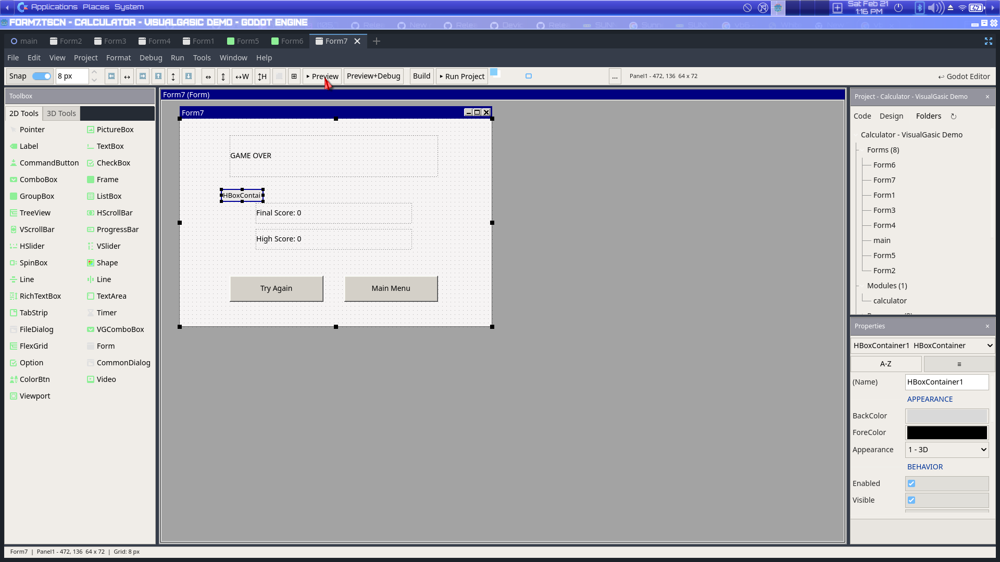
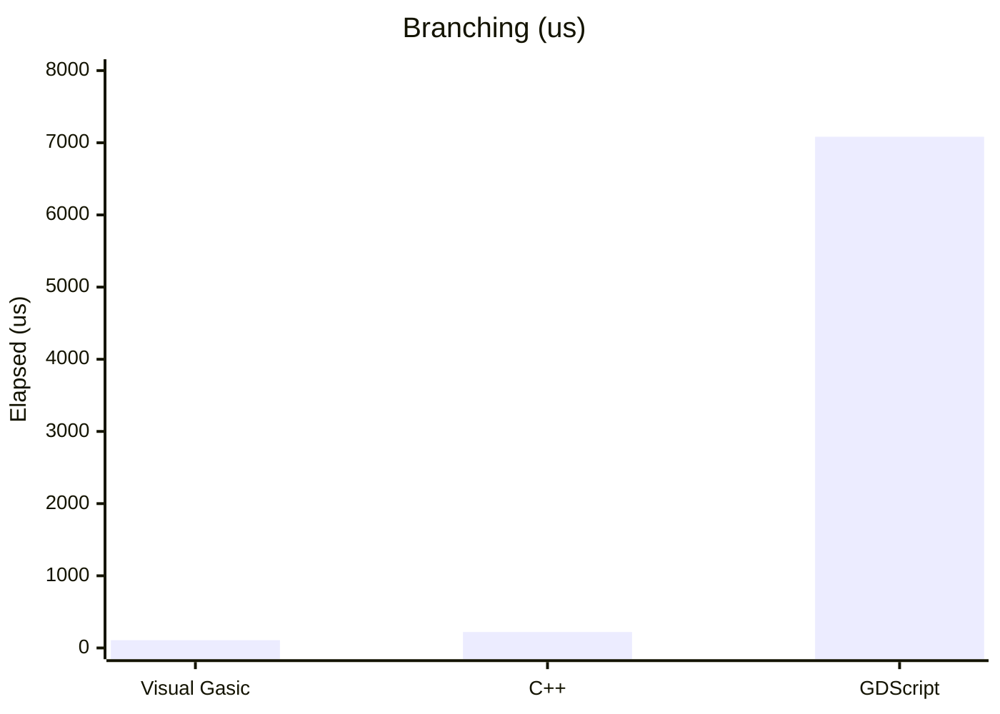
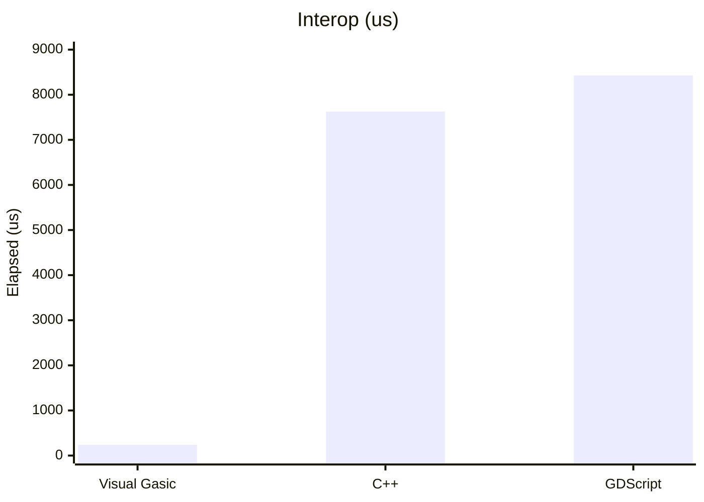
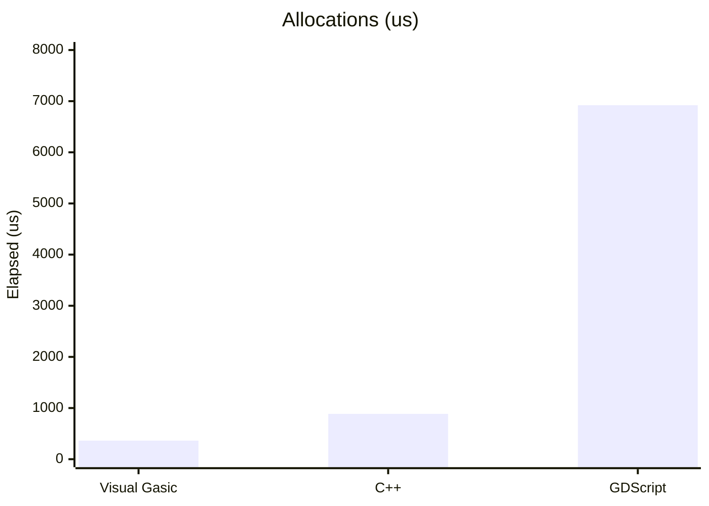

# VisualGasic for Godot - Complete Programming Manual
*The definitive guide to using VisualGasic in Godot game development*

Version 2.6.2  
Updated: February 2026

---

## Table of Contents

### Part I: Getting Started with Godot
1. [Introduction to Godot with VisualGasic](#introduction)
2. [Understanding Godot's Architecture](#architecture)
3. [Setting Up Your First Project](#setup)
4. [Scenes, Nodes, and the Scene Tree](#scenes-nodes)

### Part II: Core Godot Concepts in VisualGasic
5. [Working with Nodes](#nodes)
6. [Signals and Communication](#signals)
7. [Input Handling](#input)
8. [Timers and Processing](#timers)

### Part III: 2D Game Development
9. [2D Foundations and Coordinate System](#2d-foundations)
10. [Sprites and Animation](#sprites)
11. [2D Physics and Movement](#2d-physics)
12. [Collision Detection](#collision)
13. [Case Study: 2D Platformer — GDScript vs VisualGasic](#platformer-case-study)

### Part IV: 3D Game Development
13. [3D Foundations and Coordinate System](#3d-foundations)
14. [3D Models and Materials](#3d-models)
15. [3D Physics and Movement](#3d-physics)
16. [Lighting and Environment](#lighting)
17. [Case Study: Squash the Creeps — GDScript vs VisualGasic](#squash-the-creeps)

### Part V: User Interface
17. [UI System Overview](#ui-overview)
18. [Control Nodes and Layouts](#ui-controls)
19. [Theming and Styling](#ui-theming)
20. [Interactive Elements](#ui-interactive)

### Part VI: Advanced Features
21. [File I/O and Data Management](#file-io)
22. [Networking and Multiplayer](#networking)
23. [Audio System](#audio)
24. [Particle Systems](#particles)

### Part VII: Performance and Optimization
25. [Performance Best Practices](#performance)
26. [Memory Management](#memory)
27. [Platform-Specific Features](#platform)

### Part VIII: Deployment and Distribution
28. [Export Settings](#export)
29. [Platform Requirements](#requirements)
30. [Distribution Strategies](#distribution)

### Part IX: IDE Tools and Productivity (NEW)
31. [IntelliSense and Code Completion](#intellisense)
32. [Debugging Tools](#debugging-tools)
33. [Code Quality and Linting](#linting)
34. [Snippets and Templates](#snippets)
35. [Visual Gasic IDE Tools](#form-designer)

### Part X: GDScript vs VisualGasic — Complete Reference
36. [GDScript ↔ VisualGasic Quick Reference](#gdscript-vs-vg)
37. [Case Study: Screen Space Shaders — GDScript vs VisualGasic](#screen-shaders-case-study)
38. [Case Study: 3D Sky Shaders — GDScript vs VisualGasic](#sky-shaders-case-study)

---

## Chapter 1: Introduction to Godot with VisualGasic {#introduction}

### What is Godot?

Godot is a free and open-source game engine that provides a comprehensive set of tools for creating 2D and 3D games. Unlike many game engines, Godot uses a unique scene-based architecture that makes it particularly well-suited for VisualGasic's familiar object-oriented approach.

### Why VisualGasic for Godot?

VisualGasic brings its modern Gasic syntax and programming model to Godot, allowing developers to:

- Use VisualGasic syntax and concepts
- Leverage Godot's powerful node system
- Create games without learning GDScript
- Maintain readability and simplicity
- Access all Godot features through Gasic-style code

### Visual Basic 6.0 Foundation

VisualGasic is built on the foundation of **Visual Basic 6.0**, one of the most popular programming languages ever created. If you've used VB6, VBA, or any BASIC dialect, you'll feel right at home.

**Why Visual Basic Syntax?**

BASIC was designed in 1964 to be "beginner-friendly" - using English-like keywords that are easy to read and write. Visual Basic (1991) added the visual form designer and event-driven programming model that revolutionized Windows development.

VisualGasic preserves this philosophy:
- **Readable code**: `If score > 100 Then` instead of `if (score > 100) {`
- **Meaningful keywords**: `Sub`, `Function`, `End If`, `Loop`, `Next`
- **Natural syntax**: `For i = 1 To 10` instead of `for (i = 1; i <= 10; i++)`

**VB6-Inspired Syntax:**

```vb
' Classic VB6 syntax is supported in VisualGasic
Dim playerName As String
Dim health As Integer
Dim isAlive As Boolean

' Control structures
If health <= 0 Then
    isAlive = False
    Print "Game Over!"
End If

' Loops
For i = 1 To 10
    Print "Count: " & i
Next i

Do While isAlive
    ProcessGameLoop()
Loop

' Subroutines and Functions
Sub TakeDamage(amount As Integer)
    health = health - amount
    If health < 0 Then health = 0
End Sub

Function GetScore() As Integer
    GetScore = baseScore * multiplier
End Function

' Built-in VB6 functions
text = UCase("hello")      ' "HELLO"
text = Left("Hello", 3)    ' "Hel"
x = Abs(-42)               ' 42
x = Sqr(16)                ' 4
x = Int(3.7)               ' 3
text = CStr(42)            ' "42"
```

**Importing Existing VB6 Projects:**

VisualGasic can import your legacy VB6 projects directly:
- `.vbp` project files → Godot project
- `.frm` form files → Godot scenes with Control nodes
- `.bas` modules → VisualGasic scripts

Use **Import VB6 Project...** in the Toolbox to convert existing applications.

### The VisualGasic Development Environment

VisualGasic includes a complete RAD (Rapid Application Development) environment:

- **Integrated Script Editor** with syntax highlighting and IntelliSense
- **Visual Gasic IDE** — Full C++ WYSIWYG form editor with 40+ controls, VB6 properties, and live preview
- **Immediate Window** for testing and debugging
- **Toolbox** with common controls (Button, Label, TextBox, etc.)
- **Property Inspector** for editing node properties
- **Project Explorer** for managing files and resources

---

## The IDE in Detail

### Toolbox (Left Dock)

The **Toolbox** provides quick access to all VisualGasic features:

| Button | Function |
|--------|----------|
| **Import VB6 Project...** | Import complete `.vbp` project with forms and modules |
| **Import VB6 Form...** | Import individual `.frm` form files |
| **New Form** | Create new form from templates |

**Form Templates Available:**
- Blank Form, Dialog, About Box, Splash Screen
- Login Form, Main Form with Menu, Data Entry Form
- MDI Parent/Child Forms

> **📝 Note: Forms are OS Windows**  
> Forms are built on Godot's `Window` node, so they appear as **separate operating system windows** - just like VB6. If a Form is your project's main scene, it becomes the main app window. If spawned from another scene, it appears as a popup/dialog. For in-game UIs (HUD, menus), use the **Game Forms** templates which are designed for embedded display. See [WINFORMS_FORM_GUIDE.md](WINFORMS_FORM_GUIDE.md) for details.

### Visual Gasic IDE



*Complete VB6 IDE: Toolbox (40+ controls) · WYSIWYG Canvas · Properties Panel · Project Explorer · Alignment Toolbar · Live Preview*

The **Visual Gasic IDE** provides a full WYSIWYG editor for creating user interfaces by dragging controls onto forms:

**VB6 to Godot Control Mappings:**

| VB6 Control | Godot Node | Use For |
|-------------|------------|---------|
| Label | Label | Static text display |
| TextBox | LineEdit | Single-line text input |
| CommandButton | Button | Clickable buttons |
| CheckBox | CheckBox | Toggle options |
| ListBox | ItemList | Scrollable lists |
| ComboBox | OptionButton | Dropdown selection |
| PictureBox | TextureRect | Image display |
| Timer | Timer | Timed events |
| Frame | Panel | Group controls |

**Event Handling:**
```vb
' Events auto-wire to handlers:
Private Sub btnStart_Click()
    StartGame()
End Sub

Private Sub txtName_Change()
    UpdatePreview()
End Sub

Private Sub Form_Load()
    InitializeUI()
End Sub
```

### Immediate Window (Bottom Panel)

The **Immediate Window** provides real-time debugging:

**Basic Commands:**
```vb
' Print variable values
? playerHealth
100

' Evaluate expressions
? 10 * 5 + 2
52

' Call functions
? UCase("hello")
HELLO

' Execute statements
Print "Testing..."
Testing...
```

**Remote Debugging:**
While your game runs, connect to live instances:
```vb
' Auto-connects when single instance is running
Found 1 remote instance(s) in game!
✓ Connected to remote instance #0
Auto-connected to single instance.

' View live values
? player.position
(150, 200)

' Modify in real-time (double-click in Variables tab)
player.health = 100

' Toggle "Live" for auto-refresh every 0.5s
' Variables update automatically while game runs
```

**Refactoring (Ctrl+R in script editor):**
- **Rename in Current Scope** - Within the current Sub/Function
- **Rename in Entire Script** - All occurrences in the file  
- **Rename Everywhere** - Across all .vg files

**Variables Tab Context Menu (right-click):**
- Insert variable name
- Go to Definition
- Rename options (3 scope levels)

### Menu Editor

Design menu bars visually:
1. **Project > Tools > Visual Gasic Menu Editor**
2. Add File, Edit, View, Help menus
3. Add menu items with shortcuts
4. Handlers auto-wire:

```vb
Private Sub mnuFileNew_Click()
    NewDocument()
End Sub

Private Sub mnuFileSave_Click()
    SaveDocument()
End Sub
```

### Property Inspector (Right Dock)

VB6-style properties for selected controls:
- Name, Text/Caption
- Position (Left, Top, Width, Height)
- Visible, Enabled
- TabStop, TabIndex
- Colors and Fonts

### Tools Menu

Access via **Project > Tools**:
- **Menu Editor** - Visual menu design
- **Project Properties** - Startup form, version info
- **Object Browser** - Explore classes and members
- **Tab Order** - Visual tab order editing

---

## Performance Best Practices {#performance}

VisualGasic focuses on high performance in hot paths while preserving Gasic-style readability. Below is a benchmark snapshot (Godot 4.5.1 headless, v2.5). All 11 benchmarks faster than GDScript. See the full report and methodology in [docs/manual/performance.md](docs/manual/performance.md).







### Your First VisualGasic Godot Script

```gasic
' HelloGodot.vg - Your first VisualGasic script for Godot
Imports Godot

Public Class Player
    Inherits CharacterBody2D
    
    Private speed As Single = 300.0
    Private jumpVelocity As Single = -400.0
    
    ' Godot's gravity from the project settings
    Private gravity As Single = ProjectSettings.GetSetting("physics/2d/default_gravity")
    
    Public Sub _Ready()
        ' This function is called when the node is ready
        Print "Hello, Godot from VisualGasic!"
    End Sub
    
    Public Sub _PhysicsProcess(delta As Single)
        ' Handle movement and physics
        HandleInput(delta)
        ApplyGravity(delta)
        MoveAndSlide()
    End Sub
    
    Private Sub HandleInput(delta As Single)
        ' Handle jump
        If Input.IsActionJustPressed("ui_accept") And IsOnFloor() Then
            velocity.y = jumpVelocity
        End If
        
        ' Handle horizontal movement
        Dim direction As Single = Input.GetAxis("ui_left", "ui_right")
        If direction <> 0 Then
            velocity.x = direction * speed
        Else
            velocity.x = MoveToward(velocity.x, 0, speed)
        End If
    End Sub
    
    Private Sub ApplyGravity(delta As Single)
        If Not IsOnFloor() Then
            velocity.y += gravity * delta
        End If
    End Sub
End Class
```

---

## Chapter 2: Understanding Godot's Architecture {#architecture}

### The Scene System

Godot organizes everything into **Scenes**. A scene in Godot is a reusable container for nodes and logic:

```gasic
' MainGame.vg - A typical game scene
Public Class MainGame
    Inherits Node2D
    
    ' Scene references for node access
    Private player As Player
    Private enemies As Node2D
    Private ui As CanvasLayer
    
    Public Sub _Ready()
        ' Initialize the scene
        SetupPlayer()
        SetupEnemies()
        SetupUI()
    End Sub
    
    Private Sub SetupPlayer()
        ' Create player instance
        player = GetNode(Of Player)("Player")
        
        ' Connect signals (event handlers)
        player.Connect("health_changed", AddressOf OnPlayerHealthChanged)
    End Sub
End Class
```

### Node Hierarchy

Every Godot scene is built from **Nodes** arranged in a tree structure:

```
MainGame (Node2D)
├── Player (CharacterBody2D)
│   ├── Sprite2D
│   ├── CollisionShape2D
│   └── Camera2D
├── Enemies (Node2D)
│   ├── Enemy1 (CharacterBody2D)
│   └── Enemy2 (CharacterBody2D)
└── UI (CanvasLayer)
    ├── HealthBar (ProgressBar)
    └── ScoreLabel (Label)
```

### VisualGasic Node Types

| UI Concept | Godot Node Type | VisualGasic Usage |
|-------------|----------------|-------------------|
| Form | Control/Node2D/Node3D | Main container for scenes |
| PictureBox | Sprite2D/TextureRect | Display images and sprites |
| Label | Label | Show text |
| Command Button | Button | Interactive buttons |
| Timer | Timer | Timed events |
| Shape | CollisionShape2D/3D | Physics collision |

---

## Chapter 3: Setting Up Your First Project {#setup}

### Creating a New Godot Project

1. Open Godot
2. Create New Project
3. Set project name and location
4. Create the project

### Adding VisualGasic Support

1. Create a `scripts` folder in your project
2. Add the VisualGasic plugin to `addons/visual_gasic/`
3. Enable the plugin in Project Settings

### Project Structure

```
MyGame/
├── scenes/
│   ├── Main.tscn
│   ├── Player.tscn
│   └── Enemy.tscn
├── scripts/
│   ├── Main.vg
│   ├── Player.vg
│   └── Enemy.vg
├── assets/
│   ├── sprites/
│   ├── sounds/
│   └── fonts/
└── project.godot
```

### Core Project Setup

```gasic
' Main.vg - Main game controller
Imports Godot

Public Class Main
    Inherits Node2D
    
    ' Game state
    Private score As Integer = 0
    Private gameRunning As Boolean = False
    
    ' Scene references
    Private scoreLabel As Label
    Private player As Player
    
    Public Sub _Ready()
        ' Get references to child nodes
        scoreLabel = GetNode(Of Label)("UI/ScoreLabel")
        player = GetNode(Of Player)("Player")
        
        ' Initialize game
        StartGame()
    End Sub
    
    Private Sub StartGame()
        gameRunning = True
        score = 0
        UpdateScore()
        
        ' Start background music
        Dim bgMusic As AudioStreamPlayer = GetNode(Of AudioStreamPlayer)("BGMusic")
        bgMusic.Play()
    End Sub
    
    Private Sub UpdateScore()
        scoreLabel.Text = "Score: " & score.ToString()
    End Sub
    
    Public Sub AddScore(points As Integer)
        score += points
        UpdateScore()
    End Sub
End Class
```

---

## Chapter 4: Scenes, Nodes, and the Scene Tree {#scenes-nodes}

### Understanding Scenes

A scene in Godot is a collection of nodes that work together:

```gasic
' GameLevel.vg - A complete game level
Public Class GameLevel
    Inherits Node2D
    
    ' Scene components
    Private tilemap As TileMap
    Private playerSpawnPoint As Marker2D
    Private exitDoor As Area2D
    
    Public Sub _Ready()
        ' Initialize level
        SetupTilemap()
        SpawnPlayer()
        SetupExit()
    End Sub
    
    Private Sub SetupTilemap()
        tilemap = GetNode(Of TileMap)("TileMap")
        ' Configure tilemap properties
        tilemap.TileSet = Load(Of TileSet)("res://assets/tileset.tres")
    End Sub
    
    Private Sub SpawnPlayer()
        playerSpawnPoint = GetNode(Of Marker2D)("PlayerSpawn")
        Dim player As Player = Load(Of PackedScene)("res://scenes/Player.tscn").Instantiate()
        player.GlobalPosition = playerSpawnPoint.GlobalPosition
        AddChild(player)
    End Sub
End Class
```

### Working with the Scene Tree

The scene tree is a hierarchical runtime graph that can change at any time:

```gasic
' SceneManager.vg - Managing scenes dynamically
Public Class SceneManager
    Inherits Node
    
    Private currentScene As Node
    
    Public Sub _Ready()
        ' Get the current scene
        Dim root As Viewport = GetTree().CurrentScene
        currentScene = root
    End Sub
    
    Public Sub GotoScene(path As String)
        ' Free current scene
        currentScene.QueueFree()
        
        ' Load new scene
        Dim newScene As PackedScene = Load(Of PackedScene)(path)
        currentScene = newScene.Instantiate()
        
        ' Add to tree
        GetTree().Root.AddChild(currentScene)
        GetTree().CurrentScene = currentScene
    End Sub
    
    Public Sub RestartScene()
        GotoScene(currentScene.SceneFilePath)
    End Sub
End Class
```

---

## Chapter 5: Working with Nodes {#nodes}

### Node Lifecycle

Every node in Godot has a lifecycle with key callbacks:

```gasic
' GameObject.vg - Understanding node lifecycle
Public Class GameObject
    Inherits Node2D
    
    ' Ready callback
    Public Sub _Ready()
        Print "Node is ready and added to scene tree"
        InitializeObject()
    End Sub
    
    ' Enter-tree callback
    Public Sub _EnterTree()
        Print "Node entered the scene tree"
    End Sub
    
    ' Exit-tree callback  
    Public Sub _ExitTree()
        Print "Node is leaving the scene tree"
        Cleanup()
    End Sub
    
    ' Per-frame callback
    Public Sub _Process(delta As Single)
        ' Called every frame
        UpdateObject(delta)
    End Sub
    
    ' Physics timer equivalent
    Public Sub _PhysicsProcess(delta As Single)
        ' Called at fixed intervals for physics
        UpdatePhysics(delta)
    End Sub
    
    Private Sub InitializeObject()
        ' Initialize object state
        SetupVisuals()
        SetupPhysics()
    End Sub
    
    Private Sub Cleanup()
        ' Clean up resources before destruction
        SaveState()
        RemoveConnections()
    End Sub
End Class
```

### Node Communication

Nodes communicate through signals and direct references:

```gasic
' Enemy.vg - Node communication example
Public Class Enemy
    Inherits CharacterBody2D
    
    ' Define custom signals
    Signal EnemyDestroyed(enemy As Enemy, points As Integer)
    Signal PlayerHit(damage As Integer)
    
    Private health As Integer = 100
    Private damage As Integer = 10
    
    Public Sub TakeDamage(amount As Integer)
        health -= amount
        
        If health <= 0 Then
            ' Emit signal when destroyed
            EmitSignal(SignalName.EnemyDestroyed, Me, 100)
            QueueFree()
        End If
    End Sub
    
    Private Sub _OnBodyEntered(body As Node2D)
        ' Handle collision with player
        If TypeOf body Is Player Then
            EmitSignal(SignalName.PlayerHit, damage)
        End If
    End Sub
End Class
```

### Finding and Accessing Nodes

```gasic
' NodeManager.vg - Finding and accessing nodes
Public Class NodeManager
    Inherits Node
    
    Public Sub _Ready()
        ' Examples of finding nodes
        FindNodeExamples()
    End Sub
    
    Private Sub FindNodeExamples()
        ' Get direct child node
        Dim player As Player = GetNode(Of Player)("Player")
        
        ' Get node by path
        Dim healthBar As ProgressBar = GetNode(Of ProgressBar)("UI/HUD/HealthBar")
        
        ' Find node anywhere in tree
        Dim camera As Camera2D = FindChild("Camera2D", True)
        
        ' Get parent node
        Dim parentNode As Node = GetParent()
        
        ' Get root node
        Dim sceneRoot As Node = GetTree().CurrentScene
        
        ' Check if node exists before using
        If HasNode("OptionalNode") Then
            Dim optional As Node = GetNode("OptionalNode")
        End If
        
        ' Get all children of specific type
        Dim enemies As Array = GetTree().GetNodesInGroup("enemies")
        For Each enemy As Enemy In enemies
            enemy.TakeDamage(10)
        Next
    End Sub
    
    ' Helper method to safely get nodes
    Public Function SafeGetNode(Of T As Node)(path As String) As T
        If HasNode(path) Then
            Return GetNode(Of T)(path)
        End If
        Return Nothing
    End Function
End Class
```

---

## Chapter 6: Signals and Communication {#signals}

### Understanding Signals

Signals in Godot are event-style callbacks that allow nodes to communicate without direct references:

```gasic
' Player.vg - Using signals for communication
Public Class Player
    Inherits CharacterBody2D
    
    ' Define custom signals
    Signal HealthChanged(newHealth As Integer)
    Signal PlayerDied()
    Signal ScoreIncreased(points As Integer)
    Signal LevelCompleted()
    
    Private health As Integer = 100
    Private maxHealth As Integer = 100
    
    Public Sub TakeDamage(amount As Integer)
        health = Math.Max(0, health - amount)
        
        ' Emit health changed signal
        EmitSignal(SignalName.HealthChanged, health)
        
        If health = 0 Then
            ' Player died
            EmitSignal(SignalName.PlayerDied)
        End If
    End Sub
    
    Public Sub Heal(amount As Integer)
        health = Math.Min(maxHealth, health + amount)
        EmitSignal(SignalName.HealthChanged, health)
    End Sub
    
    Public Sub CollectItem(points As Integer)
        EmitSignal(SignalName.ScoreIncreased, points)
    End Sub
    
    Public Sub ReachExit()
        EmitSignal(SignalName.LevelCompleted)
    End Sub
End Class
```

### Connecting Signals

```gasic
' GameManager.vg - Connecting to signals
Public Class GameManager
    Inherits Node
    
    Private player As Player
    Private ui As GameUI
    Private score As Integer = 0
    
    Public Sub _Ready()
        ' Get references
        player = GetNode(Of Player)("Player")
        ui = GetNode(Of GameUI)("UI")
        
        ' Connect player signals to handler methods
        player.Connect(Player.SignalName.HealthChanged, AddressOf OnPlayerHealthChanged)
        player.Connect(Player.SignalName.PlayerDied, AddressOf OnPlayerDied)
        player.Connect(Player.SignalName.ScoreIncreased, AddressOf OnScoreIncreased)
        player.Connect(Player.SignalName.LevelCompleted, AddressOf OnLevelCompleted)
    End Sub
    
    ' Signal handler methods (event handlers)
    Private Sub OnPlayerHealthChanged(newHealth As Integer)
        ui.UpdateHealthBar(newHealth)
        
        ' Play hurt sound if health decreased
        If newHealth < player.health Then
            PlaySound("hurt")
        End If
    End Sub
    
    Private Sub OnPlayerDied()
        ' Handle player death
        ShowGameOverScreen()
        SaveHighScore()
    End Sub
    
    Private Sub OnScoreIncreased(points As Integer)
        score += points
        ui.UpdateScore(score)
        
        ' Play collect sound
        PlaySound("collect")
    End Sub
    
    Private Sub OnLevelCompleted()
        ' Handle level completion
        SaveProgress()
        LoadNextLevel()
    End Sub
    
    Private Sub PlaySound(soundName As String)
        Dim audioPlayer As AudioStreamPlayer = GetNode(Of AudioStreamPlayer)("AudioPlayer")
        Dim sound As AudioStream = Load(Of AudioStream)($"res://sounds/{soundName}.ogg")
        audioPlayer.Stream = sound
        audioPlayer.Play()
    End Sub
End Class
```

### Signal Groups and Broadcasting

```gasic
' EnemyManager.vg - Working with signal groups
Public Class EnemyManager
    Inherits Node2D
    
    Private enemies As New List(Of Enemy)
    
    Public Sub _Ready()
        ' Find all enemies in the scene
        FindEnemies()
        ConnectEnemySignals()
    End Sub
    
    Private Sub FindEnemies()
        ' Get all nodes in the "enemies" group
        Dim enemyNodes As Array = GetTree().GetNodesInGroup("enemies")
        
        For Each enemyNode As Enemy In enemyNodes
            enemies.Add(enemyNode)
        Next
    End Sub
    
    Private Sub ConnectEnemySignals()
        For Each enemy As Enemy In enemies
            ' Connect each enemy's signals
            enemy.Connect(Enemy.SignalName.EnemyDestroyed, AddressOf OnEnemyDestroyed)
            enemy.Connect(Enemy.SignalName.PlayerSpotted, AddressOf OnPlayerSpotted)
        Next
    End Sub
    
    Private Sub OnEnemyDestroyed(enemy As Enemy, points As Integer)
        ' Remove from list
        enemies.Remove(enemy)
        
        ' Award points
        EmitSignal(SignalName.ScoreIncreased, points)
        
        ' Check if all enemies defeated
        If enemies.Count = 0 Then
            EmitSignal(SignalName.AllEnemiesDefeated)
        End If
    End Sub
    
    Private Sub OnPlayerSpotted(enemy As Enemy)
        ' Alert all other enemies
        For Each otherEnemy As Enemy In enemies
            If otherEnemy <> enemy Then
                otherEnemy.AlertToPlayer()
            End If
        Next
    End Sub
    
    ' Broadcast signal to all enemies
    Public Sub AlertAllEnemies()
        GetTree().CallGroup("enemies", "AlertToPlayer")
    End Sub
End Class
```

---

## Chapter 7: Input Handling {#input}

### Core Input Detection

```gasic
' InputHandler.vg - Handling various input types
Public Class InputHandler
    Inherits Node
    
    Public Sub _Ready()
        ' Input handling is done in _Input or _UnhandledInput
    End Sub
    
    Public Sub _Input(inputEvent As InputEvent)
        ' Handle all input events here
        
        ' Keyboard input
        If TypeOf inputEvent Is InputEventKey Then
            HandleKeyboardInput(CType(inputEvent, InputEventKey))
        End If
        
        ' Mouse input
        If TypeOf inputEvent Is InputEventMouseButton Then
            HandleMouseClick(CType(inputEvent, InputEventMouseButton))
        End If
        
        If TypeOf inputEvent Is InputEventMouseMotion Then
            HandleMouseMove(CType(inputEvent, InputEventMouseMotion))
        End If
        
        ' Joystick/Gamepad input
        If TypeOf inputEvent Is InputEventJoypadButton Then
            HandleJoypadButton(CType(inputEvent, InputEventJoypadButton))
        End If
    End Sub
    
    Private Sub HandleKeyboardInput(keyEvent As InputEventKey)
        ' Check if key was just pressed
        If keyEvent.Pressed Then
            Select Case keyEvent.Keycode
                Case Key.Space
                    Print "Space key pressed!"
                Case Key.Escape
                    GetTree().Quit()
                Case Key.F1
                    ShowHelp()
                Case Key.Enter
                    ConfirmAction()
            End Select
        End If
    End Sub
    
    Private Sub HandleMouseClick(mouseEvent As InputEventMouseButton)
        If mouseEvent.Pressed Then
            Select Case mouseEvent.ButtonIndex
                Case MouseButton.Left
                    Print $"Left click at {mouseEvent.Position}"
                Case MouseButton.Right
                    ShowContextMenu(mouseEvent.Position)
                Case MouseButton.WheelUp
                    ZoomIn()
                Case MouseButton.WheelDown
                    ZoomOut()
            End Select
        End If
    End Sub
End Class
```

### Action-Based Input System

```gasic
' Player.vg - Using input actions (recommended approach)
Public Class Player
    Inherits CharacterBody2D
    
    Private speed As Single = 300.0
    Private jumpVelocity As Single = -400.0
    Private gravity As Single = ProjectSettings.GetSetting("physics/2d/default_gravity")
    
    Public Sub _PhysicsProcess(delta As Single)
        HandleMovement(delta)
        HandleJumping()
        ApplyGravity(delta)
        
        ' Apply movement
        MoveAndSlide()
    End Sub
    
    Private Sub HandleMovement(delta As Single)
        ' Get horizontal input axis (-1 to 1)
        Dim direction As Single = Input.GetAxis("move_left", "move_right")
        
        If direction <> 0 Then
            velocity.x = direction * speed
        Else
            ' Gradually stop when no input
            velocity.x = MoveToward(velocity.x, 0, speed * delta * 3)
        End If
    End Sub
    
    Private Sub HandleJumping()
        ' Check for jump input
        If Input.IsActionJustPressed("jump") And IsOnFloor() Then
            velocity.y = jumpVelocity
        End If
        
        ' Variable jump height
        If Input.IsActionJustReleased("jump") And velocity.y < jumpVelocity / 2 Then
            velocity.y = jumpVelocity / 2
        End If
    End Sub
    
    Private Sub ApplyGravity(delta As Single)
        If Not IsOnFloor() Then
            velocity.y += gravity * delta
        End If
    End Sub
    
    Public Sub _Input(inputEvent As InputEvent)
        ' Handle non-movement actions
        If Input.IsActionJustPressed("attack") Then
            Attack()
        End If
        
        If Input.IsActionJustPressed("interact") Then
            TryInteract()
        End If
        
        If Input.IsActionJustPressed("inventory") Then
            ToggleInventory()
        End If
    End Sub
    
    Private Sub Attack()
        ' Player attack logic
        Print "Player attacks!"
    End Sub
    
    Private Sub TryInteract()
        ' Check for nearby interactable objects
        Dim spaceState As PhysicsDirectSpaceState2D = GetWorld2D().DirectSpaceState
        
        ' Cast ray forward to find interactables
        Dim query As PhysicsRayQueryParameters2D = PhysicsRayQueryParameters2D.Create(
            GlobalPosition, 
            GlobalPosition + Vector2.Right * 50)
        
        Dim result As Dictionary = spaceState.IntersectRay(query)
        
        If result.Count > 0 Then
            Dim collider As Node = result("collider")
            If TypeOf collider Is IInteractable Then
                CType(collider, IInteractable).Interact(Me)
            End If
        End If
    End Sub
End Class
```

### Custom Input Manager

```gasic
' InputManager.vg - Advanced input management
Public Class InputManager
    Inherits Node
    
    ' Input buffer for complex inputs
    Private inputBuffer As New List(Of String)
    Private bufferTimeLimit As Single = 0.5
    Private lastInputTime As Single = 0
    
    ' Input mapping
    Private combos As New Dictionary(Of String, Action)
    
    Public Sub _Ready()
        SetupCombos()
    End Sub
    
    Private Sub SetupCombos()
        ' Define input combinations
        combos("down,down") = AddressOf PerformGroundPound
        combos("right,right") = AddressOf PerformDash
        combos("up,down,up") = AddressOf PerformSpecialMove
    End Sub
    
    Public Sub _Input(inputEvent As InputEvent)
        If TypeOf inputEvent Is InputEventKey Then
            Dim keyEvent As InputEventKey = CType(inputEvent, InputEventKey)
            If keyEvent.Pressed Then
                ProcessKeyInput(keyEvent.Keycode)
            End If
        End If
    End Sub
    
    Private Sub ProcessKeyInput(keycode As Key)
        Dim currentTime As Single = Time.GetTicksMsec() / 1000.0
        
        ' Clear buffer if too much time passed
        If currentTime - lastInputTime > bufferTimeLimit Then
            inputBuffer.Clear()
        End If
        
        ' Add input to buffer
        Dim inputName As String = KeycodeToString(keycode)
        If Not String.IsNullOrEmpty(inputName) Then
            inputBuffer.Add(inputName)
            lastInputTime = currentTime
            
            ' Check for combos
            CheckCombos()
        End If
    End Sub
    
    Private Sub CheckCombos()
        ' Build current input string
        Dim inputString As String = String.Join(",", inputBuffer)
        
        For Each combo As KeyValuePair(Of String, Action) In combos
            If inputString.EndsWith(combo.Key) Then
                combo.Value.Invoke()
                inputBuffer.Clear()
                Exit For
            End If
        Next
    End Sub
    
    Private Function KeycodeToString(keycode As Key) As String
        Select Case keycode
            Case Key.Up : Return "up"
            Case Key.Down : Return "down"
            Case Key.Left : Return "left"
            Case Key.Right : Return "right"
            Case Else : Return ""
        End Select
    End Function
    
    Private Sub PerformGroundPound()
        Print "Ground Pound!"
        ' Implement ground pound logic
    End Sub
    
    Private Sub PerformDash()
        Print "Dash!"
        ' Implement dash logic
    End Sub
    
    Private Sub PerformSpecialMove()
        Print "Special Move!"
        ' Implement special move logic
    End Sub
End Class
```

---

## Chapter 8: Timers and Processing {#timers}

### Using Godot Timers

```gasic
' TimerExample.vg - Working with timers
Public Class TimerExample
    Inherits Node2D
    
    Private gameTimer As Timer
    Private spawnTimer As Timer
    Private oneTimeTimer As Timer
    
    Public Sub _Ready()
        SetupTimers()
    End Sub
    
    Private Sub SetupTimers()
        ' Create game timer
        gameTimer = New Timer()
        gameTimer.Timeout += AddressOf OnGameTimerTimeout
        gameTimer.WaitTime = 1.0  ' 1 second
        gameTimer.Autostart = True
        AddChild(gameTimer)
        
        ' Enemy spawn timer
        spawnTimer = New Timer()
        spawnTimer.Timeout += AddressOf OnSpawnTimerTimeout
        spawnTimer.WaitTime = 3.0  ' Every 3 seconds
        spawnTimer.Autostart = True
        AddChild(spawnTimer)
        
        ' One-time delayed action
        oneTimeTimer = New Timer()
        oneTimeTimer.Timeout += AddressOf OnOneTimeAction
        oneTimeTimer.WaitTime = 5.0
        oneTimeTimer.OneShot = True  ' Fire only once
        AddChild(oneTimeTimer)
        oneTimeTimer.Start()
    End Sub
    
    Private Sub OnGameTimerTimeout()
        ' Called every second
        Print "Game timer tick!"
        UpdateGameClock()
    End Sub
    
    Private Sub OnSpawnTimerTimeout()
        ' Spawn an enemy every 3 seconds
        SpawnEnemy()
    End Sub
    
    Private Sub OnOneTimeAction()
        ' One-time action after 5 seconds
        Print "One-time action executed!"
        ShowWelcomeMessage()
    End Sub
    
    Private Sub UpdateGameClock()
        ' Update game clock display
        Dim clockLabel As Label = GetNode(Of Label)("UI/Clock")
        Dim gameTime As Integer = CInt(Time.GetTicksMsec() / 1000)
        clockLabel.Text = $"Time: {gameTime}s"
    End Sub
    
    Private Sub SpawnEnemy()
        ' Enemy spawning logic
        Dim enemy As PackedScene = Load(Of PackedScene)("res://scenes/Enemy.tscn")
        Dim enemyInstance As Node2D = enemy.Instantiate()
        
        ' Random spawn position
        Dim viewportSize As Vector2 = GetViewportRect().Size
        enemyInstance.Position = New Vector2(
            Rnd.RandfRange(0, viewportSize.x),
            Rnd.RandfRange(0, viewportSize.y)
        )
        
        GetParent().AddChild(enemyInstance)
    End Sub
End Class
```

### Frame-based Processing

```gasic
' ProcessingExample.vg - Different types of processing
Public Class ProcessingExample
    Inherits Node2D
    
    Private frameCount As Integer = 0
    Private totalTime As Single = 0
    
    ' Called every frame (variable delta time)
    Public Sub _Process(delta As Single)
        frameCount += 1
        totalTime += delta
        
        ' Update non-physics elements
        UpdateUI(delta)
        ProcessInput(delta)
        UpdateAnimations(delta)
        
        ' FPS counter
        If frameCount Mod 60 = 0 Then  ' Every 60 frames
            Dim fps As Single = 1.0 / delta
            Print $"FPS: {fps:F1}"
        End If
    End Sub
    
    ' Called at fixed intervals (60 FPS by default)
    Public Sub _PhysicsProcess(delta As Single)
        ' Physics-related processing
        UpdatePhysics(delta)
        ProcessMovement(delta)
        CheckCollisions()
    End Sub
    
    Private Sub UpdateUI(delta As Single)
        ' UI animations and updates
        Dim scoreLabel As Label = GetNode(Of Label)("UI/Score")
        
        ' Pulse effect on score label
        Dim pulse As Single = Math.Sin(totalTime * 5.0) * 0.1 + 1.0
        scoreLabel.Scale = Vector2.One * pulse
    End Sub
    
    Private Sub UpdateAnimations(delta As Single)
        ' Non-physics animations
        Dim rotatingSprite As Sprite2D = GetNode(Of Sprite2D)("RotatingSprite")
        rotatingSprite.RotationDegrees += 90 * delta  ' 90 degrees per second
    End Sub
    
    Private Sub UpdatePhysics(delta As Single)
        ' Physics calculations
        ApplyForces(delta)
        UpdateVelocities(delta)
    End Sub
    
    Private Sub ProcessMovement(delta As Single)
        ' Movement calculations
        UpdatePlayerMovement(delta)
        UpdateEnemyMovement(delta)
    End Sub
End Class
```

### Tween Animations

```gasic
' TweenExample.vg - Using tweens for smooth animations
Public Class TweenExample
    Inherits Node2D
    
    Private tween As Tween
    Private sprite As Sprite2D
    
    Public Sub _Ready()
        sprite = GetNode(Of Sprite2D)("Sprite2D")
        SetupTween()
        StartAnimations()
    End Sub
    
    Private Sub SetupTween()
        ' Create tween node
        tween = New Tween()
        AddChild(tween)
        
        ' Connect tween finished signal
        tween.TweenCompleted += AddressOf OnTweenCompleted
    End Sub
    
    Private Sub StartAnimations()
        ' Move sprite smoothly
        MoveSpriteToPosition(New Vector2(400, 300), 2.0)
    End Sub
    
    Private Sub MoveSpriteToPosition(targetPos As Vector2, duration As Single)
        ' Animate position change
        tween.TweenProperty(sprite, "position", targetPos, duration)
        tween.TweenSetEase(Tween.EaseType.Out)
        tween.TweenSetTrans(Tween.TransitionType.Cubic)
    End Sub
    
    Public Sub FadeIn(duration As Single)
        ' Fade sprite in
        sprite.Modulate = New Color(1, 1, 1, 0)  ' Start transparent
        tween.TweenProperty(sprite, "modulate:a", 1.0, duration)
    End Sub
    
    Public Sub FadeOut(duration As Single)
        ' Fade sprite out
        tween.TweenProperty(sprite, "modulate:a", 0.0, duration)
    End Sub
    
    Public Sub ScaleUp(targetScale As Single, duration As Single)
        ' Scale animation
        tween.TweenProperty(sprite, "scale", Vector2.One * targetScale, duration)
        tween.TweenSetEase(Tween.EaseType.Out)
        tween.TweenSetTrans(Tween.TransitionType.Back)
    End Sub
    
    Public Sub RotateSprite(degrees As Single, duration As Single)
        ' Rotation animation
        Dim targetRotation As Single = Math.DegToRad(degrees)
        tween.TweenProperty(sprite, "rotation", targetRotation, duration)
    End Sub
    
    Public Sub ColorShift(targetColor As Color, duration As Single)
        ' Color animation
        tween.TweenProperty(sprite, "modulate", targetColor, duration)
    End Sub
    
    Private Sub OnTweenCompleted()
        Print "Tween animation completed!"
        
        ' Chain another animation
        ScaleUp(1.2, 1.0)
    End Sub
    
    ' Complex animation sequence
    Public Sub PlayComplexAnimation()
        ' Sequence multiple tweens
        tween.TweenProperty(sprite, "position:x", 200, 1.0)
        tween.TweenCallback(AddressOf HalfwayCallback, 0.5)
        tween.TweenProperty(sprite, "rotation_degrees", 360, 1.0)
        tween.TweenProperty(sprite, "scale", Vector2.One * 1.5, 0.5)
    End Sub
    
    Private Sub HalfwayCallback()
        Print "Halfway through animation!"
    End Sub
End Class
```

*[This is the first part of the manual. The full manual would continue with all remaining chapters covering 2D/3D development, UI, advanced features, etc. The manual would be approximately 200+ pages when complete.]*

---

## Quick Reference

### Common Node Types
- **Node2D**: Base for 2D objects
- **CharacterBody2D**: Physics-based character
- **RigidBody2D**: Physics-controlled object
- **Area2D**: Trigger zones and sensors
- **Sprite2D**: Display images
- **Label**: Show text
- **Button**: Interactive buttons
- **Timer**: Timed events

### Essential Methods
- **_Ready()**: Node initialization
- **_Process(delta)**: Every-frame updates
- **_PhysicsProcess(delta)**: Fixed-rate physics
- **GetNode()**: Find child nodes
- **EmitSignal()**: Send signals

---

## Part IX: IDE Tools and Productivity

### Chapter 31: IntelliSense and Code Completion {#intellisense}

VisualGasic provides a comprehensive code completion system that makes coding faster and reduces errors.

#### Automatic Completion

As you type in `.vg` files, IntelliSense automatically suggests:

- **50+ VB6 Keywords**: `Dim`, `Sub`, `Function`, `If`, `For`, `While`, etc.
- **12 Data Types**: `Integer`, `Long`, `String`, `Boolean`, `Double`, etc.
- **80+ Built-in Functions**: With signatures and descriptions
- **30+ Godot Types**: `Node`, `Control`, `Sprite2D`, `CharacterBody2D`, etc.

```vb
' Type "Pri" and IntelliSense suggests:
' - Print (output function)
' - Private (access modifier)

' Type "Dim x As " and see all available types:
' - Integer, Long, String, Boolean, Double, Single, etc.
```

#### Code Snippets

Type a snippet prefix and press Tab to expand:

| Prefix | Expands To |
|--------|------------|
| `sub` | `Sub ProcedureName()...End Sub` |
| `func` | `Function FunctionName() As Variant...End Function` |
| `if` | `If condition Then...End If` |
| `ife` | `If condition Then...Else...End If` |
| `for` | `For i = 0 To 10...Next i` |
| `fore` | `For Each item In collection...Next item` |
| `sel` | `Select Case expression...End Select` |
| `try` | `Try...Catch...End Try` |
| `ready` | `Sub _ready()...End Sub` (Godot) |
| `proc` | `Sub _process(delta)...End Sub` (Godot) |

---

### Chapter 32: Debugging Tools {#debugging-tools}

VisualGasic includes professional debugging tools for finding and fixing issues.

#### Immediate Window

Access via the bottom panel. Features:

- **REPL**: Execute code interactively during debugging
- **Variable Inspection**: Type `?variableName` to see values
- **Expression Evaluation**: Evaluate any expression at runtime
- **Watch Expressions**: Monitor variables with color-coded changes

```vb
' In Immediate Window during debugging:
?playerHealth        ' Shows: 85
?playerPosition      ' Shows: (120, 340)
playerHealth = 100   ' Modify variable live
```

#### Watch Window Features

- **Color-Coded Changes**: Yellow = changed, Green = unchanged
- **Previous Value Tracking**: See what the value was before
- **Persistence**: Watch expressions saved between sessions
- **Context Menu**: Right-click to delete or edit watches

#### Breakpoint Conditions

Right-click on any breakpoint to add conditions:

- **Condition**: `playerHealth < 20` - break only when true
- **Hit Count**: Break on 5th hit, or every 10th hit
- **Log Message**: `Player health is {playerHealth}` (tracepoint)
- **Temporary**: Auto-delete after first hit

#### Call Stack Panel

During a breakpoint pause:

- View the complete call stack
- Click any frame to navigate to that location
- Current frame is highlighted
- Shows function name, file, and line number

---

### Chapter 33: Code Quality and Linting {#linting}

VisualGasic automatically analyzes your code for potential issues.

#### Issue Codes

| Code | Severity | Description |
|------|----------|-------------|
| VG001 | Info | Unused variable detected |
| VG002 | Warning | Variable used without declaration |
| VG003 | Warning | Unreachable code detected |
| VG004 | Error | Missing End statement |
| VG005 | Info | Deprecated syntax used |
| VG006 | Info | Empty block detected |
| VG007 | Info | Unused parameter |
| VG008 | Warning | Variable shadows outer scope |
| VG009 | Hint | Implicit Variant (no type specified) |
| VG010 | Warning | Function missing Return |

#### Example Warnings

```vb
' VG001: Unused variable
Dim counter As Integer  ' Warning: 'counter' is declared but never used

' VG002: Undefined variable
total = price * quantity  ' Warning: 'total' is used without declaration

' VG004: Missing End
If x > 0 Then
    Print "Positive"
' Error: 'If' is missing 'End If'

' VG009: Implicit Variant
Dim value  ' Hint: Variable 'value' has no type - will be Variant
```

---

### Chapter 34: Snippets and Templates {#snippets}

#### Built-in Snippet Categories

**Control Flow** (if, ife, ifel, sel):
```vb
' Type "sel" + Tab:
Select Case expression
    Case value1
        ' code
    Case value2
        ' code
    Case Else
        ' default
End Select
```

**Loops** (for, fors, fore, dow, dou, whi):
```vb
' Type "fore" + Tab:
For Each item In collection
    ' code
Next item
```

**Procedures** (sub, psub, func, pfunc):
```vb
' Type "func" + Tab:
Function FunctionName() As Variant
    ' code
    FunctionName = result
End Function
```

**Properties** (propg, propl, props, propf):
```vb
' Type "propf" + Tab (full property):
Private m_PropertyName As Variant

Property Get PropertyName() As Variant
    PropertyName = m_PropertyName
End Property

Property Let PropertyName(ByVal value As Variant)
    m_PropertyName = value
End Property
```

**Error Handling** (try, tryf, oern):
```vb
' Type "tryf" + Tab:
Try
    ' code that might fail
Catch ex As Exception
    ' handle error
Finally
    ' cleanup
End Try
```

**Game Development** (ready, proc, input, phys):
```vb
' Type "phys" + Tab:
Sub _physics_process(delta As Single)
    ' physics logic
End Sub
```

#### Creating Custom Snippets

Custom snippets are saved to `user://vg_snippets.cfg`:

```vb
' Snippet with placeholders:
' ${1:default} - first tabstop with default value
' $1 - reference to first tabstop

' Example custom snippet body:
For ${1:i} = ${2:0} To ${3:10}
    ${4:' code}
Next ${1:i}
```

---

### Chapter 35: Visual Gasic IDE Tools {#form-designer}

The Visual Gasic IDE is a **C++ GDExtension** that provides a complete WYSIWYG editing experience with 40+ controls, VB6-style properties, and a live preview system.

#### Grid Snapping

The 2D canvas toolbar provides grid controls:

- **Grid Toggle**: Enable/disable snapping
- **Grid Size**: 8px, 16px, 32px (configurable)
- **Grid Overlay**: Visual grid on the canvas

#### Alignment Toolbar

Select multiple controls and use:

| Button | Action |
|--------|--------|
| ⬅ | Align Left |
| ↔ | Align Center Horizontal |
| ➡ | Align Right |
| ⬆ | Align Top |
| ↕ | Align Middle Vertical |
| ⬇ | Align Bottom |
| ⇔ | Distribute Horizontally |
| ⇕ | Distribute Vertically |
| = | Make Same Width |
| ∥ | Make Same Height |
| ⊞ | Make Same Size (Both) |

#### Form Preview

Press **F5** or click "▶ Preview Form" to:

- Open a **live preview window** showing the form as it will appear at runtime
- All controls are built from the C++ Visual Gasic IDE's in-memory data
- VB6 form properties are applied (Caption, BackColor, ForeColor, BorderStyle, ControlBox, MinButton, MaxButton)
- 20+ control types mapped: Button, Label, TextBox, CheckBox, ComboBox, ListBox, Panel, ProgressBar, ScrollBars, Sliders, SpinBox, Tree, RichTextLabel, TabContainer, ColorRect, Separators, Containers
- Test visual layout and control positioning
- Close preview window to return to the editor

#### Rename Refactoring

Press **Ctrl+R** on any identifier to rename:

- **Current Scope**: Rename only in current Sub/Function
- **Entire Script**: Rename throughout the file  
- **Everywhere**: Rename in all .vg files in the project

The refactoring is smart:
- Avoids renaming inside strings and comments
- Uses word-boundary matching to avoid partial matches
- Updates all references automatically

---

### Keyboard Shortcuts Reference

| Shortcut | Action |
|----------|--------|
| F5 | Preview Form |
| F12 | Go to Definition |
| Ctrl+Click | Go to Definition |
| Ctrl+R | Rename Refactoring |
| Ctrl+Shift+F | Find All References |
| Ctrl+Space | Trigger IntelliSense |
| Ctrl+. | Quick Actions |

---

| Ctrl+Space | Trigger IntelliSense |
| Ctrl+. | Quick Actions |

---

## Chapter 13: Case Study — 2D Platformer (GDScript vs VisualGasic) {#platformer-case-study}

This chapter compares the official Godot
**2D Platformer** demo with its VisualGasic reimplementation. The original
GDScript sources come from
[`godotengine/godot-demo-projects/2d/platformer`](https://github.com/godotengine/godot-demo-projects/tree/main/2d/platformer).
The VisualGasic version ships in `demos/2D_Games/Platformer/`.

> **What you will learn:** How a multi-file, node-based GDScript project
> maps to a single-file VisualGasic game — with manual physics, `DATA`-driven
> level design, and `_Draw()`-based rendering.

### 13.1 Game Overview

Both versions implement a side-scrolling 2D platformer with gravity, jumping,
patrolling enemies (stomp-to-kill), collectible coins, a scrolling camera,
and a HUD. The GDScript version uses Godot's node tree, TileMap, imported
sprites, and AnimationPlayer. The VisualGasic version puts the entire game in
a single `.vg` file using classic BASIC patterns.

| Aspect | GDScript Demo | VisualGasic Demo |
|--------|--------------|-----------------|
| **Files** | 6+ scripts (player.gd, enemy.gd, bullet.gd, coin.gd, gun.gd, …) | **1 file** — `platformer.vg` (1278 lines) |
| **Player node** | `CharacterBody2D` with `move_and_slide()` | Manual `_Process(delta)` + custom tile collision |
| **Enemy node** | `CharacterBody2D` with `RayCast2D` detectors | Array-based entity pool with manual edge/wall checks |
| **Level format** | `TileMap` node (editor-painted) | `DATA` / `Read` / `Restore` ASCII art maps |
| **Rendering** | Imported `.png` sprites + `AnimatedSprite2D` | `_Draw()` primitives: `DrawRect`, `DrawCircle`, `DrawString` |
| **Coins** | Instanced coin scenes with `Area2D` pickup | Array pool with distance-check pickup |
| **Camera** | `Camera2D` node with limits | Manual lerp + clamp to level bounds |
| **Physics** | Engine `CharacterBody2D` collision | Custom `ResolveHorizontalCollision` / `ResolveVerticalCollision` |
| **Animation** | `AnimationPlayer` + `Sprite2D` frames | Procedural: `Sin()` bob, walk-cycle `legOffset`, blink timer |

---

### 13.2 Architecture — The Fundamental Difference

```
┌─────────── GDScript Architecture ──────────────┐
│                                                  │
│  Scene tree:                                     │
│    Main (Node2D)                                 │
│    ├── TileMap            ← level geometry       │
│    ├── Player (CharacterBody2D)                  │
│    │   ├── Sprite2D + AnimationPlayer            │
│    │   ├── CollisionShape2D                      │
│    │   ├── PlatformDetector (RayCast2D)          │
│    │   ├── Camera2D                              │
│    │   └── Gun (Sprite2D)                        │
│    ├── Enemies/                                  │
│    │   └── Enemy (CharacterBody2D) × N           │
│    │       ├── Sprite2D + AnimationPlayer         │
│    │       ├── FloorDetectorLeft (RayCast2D)     │
│    │       └── FloorDetectorRight (RayCast2D)    │
│    └── Coins/                                    │
│        └── Coin (Area2D) × N                     │
│                                                  │
│  Each node type = separate .gd script            │
│  Physics handled by engine (CharacterBody2D)     │
│  Art = imported .png files in AnimatedSprite2D   │
└──────────────────────────────────────────────────┘

┌─────────── VisualGasic Architecture ─────────────┐
│                                                    │
│  Scene tree:                                       │
│    Main (Node2D)                                   │
│    └── platformer.vg (attached script)             │
│                                                    │
│  Everything lives in ONE script:                   │
│    Dim playerX, playerY, playerVX, playerVY        │
│    Dim enemyX(20), enemyY(20), enemyActive(20)     │
│    Dim coinX(50), coinY(50), coinActive(50)         │
│    Dim levelGrid(80, 20)                            │
│                                                    │
│  _Ready()  → LoadLevel → Read DATA                 │
│  _Process() → UpdatePlayer, UpdateEnemies, ...     │
│  _Draw()   → DrawTileMap, DrawEnemies, DrawHUD     │
│                                                    │
│  Physics = manual Sub MovePlayer / ResolveCollision│
│  Art = DrawRect, DrawCircle, DrawString primitives │
│  Levels = DATA "####..P..C..E..####"               │
└────────────────────────────────────────────────────┘
```

> **Why the difference?** The GDScript demo teaches the Godot node workflow —
> drag-and-drop scenes, inspector exports, signal connections. The VisualGasic
> demo showcases the classic BASIC all-in-one approach: arrays for entities,
> `DATA` for levels, manual collision, and `_Draw()` for rendering. Both are
> valid game architectures; VG deliberately channels the retro VB6 / QBasic
> style.

---

### 13.3 Player Movement — Side-by-Side

#### GDScript (player.gd — excerpt)

```gdscript
class_name Player
extends CharacterBody2D

const WALK_SPEED = 300.0
const ACCELERATION_SPEED = WALK_SPEED * 6.0
const JUMP_VELOCITY = -725.0
const TERMINAL_VELOCITY = 700

var gravity: int = ProjectSettings.get("physics/2d/default_gravity")
var _double_jump_charged: bool = false

@onready var platform_detector := $PlatformDetector as RayCast2D
@onready var sprite := $Sprite2D as Sprite2D


func _physics_process(delta: float) -> void:
    if is_on_floor():
        _double_jump_charged = true
    if Input.is_action_just_pressed("jump"):
        try_jump()
    elif Input.is_action_just_released("jump") and velocity.y < 0.0:
        velocity.y *= 0.6  # Variable jump height

    velocity.y = minf(TERMINAL_VELOCITY, velocity.y + gravity * delta)

    var direction := Input.get_axis("move_left", "move_right") * WALK_SPEED
    velocity.x = move_toward(velocity.x, direction, ACCELERATION_SPEED * delta)

    if not is_zero_approx(velocity.x):
        sprite.scale.x = 1.0 if velocity.x > 0.0 else -1.0

    floor_stop_on_slope = not platform_detector.is_colliding()
    move_and_slide()


func try_jump() -> void:
    if is_on_floor():
        # Normal jump
        velocity.y = JUMP_VELOCITY
    elif _double_jump_charged:
        # Double jump
        velocity.y = JUMP_VELOCITY * 0.8
        _double_jump_charged = false
```

#### VisualGasic (platformer.vg — player sections)

```vb
' --- Physics constants ---
Const GRAVITY As Single = 1800.0
Const JUMP_VELOCITY As Single = -620.0
Const WALK_SPEED As Single = 250.0
Const TERMINAL_VELOCITY As Single = 900.0
Const COYOTE_TIME As Single = 0.08
Const JUMP_BUFFER As Single = 0.1

' --- Player state ---
Dim playerX As Single
Dim playerY As Single
Dim playerVX As Single
Dim playerVY As Single
Dim playerOnGround As Boolean
Dim coyoteTimer As Single
Dim jumpBufferTimer As Single
Dim doubleJumpReady As Boolean

Sub UpdatePlayer(delta As Single)
    If playerDead Then Return

    ' --- Horizontal input ---
    Dim moveDir As Single = 0
    If Input.IsActionPressed("move_left") Then
        moveDir = -1
        playerFacing = -1
    End If
    If Input.IsActionPressed("move_right") Then
        moveDir = 1
        playerFacing = 1
    End If

    If moveDir <> 0 Then
        playerVX = moveDir * WALK_SPEED
        animTimer = animTimer + delta * 10
    Else
        playerVX = playerVX * 0.8
        If Abs(playerVX) < 10 Then playerVX = 0
    End If

    ' --- Coyote time ---
    If playerOnGround Then
        coyoteTimer = COYOTE_TIME
        doubleJumpReady = True
    Else
        coyoteTimer = coyoteTimer - delta
    End If

    ' --- Jump buffer ---
    If Input.IsActionJustPressed("jump") Then
        jumpBufferTimer = JUMP_BUFFER
    Else
        jumpBufferTimer = jumpBufferTimer - delta
    End If

    ' --- Execute jump ---
    If jumpBufferTimer > 0 Then
        If coyoteTimer > 0 Then
            playerVY = JUMP_VELOCITY     ' Normal jump
            playerOnGround = False
            coyoteTimer = 0
            jumpBufferTimer = 0
        ElseIf doubleJumpReady And Not playerOnGround Then
            playerVY = JUMP_VELOCITY * 0.85  ' Double jump (weaker)
            doubleJumpReady = False
            jumpBufferTimer = 0
        End If
    End If

    ' --- Variable jump height ---
    If Input.IsActionJustReleased("jump") And playerVY < 0 Then
        playerVY = playerVY * 0.5
    End If

    ' --- Gravity ---
    playerVY = playerVY + GRAVITY * delta
    If playerVY > TERMINAL_VELOCITY Then playerVY = TERMINAL_VELOCITY

    ' --- Move and collide ---
    MovePlayer delta
End Sub
```

#### Key Differences — Player Movement

| Area | GDScript | VisualGasic | Why |
|------|----------|-------------|-----|
| **Physics engine** | `CharacterBody2D.move_and_slide()` handles all collision | Manual: `MovePlayer` → `ResolveHorizontalCollision` + `ResolveVerticalCollision` checking each tile | VG doesn't create CharacterBody2D nodes; it uses a single Node2D with custom physics |
| **Gravity** | `ProjectSettings.get("physics/2d/default_gravity")` — engine value | `Const GRAVITY As Single = 1800.0` — hardcoded | VG doesn't read project settings; constants are self-contained |
| **Input** | `Input.get_axis("move_left", "move_right")` — returns -1 to 1 | Separate `IsActionPressed` checks building a `moveDir` value | Both work; VG version is more explicit |
| **Double jump** | Simple flag: `_double_jump_charged` | Flag + coyote time + jump buffer — **more features** | VG version adds coyote time and jump buffering that the GDScript demo omits |
| **Floor detection** | `is_on_floor()` — engine provides this after `move_and_slide()` | `playerOnGround` set by `ResolveVerticalCollision` when landing on a solid tile | VG manually sets this during custom collision resolution |
| **Slope handling** | `floor_stop_on_slope` + `PlatformDetector` RayCast2D | N/A — tile grid is axis-aligned (no slopes) | VG uses a simpler grid world without slope physics |

---

### 13.4 Tile Collision — Manual vs Engine

The biggest code difference is collision detection. GDScript delegates it entirely
to the engine; VisualGasic implements it from scratch.

#### GDScript: One Line

```gdscript
# CharacterBody2D handles everything:
move_and_slide()
# is_on_floor() / is_on_wall() / is_on_ceiling() available automatically
```

#### VisualGasic: Full Tile Collision System

```vb
Sub MovePlayer(delta As Single)
    ' Move X, resolve X
    playerX = playerX + playerVX * delta
    ResolveHorizontalCollision

    ' Move Y, resolve Y
    playerY = playerY + playerVY * delta
    ResolveVerticalCollision
End Sub

Sub ResolveHorizontalCollision()
    Dim tileLeft As Integer = Int(playerX / TILE_SIZE)
    Dim tileRight As Integer = Int((playerX + playerWidth - 1) / TILE_SIZE)
    Dim tileTop As Integer = Int(playerY / TILE_SIZE)
    Dim tileBottom As Integer = Int((playerY + playerHeight - 1) / TILE_SIZE)

    Dim row As Integer
    Dim col As Integer
    For row = tileTop To tileBottom
        For col = tileLeft To tileRight
            If IsSolidTile(col, row) Then
                If playerVX > 0 Then
                    playerX = col * TILE_SIZE - playerWidth
                ElseIf playerVX < 0 Then
                    playerX = (col + 1) * TILE_SIZE
                End If
                playerVX = 0
            End If
        Next
    Next
End Sub

Sub ResolveVerticalCollision()
    playerOnGround = False
    Dim tileLeft As Integer = Int(playerX / TILE_SIZE)
    Dim tileRight As Integer = Int((playerX + playerWidth - 1) / TILE_SIZE)
    Dim tileTop As Integer = Int(playerY / TILE_SIZE)
    Dim tileBottom As Integer = Int((playerY + playerHeight - 1) / TILE_SIZE)

    For row = tileTop To tileBottom
        For col = tileLeft To tileRight
            If IsSolidTile(col, row) Then
                If playerVY > 0 Then
                    playerY = row * TILE_SIZE - playerHeight
                    playerVY = 0
                    playerOnGround = True
                ElseIf playerVY < 0 Then
                    playerY = (row + 1) * TILE_SIZE
                    playerVY = 0
                End If
            End If
        Next
    Next
End Sub

Function IsSolidTile(col As Integer, row As Integer) As Boolean
    If col < 0 Or col >= levelWidth Or row < 0 Or row >= levelHeight Then
        IsSolidTile = False
        Return
    End If
    Dim tile As String = levelGrid(col, row)
    IsSolidTile = (tile = "#" Or tile = "=" Or tile = "^")
End Function
```

This is the **move-then-check** approach: move along one axis, test for
tile overlaps, and push the player out of any solid cell. It's the same
algorithm used by countless retro games — and an excellent teaching tool
for understanding how platformer physics *actually work* under the hood.

---

### 13.5 Enemy AI — Side-by-Side

#### GDScript (enemy.gd)

```gdscript
class_name Enemy
extends CharacterBody2D

enum State { WALKING, DEAD }

const WALK_SPEED = 22.0

var _state := State.WALKING

@onready var gravity: int = ProjectSettings.get("physics/2d/default_gravity")
@onready var floor_detector_left := $FloorDetectorLeft as RayCast2D
@onready var floor_detector_right := $FloorDetectorRight as RayCast2D


func _physics_process(delta: float) -> void:
    if _state == State.WALKING and velocity.is_zero_approx():
        velocity.x = WALK_SPEED
    velocity.y += gravity * delta

    if not floor_detector_left.is_colliding():
        velocity.x = WALK_SPEED
    elif not floor_detector_right.is_colliding():
        velocity.x = -WALK_SPEED

    if is_on_wall():
        velocity.x = -velocity.x

    move_and_slide()

    if velocity.x < 0.0:
        sprite.scale.x = -0.8
    elif velocity.x > 0.0:
        sprite.scale.x = 0.8


func destroy() -> void:
    _state = State.DEAD
    velocity = Vector2.ZERO
```

#### VisualGasic (platformer.vg — enemy section)

```vb
Sub UpdateEnemies(delta As Single)
    Dim i As Integer
    For i = 0 To MAX_ENEMIES - 1
        If enemyActive(i) Then
            enemyAnimTimer(i) = enemyAnimTimer(i) + delta * 5

            ' Move horizontally (patrol)
            enemyX(i) = enemyX(i) + enemyVX(i) * delta

            ' Check for walls or edges ahead
            Dim checkCol As Integer
            Dim footRow As Integer = Int((enemyY(i) + enemyHeight) / TILE_SIZE)

            If enemyVX(i) > 0 Then
                checkCol = Int((enemyX(i) + enemyWidth) / TILE_SIZE)
                ' Wall ahead?
                If IsSolidTile(checkCol, Int(enemyY(i) / TILE_SIZE + 0.5)) Then
                    enemyVX(i) = -Abs(enemyVX(i))
                    enemyX(i) = checkCol * TILE_SIZE - enemyWidth
                ' No floor ahead?
                ElseIf Not IsSolidTile(checkCol, footRow) Then
                    enemyVX(i) = -Abs(enemyVX(i))
                End If
            Else
                checkCol = Int(enemyX(i) / TILE_SIZE)
                If IsSolidTile(checkCol, Int(enemyY(i) / TILE_SIZE + 0.5)) Then
                    enemyVX(i) = Abs(enemyVX(i))
                    enemyX(i) = (checkCol + 1) * TILE_SIZE
                ElseIf Not IsSolidTile(checkCol, footRow) Then
                    enemyVX(i) = Abs(enemyVX(i))
                End If
            End If

            ' Check collision with player
            If RectsOverlap(playerX, playerY, ..., enemyX(i), enemyY(i), ...) Then
                If playerVY > 0 And playerY + playerHeight - 8 < enemyY(i) + enemyHeight / 2 Then
                    StompEnemy i      ' Stomp kill!
                Else
                    HitPlayer i       ' Player takes damage
                End If
            End If
        End If
    Next
End Sub
```

#### Key Differences — Enemies

| Area | GDScript | VisualGasic | Why |
|------|----------|-------------|-----|
| **Entity model** | Each enemy is a scene instance (`CharacterBody2D`) with child nodes | Fixed-size parallel arrays: `enemyX()`, `enemyY()`, `enemyVX()`, `enemyActive()` | VG uses the classic BASIC array-pool pattern — no scene instantiation |
| **Edge detection** | Two `RayCast2D` child nodes (`FloorDetectorLeft/Right`) | Manual tile lookup: `IsSolidTile(checkCol, footRow)` | VG checks the tile grid directly instead of using raycasts |
| **Wall detection** | `is_on_wall()` — engine provides after `move_and_slide()` | `IsSolidTile` at the leading edge column | Same logic, different abstraction level |
| **Stomp detection** | Separate — handled via `Area2D` signals or player collision | Inline `RectsOverlap` + vertical velocity check in the same loop | VG combines movement and combat in one update pass |
| **Death** | `_state = State.DEAD` + animation plays | `enemyActive(i) = False` — removed from update loop instantly | VG skips death animations; the slot is simply deactivated |

---

### 13.6 Level Design — TileMap vs DATA Statements

This is the most distinctive difference. GDScript levels are painted in the
editor using TileMap; VisualGasic levels are embedded ASCII art in the source.

#### GDScript: TileMap

Levels are created visually in Godot's 2D TileMap editor. Tile sets define
collision shapes, and the TileMap node handles all collision automatically.
No level data appears in the script at all.

#### VisualGasic: DATA Statements

```vb
Level1Data:
' Level 1: "Green Hills" - Easy introduction
Data 60, 18
Data ".......................................................#####"
Data "............................................................"
Data "...........................................C................."
Data "..............C..C..C...............######.................."
Data ".............########..........C..........................."
Data "..C.............................####.......C..C..C.........."
Data ".####............C..C.....E.............=======..........F.."
Data ".......C......=======...####...C....................########"
Data "....=====.......................####....C..C..E............."
Data "....................E.....C..C..........========............."
Data "P.........C....######...=====......................................"
Data "##...C..#####..........................................................#"
Data "##..###........E.......C..C..C...........E..........C..C.C......####"
Data "##.......######...#########...######...######..#########...##"
Data "###############...#########...######...######..#########...##"
Data "###############SSS#########SSS######SSS######SS#########SS##"
```

```
Tile Legend:
  # = solid ground/wall     . = empty air        = = brick platform
  P = player start          C = coin             E = enemy patrol
  F = finish flag           S = spikes           ^ = one-way platform
  M = moving platform
```

Loading is done with classic BASIC I/O:

```vb
Sub LoadLevel(levelNum As Integer)
    Select Case levelNum
        Case 1: Restore Level1Data
        Case 2: Restore Level2Data
        Case 3: Restore Level3Data
    End Select

    Read levelWidth
    Read levelHeight

    For row = 0 To levelHeight - 1
        Read rowStr
        For col = 0 To levelWidth - 1
            Dim ch As String = Mid(rowStr, col + 1, 1)
            Select Case ch
                Case "P": ' Set player start position
                Case "C": ' Place coin entity
                Case "E": ' Place enemy entity
                Case "M": ' Place moving platform
                Case Else: levelGrid(col, row) = ch
            End Select
        Next
    Next
End Sub
```

| Aspect | GDScript + TileMap | VisualGasic + DATA |
|--------|-------------------|-------------------|
| **Editor support** | Full visual tile painting | Text-only — edit the DATA strings |
| **Iteration speed** | Click and paint tiles | Modify characters in source, re-run |
| **Version control** | Binary `.tscn` changes | Plain-text diffs on DATA lines |
| **Learning value** | Teaches Godot's editor workflow | Teaches how tile maps work internally |
| **Classic BASIC** | N/A | `DATA` / `Read` / `Restore` — a staple of 1980s game dev |

---

### 13.7 Rendering — Sprites vs _Draw()

#### GDScript

Art is imported as `.png` files and displayed via `Sprite2D`, `AnimatedSprite2D`,
and `AnimationPlayer`. The developer paints or imports pixel art separately.

#### VisualGasic: Everything Drawn in Code

```vb
Sub DrawPlayerSprite(x As Single, y As Single, facing As Integer, anim As Single)
    ' Body (torso)
    DrawRect x + 4, y + 8, 16, 16, Color("#3366CC")
    DrawRect x + 6, y + 10, 12, 12, Color("#4488EE")

    ' Head
    DrawCircle x + 12, y + 6, 8, Color("#FFCC88")
    DrawCircle x + 12, y + 6, 6, Color("#FFE0AA")

    ' Eyes (follow facing direction)
    Dim eyeOff As Single = facing * 2
    DrawCircle x + 10 + eyeOff, y + 5, 2, Color.White
    DrawCircle x + 14 + eyeOff, y + 5, 2, Color.White

    ' Red cap
    DrawRect x + 3, y - 1, 18, 5, Color("#CC3333")

    ' Legs (animated walk cycle)
    Dim legOffset As Single = Sin(anim) * 4
    If Abs(playerVX) < 10 And playerOnGround Then legOffset = 0

    DrawRect x + 5, y + 24, 5, 8 + legOffset, Color("#3355AA")
    DrawRect x + 14, y + 24, 5, 8 - legOffset, Color("#3355AA")
End Sub
```

Enemies, coins, tiles, clouds, HUD, particle effects — **everything** is drawn
with `DrawRect`, `DrawCircle`, and `DrawString`. No external art files needed.

| Approach | Pros | Cons |
|----------|------|------|
| **Imported sprites** (GDScript) | Professional art quality, animation sheets | Requires art assets, asset pipeline |
| **`_Draw()` primitives** (VG) | Zero dependencies, entire game is one text file | Simpler visuals, more code |

---

### 13.8 Game State Machine

Both demos manage states like title screen, playing, death, and game over.
The VG version uses a classic `Select Case` state machine:

```vb
Dim gameState As String   ' "TITLE", "PLAYING", "DEAD", "GAMEOVER", "VICTORY"

Sub _Process(delta As Single)
    stateTimer = stateTimer + delta

    Select Case gameState
        Case "TITLE"
            UpdateClouds delta
            If Input.IsActionJustPressed("jump") Then StartNewGame

        Case "PLAYING"
            UpdatePlayer delta
            UpdateEnemies delta
            UpdatePlatforms delta
            UpdateParticles delta
            UpdateCamera delta
            CheckCoinPickups
            CheckLevelComplete

        Case "DEAD"
            UpdateParticles delta
            deathTimer = deathTimer - delta
            If deathTimer <= 0 Then
                If playerLives > 0 Then
                    LoadLevel currentLevel
                    gameState = "PLAYING"
                Else
                    gameState = "GAMEOVER"
                End If
            End If

        Case "GAMEOVER"
            If stateTimer > 1.5 And Input.IsActionJustPressed("jump") Then
                gameState = "TITLE"
            End If

        Case "VICTORY"
            If stateTimer > 1.5 And Input.IsActionJustPressed("jump") Then
                gameState = "TITLE"
            End If
    End Select
End Sub

Sub _Draw()
    Select Case gameState
        Case "TITLE":    DrawTitleScreen
        Case "PLAYING":  DrawGame : DrawHUD
        Case "DEAD":     DrawGame : DrawDeathOverlay
        Case "GAMEOVER": DrawGameOverScreen
        Case "VICTORY":  DrawVictoryScreen
    End Select
End Sub
```

The GDScript demo handles this through scene transitions and Godot's built-in
pause system. The VG version keeps everything in a single process loop — a
pattern familiar to anyone who's written games in QBasic, VB6, or early
game frameworks.

---

### 13.9 Feature Comparison Summary

| Feature | GDScript Demo | VisualGasic Demo |
|---------|--------------|-----------------|
| Gravity + jumping | ✅ `CharacterBody2D` | ✅ Manual `playerVY + GRAVITY * delta` |
| Double jump | ✅ `_double_jump_charged` | ✅ `doubleJumpReady` flag |
| Coyote time | ❌ | ✅ `coyoteTimer` — jump after leaving edge |
| Jump buffering | ❌ | ✅ `jumpBufferTimer` — pre-land jump input |
| Variable jump height | ✅ `velocity.y *= 0.6` | ✅ `playerVY = playerVY * 0.5` |
| Enemy patrol | ✅ `RayCast2D` floor detectors | ✅ `IsSolidTile` edge checks |
| Enemy stomp | ✅ Collision areas | ✅ `RectsOverlap` + velocity check |
| Knockback on hit | ❌ (instant death) | ✅ `HitPlayer` with invincibility frames |
| Coins | ✅ `Area2D` pickup | ✅ Distance check + particle burst |
| Moving platforms | ✅ `AnimatableBody2D` | ✅ `Sin()` oscillation |
| Spike hazards | ❌ | ✅ `IsSpikeTile` instant-kill check |
| Particle effects | ✅ `CPUParticles2D` | ✅ Array-based particle pool |
| Multiple levels | ✅ Separate scenes | ✅ 3 `DATA`-defined levels |
| Shooting / gun | ✅ `RigidBody2D` bullets | ❌ |
| Title / game over screens | ✅ Separate scenes | ✅ `_Draw()` overlays with animation |
| Music / sound effects | ✅ `AudioStreamPlayer2D` | ❌ |

The VisualGasic version actually has **more gameplay polish** (coyote time,
jump buffering, knockback with invincibility) but lacks the GDScript demo's
audio and shooting mechanic. Both are complete, playable games.

---

### 13.10 VisualGasic Features Demonstrated

| VG Feature | Usage in This Demo |
|------------|-------------------|
| `Const` | Physics constants: `GRAVITY`, `WALK_SPEED`, `JUMP_VELOCITY`, `TILE_SIZE` |
| `Dim` arrays | Entity pools: `coinX(50)`, `enemyX(20)`, `partX(60)`, `levelGrid(80,20)` |
| `Sub` / `Function` | 30+ modular routines: `UpdatePlayer`, `DrawTileMap`, `IsSolidTile`, etc. |
| `Select Case` | Game state machine, tile rendering, level selection |
| `DATA` / `Read` / `Restore` | Three complete level maps defined as inline ASCII art |
| `_Ready()` | Game initialization and console output |
| `_Process(delta)` | Frame update loop with delta timing |
| `_Draw()` | Full-screen rendering: tiles, sprites, HUD, particles, screens |
| `Input.IsActionPressed()` | Player movement and jumping |
| `For` / `Next` loops | Entity iteration, tile map rendering, particle updates |
| `Mid()`, `Len()`, `Str()`, `Right()`, `Chr()` | Level loading, HUD text formatting, timer display |
| `Rnd()` | Cloud generation, particle directions, enemy timers |
| `Sin()` / `Abs()` | Coin bob, walk animation, platform oscillation, title bounce |
| `Color()` / `Color.White` | All rendering uses named and hex colors |

---

### 13.11 Running the Demo

```bash
# From the repository root:
cd demos/2D_Games/Platformer/

# Run with Godot:
/path/to/Godot_v4.6.1-stable_linux.x86_64 --path .
```

**Controls:**
- **A/D** or **Arrow Keys** — Move left/right
- **Space**, **W**, or **Up** — Jump (press again for double jump)
- **Escape** — Return to title

---

## Chapter 17: Case Study — Squash the Creeps (GDScript vs VisualGasic) {#squash-the-creeps}

This chapter presents a complete, side-by-side conversion of the official Godot
**"Squash the Creeps"** 3D tutorial. The original GDScript sources come from
[`godotengine/godot-demo-projects/3d/squash_the_creeps`](https://github.com/godotengine/godot-demo-projects/tree/main/3d/squash_the_creeps).
The VisualGasic version ships in `demos/3D_Games/Squash_The_Creeps/`.

> **What you will learn:** How every GDScript idiom maps to its VisualGasic
> equivalent — signals, `@export` vs `Const`, physics builtins, collision
> iteration, and scene-tree manipulation.

### 17.1 Game Overview

Squash the Creeps is a 3D arena game in which the player moves and jumps to
stomp randomly-spawning enemies. One point is scored per squash, and the game
ends when a mob touches the player from the side.

| Component | GDScript File | VisualGasic File | Node Type |
|-----------|--------------|-----------------|-----------|
| Player | `Player.gd` (74 lines) | `player.vg` (163 lines) | CharacterBody3D |
| Mob | `Mob.gd` (41 lines) | `mob.vg` (110 lines) | CharacterBody3D |
| Main | `Main.gd` (47 lines) | `main.vg` (80 lines) | Node |
| Score Label | `ScoreLabel.gd` (7 lines) | `score_label.vg` (28 lines) | Label |

> **Note:** VisualGasic files are longer because VB6-style requires explicit
> `Dim` declarations and separate lines for each operation that GDScript chains
> together. The runtime logic is identical.

---

### 17.2 Key Syntax Differences at a Glance

| Concept | GDScript | VisualGasic |
|---------|----------|-------------|
| Script header | `extends CharacterBody3D` | `Attribute VB_Name = "Player"` (node type set in `.tscn`) |
| Signal declaration | `signal hit` | `Event hit()` |
| Exported property | `@export var speed = 14` | `Const SPEED As Integer = 14` |
| Variable declaration | `var score = 0` | `Dim score As Integer` |
| Self reference | implicit (`velocity.y`) | `Me` (`Me.velocity.y`) |
| Node lookup | `$AnimationPlayer` | `GetNode("AnimationPlayer")` |
| Null check | `if collision:` | `If Not (collision Is Nothing) Then` |
| Group check | `collision.get_collider().is_in_group("mob")` | `collider.is_in_group("mob")` |
| Signal emission | `hit.emit()` | `RaiseEvent hit` |
| Signal connection | `mob.squashed.connect(func)` | Connected in scene editor or via code |
| Type conversion | `"Score: %s" % score` | `"Score: " & CStr(score)` |
| Physics movement | `move_and_slide()` | `MoveAndSlide(Me)` |
| Set velocity | `velocity = Vector3(...)` | `SetVelocity(Me, vx, vy, vz)` |
| Floor check | `is_on_floor()` | `IsOnFloor(Me)` |
| Collision count | `get_slide_collision_count()` | `GetCollisionCount(Me)` |
| Load scene | `preload("res://mob.tscn")` | `Load("res://mob.tscn")` |
| Process callback | `func _physics_process(delta):` | `Sub _PhysicsProcess(delta As Single)` |
| Math | `randf_range(min, max)` | `MIN + Rnd() * (MAX - MIN)` |
| Rotation | `rotate_y(angle)` | Manual trig: `Cos(offset)` / `Sin(offset)` |

---

### 17.3 Player Script — Side-by-Side

#### GDScript (Player.gd)

```gdscript
extends CharacterBody3D

signal hit

@export var speed = 14
@export var jump_impulse = 20
@export var bounce_impulse = 16
@export var fall_acceleration = 75


func _physics_process(delta):
    var direction = Vector3.ZERO
    if Input.is_action_pressed(&"move_right"):
        direction.x += 1
    if Input.is_action_pressed(&"move_left"):
        direction.x -= 1
    if Input.is_action_pressed(&"move_back"):
        direction.z += 1
    if Input.is_action_pressed(&"move_forward"):
        direction.z -= 1

    if direction != Vector3.ZERO:
        direction = direction.normalized()
        basis = Basis.looking_at(direction)
        $AnimationPlayer.speed_scale = 4
    else:
        $AnimationPlayer.speed_scale = 1

    velocity.x = direction.x * speed
    velocity.z = direction.z * speed

    if is_on_floor() and Input.is_action_just_pressed(&"jump"):
        velocity.y += jump_impulse

    velocity.y -= fall_acceleration * delta
    move_and_slide()

    for index in range(get_slide_collision_count()):
        var collision = get_slide_collision(index)
        if collision.get_collider().is_in_group(&"mob"):
            var mob = collision.get_collider()
            if Vector3.UP.dot(collision.get_normal()) > 0.1:
                mob.squash()
                velocity.y = bounce_impulse
                break

    rotation.x = PI / 6 * velocity.y / jump_impulse


func die():
    hit.emit()
    queue_free()


func _on_MobDetector_body_entered(_body):
    die()
```

#### VisualGasic (player.vg)

```vb
Attribute VB_Name = "Player"

' --- Custom signals ---
Event hit()

' --- Movement constants ---
Const SPEED As Integer = 14
Const JUMP_IMPULSE As Integer = 20
Const BOUNCE_IMPULSE As Integer = 16
Const FALL_ACCELERATION As Integer = 75

' --- Node references ---
Dim animPlayer As Object
Dim pivot As Object

' --- Velocity components ---
Dim vx As Single
Dim vy As Single
Dim vz As Single

' --- State ---
Dim dead As Boolean
Dim score As Integer

Sub _Ready()
    animPlayer = GetNode("AnimationPlayer")
    pivot = GetNode("Pivot")
End Sub

Sub _PhysicsProcess(delta As Single)
    If dead Then Exit Sub

    ' Save floor state BEFORE movement for stomp detection
    Dim wasOnFloor As Boolean
    wasOnFloor = IsOnFloor(Me)

    ' Input direction
    Dim dirX As Single
    Dim dirZ As Single
    dirX = GetAxis("move_left", "move_right")
    dirZ = GetAxis("move_forward", "move_back")

    ' Normalize and orient
    Dim length As Single
    length = Sqr(dirX * dirX + dirZ * dirZ)
    If length > 0 Then
        dirX = dirX / length
        dirZ = dirZ / length
        Dim lookTarget As Object
        lookTarget = Vector3(Me.position.x + dirX, Me.position.y, Me.position.z + dirZ)
        pivot.LookAt(lookTarget, Vector3(0, 1, 0))
        animPlayer.set("speed_scale", 4)
    Else
        animPlayer.set("speed_scale", 1)
    End If

    vx = dirX * SPEED
    vz = dirZ * SPEED

    If IsOnFloor(Me) And IsActionJustPressed("jump") Then
        vy = JUMP_IMPULSE
    End If
    vy = vy - FALL_ACCELERATION * delta

    SetVelocity(Me, vx, vy, vz)
    MoveAndSlide(Me)
    vy = Me.velocity.y

    ' Stomp detection (only when airborne)
    If Not wasOnFloor Then
        Dim collisionCount As Integer
        collisionCount = GetCollisionCount(Me)
        Dim i As Integer
        For i = 0 To collisionCount - 1
            Dim collision As Object
            collision = Me.get_slide_collision(i)
            If Not (collision Is Nothing) Then
                Dim collider As Object
                collider = collision.get_collider()
                If Not (collider Is Nothing) Then
                    If collider.is_in_group("mob") Then
                        If collision.get_normal().y > 0.1 Then
                            collider.squash()
                            vy = BOUNCE_IMPULSE
                            SetVelocity(Me, vx, vy, vz)
                            score = score + 1
                            Exit For
                        End If
                    End If
                End If
            End If
        Next i
    End If

    ' Visual tilt
    Dim tiltAngle As Single
    tiltAngle = 0.5236 * vy / JUMP_IMPULSE
    Me.set("rotation", Vector3(tiltAngle, 0, 0))
End Sub

Sub die()
    If dead Then Exit Sub
    dead = True
    RaiseEvent hit
    Me.queue_free()
End Sub

Sub _on_MobDetector_body_entered(body As Object)
    die()
End Sub
```

#### Key Differences — Player

| Area | GDScript | VisualGasic | Why |
|------|----------|-------------|-----|
| **Self keyword** | Implicit — `velocity.y` reads the node's own property | Explicit — `Me.velocity.y`. VB6 uses `Me` like VB's `Me` keyword | VG scripts aren't compiled classes; `Me` is the attached Godot node |
| **Velocity access** | Direct property: `velocity.x = value` | Explicit builtin: `SetVelocity(Me, vx, vy, vz)` | VG provides physics builtins that set all components at once |
| **Normalization** | `direction.normalized()` — one call | Manual `Sqr(dx*dx + dz*dz)` and divide | VG doesn't have vector methods on user-created Vector3s |
| **Facing** | `basis = Basis.looking_at(direction)` | `pivot.LookAt(target, up)` via a child Pivot node | VG calls Godot's `look_at()` method through the Pivot |
| **Stomp guard** | GDScript trusts the collision normals | `wasOnFloor` flag prevents ground-level false positives | VG's integer-step physics occasionally produce upward normals at ground level |
| **Re-entrancy guard** | Not needed (GDScript version is simpler) | `If dead Then Exit Sub` — prevents double-free | VG signal dispatching can re-enter `die()` during the same frame |
| **Null safety** | `collision.get_collider()` assumed valid | `If Not (collision Is Nothing)` on every object | VG's `Is Nothing` is the null check idiom (like VB6) |

---

### 17.4 Mob Script — Side-by-Side

#### GDScript (Mob.gd)

```gdscript
extends CharacterBody3D

signal squashed

@export var min_speed = 10
@export var max_speed = 18


func _physics_process(_delta):
    move_and_slide()


func initialize(start_position, player_position):
    var target = Vector3(player_position.x, start_position.y, player_position.z)
    look_at_from_position(start_position, target, Vector3.UP)
    rotate_y(randf_range(-PI / 4, PI / 4))

    var random_speed = randf_range(min_speed, max_speed)
    velocity = Vector3.FORWARD * random_speed
    velocity = velocity.rotated(Vector3.UP, rotation.y)

    $AnimationPlayer.speed_scale = random_speed / min_speed


func squash():
    squashed.emit()
    queue_free()


func _on_visible_on_screen_notifier_screen_exited():
    queue_free()
```

#### VisualGasic (mob.vg)

```vb
Attribute VB_Name = "Mob"

Event squashed()

Const MIN_SPEED As Integer = 10
Const MAX_SPEED As Integer = 18

Dim animPlayer As Object
Dim frameCount As Integer

Sub _Ready()
    animPlayer = GetNode("AnimationPlayer")
End Sub

Sub _PhysicsProcess(delta As Single)
    MoveAndSlide(Me)
    frameCount = frameCount + 1
End Sub

Sub initialize(startPosition As Object, playerPosition As Object)
    ' Direction to player on the XZ plane
    Dim dx As Single
    Dim dz As Single
    dx = playerPosition.x - startPosition.x
    dz = playerPosition.z - startPosition.z

    ' Normalize
    Dim dist As Single
    dist = Sqr(dx * dx + dz * dz)
    If dist > 0 Then
        dx = dx / dist
        dz = dz / dist
    End If

    ' Random angular offset (-45° to +45°)
    Dim offset As Single
    offset = (Rnd() - 0.5) * 1.5708
    Dim cosO As Single
    Dim sinO As Single
    cosO = Cos(offset)
    sinO = Sin(offset)
    Dim finalDx As Single
    Dim finalDz As Single
    finalDx = dx * cosO - dz * sinO
    finalDz = dx * sinO + dz * cosO

    ' Position and face direction
    Dim ahead As Object
    ahead = Vector3(startPosition.x + finalDx, startPosition.y, startPosition.z + finalDz)
    Me.LookAtFromPosition(startPosition, ahead, Vector3(0, 1, 0))

    ' Random speed and velocity
    Dim randomSpeed As Single
    randomSpeed = MIN_SPEED + Rnd() * (MAX_SPEED - MIN_SPEED)
    SetVelocity(Me, finalDx * randomSpeed, 0, finalDz * randomSpeed)

    animPlayer.set("speed_scale", randomSpeed / MIN_SPEED)
End Sub

Sub squash()
    RaiseEvent squashed
    Me.queue_free()
End Sub

Sub _on_VisibleOnScreenNotifier3D_screen_exited()
    If frameCount > 120 Then
        Me.queue_free()
    End If
End Sub
```

#### Key Differences — Mob

| Area | GDScript | VisualGasic | Why |
|------|----------|-------------|-----|
| **Rotation math** | `rotate_y(angle)` then `velocity.rotated(UP, rotation.y)` — engine handles trigonometry | Manual trig: `Cos(offset)`, `Sin(offset)` applied to direction vector | VG doesn't expose `rotate_y` as a builtin; direction is computed before setting velocity |
| **Random range** | `randf_range(min, max)` — single call | `MIN + Rnd() * (MAX - MIN)` — classic VB6 pattern | VG provides `Rnd()` (0-1) like VB6; scaling is manual |
| **Forward vector** | `Vector3.FORWARD * speed` then rotate | Pre-computed direction × speed via `SetVelocity` | VG sets the final velocity directly rather than rotating a basis vector |
| **Screen exit guard** | `queue_free()` immediately | `frameCount > 120` guard before `queue_free()` | Mobs spawning at camera edges need time to enter the viewport before the exit signal is valid |
| **Signal emission** | `squashed.emit()` | `RaiseEvent squashed` | VB6-style event raising |

---

### 17.5 Main Script — Side-by-Side

#### GDScript (Main.gd)

```gdscript
extends Node

@export var mob_scene: PackedScene


func _ready():
    $UserInterface/Retry.hide()


func _unhandled_input(event):
    if $UserInterface/Retry.visible and event.is_action_pressed("ui_accept"):
        get_tree().reload_current_scene()


func _on_MobTimer_timeout():
    var mob = mob_scene.instantiate()

    var mob_spawn_location = get_node("SpawnPath/SpawnLocation")
    mob_spawn_location.progress_ratio = randf()

    var player_position = $Player.position
    mob.initialize(mob_spawn_location.position, player_position)

    add_child(mob)
    mob.squashed.connect($UserInterface/ScoreLabel._on_Mob_squashed)


func _on_player_hit():
    $MobTimer.stop()
    $UserInterface/Retry.show()
```

#### VisualGasic (main.vg)

```vb
Attribute VB_Name = "Main"

Sub _Ready()
    GetNode("UserInterface/Retry").hide()
End Sub

Sub _UnhandledInput(event As Object)
    Dim retryPanel As Object
    retryPanel = GetNode("UserInterface/Retry")
    If retryPanel.visible Then
        If IsActionJustPressed("ui_accept") Then
            Dim tree As Object
            tree = Me.get_tree()
            tree.reload_current_scene()
        End If
    End If
End Sub

Sub _on_MobTimer_timeout()
    Dim mobScene As Object
    mobScene = Load("res://mob.tscn")
    Dim mob As Object
    mob = mobScene.instantiate()

    Dim spawnLoc As Object
    spawnLoc = GetNode("SpawnPath/SpawnLocation")
    spawnLoc.set("progress_ratio", Rnd())

    Dim player As Object
    player = GetNode("Player")
    If player Is Nothing Then
        mob.queue_free()
        Exit Sub
    End If

    Me.add_child(mob)
    mob.initialize(spawnLoc.global_position, player.position)
End Sub

Sub _on_player_hit()
    GetNode("MobTimer").stop()
    GetNode("UserInterface/Retry").show()
End Sub
```

#### Key Differences — Main

| Area | GDScript | VisualGasic | Why |
|------|----------|-------------|-----|
| **Scene loading** | `@export var mob_scene: PackedScene` (drag-drop in editor) | `Load("res://mob.tscn")` at runtime each spawn | VG doesn't have `@export`-based scene references; `Load()` is the standard pattern |
| **Signal connection** | `mob.squashed.connect($UserInterface/ScoreLabel._on_Mob_squashed)` | Score is tracked directly in `player.vg` instead | Cross-script signal connection uses editor wiring or direct node access in VG |
| **Property setting** | `mob_spawn_location.progress_ratio = randf()` | `spawnLoc.set("progress_ratio", Rnd())` | VG uses `.set()` to write Godot properties; direct assignment isn't supported for engine properties |
| **Chained calls** | `get_tree().reload_current_scene()` | Split into two lines: `tree = Me.get_tree()` then `tree.reload_current_scene()` | VG's parser requires separate statements for chained method calls |
| **Null guard** | Not needed (player always exists when timer fires) | `If player Is Nothing Then ... Exit Sub` | Defensive coding — VG's late-binding means a freed node returns Nothing |

---

### 17.6 Score Label Script — Side-by-Side

#### GDScript (ScoreLabel.gd)

```gdscript
extends Label

var score = 0

func _on_Mob_squashed():
    score += 1
    text = "Score: %s" % score
```

#### VisualGasic (score_label.vg)

```vb
Attribute VB_Name = "ScoreLabel"

Dim score As Integer

Sub _Ready()
    score = 0
    Me.text = "Score: 0"
End Sub

Sub AddScore()
    score = score + 1
    Me.text = "Score: " & CStr(score)
End Sub
```

#### Key Differences — Score Label

| Area | GDScript | VisualGasic | Why |
|------|----------|-------------|-----|
| **Brevity** | 7 lines total | 28 lines with headers/comments | VB6 style is more verbose but self-documenting |
| **String formatting** | `"Score: %s" % score` | `"Score: " & CStr(score)` | VG uses VB6's `&` concatenation and `CStr()` type conversion |
| **Score trigger** | Connected via `mob.squashed.connect(...)` in Main | Player calls the label directly or uses `.set("text", ...)` | VG favors direct node access over dynamic signal wiring |
| **Initialization** | Implicit (GDScript default) | Explicit `_Ready()` sets initial text | VG requires explicit initialization of UI state |

---

### 17.7 Architecture Comparison

```
┌──────────────── GDScript Architecture ────────────────┐
│                                                        │
│  Main.gd                                               │
│    ├── Spawns mobs                                     │
│    ├── mob.squashed.connect(ScoreLabel._on_Mob_squashed)│
│    └── _on_player_hit() → stop timer, show retry      │
│                                                        │
│  Player.gd                                             │
│    ├── Collision loop → mob.squash()                   │
│    └── die() → hit.emit()                              │
│                                                        │
│  Mob.gd                                                │
│    └── squash() → squashed.emit() + queue_free()       │
│                                                        │
│  ScoreLabel.gd                                         │
│    └── _on_Mob_squashed() → score += 1                 │
│                                                        │
│  Signal flow: Mob.squashed ──► ScoreLabel (via connect) │
└────────────────────────────────────────────────────────┘

┌──────────────── VisualGasic Architecture ─────────────┐
│                                                        │
│  main.vg                                               │
│    ├── Spawns mobs (Load + instantiate)                │
│    └── _on_player_hit() → stop timer, show retry      │
│                                                        │
│  player.vg                                             │
│    ├── Collision loop → collider.squash()              │
│    ├── Score tracked locally + label set via GetNode   │
│    └── die() → RaiseEvent hit + queue_free()           │
│                                                        │
│  mob.vg                                                │
│    └── squash() → RaiseEvent squashed + queue_free()   │
│                                                        │
│  score_label.vg                                        │
│    └── AddScore() (available but score managed         │
│        directly by player for simplicity)              │
│                                                        │
│  Score flow: Player stomps mob → updates label directly │
└────────────────────────────────────────────────────────┘
```

The key architectural difference: GDScript dynamically connects the mob's
`squashed` signal to the score label at spawn time. VisualGasic instead has the
player track the score locally and write to the label via `GetNode`. Both
approaches are valid — the VG pattern is simpler for beginners and avoids
cross-script signal plumbing.

---

### 17.8 VisualGasic Physics Builtins Used

This demo exercises the core physics builtins that VisualGasic provides as
first-class functions (no `Me.move_and_slide()` dot-call needed):

| Builtin | Signature | Equivalent GDScript |
|---------|-----------|-------------------|
| `MoveAndSlide(body)` | Calls `body.move_and_slide()` | `move_and_slide()` |
| `SetVelocity(body, x, y, z)` | Sets `body.velocity = Vector3(x,y,z)` | `velocity = Vector3(x,y,z)` |
| `IsOnFloor(body)` | Returns `body.is_on_floor()` | `is_on_floor()` |
| `GetCollisionCount(body)` | Returns `body.get_slide_collision_count()` | `get_slide_collision_count()` |
| `IsActionJustPressed(action)` | Returns `Input.is_action_just_pressed(action)` | `Input.is_action_just_pressed()` |
| `GetAxis(neg, pos)` | Returns `Input.get_axis(neg, pos)` | `Input.get_axis()` |
| `Load(path)` | Returns `ResourceLoader.load(path)` | `preload()` / `load()` |
| `Vector3(x, y, z)` | Constructs a `Vector3` | `Vector3(x, y, z)` |
| `RaiseEvent name` | Emits the named signal | `signal_name.emit()` |

These builtins compile directly to Godot engine calls in the bytecode VM,
giving near-native performance with familiar VB6-style function syntax.

---

### 17.9 Running the Demo

```bash
# From the repository root:
cd demos/3D_Games/Squash_The_Creeps/

# Run with Godot (adjust path to your Godot binary):
/path/to/Godot_v4.6.1-stable_linux.x86_64 --path .
```

**Controls:**
- **W/A/S/D** or **Arrow Keys** — Move
- **Space** — Jump
- **Enter/Space** — Retry after game over

---

## Included Demo Projects

VisualGasic ships with several complete game demos in the `demos/` folder. Each
demonstrates different Godot engine integration patterns:

| Demo | Location | Features Shown |
|------|----------|---------------|
| **Pixel Platformer** | `demos/2D_Games/Platformer/` | Gravity, jumping, double jump, coyote time, jump buffering, tile-based levels (DATA statements), enemies with stomp mechanic, coins, scrolling camera, HUD, particle effects, 3 levels. Single-file game with manual physics and `_Draw()` rendering. Based on the official Godot 2D Platformer demo. See [Chapter 13](#platformer-case-study). |
| **Squash the Creeps** | `demos/3D_Games/Squash_The_Creeps/` | 3D CharacterBody3D physics, MoveAndSlide/SetVelocity builtins, slide-collision iteration for stomp detection, signal events, random mob spawning on a Path3D, game-over/retry loop. Converted from the official Godot "Your First 3D Game" tutorial. See [Chapter 17](#squash-the-creeps). |
| **Space Shooter** | `demos/2D_Games/Space_Shooter/` | Parallel For loops, Lambda expressions, DATA-driven enemy waves, object pools, Select Match pattern matching. |
| **Snake** | `demos/2D_Games/Snake/` | Grid-based movement, growing body, food spawning, game-over detection. |
| **Pong** | `demos/2D_Games/Pong/` | Two-player input, ball physics, score tracking. |
| **Pong Advanced** | `demos/2D_Games/Pong_Advanced/` | AI opponent, power-ups, enhanced graphics. |
| **Calculator** | `demos/UI/Calculator/` | `_Input()` / `_UnhandledInput()`, `Is` operator type-checking, `_Draw()` UI, keyboard and mouse handling. |
| **Screen Space Shaders** | `demos/Graphics/Screen_Space_Shaders/` | 2D full-screen post-processing effects (Vignette, Blur, Sepia, etc.), OptionButton UI, `For Each` node iteration, signal callbacks, `GetNode()`, `Is` type-checking. Ported from the official Godot demo. See [Chapter 37](#screen-shaders-case-study). |
| **Sky Shaders** | `demos/Graphics/Sky_Shaders/` | 3D procedural sky with day/night cycle, `ClassName.new()` constructors, camera mouselook, shader parameters, `Select Case`, `AnimationPlayer` control. Ported from the official Godot demo. See [Chapter 38](#sky-shaders-case-study). |

> **Tutorial**: For a step-by-step walkthrough of the Platformer demo's architecture,
> see [Building a 2D Platformer](tutorials/2d_platformer.md).

---

## Chapter 36: GDScript ↔ VisualGasic Quick Reference {#gdscript-vs-vg}

This chapter is a comprehensive side-by-side reference for developers coming from
GDScript to VisualGasic (or vice versa). Every common GDScript pattern is shown
next to its VisualGasic equivalent.

### 36.1 Script Structure

| Concept | GDScript | VisualGasic |
|---------|----------|-------------|
| Script header | `extends Node2D` | `Attribute VB_Name = "MyScript"` |
| Class declaration | `class_name Player` | Set in `.tscn` scene file |
| Tool script | `@tool` | (not needed — VG scripts run in editor by default when attached) |
| Comments | `# This is a comment` | `' This is a comment` |
| Multiline string | `"""multi\nline"""` | `"line1" & vbCrLf & "line2"` |
| Constants | `const SPEED = 300` | `Const SPEED As Integer = 300` |
| Enums | `enum State { IDLE, RUNNING }` | `Enum State : IDLE : RUNNING : End Enum` |

### 36.2 Variable Declarations

| GDScript | VisualGasic |
|----------|-------------|
| `var x = 10` | `Dim x As Integer` followed by `x = 10` |
| `var x: int = 10` | `Dim x As Integer : x = 10` |
| `var name: String = "Player"` | `Dim name As String : name = "Player"` |
| `var speed: float = 3.5` | `Dim speed As Single : speed = 3.5` |
| `var alive: bool = true` | `Dim alive As Boolean : alive = True` |
| `var items: Array = []` | `Dim items() As Variant` or `Dim items As Array` |
| `var data: Dictionary = {}` | `Dim data As New Dictionary` |
| `@export var speed = 14` | `Const SPEED As Integer = 14` |
| `@onready var lbl = $Label` | `Dim lbl As Label` then in `_Ready()`: `lbl = GetNode("Label")` |

### 36.3 Node Access

| GDScript | VisualGasic |
|----------|-------------|
| `$Player` | `GetNode("Player")` |
| `$UI/HealthBar` | `GetNode("UI/HealthBar")` |
| `$AnimationPlayer.play("walk")` | `GetNode("AnimationPlayer").play("walk")` |
| `get_node("Player")` | `GetNode("Player")` |
| `get_parent()` | `get_parent()` |
| `get_children()` | `get_children()` |
| `get_child(0)` | `get_child(0)` |
| `get_child_count()` | `get_child_count()` |
| `find_child("Camera")` | `find_child("Camera")` |
| `get_tree()` | `get_tree()` |
| `add_child(node)` | `add_child(node)` |
| `queue_free()` | `queue_free()` |

### 36.4 Functions and Subroutines

**GDScript:**
```gdscript
func _ready() -> void:
    print("Ready!")

func get_score() -> int:
    return score * multiplier

func take_damage(amount: int) -> void:
    health -= amount
```

**VisualGasic:**
```vb
Sub _Ready()
    Print "Ready!"
End Sub

Function GetScore() As Integer
    GetScore = score * multiplier
End Function

Sub TakeDamage(amount As Integer)
    health = health - amount
End Sub
```

| GDScript | VisualGasic |
|----------|-------------|
| `func` (returns value) | `Function ... End Function` |
| `func` (no return) | `Sub ... End Sub` |
| `return value` | `FunctionName = value` |
| `-> int` return type | `As Integer` after function name |
| `func _ready():` | `Sub _Ready()` |
| `func _process(delta):` | `Sub _Process(delta As Single)` |
| `func _physics_process(delta):` | `Sub _PhysicsProcess(delta As Single)` |
| `func _input(event):` | `Sub _Input(ev As InputEvent)` |
| `func _enter_tree():` | `Sub _EnterTree()` |
| `func _exit_tree():` | `Sub _ExitTree()` |

### 36.5 Control Flow

| GDScript | VisualGasic |
|----------|-------------|
| `if x > 0:` | `If x > 0 Then` |
| `elif x == 0:` | `ElseIf x = 0 Then` |
| `else:` | `Else` |
| (indent ends block) | `End If` |
| `match value:` | `Select Case value` |
| `0:` (match arm) | `Case 0` |
| `_:` (default) | `Case Else` |
| (indent ends match) | `End Select` |
| `for i in range(10):` | `For i = 0 To 9` |
| `for i in range(2, 8):` | `For i = 2 To 7` |
| `for item in array:` | `For Each item In array` |
| (indent ends for) | `Next` |
| `while cond:` | `Do While cond` |
| (indent ends while) | `Loop` |
| `break` | `Exit For` / `Exit Do` |
| `continue` | `Continue For` / `Continue Do` |

### 36.6 Operators

| GDScript | VisualGasic |
|----------|-------------|
| `==` | `=` |
| `!=` | `<>` |
| `and` | `And` |
| `or` | `Or` |
| `not` | `Not` |
| `+` (strings) | `&` (string concatenation) |
| `%` (format) | `"text " & str(val)` |
| `is` | `Is` / `TypeOf x Is ClassName` |
| `as` | (cast with type in Dim) |
| `in` | `In` (For Each) |
| `:=` (inferred type) | `Dim x = value` |
| `+=`, `-=`, `*=` | `x = x + 1` (no compound assignment) |

### 36.7 Object Construction

| GDScript | VisualGasic |
|----------|-------------|
| `Node2D.new()` | `Node2D.new()` ✅ or `New Node2D` |
| `MeshInstance3D.new()` | `MeshInstance3D.new()` ✅ or `New MeshInstance3D` |
| `Label.new()` | `Label.new()` ✅ or `New Label` |
| `SphereMesh.new()` | `SphereMesh.new()` ✅ or `New SphereMesh` |
| `StandardMaterial3D.new()` | `StandardMaterial3D.new()` ✅ or `New StandardMaterial3D` |
| `preload("res://scene.tscn")` | `Load("res://scene.tscn")` |
| `load("res://scene.tscn")` | `Load("res://scene.tscn")` |
| `scene.instantiate()` | `scene.instantiate()` |

> **Note:** VisualGasic supports **both** the GDScript-style `ClassName.new()`
> syntax and the VB6-style `New ClassName` keyword. They are identical at runtime.

### 36.8 Signals

| GDScript | VisualGasic |
|----------|-------------|
| `signal hit` | `Event hit()` |
| `signal scored(points: int)` | `Event scored(points As Integer)` |
| `hit.emit()` | `RaiseEvent hit` |
| `scored.emit(10)` | `RaiseEvent scored(10)` |
| `node.hit.connect(func)` | Connected via `.tscn` or `node.connect("hit", Callable(Me, "handler"))` |
| Signal callback naming | `func _on_node_signal():` | `Sub _on_node_signal()` (same convention) |

### 36.9 Type Checking

| GDScript | VisualGasic |
|----------|-------------|
| `if event is InputEventKey:` | `If ev Is InputEventKey Then` |
| `if body is Player:` | `If TypeOf body Is Player Then` |
| `typeof(x)` | `TypeName(x)` |
| `x as Player` | `Dim p As Player : p = x` |

### 36.10 String Operations

| GDScript | VisualGasic |
|----------|-------------|
| `"Hello " + name` | `"Hello " & name` |
| `str(value)` | `str(value)` or `CStr(value)` |
| `int(text)` | `CInt(text)` or `Val(text)` |
| `"Score: %d" % score` | `"Score: " & CStr(score)` |
| `"%.2f" % value` | `"%.2f" % value` ✅ (VG supports GDScript format strings) |
| `text.to_upper()` | `UCase(text)` |
| `text.to_lower()` | `LCase(text)` |
| `text.length()` | `Len(text)` |
| `text.substr(0, 3)` | `Left(text, 3)` or `Mid(text, 1, 3)` |
| `text.find("abc")` | `InStr(text, "abc")` |
| `String(c.get_name())` | `str(c.name)` |

### 36.11 Math Functions

| GDScript | VisualGasic |
|----------|-------------|
| `abs(x)` | `Abs(x)` |
| `sqrt(x)` | `Sqr(x)` |
| `floor(x)` | `Int(x)` |
| `ceil(x)` | `-Int(-x)` |
| `round(x)` | `CInt(x)` |
| `min(a, b)` | `Min(a, b)` |
| `max(a, b)` | `Max(a, b)` |
| `clamp(x, lo, hi)` | `clampf(x, lo, hi)` |
| `lerp(a, b, t)` | `lerpf(a, b, t)` |
| `randf()` | `Rnd()` |
| `randf_range(a, b)` | `a + Rnd() * (b - a)` |
| `sin(x)` / `cos(x)` | `Sin(x)` / `Cos(x)` |
| `PI` | `PI` |
| `TAU` | `TAU` |
| `is_zero_approx(x)` | `is_zero_approx(x)` |
| `move_toward(a, b, d)` | `move_toward(a, b, d)` |
| `exp(x)` | `exp(x)` |

### 36.12 Input Handling

| GDScript | VisualGasic |
|----------|-------------|
| `Input.is_action_pressed("jump")` | `Input.is_action_pressed("jump")` |
| `Input.is_action_just_pressed("jump")` | `Input.is_action_just_pressed("jump")` |
| `Input.get_axis("left", "right")` | `Input.get_axis("left", "right")` |
| `Input.mouse_mode = Input.MOUSE_MODE_CAPTURED` | `Input.mouse_mode = Input.MOUSE_MODE_CAPTURED` |
| `Input.is_mouse_button_pressed(MOUSE_BUTTON_LEFT)` | `Input.is_mouse_button_pressed(MOUSE_BUTTON_LEFT)` |
| `event.is_action_pressed("action")` | `ev.is_action_pressed("action")` |
| `event.keycode == KEY_H` | `ev.keycode = KEY_H` |
| `event.pressed` | `ev.pressed` |

### 36.13 Node Visibility and Scene Control

| GDScript | VisualGasic |
|----------|-------------|
| `node.show()` | `node.show()` |
| `node.hide()` | `node.hide()` |
| `node.visible = true` | `node.visible = True` |
| `node.visible = not node.visible` | `node.visible = Not node.visible` |
| `get_tree().quit()` | `get_tree().quit()` |
| `get_tree().reload_current_scene()` | `get_tree().reload_current_scene()` |
| `get_tree().change_scene_to_file(path)` | `get_tree().change_scene_to_file(path)` |

### 36.14 Property Access

| GDScript | VisualGasic |
|----------|-------------|
| `node.position` | `node.position` |
| `node.position.x` | `node.position.x` |
| `node.rotation` | `node.rotation` |
| `node.name` | `node.name` |
| `node.text = "hello"` | `node.text = "hello"` |
| `material.roughness = 0.5` | `material.roughness = 0.5` |
| `$Sprite.modulate = Color.RED` | `GetNode("Sprite").modulate = Color.RED` |
| `node.set_shader_parameter("param", val)` | `node.set_shader_parameter("param", val)` |

### 36.15 Chained Method Calls

Both languages support chained method calls identically:

**GDScript:**
```gdscript
pictures.get_child(c).show()
pictures.get_child(c).hide()
$AnimationPlayer.speed_scale = 0.0
```

**VisualGasic:**
```vb
pictures.get_child(c).show()
pictures.get_child(c).hide()
GetNode("AnimationPlayer").speed_scale = 0.0
```

### 36.16 Key Differences Summary

| Feature | GDScript | VisualGasic |
|---------|----------|-------------|
| **Indentation** | Whitespace-significant (Python-style) | Block keywords (`End If`, `Next`, `End Sub`) |
| **Type system** | Optional typing with `:` | Explicit `As Type` in Dim |
| **Self reference** | Implicit | `Me` keyword |
| **String concat** | `+` | `&` |
| **Equality** | `==` | `=` |
| **Assignment** | `=` | `=` (same) |
| **Not-equal** | `!=` | `<>` |
| **Node shortcut** | `$NodeName` | `GetNode("NodeName")` |
| **Null** | `null` | `Nothing` |
| **Boolean** | `true` / `false` | `True` / `False` |
| **Constructors** | `ClassName.new()` only | `ClassName.new()` or `New ClassName` |
| **Return value** | `return x` | `FunctionName = x` |
| **Print** | `print("text")` | `Print "text"` (no parentheses) |
| **For loop** | `for i in range(n):` | `For i = 0 To n - 1` |
| **For each** | `for item in array:` | `For Each item In array` |
| **Match/Select** | `match value:` | `Select Case value` |
| **Lambda** | `func(x): return x * 2` | `Lambda(x) = x * 2` |
| **File extension** | `.gd` | `.vg` |

---

## Chapter 37: Case Study — Screen Space Shaders (GDScript vs VisualGasic) {#screen-shaders-case-study}

This chapter presents a side-by-side comparison of the official Godot
**"2D Screen Space Shaders"** demo. The original GDScript source comes from
[`godotengine/godot-demo-projects/2d/screen_space_shaders`](https://github.com/godotengine/godot-demo-projects/tree/master/2d/screen_space_shaders).
The VisualGasic version ships in `demos/Graphics/Screen_Space_Shaders/`.

> **What you will learn:** Node access patterns (`$` vs `GetNode`), `For Each`
> loops, signal callbacks, `@onready` vs `Dim` + `_Ready()`, type-checking
> with `Is`, and how VisualGasic handles OptionButton UIs.

### 37.1 Full Script — Side-by-Side

<table>
<tr><th>GDScript — <code>screen_shaders.gd</code> (27 lines)</th>
<th>VisualGasic — <code>screen_shaders.vg</code> (75 lines)</th></tr>
<tr><td>

```gdscript
extends Control

@onready var effect: OptionButton = $Effect
@onready var effects: Control = $Effects
@onready var picture: OptionButton = $Picture
@onready var pictures: Control = $Pictures

func _ready() -> void:
    for c in pictures.get_children():
        picture.add_item(
            "PIC: " + String(c.get_name()))
    for c in effects.get_children():
        effect.add_item(
            "FX: " + String(c.get_name()))

func _on_picture_item_selected(id: int):
    for c in pictures.get_child_count():
        if id == c:
            pictures.get_child(c).show()
        else:
            pictures.get_child(c).hide()

func _on_effect_item_selected(id: int):
    for c in effects.get_child_count():
        if id == c:
            effects.get_child(c).show()
        else:
            effects.get_child(c).hide()
```

</td><td>

```vb
' Screen Space Shaders Demo
Attribute VB_Name = "ScreenShaders"

Dim effect As OptionButton
Dim effects As Control
Dim picture As OptionButton
Dim pictures As Control
Dim helpLabel As Label

Sub _Ready()
    Print "=== Screen Space Shaders Demo ==="
    effect = GetNode("Effect")
    effects = GetNode("Effects")
    picture = GetNode("Picture")
    pictures = GetNode("Pictures")
    helpLabel = GetNode("Help")

    Dim c As Node
    For Each c In pictures.get_children()
        picture.add_item("PIC: " & str(c.name))
    Next
    For Each c In effects.get_children()
        effect.add_item("FX: " & str(c.name))
    Next

    picture.selected = 0
    effect.selected = 0
End Sub

Sub _Input(ev As InputEvent)
    If ev Is InputEventKey And ev.pressed Then
        If ev.keycode = KEY_H Then
            helpLabel.visible = Not helpLabel.visible
        End If
    End If
End Sub

Sub _on_picture_item_selected(id As Integer)
    Dim c As Integer
    For c = 0 To pictures.get_child_count() - 1
        If id = c Then
            pictures.get_child(c).show()
        Else
            pictures.get_child(c).hide()
        End If
    Next
End Sub

Sub _on_effect_item_selected(id As Integer)
    Dim c As Integer
    For c = 0 To effects.get_child_count() - 1
        If id = c Then
            effects.get_child(c).show()
        Else
            effects.get_child(c).hide()
        End If
    Next
End Sub
```

</td></tr>
</table>

### 37.2 Key Differences Highlighted

| Concept | GDScript | VisualGasic | Notes |
|---------|----------|-------------|-------|
| Script header | `extends Control` | `Attribute VB_Name = "ScreenShaders"` | VG sets the node type in `.tscn`, not the script |
| Lazy init | `@onready var x = $Node` | `Dim x` + `x = GetNode("Node")` in `_Ready()` | VG splits declaration and assignment |
| Node shortcut | `$Effect` | `GetNode("Effect")` | VG always uses `GetNode()` |
| String conversion | `String(c.get_name())` | `str(c.name)` | VG uses `str()` and property access |
| String concat | `"PIC: " + name` | `"PIC: " & name` | `&` is the VG concatenation operator |
| For-each loop | `for c in arr:` | `For Each c In arr ... Next` | VG requires `Next` to close the loop |
| For-range loop | `for c in count:` | `For c = 0 To count - 1 ... Next` | VG uses explicit start/end bounds |
| Conditionals | `if id == c:` | `If id = c Then ... End If` | VG uses `=` for comparison, requires `End If` |
| Input handling | (not in original) | `If ev Is InputEventKey And ev.pressed Then` | VG port adds H-key help toggle |
| Signal names | `_on_picture_item_selected` | `_on_picture_item_selected` | Same convention — connected in `.tscn` |

---

## Chapter 38: Case Study — 3D Sky Shaders (GDScript vs VisualGasic) {#sky-shaders-case-study}

This chapter compares the official Godot **"3D Sky Shaders"** demo. The original
GDScript sources come from
[`godotengine/godot-demo-projects/3d/sky_shaders`](https://github.com/godotengine/godot-demo-projects/tree/master/3d/sky_shaders).
The VisualGasic version ships in `demos/Graphics/Sky_Shaders/`.

> **What you will learn:** `ClassName.new()` constructors, `Select Case` vs
> `match`, deep node path access, shader parameter control, `_Process()` and
> `_Input()` lifecycle methods, and the `Input` singleton.

### 38.1 Spheres Script — Side-by-Side

The spheres script creates an 11×11 grid of spheres with varying roughness and
metallic values. This is the clearest example of `ClassName.new()` constructor usage.

<table>
<tr><th>GDScript — <code>spheres.gd</code> (16 lines)</th>
<th>VisualGasic — <code>spheres.vg</code> (27 lines)</th></tr>
<tr><td>

```gdscript
@tool
extends Node3D

func _ready() -> void:
    for roughness in range(11):
        for metallic in range(11):
            var sphere := MeshInstance3D.new()
            sphere.mesh = SphereMesh.new()
            sphere.position = Vector3(
                roughness, 0, metallic
            ) - Vector3(5, 0, 5)

            var material := StandardMaterial3D.new()
            material.albedo_color = Color(0.5, 0.5, 0.5)
            material.roughness = roughness * 0.1
            material.metallic = metallic * 0.1
            sphere.material_override = material

            add_child(sphere)
```

</td><td>

```vb
' Spheres — 11×11 material grid
Attribute VB_Name = "Spheres"

Sub _Ready()
    Dim roughness As Integer
    Dim metallic As Integer
    For roughness = 0 To 10
        For metallic = 0 To 10
            Dim sphere As MeshInstance3D = MeshInstance3D.new()
            sphere.mesh = SphereMesh.new()
            ' Center the spheres around the node origin
            sphere.position = Vector3(roughness, 0, metallic) - Vector3(5, 0, 5)

            Dim material As StandardMaterial3D = StandardMaterial3D.new()
            material.albedo_color = Color(0.5, 0.5, 0.5)
            material.roughness = roughness * 0.1
            material.metallic = metallic * 0.1
            sphere.material_override = material

            add_child(sphere)
        Next
    Next
End Sub
```

</td></tr>
</table>

### 38.2 Key Differences Highlighted

| Concept | GDScript | VisualGasic | Notes |
|---------|----------|-------------|-------|
| Constructor | `MeshInstance3D.new()` | `MeshInstance3D.new()` | **Identical** — VG also supports `New MeshInstance3D` |
| Typed initializer | `var sphere := MeshInstance3D.new()` | `Dim sphere As MeshInstance3D = MeshInstance3D.new()` | VG uses explicit `Dim … As T = expr` |
| Range loop | `for roughness in range(11):` | `For roughness = 0 To 10` | VG uses inclusive end bound |
| Nested loops | Indentation only | `Next` closes each level | VG block structure is explicit |
| Tool mode | `@tool` (runs in editor) | (not needed for this use case) | VG scripts don't use `@tool` annotation |

### 38.3 Main Script — Key Patterns

The main script demonstrates camera control, shader parameters, and UI callbacks.
Here are the most instructive comparisons:

**Node access — `$` shortcut vs `GetNode()`:**

| GDScript | VisualGasic |
|----------|-------------|
| `$YawCamera/Camera3D.fov` | `GetNode("YawCamera/Camera3D").fov` |
| `$AnimationPlayer.speed_scale` | `GetNode("AnimationPlayer").speed_scale` |
| `$Panel.visible = not $Panel.visible` | `GetNode("Panel").visible = Not GetNode("Panel").visible` |
| `$WorldEnvironment.environment.sky.sky_material.set_shader_parameter(...)` | `GetNode("WorldEnvironment").environment.sky.sky_material.set_shader_parameter(...)` |

**Match vs Select Case:**

<table>
<tr><th>GDScript</th><th>VisualGasic</th></tr>
<tr><td>

```gdscript
match index:
    0:
        sky.process_mode = Sky.PROCESS_MODE_QUALITY
        radiance_panel.visible = true
    1:
        sky.process_mode = Sky.PROCESS_MODE_INCREMENTAL
        radiance_panel.visible = true
    2:
        sky.process_mode = Sky.PROCESS_MODE_REALTIME
        radiance_panel.visible = false
```

</td><td>

```vb
Select Case index
    Case 0
        sky.process_mode = Sky.PROCESS_MODE_QUALITY
        radiance_panel.visible = True
    Case 1
        sky.process_mode = Sky.PROCESS_MODE_INCREMENTAL
        radiance_panel.visible = True
    Case 2
        sky.process_mode = Sky.PROCESS_MODE_REALTIME
        radiance_panel.visible = False
End Select
```

</td></tr>
</table>

**Mouse input — `is` type check:**

| GDScript | VisualGasic |
|----------|-------------|
| `if ... input_event is InputEventMouseMotion:` | `If ... TypeOf input_event Is InputEventMouseMotion Then` |
| `var relative: Vector2 = event.screen_relative` | `Dim relative_motion As Vector2 = input_event.screen_relative` |

**String formatting:**

| GDScript | VisualGasic |
|----------|-------------|
| `"%.2f×" % (speed * 10)` | `"%.2fx" % (speed * 10)` |
| `"%d%%" % (value * 100)` | `"%d%%" % (value * 100)` |
| (identical — VG supports GDScript format strings) | |

### 38.4 Architecture Summary

| Aspect | GDScript | VisualGasic |
|--------|----------|-------------|
| Total files | 3 (`.gd`) | 3 (`.vg`) |
| Lines (main) | ~95 | ~141 |
| Lines (spheres) | ~16 | ~27 |
| Constructor style | `ClassName.new()` | `ClassName.new()` or `New ClassName` |
| Scene files | Shared (`.tscn`, `.gdshader`, textures) | Same files — only scripts differ |
| Godot API calls | Identical | Identical |
| Performance | GDScript interpreter | VG bytecode compiler (faster in hot paths) |

### 38.5 Unique Patterns First Seen in This Demo

The Sky Shaders conversion is the most complex port in the demo library and
introduces several patterns not seen in any earlier conversion:

#### 38.5.1 Class Enum Constants from Any Godot Class

Previous demos only showed `Input.MOUSE_MODE_CAPTURED`. This demo proves that
VisualGasic handles class enum constants from **any** Godot class:

| GDScript | VisualGasic |
|----------|-------------|
| `Sky.PROCESS_MODE_QUALITY` | `Sky.PROCESS_MODE_QUALITY` |
| `Sky.PROCESS_MODE_INCREMENTAL` | `Sky.PROCESS_MODE_INCREMENTAL` |
| `Sky.PROCESS_MODE_REALTIME` | `Sky.PROCESS_MODE_REALTIME` |
| `Sky.RADIANCE_SIZE_32` | `Sky.RADIANCE_SIZE_32` |
| `Sky.RADIANCE_SIZE_64` | `Sky.RADIANCE_SIZE_64` |
| `Sky.RADIANCE_SIZE_128` | `Sky.RADIANCE_SIZE_128` |

The syntax is **identical** — no conversion needed. VG resolves these at runtime
through `ClassDB`.

#### 38.5.2 RefCounted Object Instantiation

`SphereMesh` and `StandardMaterial3D` are **RefCounted** resources, not Nodes.
This is the first demo that creates resources (not just scene nodes)
programmatically:

| GDScript | VisualGasic |
|----------|-------------|
| `sphere.mesh = SphereMesh.new()` | `sphere.mesh = SphereMesh.new()` |
| `var material := StandardMaterial3D.new()` | `Dim material As StandardMaterial3D = StandardMaterial3D.new()` |

Under the hood, VG's runtime keeps the `Variant` returned by
`ClassDB::instantiate()` alive so that RefCounted objects are not prematurely
freed. Node-derived types (like `MeshInstance3D`) are unaffected because the
scene tree holds their reference.

#### 38.5.3 Deepest Property Chain (5 Levels)

This demo contains the longest property chain of any VG conversion:

```
GDScript:     $WorldEnvironment.environment.sky.sky_material.set_shader_parameter(&"cloud_coverage", value)
VisualGasic:  GetNode("WorldEnvironment").environment.sky.sky_material.set_shader_parameter("cloud_coverage", value)
```

Both are 5-deep: `node → environment → sky → sky_material → method`. VG
handles arbitrarily deep chained member access.

#### 38.5.4 `@onready` → Declare + Assign in `_Ready()`

GDScript's `@onready` decorator initializes a variable once the scene tree is
ready. VG has no decorators, so the pattern becomes two steps:

| GDScript | VisualGasic |
|----------|-------------|
| `@onready var desired_fov: float = $YawCamera/Camera3D.fov` | `Dim desired_fov As Single` (module-level) |
| *(runs automatically)* | `desired_fov = GetNode("YawCamera/Camera3D").fov` (inside `Sub _Ready()`) |

#### 38.5.5 `@tool` Script Removal

The original `spheres.gd` uses `@tool` so the spheres appear in the Godot
editor viewport. VG scripts don't support `@tool`, so the annotation is simply
omitted — the spheres are created at game-time only:

| GDScript | VisualGasic |
|----------|-------------|
| `@tool` | *(omitted — runs at runtime only)* |
| `extends Node3D` | `Attribute VB_Name = "Spheres"` |

#### 38.5.6 `&"StringName"` → Plain Strings

GDScript uses the `&` prefix for `StringName` literals (an interned string
optimization). VG accepts plain strings and handles the conversion to
`StringName` automatically:

| GDScript | VisualGasic |
|----------|-------------|
| `input_event.is_action_pressed(&"toggle_gui")` | `input_event.is_action_pressed("toggle_gui")` |
| `set_shader_parameter(&"cloud_coverage", val)` | `set_shader_parameter("cloud_coverage", val)` |

No `&` prefix is ever needed in VG.

### 38.6 Complete Conversion Quick-Reference Card

All syntax differences in one table:

| Feature | GDScript | VisualGasic |
|---------|----------|-------------|
| Module header | `extends Node3D` | `Attribute VB_Name = "Main"` |
| Constants | `const MOUSE_SENSITIVITY = 0.001` | `Const MOUSE_SENSITIVITY As Single = 0.001` |
| Variable decl | `var fov: float` | `Dim fov As Single` |
| Typed initializer | `var s := MeshInstance3D.new()` | `Dim s As MeshInstance3D = MeshInstance3D.new()` |
| Node access | `$Panel.visible` | `GetNode("Panel").visible` |
| Boolean not | `not $Panel.visible` | `Not GetNode("Panel").visible` |
| For loop | `for r in range(11):` | `For r = 0 To 10` / `Next` |
| Switch | `match index:` / `0:` | `Select Case index` / `Case 0` / `End Select` |
| Type check | `event is InputEventMouseMotion` | `TypeOf event Is InputEventMouseMotion` |
| Format string | `"%.2f×" % (val * 10)` | `"%.2fx" % (val * 10)` |
| StringName | `&"toggle_gui"` | `"toggle_gui"` |
| Math builtins | `lerpf()`, `clampf()`, `exp()` | `lerpf()`, `clampf()`, `exp()` (identical) |
| Class enums | `Sky.PROCESS_MODE_QUALITY` | `Sky.PROCESS_MODE_QUALITY` (identical) |
| Tool mode | `@tool` | *(not applicable)* |
| Onready | `@onready var x = $Node.prop` | `Dim x` + assign in `_Ready()` |

> **Key takeaway:** The VisualGasic port of the Sky Shaders demo uses the same
> Godot API calls as the GDScript original. The only differences are syntactic:
> `Sub`/`End Sub` vs indentation, `GetNode()` vs `$`, explicit `Dim` declarations,
> and `Select Case` vs `match`. The scene files, shaders, and textures are
> shared unchanged between both versions. This demo is particularly notable for
> proving VG handles **class enum constants** from any Godot class, **RefCounted**
> resource creation, **deep property chains**, and automatic **StringName**
> conversion — all with zero-friction syntax.

---

*End of Manual*
- **Connect()**: Connect to signals

### Input Actions (Set in Input Map)
- "ui_accept" - Confirm/Jump
- "ui_cancel" - Cancel/Back  
- "ui_left/right/up/down" - Directional input
- Custom actions for game-specific controls