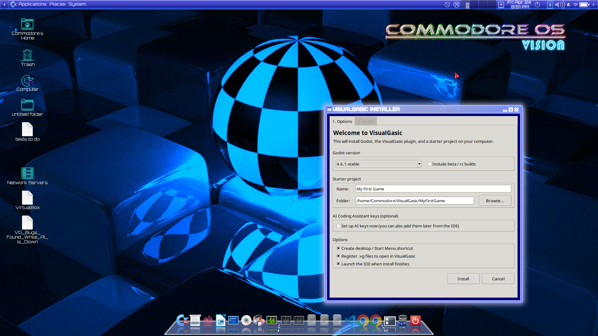
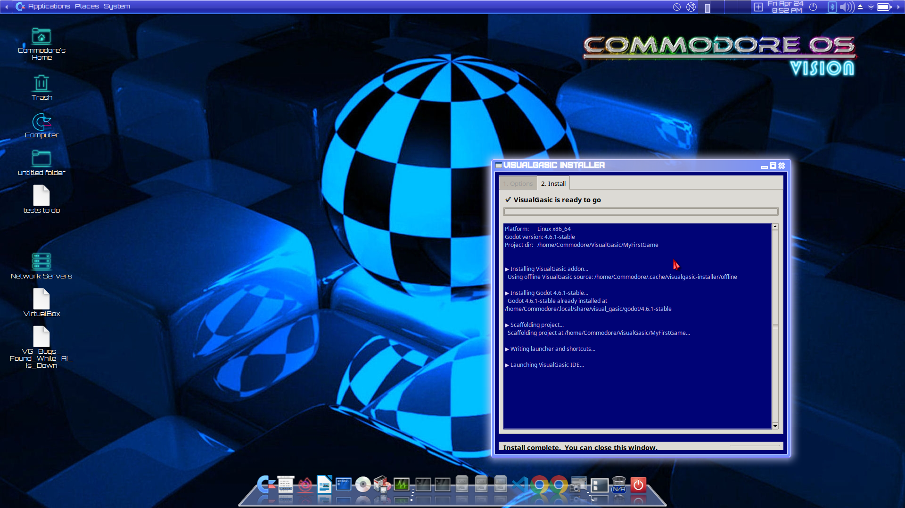

# VisualGasic Installation Guide

**Version**: 5.3.0-Beta7 (August 18, 2026)
**Requires**: Godot 4.6.1+ (handled automatically by the one-click installer)

Choose your preferred installation method:

- **Already have Godot 4.6.1+?** → **Method 0 (Asset Library)** — one click inside the editor.
- **New to Godot or want everything bundled?** → **Method 1 (one-click installer)** — no terminal required.

---

## 📥 Quick downloads

All assets live on the [v5.3.0-Beta7 release page](https://github.com/xgreenrx-star/VisualGasic/releases/tag/v5.3.0-Beta7). Direct links:

| Platform | Best option | Download |
| --- | --- | --- |
| 🐧 **Linux x86_64** | One-click installer (AppImage) | [`VisualGasic-Installer-v5.3.0-Beta7-x86_64.AppImage`](https://github.com/xgreenrx-star/VisualGasic/releases/download/v5.3.0-Beta7/VisualGasic-Installer-v5.3.0-Beta7-x86_64.AppImage) (~102 MB) |
| 🪟 **Windows x64** | One-click installer (`.exe`) | [`VisualGasic-Installer-v5.3.0-Beta7-x86_64.exe`](https://github.com/xgreenrx-star/VisualGasic/releases/download/v5.3.0-Beta7/VisualGasic-Installer-v5.3.0-Beta7-x86_64.exe) (~70 MB) |
| 🐧 Linux | Offline bundle (Godot included) | [`VisualGasic-Installer-Offline-v5.3.0-Beta7-linux-x86_64.zip`](https://github.com/xgreenrx-star/VisualGasic/releases/download/v5.3.0-Beta7/VisualGasic-Installer-Offline-v5.3.0-Beta7-linux-x86_64.zip) (~169 MB) |
| 🪟 Windows | Offline bundle (Godot included) | [`VisualGasic-Installer-Offline-v5.3.0-Beta7-windows-x86_64.zip`](https://github.com/xgreenrx-star/VisualGasic/releases/download/v5.3.0-Beta7/VisualGasic-Installer-Offline-v5.3.0-Beta7-windows-x86_64.zip) (~146 MB) |
| 🐧 Linux | Portable zip (bring your own Godot) | [`VisualGasic_v5.3.0-Beta7_linux_x86_64.zip`](https://github.com/xgreenrx-star/VisualGasic/releases/download/v5.3.0-Beta7/VisualGasic_v5.3.0-Beta7_linux_x86_64.zip) (~1 GB) |
| 🪟 Windows | Portable zip (bring your own Godot) | [`VisualGasic_v5.3.0-Beta7_windows_x86_64.zip`](https://github.com/xgreenrx-star/VisualGasic/releases/download/v5.3.0-Beta7/VisualGasic_v5.3.0-Beta7_windows_x86_64.zip) (~320 MB) |
| 📦 Asset Library | Godot editor install | [`VisualGasic_AssetLibrary_v5.3.0-Beta7.zip`](https://github.com/xgreenrx-star/VisualGasic/releases/download/v5.3.0-Beta7/VisualGasic_AssetLibrary_v5.3.0-Beta7.zip) — or use Method 0 below |
| 🍎 **macOS** | *not yet available* | Use the `vg` CLI (Method 2) or build from source (Method 5) for now. macOS `.dmg` is the last platform still in progress; we're looking for a tester. |

> 💡 **Not sure which to pick?** Use the one-click installer for your OS if you're starting fresh. Use **Method 0 (Asset Library)** if you already have Godot open. The offline bundle is for air-gapped installs. The portable zip is for people who already have Godot 4.6.1+ and want to drop the addon into an existing project.

---

## 🎮 Method 0: Godot Asset Library (Recommended if you already have Godot)

Install VisualGasic directly from Godot's built-in asset browser — no zip extraction or manual copy.

### Step-by-step

1. Open **Godot 4.6.1+** and create or open a project.
2. Click the **AssetLib** tab at the top of the editor (next to 2D, 3D, Script).
3. Search for **VisualGasic**.
4. Click **Download**, then **Install** (default path: `addons/visual_gasic/`).
5. Go to **Project → Project Settings → Plugins**, enable **VisualGasic**, then **restart Godot** when prompted.
6. Verify installation:
   - The FileSystem dock shows `addons/visual_gasic/` with `plugin.cfg` and `bin/` GDExtension binaries.
   - Right-click a node → **Attach Script** → **Language: VisualGasic** is available.
   - Switch to the **Visual Gasic IDE** main screen tab to open the Form Designer.

### Optional: run the Asset Library smoke test

From a clone of this repository:

```bash
./scripts/run_asset_library_smoke.sh
```

This creates a temporary project, installs the addon, runs the corpus, and executes the command-reference gate.

> **Note:** If VisualGasic does not appear in AssetLib yet, the listing may still be awaiting moderator approval. Use Method 1 (one-click installer) or Method 4 (GitHub release ZIP) until it is live.

---

## ✨ Method 1: One-Click Installer (Recommended for new users & kids)

A single download that installs Godot, installs VisualGasic, creates a starter project, and registers `.vg` files so double-clicking them opens the IDE. **No terminal required — just double-click and follow the prompts.**

### Linux

1. Download `VisualGasic-Installer-v5.3.0-Beta7-x86_64.AppImage` from the [latest release](https://github.com/xgreenrx-star/VisualGasic/releases/tag/v5.3.0-Beta7).
2. Right-click → **Properties → Permissions → Allow executing as a program** (or `chmod +x` it).
3. Double-click it. A graphical wizard opens where you can pick your Godot version, name your project, and (optionally) enter AI keys — then click **Install**.

> **Note:** the graphical wizard uses Tkinter. Almost every desktop Linux already has it; if not, install it with `sudo apt install python3-tk` (or your distro's equivalent). The installer falls back to text mode if Tk is missing.

### Windows

1. Download `VisualGasic-Installer-v5.3.0-Beta7-x86_64.exe` from the [latest release](https://github.com/xgreenrx-star/VisualGasic/releases/tag/v5.3.0-Beta7).
2. Double-click. The wizard walks you through: install location → Godot version → starter project name & folder → (optional) AI keys → click **Install**. Done.

### The graphical wizard

Both the Linux AppImage and the Windows `.exe` open a wizard with the same options:



- **Godot version** (dropdown; defaults to 4.6.1-stable).
- **Starter project name** and **folder** (defaults to `~/VisualGasic/MyFirstGame`).
- **Shortcuts & file association** checkboxes — create Start Menu / Applications-menu entries and register `.vg` files.
- **AI keys** (optional): OpenAI, Claude, Gemini. Leave blank to configure from inside the IDE later. Ollama runs locally and needs no key.
- **Install progress** tab with a live log.



If you prefer the command line — or need it for CI or scripted installs — every wizard option also exists as a flag (see [Power-user / scripted install](#choosing-a-godot-version) below). Pass `--no-gui` to force text mode, or `--gui` to force the wizard even over SSH with X11 forwarding.

### What the one-click installer does

- Downloads a matching Godot 4.6.1+ and stores it in a private, user-scoped location (no admin needed).
- Installs the VisualGasic editor plugin.
- Creates a **MyFirstGame** project in `~/VisualGasic/` (`%USERPROFILE%\VisualGasic\` on Windows) with VG pre-enabled and a starter `Form1.vg`.
- Adds a **VisualGasic IDE** entry to your Applications menu / Start Menu / Desktop.
- Registers `.vg` files so double-clicking one launches the IDE on that file.

### Choosing a Godot version

The wizard's Godot dropdown is the easy path. If you're scripting or on a headless box, every wizard option is also a flag:

```bash
# Linux: see what's available
./VisualGasic-Installer-v5.3.0-Beta7-x86_64.AppImage --no-gui --list-godot-versions

# Pick interactively (text prompt)
./VisualGasic-Installer-v5.3.0-Beta7-x86_64.AppImage --no-gui --pick-godot

# Install a specific version
./VisualGasic-Installer-v5.3.0-Beta7-x86_64.AppImage --no-gui --godot-version 4.6.2-stable
```

Only **Godot 4.6.1-stable and newer** is supported (the default is `4.6.1-stable`). Pre-release builds can be shown with `--include-prereleases`.

### Optional: set up AI keys during install

VisualGasic's built-in AI Coding Assistant supports OpenAI, Claude, Gemini, and Ollama. The graphical wizard has a dedicated **AI Coding Assistant** page where you can paste the keys you want (or leave it blank). For scripted installs, use the equivalent flags:

```bash
./VisualGasic-Installer-v5.3.0-Beta7-x86_64.AppImage --no-gui \
    --with-ai-keys \
    --openai-key "sk-..." \
    --claude-key "sk-ant-..." \
    --gemini-key "AIza..."
```

Keys are stored in Godot's per-user config with `0600` permissions on POSIX. All of these are **opt-in** — without them, the installer writes no keys and the AI assistant stays disabled until you configure it from inside the IDE.

### Optional: install Ollama (free local AI) during install

Don't want to share keys (or pay for them)? The wizard has a **Free local AI — Ollama** section that:

1. Detects your hardware (RAM, CPU cores, NVIDIA/AMD/Intel GPU + VRAM).
2. Pre-selects a recommended coding model from a curated list:

   | Model | Size | RAM needed | Notes |
   |-------|-----:|-----------:|-------|
   | `tinyllama` | ~0.7 GB | 2 GB | Tiniest; smoke-test only |
   | `qwen2.5-coder:1.5b` | ~1 GB | 4 GB | Lightweight coding |
   | `llama3.2:3b` | ~2 GB | 6 GB | General-purpose |
   | `qwen2.5-coder:7b` | ~4.7 GB | 10 GB | Recommended sweet spot |
   | `qwen2.5-coder:14b` | ~9 GB | 16 GB | Powerful |
   | `qwen2.5-coder:32b` | ~20 GB | 32 GB / 16+ GB GPU | Workstation |

3. Lets you override the choice from a dropdown.
4. On **Linux**, runs the official Ollama install script (may prompt for sudo) and then `ollama pull <model>`.
5. On **Windows / macOS**, opens [https://ollama.com/download](https://ollama.com/download) so you can run the native installer, then re-runs `ollama pull` if Ollama is already on PATH.

Scripted equivalent:
```bash
# Auto-pick model from hardware:
./VisualGasic-Installer-v5.3.0-Beta7-x86_64.AppImage --no-gui --with-ollama

# Pick a specific model:
./VisualGasic-Installer-v5.3.0-Beta7-x86_64.AppImage --no-gui --with-ollama \
    --ollama-model qwen2.5-coder:7b

# Inspect the catalog + see what would be recommended for this machine:
./VisualGasic-Installer-v5.3.0-Beta7-x86_64.AppImage --no-gui --list-ollama-models
```

Once installed, VisualGasic's AI Help panel can talk to the local Ollama instance with no API key.

### Offline install (no internet)

Download the appropriate offline bundle instead (`VisualGasic-Installer-Offline-v5.3.0-Beta7-linux-x86_64.zip` or `-windows-x86_64.zip`) — it includes a pre-downloaded Godot. Unzip and follow the `README.txt` inside.

---

## 🚀 Method 2: One-Line Install with `vg` CLI

The `vg` command-line tool installs VisualGasic globally and lets you create new projects instantly.

### Linux / macOS
```bash
curl -sSL https://raw.githubusercontent.com/xgreenrx-star/VisualGasic/main/install.sh | bash
```

### Windows (PowerShell — run as Administrator or normal user)
```powershell
irm https://raw.githubusercontent.com/xgreenrx-star/VisualGasic/main/install.ps1 | iex
```

### Cross-Platform (Python 3)
```bash
python3 install.py          # From the repo root (local install)
python3 install.py --github # Download from GitHub automatically
```

### What the Installer Does

1. Downloads the latest VisualGasic release from GitHub
2. Installs the addon to a global location:

   | Platform | Global Location |
   |----------|----------------|
   | **Linux** | `~/.local/share/visual_gasic/` |
   | **macOS** | `~/Library/Application Support/VisualGasic/` |
   | **Windows** | `%APPDATA%\VisualGasic\` |

3. Installs the `vg` CLI tool to `~/.local/bin/` (or `%USERPROFILE%\.local\bin\vg.cmd` on Windows)

### Using the `vg` CLI

After installation, the `vg` command is available from any terminal:

```bash
# Create a new Godot project with VG pre-installed and enabled
vg new MyGame
cd MyGame && godot .

# Add VG to an existing Godot project
cd /path/to/existing/project
vg install

# Update your global VG installation (from the source repo)
cd /path/to/VisualGasic
vg update

# Package management
vg pkg install MathLibrary@^2.1.0
vg pkg search "physics"
vg pkg list

# Show version and help
vg version
vg help
```

**What `vg new` creates:**
```
MyGame/
├── project.godot          # Plugin already enabled, autoloads configured
├── addons/visual_gasic/   # Complete addon with binaries
├── Form1.vg               # Starter form with Form_Load and Form_Click
├── icon.svg               # Project icon
└── .gitignore             # Configured for Godot
```

> **Note:** If `~/.local/bin` is not in your PATH, add it:
> ```bash
> echo 'export PATH="$HOME/.local/bin:$PATH"' >> ~/.bashrc && source ~/.bashrc
> ```

---

## 🎨 Method 3: From the VG IDE (Inside Godot)

If you already have a VG project open in Godot, you can create new projects without leaving the editor:

### Step-by-Step Walkthrough

1. **Open an existing VG project** in Godot (or create one with `vg new` first)

2. **Switch to the Visual Gasic IDE** main screen tab (top of the editor, between "2D", "3D", "Script", etc.)

3. **Go to File → New Project...** in the VG IDE menu bar

4. **Enter a project name** — only letters, digits, hyphens, and underscores allowed

5. **Choose a folder** — a file browser opens to select the parent directory

6. **Click Create** — the new project is generated with:
   - `project.godot` with the VG plugin already enabled
   - `addons/visual_gasic/` copied from your current project
   - A starter `Form1.vg` file ready to edit
   - The project opens in a new Godot instance

### Also Available from the Tools Menu

The VG plugin registers a **Tools → New VG Project...** menu item, so you can also create projects from the main Godot menu without switching to the VG IDE screen.

### Creating New Forms and Modules

Within an existing project, use the VG IDE's File menu:
- **File → New Form** — creates a new `.vg` form file with Form_Load stub
- **File → New Module** — creates a new `.vg` module file
- **File → Open** — opens an existing `.vg` file

---

## 📥 Method 4: Manual Installation (From GitHub Release)

### Download

1. Go to [Releases](https://github.com/xgreenrx-star/VisualGasic/releases/tag/v5.3.0-Beta7)
2. Download the platform zip for your OS:
   - Linux: `VisualGasic_v5.3.0-Beta7_linux_x86_64.zip`
   - Windows: `VisualGasic_v5.3.0-Beta7_windows_x86_64.zip`

### Install into a New Project

```bash
# Create a Godot project first (or use an existing one)
mkdir MyGame && cd MyGame
# Initialize a minimal project.godot if needed:
echo 'config_version=5
[application]
config/name="MyGame"' > project.godot

# Extract the addon
unzip VisualGasic_v5.3.0-Beta7_linux_x86_64.zip
cp -r addons/ .

# Open in Godot
godot .
```

Then enable the plugin: **Project → Project Settings → Plugins → VisualGasic ✓**

### Install into an Existing Project

```bash
cd /path/to/your/godot/project
unzip VisualGasic_v5.3.0-Beta7_linux_x86_64.zip -d /tmp/vg_temp
cp -r /tmp/vg_temp/addons/visual_gasic addons/
rm -rf /tmp/vg_temp
```

Restart Godot and enable the plugin in Project Settings.

### Pre-Built Binaries (Included)

The release zip contains pre-compiled binaries for all platforms:

| Platform | Binary Files |
|----------|-------------|
| **Linux** x86_64 | `libvisualgasic.linux.editor.x86_64.so`, `...template_debug...`, `...template_release...` |
| **Windows** x86_64 | `libvisualgasic.windows.editor.x86_64.dll`, `...template_debug...`, `...template_release...` |
| **macOS** Universal | `libvisualgasic.macos.editor.framework/`, `...template_debug...`, `...template_release...` |

---

## 🔧 Method 5: Build from Source

### Prerequisites
- **Godot 4.6.1+** binary
- **SCons** build system (`pip install scons`)
- **Git** with submodules
- **C++ compiler**: GCC 9+, Clang 10+, or MSVC 2019+
- **MinGW** (optional, for Windows cross-compilation): `sudo apt install g++-mingw-w64-x86-64`

### Build Steps

```bash
# Clone with submodules
git clone --recurse-submodules https://github.com/xgreenrx-star/VisualGasic.git
cd VisualGasic

# Build for your platform
scons platform=linux target=editor -j$(nproc)        # Linux
scons platform=windows target=editor -j$(nproc)       # Windows (MinGW cross-compile)
scons platform=macos target=editor -j$(sysctl -n hw.logicalcpu)  # macOS

# The compiled extension appears in demo/bin/
```

### Install into Your Project

```bash
mkdir -p YourProject/addons/visual_gasic/bin/
cp -r addons/visual_gasic/* YourProject/addons/visual_gasic/
cp demo/bin/libvisualgasic.* YourProject/addons/visual_gasic/bin/
```

### Build All Platforms (Release Script)

For building distributable release packages:

```bash
# Build Linux + Windows (from Linux with MinGW), creates release zips
./scripts/build_release.sh                # reads VERSION
./scripts/build_release.sh 5.3.0-Beta7     # explicit version

# One-click installer artifacts (run after build_release.sh)
./scripts/build_appimage.sh         5.3.0-Beta7   # Linux AppImage
./scripts/build_windows_installer.sh 5.3.0-Beta7  # Windows .exe (needs makensis)
./scripts/build_offline_bundle.sh   5.3.0-Beta7   # Offline bundles (Godot included)

# Or on macOS (builds all three including universal binary)
./scripts/build_release.sh
```

Output goes to `release/v<version>/`. The release script auto-strips dev/debug-symbol GDExtension variants (`*.editor.dev.*`, `*.template_debug.dev.*`) so the Linux portable zip lands around 1 GB instead of 2 GB.

---

## 🚪 The VG Welcome launcher (`vg-ide` / `vg-ide.ps1`)

Once VG is installed (any method above), the repo / install ships two tiny launcher scripts that **skip Godot's Project Manager** and land you in a VG-branded **Welcome window** instead. From there you pick a recent project, browse, or click **Ask Narcea to Make a Project** to scaffold a new one from a chat description.

### Linux / macOS

```bash
./vg-ide                       # opens the VG Welcome window (default)
./vg-ide --last                # jumps straight into the most-recent VG project
./vg-ide ~/Documents/MyGame    # opens a specific project
VG_OPEN_LAST=1 ./vg-ide        # env-var equivalent of --last
VG_GODOT=/path/to/godot ./vg-ide  # override binary discovery
```

The bash script is dependency-free (POSIX bash + awk). On macOS it picks up `Godot.app` bundles in the script dir, `/Applications`, `~/Applications`, and the standard install layouts. On Linux it looks for `Godot_v4.6.x-stable_linux.x86_64`, `godot` on `$PATH`, or `$VG_GODOT`.

### Windows

```powershell
.\vg-ide.ps1                   # opens the VG Welcome window
.\vg-ide.ps1 -Last             # most-recent project
.\vg-ide.ps1 'C:\path\to\MyGame'
$env:VG_OPEN_LAST = '1'; .\vg-ide.ps1
$env:VG_GODOT = 'C:\Tools\Godot.exe'; .\vg-ide.ps1
```

First-time PowerShell users may need to allow local scripts: `Set-ExecutionPolicy RemoteSigned -Scope CurrentUser`. The script searches the script dir, `C:\Program Files\Godot`, `C:\Program Files\VisualGasic`, `%LOCALAPPDATA%\Programs\Godot`, and `%LOCALAPPDATA%\visual_gasic`.

### How it works

- The cross-project recent list lives at:
  - **Linux:** `~/.config/visual_gasic/recent_projects.cfg`
  - **macOS:** `~/Library/Application Support/VisualGasic/recent_projects.cfg`
  - **Windows:** `%APPDATA%\VisualGasic\recent_projects.cfg`
- The IDE plugin records every VG project you open into that file (move-to-front, capped at 16).
- The Welcome shell project is a tiny Godot app under `welcome_shell/` that reads the list, shows thumbnails, supports search + tag filtering, and has an **Exit to VG Welcome** menu item from inside the IDE for easy round-tripping.
- A `launching.flag` marker keeps a "Loading…" splash on top while Godot initializes, so you don't see the partially-painted editor mid-boot. Since `v5.2.0-Beta4` the splash flips to **borderless + always-on-top + fullscreen** *before* spawning Godot and shows a custom rotating-arc circular spinner; it lingers an extra 1.5 s after `launching.flag` clears so the editor's first frame doesn't race the cover's `quit()`.
- The Quit button on the cover is wired to a real `_on_quit_pressed` handler (logs `[VG Welcome] Quit pressed`, drops `always_on_top` + fullscreen, then quits the tree) — safe to click at any point during the load.

If the Welcome shell isn't found, set `VG_WELCOME_DIR` to the directory containing it.

---

## ✅ Verification

After installation, verify VisualGasic is working:

1. **Check the plugin is enabled**: Project → Project Settings → Plugins → VisualGasic should show ✓
2. **Switch to the Visual Gasic IDE** main screen — you should see the Form Designer with Toolbox, Canvas, and Properties Panel
3. **Confirm the toolbox controls are present** — the Toolbox panel should show **Spinner**, **BusyDots**, **ToggleSwitch**, **ColorPicker**, and other Standard 2D controls. Switch to the **Game UI** tab for **PixelProgressBar**, **Badge**, and related controls. (See [`RELEASE_NOTES_5.3.0-Beta7.md`](../../RELEASE_NOTES_5.3.0-Beta7.md).)
4. **Create a test file** — create `hello.vg`:
   ```vb
   Sub Main()
       Print "Hello from VisualGasic!"
   End Sub
   ```
5. **Attach to a node** and run — you should see the output in the console
6. **Try the Immediate Window** — click the "Immediate" tab in the bottom panel, type `2 + 2` and press Enter
7. **Test VG Welcome** — close the IDE, run `./vg-ide` (or `.\vg-ide.ps1` on Windows). You should see the fullscreen project picker. Pick a project; the welcome cover (always-on-top fullscreen with the rotating-arc spinner) should stay painted until the IDE is fully ready.

---

## 🆘 Troubleshooting

### Plugin Not Showing Up
- Restart Godot after installation
- Check that `addons/visual_gasic/plugin.cfg` exists
- Verify the extension binary is in `addons/visual_gasic/bin/`

### Extension Failed to Load
- Ensure you downloaded the correct platform version
- Check Godot console (Output tab) for error messages
- Verify Godot version is 4.6.1 or newer
- On macOS: right-click the Godot app → Open (bypasses Gatekeeper on first run)

### `vg` Command Not Found
- Ensure `~/.local/bin` is in your PATH
- On Windows: ensure `%USERPROFILE%\.local\bin` is in your system PATH
- Try running the installer again

### Build Issues
- Update godot-cpp submodule: `git submodule update --init --recursive`
- Install SCons: `pip install scons`
- On Linux: `sudo apt install build-essential libffi-dev`
- On macOS: `xcode-select --install`

---

## 📚 Next Steps

After installation:

1. **[Getting Started Guide](GET_STARTED.md)** — beginner-friendly walkthrough
2. **[Quick Start](../getting_started/QUICK_START.md)** — forms, 2D games, and Narcea in one guide
3. **[Built-in Functions Reference](../reference/BUILTIN_FUNCTIONS_REFERENCE.md)** — 122+ builtins and statements
4. **[VB6 Features](../reference/VB6_FEATURES_IMPLEMENTATION.md)** — VB6 compatibility reference
5. **[Demo Projects](../../demos/)** — playable game and feature demos
6. **[Community](../community/README.md)** — drafts and links for community channels

---

*Installation help: [GitHub Issues](https://github.com/xgreenrx-star/VisualGasic/issues) · [Community](../community/README.md)*
