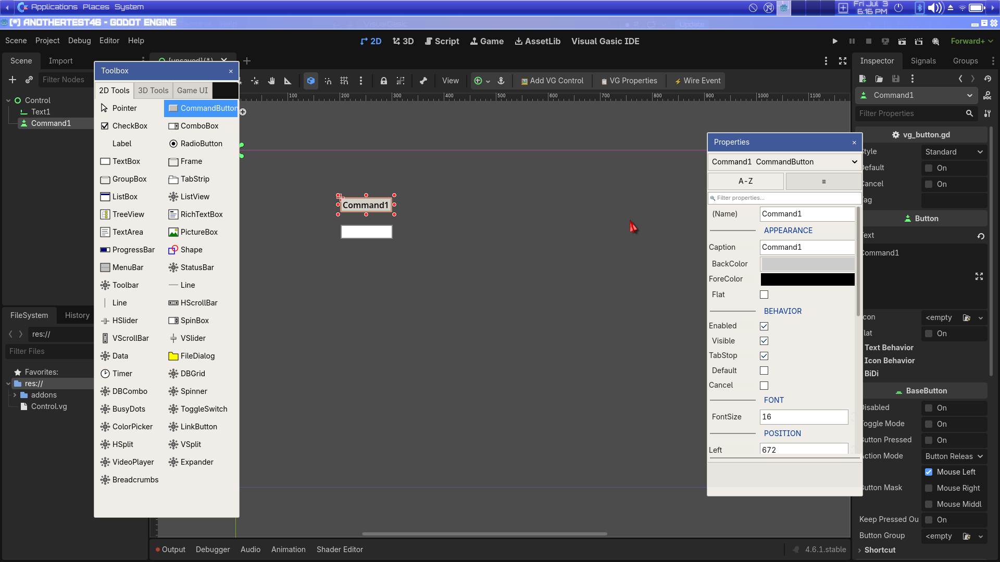
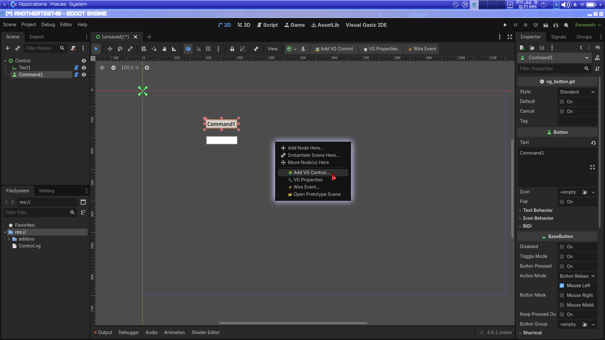

# VisualGasic IDE Tools

VisualGasic extends the Godot Editor with several tools designed to make Visual Basic 6 developers feel at home. These tools can be accessed via the **Project > Tools** menu or the **VisualGasic Toolbox**.

---

## Plugin Activation (v5.3.0+)

As of v5.3.0, VG sub-plugins (AGCK, Working Nodes, UI Forms, VGMusic, etc.) are
**disabled by default** and must be opted-in via **Project → Project Settings → Vg → Plugins**.
Each plugin appears as a single **On** checkbox (no nested "Enabled" row).

```
vg/plugins/agck = true
vg/plugins/working_nodes = true
vg/plugins/ui_forms = true
vg/plugins/vector_graphics = true
vg/plugins/gdai = true
```

Legacy paths (`vg/plugins/<id>/enabled`) are still read if present.

Set any of these to `true` in your project's settings to load the corresponding
plugin. The VG IDE itself no longer auto-opens on project load — switch to it
via the **Visual Gasic IDE** button in the top toolbar.

---

## 2D / 3D Scene Editors

The IDE toolbar **2D** and **3D** buttons open **Godot's native** scene editors
by default (recommended).

To use Visual Gasic's experimental embedded 2D/3D viewports instead:

**Project → Project Settings → Vg → Scene Editors → Simple 2d 3d** (`vg/scene_editors/simple_2d_3d`)

This is separate from sub-plugins such as **Vg 3d** under **Vg → Plugins** — those
load optional VG IDE modules, not the main 2D/3D viewport routing.

---

## Narcea AI Pair + Cursor

| Goal | What to use |
|------|-------------|
| In-Godot help, VG-aware prompts (default) | **Narcea** + Ollama / Gemini / DeepSeek |
| Composer inside the AI Pair panel | Provider **⬡ Cursor (Composer)** — needs API key + `pip install cursor-sdk` |
| Full Cursor IDE (diffs, native agent tools) | **↗ Cursor** handoff — opens project in Cursor + MCP auto-config |

**MCP:** With Godot running, `.cursor/mcp.json` exposes **visual-gasic** at `http://127.0.0.1:8766/mcp`.
Enable it in Cursor → Settings → Tools & MCP.

See [Cursor + Narcea roadmap](../development/CURSOR_NARCEA_ROADMAP.md) for the full plan.

---

## Context Rail — Data files (v5.4+)

When the caret is on a **`DataFile "path"`** line (or its label), the embedded code editor’s **Context Rail** opens the **Data file** section.

| Action | Purpose |
|--------|---------|
| **New level…** | Wizard: label name, file path, grid size → inserts `Label:` + `DataFile` in source and creates empty CSV/`.vgd` |
| **Edit Grid…** | Open the native Grid Editor (paint / fill / save) |

| Action | What it does |
|--------|----------------|
| Preview | CSV snippet, `.vgd` width×height, PNG thumbnail, or hex for raw bytes |
| **Convert → .vgd** | Pack a CSV grid into binary `.vgd` and update the `DataFile` path |
| **Import → .vgd** | Tiled JSON export → `.vgd` (`grid_u16`) |
| **Detect Tiled** / **Install Tiled…** | Find or install [Tiled Map Editor](https://www.mapeditor.org/) (not bundled with VG) |
| **Open in Tiled** | Launch Tiled on the source map when installed |
| Reveal / Copy path | File manager + clipboard |

**Project setting:** **Vg → Datafile → Tiled Executable** (`vg/datafile/tiled_executable`).

**VG source pattern:**

```vg
WorldTiles:
DataFile "levels/world.vgd"
```

Runtime: `DataCount("WorldTiles")`, `PeekData("WorldTiles", offset)`, `DataBuffer("WorldTiles")`. See [Language Reference — DataFile](../VisualGasic_Language_Reference.md#datafile) and [`.vgd` format](vg_data_format.md).

Inline **Sprite data** (≤32×32, label ending in `Sprite`) uses a separate **Sprite data** rail section with a paint grid — not the Data file panel.

---

## 2D Canvas Toolbar

Three VG-specific buttons are added to the Godot 2D editor toolbar:

| Button | Action |
|--------|--------|
| **🖼 Add VG Control** | Opens the floating **Toolbox** window. Select a control type, then click the canvas to place it with VB6 naming (`Command1`, `Text1`, etc.) |
| **📋 VG Properties** | Opens the floating **Properties** window to inspect and edit VB6-style properties of the selected control |
| **⚡ Wire Event** | Creates the primary VB6 event stub for the selected control (e.g. `Command1_Click`) and opens the `.vg` script at that location |

These actions are also available from the **right-click context menu** on the 2D canvas.





---

## High-Priority Features (Complete)

### Watch Window
**Location**: `Immediate Window > Watch Tab`

Enhanced variable watching with color-coded changes.
*   **Color-Coded Values**: Yellow = changed, Green = unchanged
*   **Context Menu**: Right-click to delete watches
*   **Persistence**: Watch expressions saved between sessions
*   **Previous Value Tracking**: Compare current vs. previous values
*   **VB6 Property Evaluation**: Watch expressions like `Me.Text1.Caption` or `btnOK.Enabled` resolve through the VG Immediate Window engine, so all 62+ VB6 property aliases work in watch expressions

### Snap-to-Grid & Alignment Tools
**Location**: `2D Canvas Editor Toolbar`

Professional Visual Gasic IDE tools for precise control placement.
*   **Grid Snapping**: Configurable grid size (8px, 16px, 32px, etc.)
*   **Grid Overlay**: Visual grid drawn on form canvas
*   **Alignment**: Left, Center, Right, Top, Middle, Bottom
*   **Distribution**: Distribute Horizontally/Vertically
*   **Sizing**: Make Same Width/Height/Both

### Call Stack Panel
**Location**: `Debugger > Call Stack`

Visual call stack display during debugging.
*   **Tree View**: Frame #, function name, file:line
*   **Navigation**: Click to jump to stack frame
*   **Color-Coded**: Current frame highlighted
*   **Auto-Request**: Call stack fetched on breakpoint hit

### IntelliSense / Autocomplete
**Location**: Automatic in `.vg` script files (VG IDE and Godot's native Script editor)

Full code completion for VB6-style programming.
*   **50+ VB6 Keywords**: Dim, Sub, Function, If, For, etc.
*   **12 VB6 Data Types**: Integer, Long, String, Boolean, etc.
*   **122+ Built-in Functions**: With signatures and descriptions
*   **62+ VB6 Property Completions**: Caption, Text, Visible, Enabled, Left, Top, Width, Height, BackColor, ForeColor, FontSize, FontBold, Tag, BackStyle, Appearance, TabIndex, Parent, DragMode, and more — appears when typing a dot after any control name
*   **Type-Specific Properties**: LineEdit shows MaxLength/PasswordMode/SelStart; Timer shows Interval/Enabled; Button shows Default/Cancel; CheckBox shows Value/Checked
*   **Common Methods**: Show, Hide, Move, SetFocus, Refresh
*   **Godot Native Properties**: After VB6 properties, ClassDB properties and methods for the control's actual Godot class are listed
*   **30+ Godot Types**: Node, Control, Sprite2D, etc.
*   **14 Code Snippets**: sub, func, if, for, select, try, class
*   **Works in Godot's Script Editor**: Dot-completion, control names, keywords, and variables all available when editing `.vg` files in Godot's built-in editor — Godot's own completions preserved alongside VG's

### Breakpoint Conditions
**Location**: Right-click on breakpoint gutter

Conditional breakpoints for advanced debugging.
*   **Condition Expressions**: Break when expression is true
*   **Hit Count**: Equals, greater-equal, or multiple of N
*   **Log Messages**: Tracepoints with `{variable}` substitution
*   **Temporary**: Auto-delete after first hit

---

## Medium-Priority Features (Complete)

### Recent Projects List
**Location**: `Project > Tools > Recent Projects`

Quick access to recently opened projects.
*   **Stores Last 10**: Projects automatically tracked
*   **Pin Favorites**: Keep important projects at top (📌)
*   **Clear History**: Remove all or individual entries
*   **Tooltip**: Shows full path on hover

### Code Formatter / Beautifier
**Location**: Coming to Tools menu

Automatic code formatting for .vg files.
*   **Auto-Indent**: Based on blocks (Sub/End Sub, If/End If)
*   **Operator Spacing**: Consistent spacing around `=`, `+`, etc.
*   **Keyword Capitalization**: `if` → `If`, `dim` → `Dim`
*   **100+ Keywords**: Properly formatted
*   **Format Selection**: Format only selected code

### Find All References
**Location**: Right-click on identifier

Show all usages of a variable, Sub, or Function.
*   **Results Panel**: Tree view with file:line listings
*   **Click to Navigate**: Jump to any reference
*   **Filter by Type**: Declaration, Read, Write, Call
*   **Search All .vg Files**: Workspace-wide search

### Go to Definition
**Location**: Ctrl+Click or F12 on identifier

Navigate to Sub/Function/Variable declarations.
*   **Ctrl+Click**: Hold Ctrl and click an identifier to jump to its definition
*   **F12 Key**: Alternative keyboard shortcut
*   **Context Menu**: Right-click → Go To Definition for the word under the caret
*   **Cross-File**: Works across all .vg files
*   **Symbol Types**: Sub, Function, Property, Enum, Type (UDT), Variable, Const, Label
*   **Symbol Validation**: Hovering with Ctrl highlights recognized symbols as clickable links
*   **Viewport Centering**: The editor scrolls to center the definition after navigation

### Form Preview Toolbar
**Location**: `2D Canvas Editor Toolbar`

Quick form testing without full game launch.
*   **Preview Form Button**: Opens form in popup window
*   **F5 Shortcut**: Quick preview
*   **Preview + Debug**: Connect to Immediate Window
*   **Form Events**: Fires Form_Load, Form_Shown

### Line Editing Tools
**Location**: Code Editor — keyboard shortcuts and right-click context menu

Fast line manipulation shortcuts that work on the current line or selection.
*   **Move Lines Up/Down** (`Alt+Up` / `Alt+Down`): Shift the selected line(s) up or down without cutting and pasting
*   **Duplicate Lines** (`Ctrl+Shift+D`): Insert a copy of the current line(s) immediately below
*   **Delete Lines** (`Ctrl+Shift+K`): Remove the entire current line(s) in one keystroke
*   **Context Menu**: All three actions are also available from the right-click menu

### Multi-Caret Editing
**Location**: Code Editor — `Ctrl+D` and mouse

Edit multiple locations simultaneously with multiple cursors.
*   **Ctrl+D**: Select the current word, then press again to add the next matching occurrence as an additional caret
*   **Multiple Selections**: Type, delete, or paste at all caret positions at once
*   **Use Cases**: Rename a local variable in-place, edit repeated patterns, bulk-change formatting

### Code Editor View Options
**Location**: Code Editor — right-click context menu

Toggle visual preferences from the context menu.
*   **Word Wrap** (check item): Wrap long lines at the editor boundary instead of scrolling horizontally
*   **Show Whitespace** (check item): Make spaces and tabs visible as dots and arrows
*   **Line Length Guideline**: A vertical guide at column 80 for readable line widths
*   **Code Regions**: Fold and unfold sections with `'Region` / `'End Region` comments
*   **Scroll Past End**: Continue scrolling past the last line for comfortable bottom-of-file editing
*   **Smooth Scrolling**: Animated scroll transitions
*   **Drag & Drop Text**: Select text and drag it to reposition within the editor
*   **Overtype Mode** (`Insert` key): Toggle between insert and overwrite typing

### Sort Lines
**Location**: Code Editor — right-click context menu

Alphabetically sort the currently selected lines. Useful for organizing blocks of `Dim` declarations, `Const` lists, or `Enum` members.
*   **Multi-Line Selection Required**: The item is disabled when fewer than two lines are selected
*   **Alphabetic Sort**: Lines are sorted in ascending A–Z order

### Go to Matching Block
**Location**: Code Editor — `Ctrl+Shift+]`

Jump between matching VB6 block keywords.
*   **Supported Pairs**: `Sub`↔`End Sub`, `Function`↔`End Function`, `Property`↔`End Property`, `If`↔`End If`, `For`↔`Next`, `Do`↔`Loop`, `While`↔`Wend`, `Select Case`↔`End Select`, `With`↔`End With`, `Enum`↔`End Enum`, `Type`↔`End Type`
*   **Depth-Aware**: Correctly handles nested blocks of the same type

### Surround With
**Location**: Code Editor — right-click → Surround With submenu

Wrap the current selection (or insert an empty block at the caret) in a VB6 block structure.
*   **If...End If**: Wrap in a conditional block
*   **For...Next**: Wrap in a counting loop
*   **Sub...End Sub**: Extract into a subroutine skeleton
*   **Try...Catch**: Wrap in error handling
*   **With...End With**: Wrap in a With block
*   **Select Case...End Select**: Wrap in a multi-branch selector
*   **Auto-Indent**: The wrapped code is automatically re-indented inside the block

### Expand / Shrink Selection
**Location**: Code Editor — `Alt+Shift+Up` (expand) / `Alt+Shift+Down` (shrink)

Progressively widen or narrow the selection by semantic scope.
*   **Expand Steps**: Word → Line → Enclosing Block → Enclosing Procedure → Entire File
*   **Shrink**: Reverses the last expand step, returning to the previous selection

### Visual Gasic IDE Canvas Enhancements
**Location**: Visual Gasic IDE canvas

Precision tools for control layout and form editing.
*   **Ctrl+Arrow Nudge**: Move selected controls by exactly 1 pixel
*   **Shift+Ctrl+Arrow Nudge**: Move selected controls by grid size
*   **Ctrl+Scroll Zoom**: Zoom the canvas in/out (25%–400%, 10% steps)
*   **Form Resize Handles**: 8 draggable handles on form edges and corners
*   **Z-Order Controls**: Right-click → Bring to Front / Send to Back
*   **Lock Position**: Right-click → Lock Position to prevent accidental moves
*   **Status Bar**: Live display of form name, dimensions, grid size, zoom %, and dirty indicator (`*`)
*   **Dirty Indicator**: Asterisk `*` appears in the status bar when the form has unsaved changes
*   **Undo/Redo Feedback**: Status bar flashes "Undo" / "Redo" on each operation

### Save All
**Location**: `File > Save All` or `Ctrl+Shift+S`

Save both the form layout (.tscn) and the code file (.vg) simultaneously.
*   **Keyboard Shortcut**: Ctrl+Shift+S
*   **Saves Form + Code**: Both files saved in one action
*   **Clears Dirty Flag**: The `*` indicator disappears after save
*   **Status Flash**: Shows "All files saved" briefly in status bar

### Properties Panel Enhancements
**Location**: Properties panel (right side)

Improved usability for the VB6-style Properties panel.
*   **🔍 Filter Search**: Type to filter properties by name — real-time, case-insensitive
*   **Hover Tooltips**: Every property label shows a description tooltip on hover
*   **Zebra Striping**: Alternating row backgrounds for easier visual scanning
*   **Numeric Stepping**: Arrow keys ±1, Shift+Arrow keys ±10 (±100 for Interval)
*   **Color Picker**: Click any color swatch for a full ColorPicker with alpha support

### Go To Line
**Location**: Code Editor — `Ctrl+G`

Jump to any line number in the current .vg script.
*   **Keyboard Shortcut**: Ctrl+G
*   **Shows Line Range**: Dialog displays valid range (1–N)
*   **Enter to Jump**: Type a number and press Enter
*   **Centers Viewport**: Editor scrolls to show the target line centered

### Keyboard Shortcuts Reference

For a complete list of all keyboard shortcuts, see [IDE Keyboard Shortcuts](IDE_SHORTCUTS.md).

---

## Nice-to-Have Features (Complete)

### Linting / Warnings
**Location**: Automatic in `.vg` files

Static analysis for code quality.
*   **VG001**: Unused variable detection
*   **VG002**: Undefined variable usage
*   **VG003**: Unreachable code warnings
*   **VG004**: Missing End statements
*   **VG005**: Deprecated syntax warnings
*   **VG006**: Empty block detection
*   **VG007**: Unused parameter warnings
*   **VG008**: Shadowed variable detection
*   **VG009**: Implicit Variant warnings
*   **VG010**: Missing Return warnings

### Snippet Manager
**Location**: IntelliSense / Autocomplete

User-defined code snippets with placeholders.
*   **40+ Built-in Snippets**: VB6 patterns ready to use
*   **8 Categories**: Control Flow, Loops, Procedures, Properties, Error Handling, Declarations, Events, Game, Utility
*   **Tabstop Placeholders**: `${1:default}` syntax
*   **User Snippets**: Create and save custom snippets
*   **Persistence**: Saved to `vg_snippets.cfg`

**Built-in Snippet Prefixes**:
| Prefix | Description |
|--------|-------------|
| `if` | If-Then-End If |
| `ife` | If-Then-Else-End If |
| `sel` | Select Case |
| `for` | For-Next loop |
| `fore` | For Each loop |
| `dow` | Do While loop |
| `sub` | Sub procedure |
| `func` | Function |
| `try` | Try-Catch |
| `prop` | Property Get/Let |
| `ready` | Godot _ready() |
| `proc` | Godot _process() |

### Theme Support
**Location**: Editor Settings (Coming Soon)

Visual theme options for the VB6 experience.

**Built-in Themes**:
| Theme | Description |
|-------|-------------|
| **VB6 Classic** | Authentic blue background, yellow text, cyan keywords |
| **Modern Dark** | VS Code-style dark theme |
| **Modern Light** | Clean light theme |
| **High Contrast** | Accessibility-focused |
| **Solarized Dark** | Popular color scheme |

*   **Custom Themes**: Create and save your own
*   **Color Options**: Background, text, keywords, strings, comments, etc.
*   **Font Settings**: Font name, size, bold keywords
*   **CSS Export**: Export theme for documentation

---

## Classic IDE Tools

### Menu Editor
**Location**: `Project > Tools > Visual Gasic Menu Editor`

A visual editor for constructing `MenuBar` hierarchies.
*   **Caption**: The text displayed to the user.
*   **Name**: Key for code access (e.g., `mnuFileOpen`).
*   **Hierarchy**: Use Indent/Outdent to create submenus.
*   **Shortcuts**: Define keyboard shortcuts (Ctrl+C, etc.).

### Project Properties
**Location**: `Project > Tools > Visual Gasic Project Properties`

A simplified dialog for managing game configuration.
*   **Startup Object**: Select which Form/Scene runs when you press F5.
*   **Project Name**: Updates the window title.
*   **Dimensions**: Set the default window resolution (Width/Height).

### Object Browser
**Location**: `Project > Tools > Visual Gasic Object Browser`

A searchable reference guide for the VisualGasic language.
*   Lists all built-in Functions, Subs, and Keywords.
*   Provides syntax examples and descriptions.
*   Organized by category (Math, Graphics, AI, etc.).

### Tab Order Editor
**Location**: `Project > Tools > Visual Gasic Tab Order`

Visually rearrange the Focus order of controls.
1.  Select a Form or Container in the Scene tree.
2.  Open the Tab Order tool.
3.  Select controls and move them Up/Down to change their sequence.

### New Form Wizard
**Location**: `VisualGasic Toolbox > New Form`

Quickly generate a new Form scene.
*   Creates a `Window` with VGFormBase functionality.
*   Automatically creates and attaches a `.vg` script.
*   Includes sample code with Form_Load, Form_Shown events.
*   Saves as `Form1.tscn`, `Form2.tscn`, etc.

**Form Templates**:
| Category | Templates |
|----------|-----------|
| **VB6 Classic** | Blank Form, About Box, Login Form, Splash Screen, Data Entry Form, MDI Parent Form |
| **Game Forms** | Main Menu, Settings, HUD, Inventory, Dialogue |
| **Platform** | macOS, Linux, Windows styles |
| **Custom** | User-saved templates |

### Components Dialog
**Location**: `Project > Visual Gasic Components...`

A VB6-style dialog for managing optional and custom controls in the Toolbox.
*   **Optional Components**: Enable/disable advanced controls
*   **Custom Controls**: Browse and add your own .tscn prototypes
*   **Custom Icons**: Each custom control gets a gear ⚙ fallback icon automatically. To provide a specific icon, add an SVG entry keyed to the control name in `vb6_toolbox_icons.gd` (see the [Custom Wobbly Form](../tutorials/custom_wobbly_form.md#custom-toolbox-icons) tutorial for details)
*   **Persistent Config**: Settings saved to `custom_components.cfg`
*   **Double-Click Toggle**: Quickly add/remove components

**Built-in Optional Components**:
| Component | Description |
|-----------|-------------|
| StatusBar | Status bar with panels |
| Toolbar | Button toolbar container |
| Animation | Sprite animation control |
| Calendar | Month/date picker calendar |
| DatePicker | Date selection control |
| MaskedEdit | Input mask text box |
| Winsock | Network socket control |
| UpDown | Spin button control |
| ListView | Multi-column list view |
| ImageCombo | Image + text combo box |

### Rename Refactoring
**Location**: `Ctrl+R` in any `.vg` script

Scope-aware variable renaming.
*   **Current Scope**: Rename only in current Sub/Function
*   **Entire Script**: Rename throughout the file
*   **Everywhere**: Rename in all .vg files
*   **Smart Matching**: Avoids strings and comments

---

## Bottom Dock Panels

The bottom dock in the VisualGasic IDE exposes four specialized panels beyond the built‑in Output/Debugger/Immediate tabs. These panels are defined in the editor addon (`addons/visual_gasic/`) and are available whenever the VG plugin is active.

### Profiler Panel
**Location**: `Bottom Dock > Profiler`
**File**: [addons/visual_gasic/vg_profiler_panel.gd](../../addons/visual_gasic/vg_profiler_panel.gd)

Bytecode-level performance profiler for VisualGasic scripts, backed by the C++ `VisualGasicProfiler` singleton. Integrates with the editor via the debug protocol (`visualgasic:profiler_*` messages) and is wired to the running engine through static class methods on `VisualGasicLanguage` (`vg_profiler_enable`, `vg_profiler_get_report`, `vg_profiler_clear`).

**What it's for**: find hot paths in your `.vg` code and in the VG runtime itself (parser, JIT, bytecode VM, ECS, etc.).

**Toolbar**:
| Button | Action |
|--------|--------|
| **▶ Start Profiling** | Enables the C++ profiler and begins auto‑refreshing (2s interval) |
| **🔄 Refresh** | Manually fetch the latest report from the running game |
| **🗑 Clear** | Zero all counter values and drop per‑function timing. Registered counter names are preserved so the list stays stable. |
| **💾 Export** | Dump the current report as JSON to `user://vg_profile_export.json` |

**Functions tab** — seven columns per entry:
- `Function`, `Category`, `Calls`, `Total (ms)`, `Avg (ms)`, `Min (ms)`, `Max (ms)`

Rows are sorted by total time descending and **heat‑colored**:
- 🔴 Red  ≥ 50 ms total (hot path)
- 🟠 Orange ≥ 10 ms (warm)
- 🟡 Yellow ≥ 1 ms (tepid)
- 🟢 Green  < 1 ms (cool)

**Counters tab** — `Counter`, `Value`, `Updates`, `Unit`. Populated by the `VG_COUNT` / `VG_COUNT_VALUE` macros in the engine (parser cache hits, JIT tier‑up events, allocator pool util, etc.).

**How to use**:
1. Open your project and run it (`F5`).
2. Click **▶ Start Profiling** in the Profiler panel.
3. Exercise the code paths you want to measure (gameplay, parser, etc.).
4. Click **⏹ Stop Profiling** or just hit **🔄 Refresh** to see live numbers.
5. Click a hot row to identify the offending function; use **💾 Export** to share the report.
6. Click **🗑 Clear** between runs to reset between A/B comparisons.

**Instrumenting your own code**: engine internals already use `VG_PROFILE(name)` and `VG_COUNT(name)` macros from [src/visual_gasic_profiler.h](../../src/visual_gasic_profiler.h). User `.vg` functions are not auto‑instrumented yet — the Counters tab will populate from engine activity, the Functions tab reflects macro call sites.

### Controls Panel (Controls Inspector)
**Location**: `Bottom Dock > Controls`
**File**: [addons/visual_gasic/vg_controls_inspector.gd](../../addons/visual_gasic/vg_controls_inspector.gd)

A VB6‑style live inspector for every control on your active form. Analogous to VB6's `Me.Controls` collection view at a breakpoint.

**What it's for**: inspect — and step through — the state of every `Button`, `TextBox`, `Label`, `ListBox`, etc. on the current form **while the game is paused at a breakpoint**. This is the missing piece between the Watch window (variables) and the form designer (static layout).

**UI**:
- **Filter box** — type to narrow by control name (live filter)
- **⟳ Refresh** — re‑request the controls list from the paused instance
- **Three‑column tree**: `Control` name, `Type` (Button/TextBox/…), `Value` (Caption / Text / Value / state)
- Each row expands to show **all** VB6 property aliases resolved at that frame (`Caption`, `Enabled`, `Visible`, `Left`, `Top`, `Width`, `Height`, `BackColor`, `ForeColor`, `Font`, …)

**How to use**:
1. Set a breakpoint in an event handler (`btn_Click`, `Form_Load`, etc.).
2. Run the project and trigger the breakpoint.
3. Open the **Controls** panel — it will say "Debugging active. Click Refresh to inspect controls."
4. Click **⟳ Refresh** to pull the live control list from the paused VG instance.
5. **Click** a control to emit `control_selected` (other plugins can listen — e.g. highlight on the canvas).
6. **Double‑click** a control to jump to its default event handler (`btn_Click` for Button, `txt_Change` for TextBox, etc.).
7. Use the filter box to quickly find named controls in forms with many widgets.

Outside of debugging the panel shows "Run project and hit a breakpoint to inspect controls." — the data comes from the running instance over the debug protocol, so the game must be paused.

### Packages Panel (VG Packages)
**Location**: `Bottom Dock > Packages`
**File**: [addons/visual_gasic/vg_package_browser.gd](../../addons/visual_gasic/vg_package_browser.gd)

Editor front‑end for the VisualGasic package manager (C++ class `VisualGasicPackage`). Analogous to NuGet in Visual Studio, or `pip`/`npm` for VG projects.

**What it's for**: install, remove, and search for reusable VG packages in your project. A VG package is a folder containing `.vg` modules plus a `package.vg.json` manifest — drop one into `vg_packages/` and it becomes `Imports`‑able from any script in the project.

**Toolbar**:
| Button | Action |
|--------|--------|
| **Init** | Create a `vg.json` manifest in the project root (required before installing anything) |
| **⟳** | Refresh the installed packages list from disk |

**Search bar** — query the package registry. Hit Enter or click **Search** to populate the Search tab. (Note: the remote registry endpoint is currently a TODO — see `TODO(pkg-registry)` in [src/visual_gasic_package.cpp](../../src/visual_gasic_package.cpp). Local install from a folder works today.)

**Tabs**:
- **Installed** — every package currently resolved into `vg_packages/`, with version and a Remove button per row
- **Search** — results from the registry query, each with an Install button
- **Info** — RichTextLabel that shows the selected package's `package.vg.json` (description, author, dependencies, license)

**How to use**:
1. Open the Packages panel in your project.
2. If it prompts, click **Init** — this writes `vg.json` at the project root.
3. Type a package name in the search box and press Enter (or install locally by dropping a package folder into `vg_packages/` and clicking **⟳**).
4. Hit **Install** on a search result; the package is downloaded into `vg_packages/<name>/` and its exported symbols become available.
5. In your `.vg` code:
   ```vb
   Imports MyPackage
   MyPackage.Foo()
   ```
6. To uninstall, open the **Installed** tab and click **Remove** next to the package.

**Signals** (for plugin integration): `package_installed(pkg_name, version)`, `package_removed(pkg_name)`.

### AI Help Panel
**Location**: `Bottom Dock > AI Help`
**Files**: [addons/visual_gasic/vg_ai_help.gd](../../addons/visual_gasic/vg_ai_help.gd), [addons/visual_gasic/vg_ai_providers.gd](../../addons/visual_gasic/vg_ai_providers.gd), [addons/visual_gasic/vg_ai_model_picker.gd](../../addons/visual_gasic/vg_ai_model_picker.gd)

In‑editor AI assistant with a VisualGasic‑aware system prompt. Supports **local Ollama** (private, offline) and cloud providers **OpenAI**, **Claude**, and **Gemini**. Streams token‑by‑token responses into a RichTextLabel in the panel.

**What it's for**: explain errors, translate GDScript ↔ VG, describe a selected `Sub`/`Function`, generate boilerplate, or just ask "why doesn't this compile?" without leaving the IDE.

**UI**:
- **Provider dropdown** — pick Ollama / OpenAI / Claude / Gemini
- **API Key** button — stores keys in `user://vg_ai_keys.cfg` (Ollama needs none)
- **Model dropdown** / **Models…** — pick the model. Defaults to `qwen2.5-coder:7b` on Ollama.
- **Status label** — shows connection state (`Ollama ready`, `Warming up…`, `Streaming…`, etc.)
- **Output** — RichTextLabel with Markdown/code‑fence rendering, token count, and elapsed time
- **Input** — CodeEdit with `↑/↓` history navigation
- **Send** — submit the prompt (Ctrl+Enter also works)
- **Stop** — abort an in‑flight generation
- **Clear** — reset the conversation (the last 3 user+assistant exchanges are fed back as context)

**Preset quick‑action buttons**:
| Button | What it does |
|--------|--------------|
| **Explain Error** | Sends the last error captured from the Output/Debugger to the model: "Explain this VG error and how to fix it" |
| **Explain Code** | Sends the current selection (or the surrounding Sub/Function block if no selection) with "Explain what this VG code does" |
| **Translate** | Converts between VG and GDScript — directional based on which pane the code came from |

**How to use**:
1. Open the AI Help panel. If you want local/offline: install Ollama (`curl -fsSL https://ollama.ai/install.sh | sh`) and pull a model (`ollama pull qwen2.5-coder:7b`). The panel pings `http://127.0.0.1:11434` on activation.
2. For cloud providers, click **API Key** and paste your key (stored in `user://vg_ai_keys.cfg`).
3. Pick a model from the dropdown. Click **Models…** to browse everything installed.
4. Type a question, or select code in the editor and click a preset button.
5. Tokens stream in real time — click **Stop** anytime to abort.
6. History: `↑/↓` in the input recalls previous prompts. The panel keeps the last 3 exchanges as conversation context so you can say "refactor that" or "show me an example".

**System prompt**: every request is prefixed with a VG‑aware preamble covering VB6 syntax, auto‑wired events, virtual callbacks (`_Ready`, `_Process`, `_PhysicsProcess`, `_Input`), VB6 property aliases, and `ConnectSignal`. See `SYSTEM_PROMPT` in [vg_ai_help.gd](../../addons/visual_gasic/vg_ai_help.gd) for the full text.

**Privacy**: when using Ollama everything stays on your machine. Cloud providers send the prompt (plus the last N exchanges and any selected code) to the respective API; don't paste secrets.

**Developer note**: plugin authors can extend or consume the same AI integration via `addons/visual_gasic/gdai.gd`; see `docs/guides/PLUGIN_SYSTEM.md` for provider registration, project settings, and `ai.*` capability metadata.
