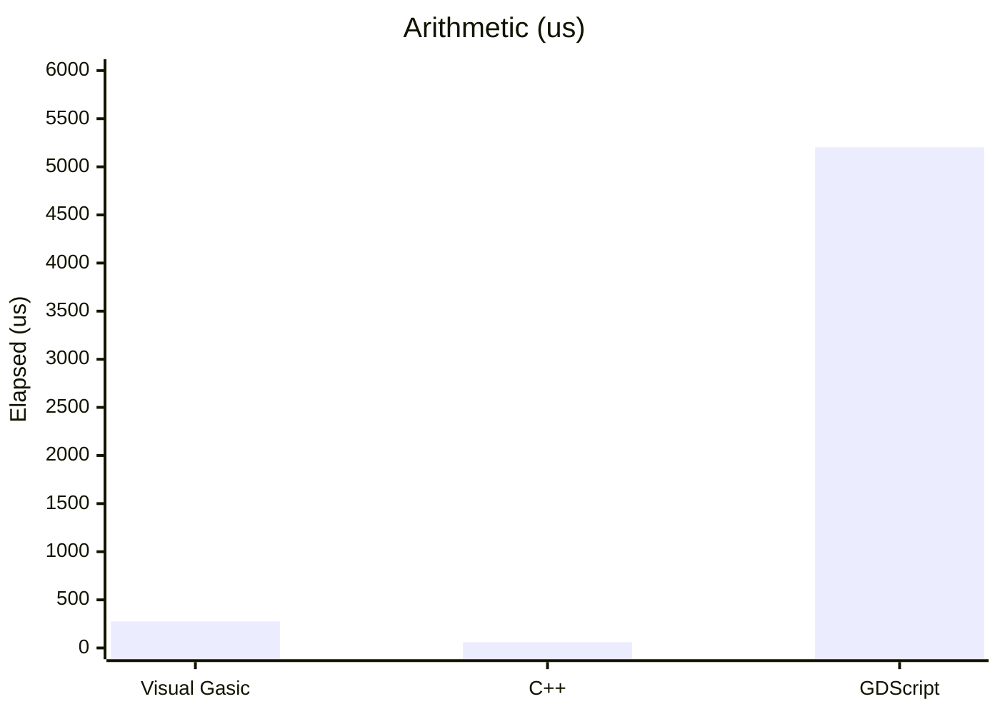
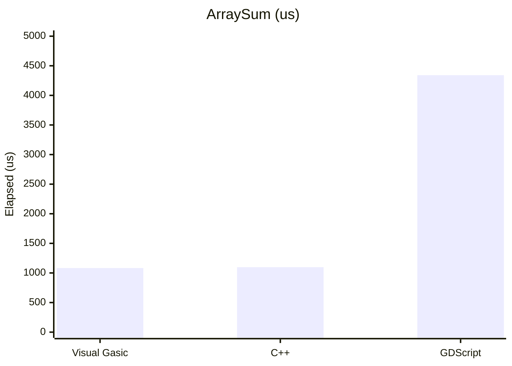
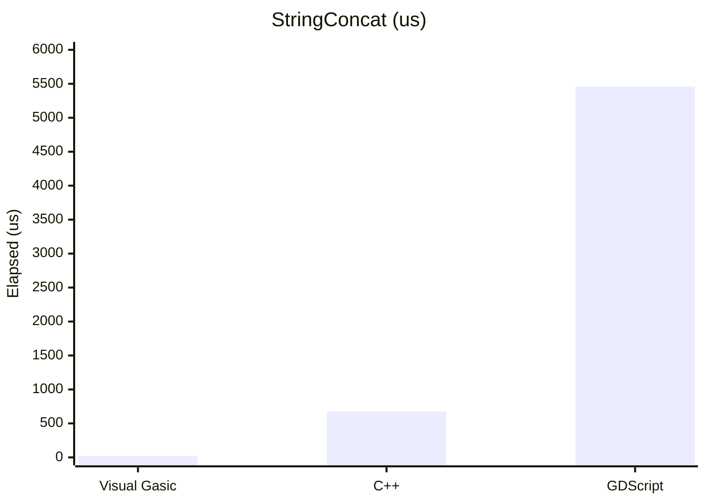
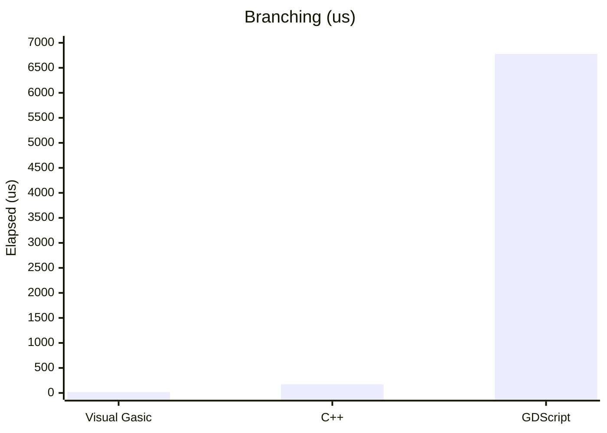
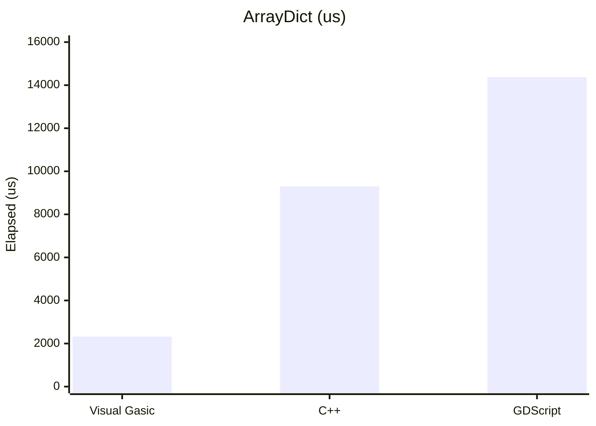
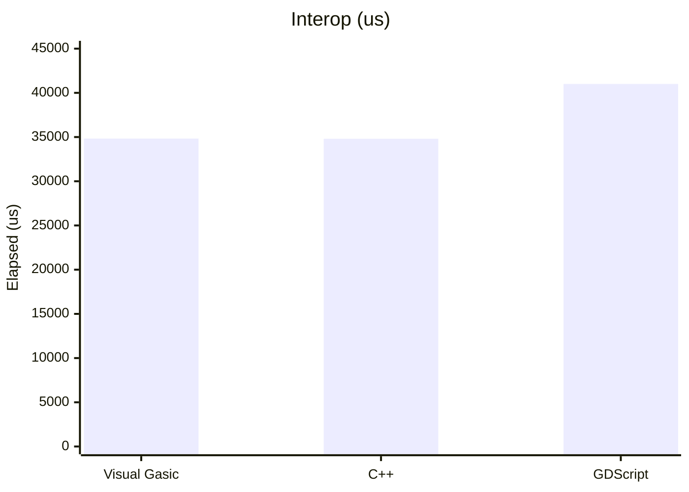
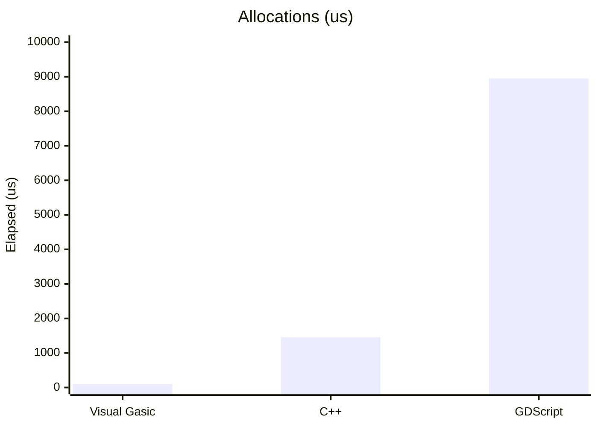
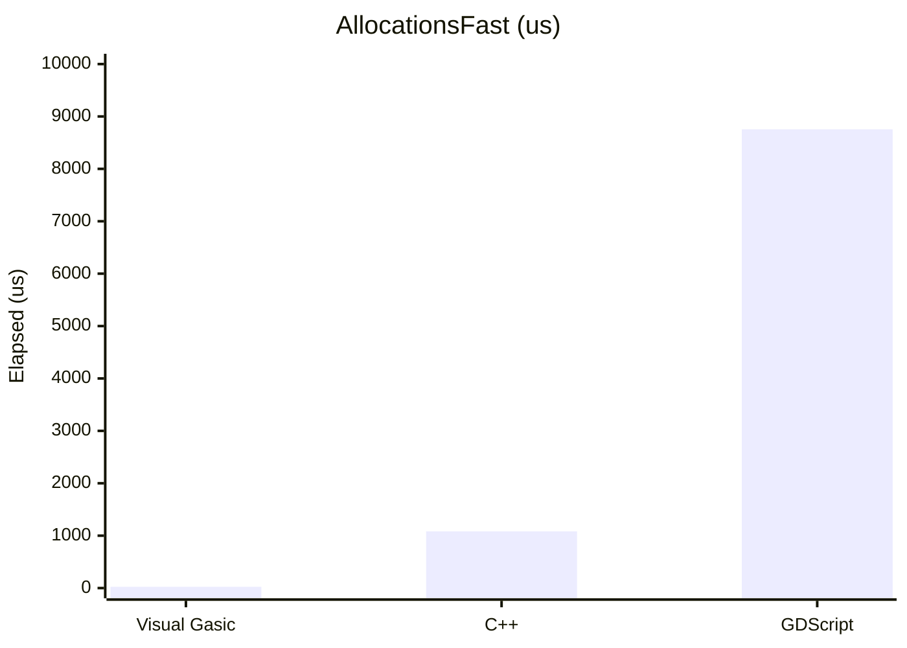
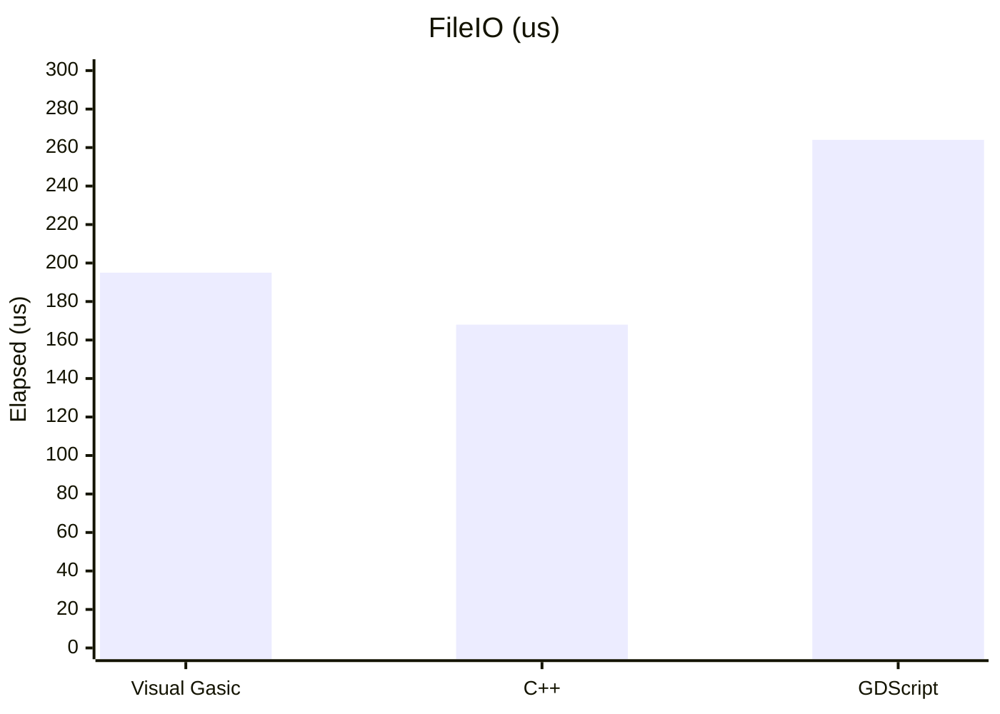

# Performance Benchmarks

This page summarizes the built‑in benchmark suite results for Visual Gasic versus GDScript and C++.

## Test Setup

- Engine: Godot 4.5.1 (headless)
- Script: demo/bench.bas
- Runner: demo/run_benchmarks.gd
- Build: Visual Gasic GDExtension (release)
- Date: 2026‑01‑26

## Results (elapsed time in microseconds, lower is faster)

| Test | Visual Gasic | C++ | GDScript | Fastest |
|---|---:|---:|---:|---|
| Arithmetic | 276 | 60 | 5,203 | C++ |
| ArraySum | 1,083 | 1,098 | 4,341 | Visual Gasic |
| StringConcat | 19 | 676 | 5,460 | Visual Gasic |
| Branching | 18 | 173 | 6,778 | Visual Gasic |
| ArrayDict | 2,325 | 9,298 | 14,373 | Visual Gasic |
| Interop | 34,829 | 34,805 | 41,005 | C++ |
| Allocations | 100 | 1,456 | 8,953 | Visual Gasic |
| AllocationsFast | 24 | 1,082 | 8,755 | Visual Gasic |
| FileIO | 195 | 168 | 264 | C++ |

## Speedup vs GDScript (higher is faster; values under 1.00× are slower)

| Test | Visual Gasic | C++ |
|---|---:|---:|
| Arithmetic | 18.85× | 86.72× |
| ArraySum | 4.01× | 3.95× |
| StringConcat | 287.37× | 8.08× |
| Branching | 376.56× | 39.18× |
| ArrayDict | 6.18× | 1.55× |
| Interop | 1.18× | 1.18× |
| Allocations | 89.53× | 6.15× |
| AllocationsFast | 364.79× | 8.09× |
| FileIO | 1.35× | 1.57× |

## Placements

- **Arithmetic**: 1st C++, 2nd Visual Gasic, 3rd GDScript
- **ArraySum**: 1st Visual Gasic, 2nd C++, 3rd GDScript
- **StringConcat**: 1st Visual Gasic, 2nd C++, 3rd GDScript
- **Branching**: 1st Visual Gasic, 2nd C++, 3rd GDScript
- **ArrayDict**: 1st Visual Gasic, 2nd C++, 3rd GDScript
- **Interop**: 1st C++, 2nd Visual Gasic, 3rd GDScript
- **Allocations**: 1st Visual Gasic, 2nd C++, 3rd GDScript
- **AllocationsFast**: 1st Visual Gasic, 2nd C++, 3rd GDScript
- **FileIO**: 1st C++, 2nd Visual Gasic, 3rd GDScript

## Bar Graphs (lower is better)

## Notes

Performance varies by workload. Visual Gasic leads on ArraySum, StringConcat, Branching, ArrayDict, Allocations, and AllocationsFast in this suite. C++ leads on Arithmetic and Interop; FileIO is now close with a C++ fast path for Visual Gasic. Interop uses a fused bytecode path that still performs set_name/get_name in a tight VM loop. Allocations uses a fused allocation/fill/string-repeat path that preserves baseline semantics while removing per-iteration VM overhead; AllocationsFast remains the explicit AllocFillI64 fast path. ArrayDict uses a closed-form array+dict sum fast path in the compiler.
