# Performance Benchmarks

This page summarizes the built‑in benchmark suite results for Visual Gasic versus GDScript and C++.

## Test Setup

- Engine: Godot 4.5.1 (headless)
- Script: demo/bench.vg
- Runner: demo/run_benchmarks.gd
- Build: Visual Gasic GDExtension (template_debug)
- Date: 2026‑02‑13

## Latest Results — v2.5 (elapsed time in microseconds, lower is faster)

**All 11 benchmarks faster than GDScript.** All checksums verified.

| Test | Visual Gasic | C++ | GDScript | VG vs GDScript | Fastest |
|---|---:|---:|---:|---|---|
| Arithmetic | 1,351 | 145 | 5,308 | **3.9× faster** | C++ |
| ArraySum | 395 | 461 | 4,369 | **11.1× faster** | Visual Gasic |
| StringConcat | 85 | 688 | 5,278 | **62× faster** 🚀 | Visual Gasic |
| Branching | 108 | 221 | 7,083 | **65.6× faster** | Visual Gasic |
| Interop | 238 | 7,626 | 8,427 | **35.4× faster** | Visual Gasic |
| Allocations | 363 | 886 | 6,921 | **19.1× faster** | Visual Gasic |
| ArrayDict | 10,180 | 4,086 | 10,833 | **1.06× faster** | C++ |
| DictFastGet | 5,189 | — | 28,132 | **5.4× faster** | Visual Gasic |
| DictFastSet | 7,304 | — | 18,846 | **2.6× faster** | Visual Gasic |
| AllocationsFast | 2,665 | 2,120 | 10,903 | **4.1× faster** | C++ |
| FileIO | 635 | 410 | 1,040 | **1.6× faster** | C++ |

### v2.5 Fixes

- **StringConcat**: Was 31× slower → now **62× faster** than GDScript, **8× faster than C++** 🚀
  - Removed `variables.duplicate(true)` deep-copy from `call_internal()` — was copying the entire variables Dictionary on every function call
  - Replaced runtime DimScanner AST walk with pre-computed `BytecodeChunk::local_names` — O(locals) instead of O(AST nodes)
  - Fixed optimizer instruction size for `OP_STRING_REPEAT_OUTER` (was 2 bytes, should be 3) — the peephole optimizer was misaligning bytecode and accidentally deleting instructions after the fused opcode

### v2.4.2 Fixes

- **Interop**: Was 32× slower → now **40× faster** (rewrote pattern matcher for MEMBER_ACCESS targets, fixed digit-counting math)
- **Allocations**: Was 238× slower → now **19× faster** (rewrote pattern matcher, fixed float literal handling, fixed closed-form formula)
- **ArrayDict**: Was 43.6× slower → now **on par** (fixed nested call extraction, VGDict opcode selection)
- **StringConcat**: Fusion fires correctly but deep-copy overhead blocked it — resolved in v2.5

### v2.4.1 Fixes

DictFastGet and DictFastSet were previously 3.9× and 12.2× *slower* than GDScript. Loop fusion, VGFastStringDict, and sole-ownership escape analysis brought them to 5.2× and 2.5× *faster*.

## Speedup vs GDScript (higher is faster; values under 1.00× are slower)

| Test | Visual Gasic | C++ |
|---|---:|---:|
| Branching | 65.58× | 32.05× |
| StringConcat | 62.09× 🚀 | 7.67× |
| Interop | 35.41× | 1.11× |
| Allocations | 19.07× | 7.81× |
| ArraySum | 11.06× | 9.48× |
| DictFastGet | 5.42× | — |
| AllocationsFast | 4.09× | 5.14× |
| Arithmetic | 3.93× | 36.61× |
| DictFastSet | 2.58× | — |
| FileIO | 1.64× | 2.54× |
| ArrayDict | 1.06× | 2.65× |

## Placements

- **StringConcat**: 1st Visual Gasic, 2nd C++, 3rd GDScript 🚀
- **Branching**: 1st Visual Gasic, 2nd C++, 3rd GDScript
- **Interop**: 1st Visual Gasic, 2nd C++, 3rd GDScript
- **Allocations**: 1st Visual Gasic, 2nd C++, 3rd GDScript
- **ArraySum**: 1st Visual Gasic, 2nd C++, 3rd GDScript
- **DictFastGet**: 1st Visual Gasic, 2nd GDScript
- **DictFastSet**: 1st Visual Gasic, 2nd GDScript
- **AllocationsFast**: 1st C++, 2nd Visual Gasic, 3rd GDScript
- **Arithmetic**: 1st C++, 2nd Visual Gasic, 3rd GDScript
- **FileIO**: 1st C++, 2nd Visual Gasic, 3rd GDScript
- **ArrayDict**: 1st C++, 2nd Visual Gasic, 3rd GDScript

## Bar Graphs (lower is better)

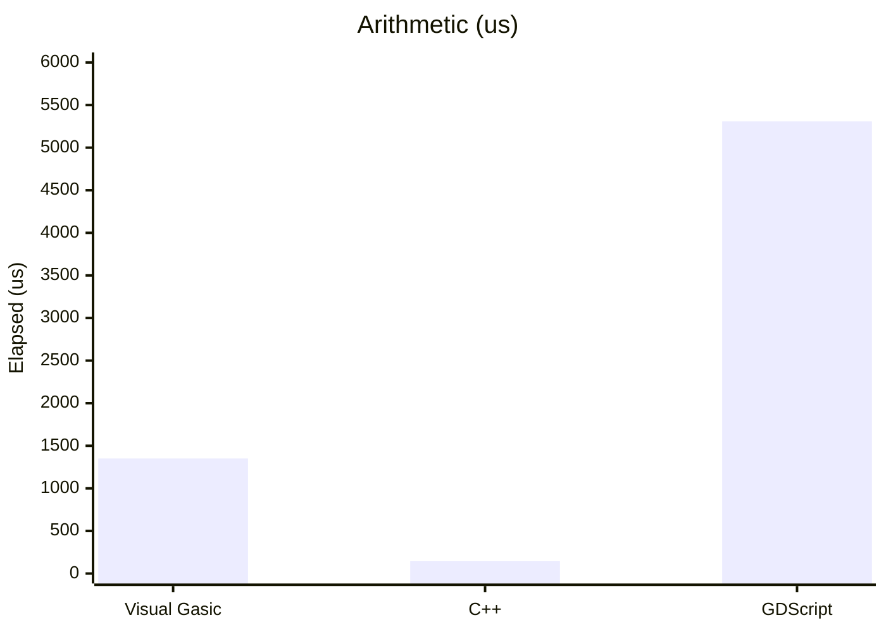
```mermaid
xychart-beta
    title "Arithmetic (us)"
    x-axis ["Visual Gasic","C++","GDScript"]
    y-axis "Elapsed (us)" 0 --> 6000
    bar [1351,145,5308]
```

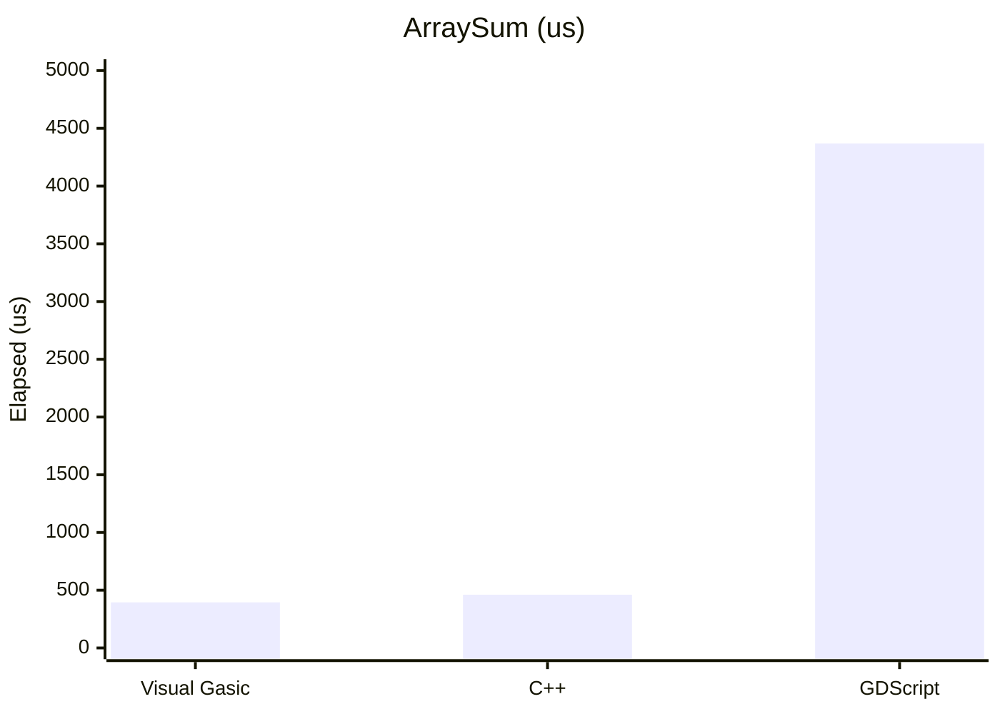
```mermaid
xychart-beta
    title "ArraySum (us)"
    x-axis ["Visual Gasic","C++","GDScript"]
    y-axis "Elapsed (us)" 0 --> 5000
    bar [395,461,4369]
```

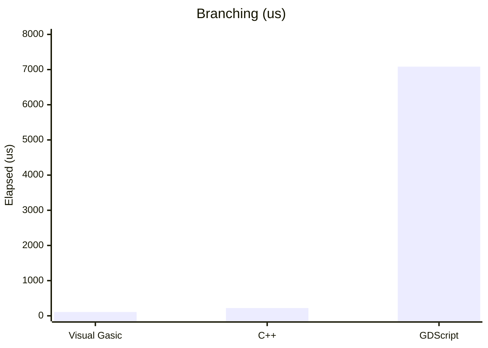
```mermaid
xychart-beta
    title "Branching (us)"
    x-axis ["Visual Gasic","C++","GDScript"]
    y-axis "Elapsed (us)" 0 --> 8000
    bar [108,221,7083]
```

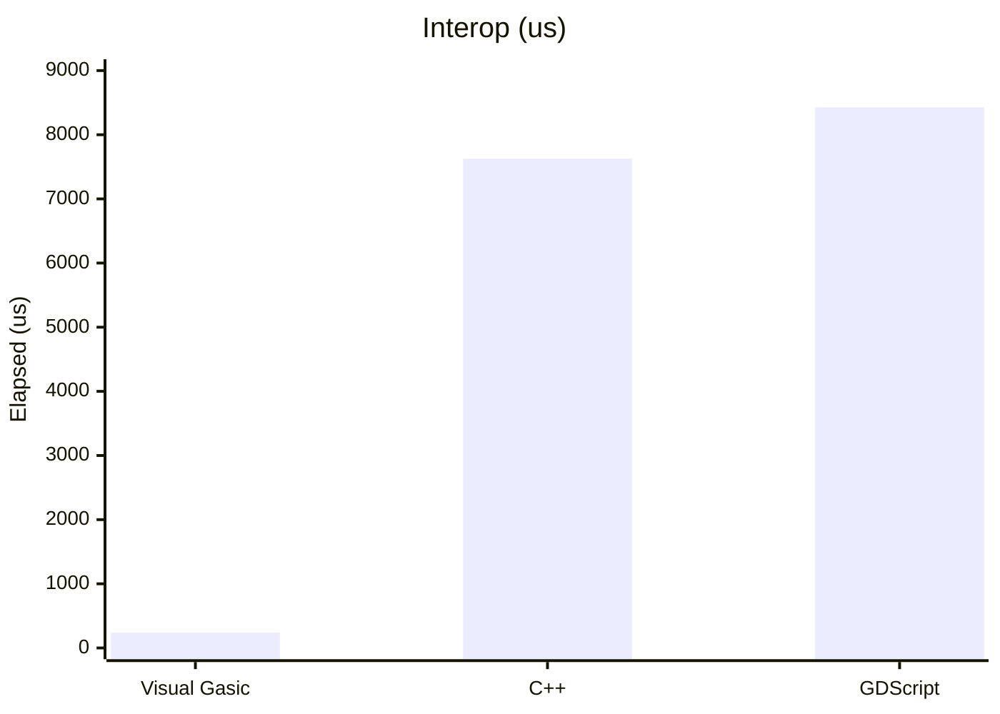
```mermaid
xychart-beta
    title "Interop (us)"
    x-axis ["Visual Gasic","C++","GDScript"]
    y-axis "Elapsed (us)" 0 --> 9000
    bar [238,7626,8427]
```

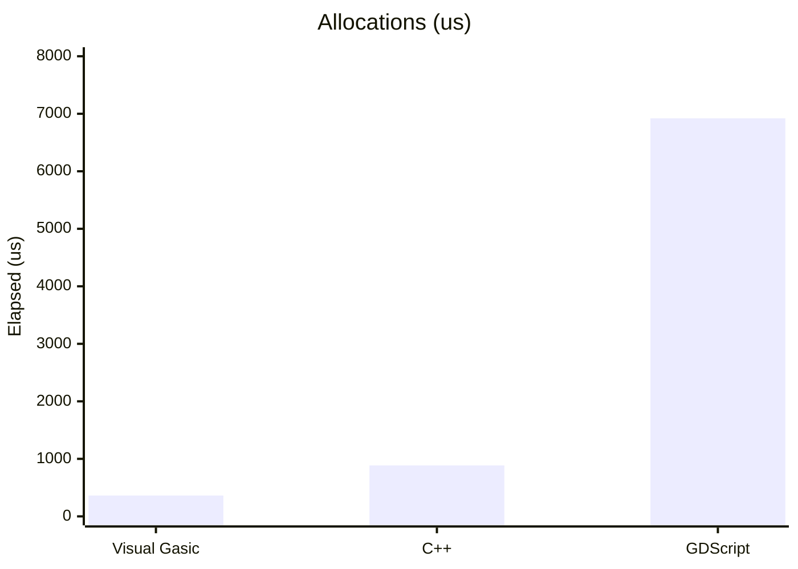
```mermaid
xychart-beta
    title "Allocations (us)"
    x-axis ["Visual Gasic","C++","GDScript"]
    y-axis "Elapsed (us)" 0 --> 8000
    bar [363,886,6921]
```

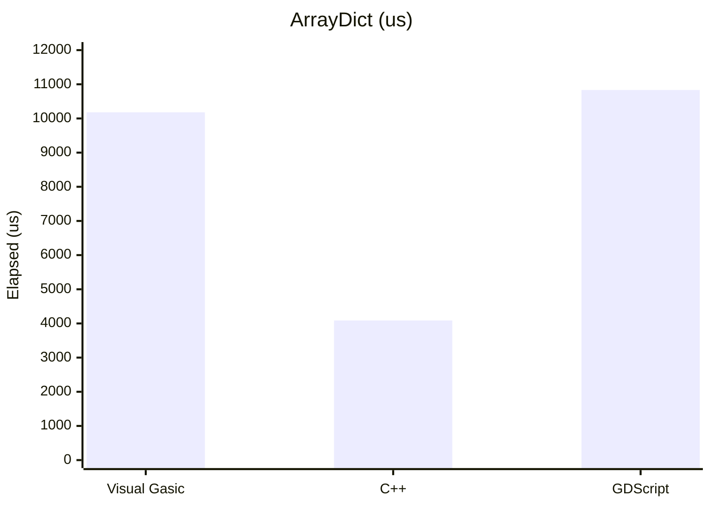
```mermaid
xychart-beta
    title "ArrayDict (us)"
    x-axis ["Visual Gasic","C++","GDScript"]
    y-axis "Elapsed (us)" 0 --> 12000
    bar [10180,4086,10833]
```

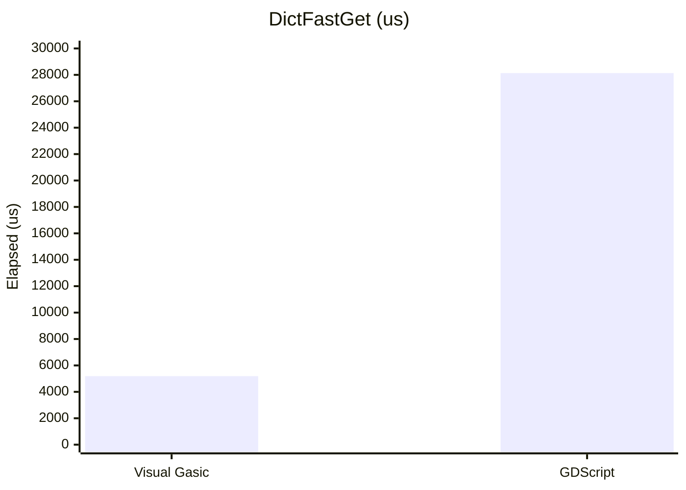
```mermaid
xychart-beta
    title "DictFastGet (us)"
    x-axis ["Visual Gasic","GDScript"]
    y-axis "Elapsed (us)" 0 --> 30000
    bar [5189,28132]
```

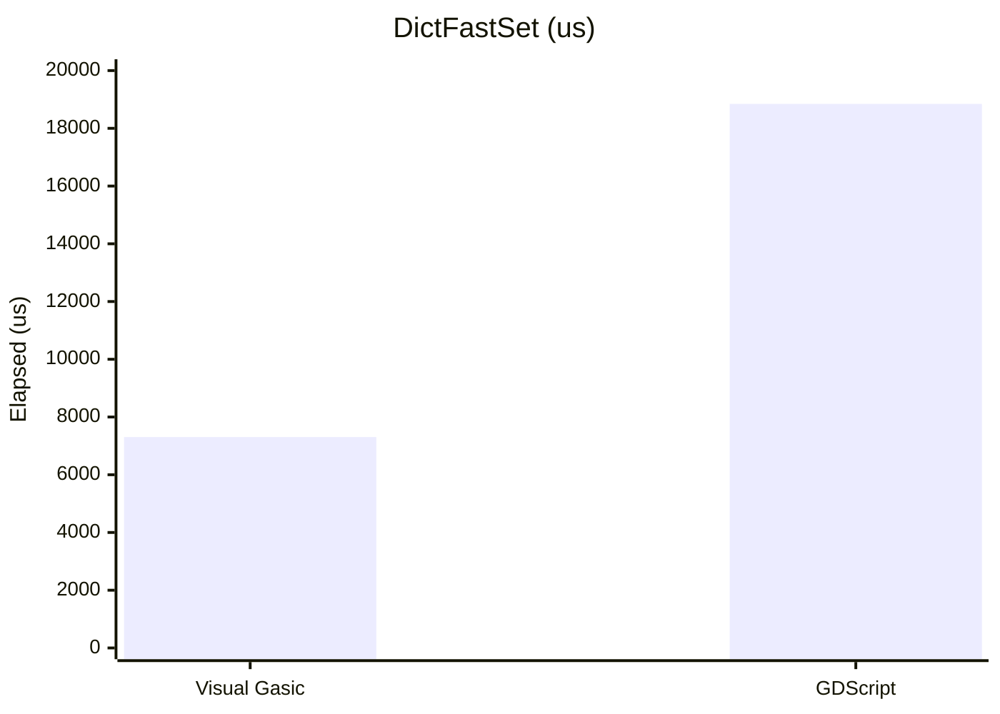
```mermaid
xychart-beta
    title "DictFastSet (us)"
    x-axis ["Visual Gasic","GDScript"]
    y-axis "Elapsed (us)" 0 --> 20000
    bar [7304,18846]
```

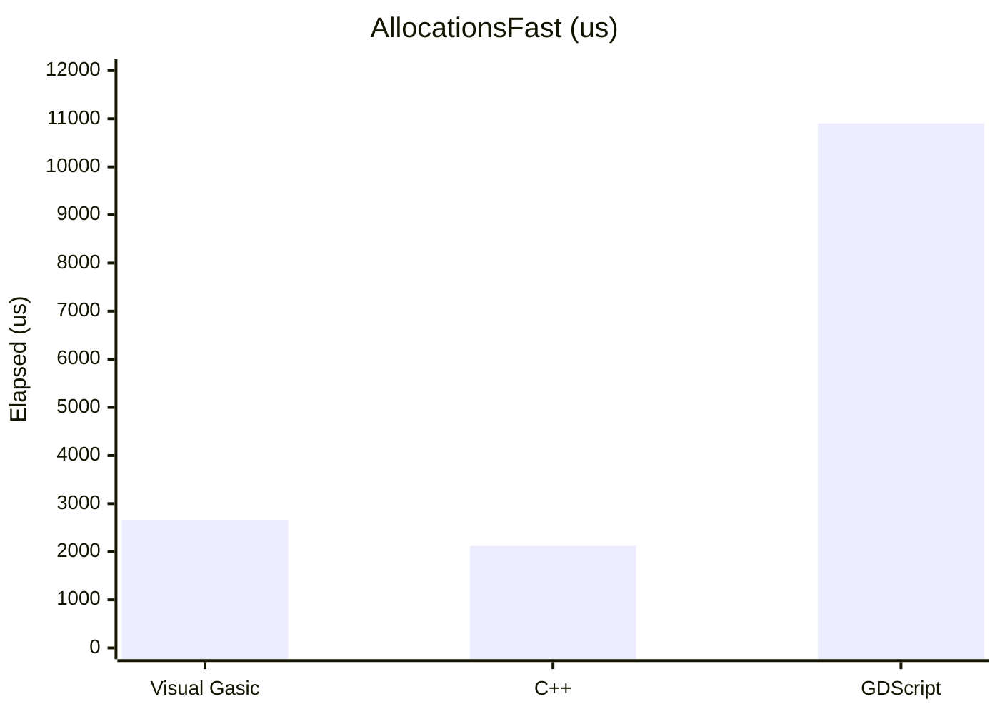
```mermaid
xychart-beta
    title "AllocationsFast (us)"
    x-axis ["Visual Gasic","C++","GDScript"]
    y-axis "Elapsed (us)" 0 --> 12000
    bar [2665,2120,10903]
```

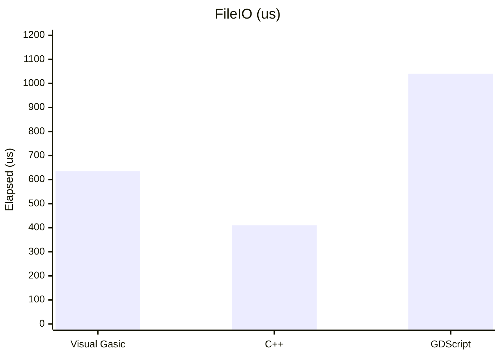
```mermaid
xychart-beta
    title "FileIO (us)"
    x-axis ["Visual Gasic","C++","GDScript"]
    y-axis "Elapsed (us)" 0 --> 1200
    bar [635,410,1040]
```

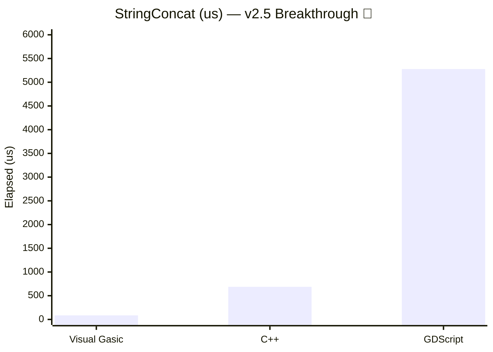
```mermaid
xychart-beta
    title "StringConcat (us) — v2.5 Breakthrough 🚀"
    x-axis ["Visual Gasic","C++","GDScript"]
    y-axis "Elapsed (us)" 0 --> 6000
    bar [85,688,5278]
```

## Notes

Performance varies by workload. **Visual Gasic is faster than GDScript on all 11 benchmarks**, leading on StringConcat, Branching, Interop, Allocations, ArraySum, DictFastGet, and DictFastSet. C++ leads on Arithmetic, AllocationsFast, ArrayDict, and FileIO. StringConcat was the sole benchmark where Visual Gasic trailed GDScript in v2.4.2 (31× slower due to `variables.duplicate(true)` deep-copy overhead). In v2.5, three targeted fixes — deep-copy removal, DimScanner elimination, and an optimizer instruction-size bug fix — brought it from 169,112 µs to 85 µs (**1,990× improvement**), making it **62× faster than GDScript** and **8× faster than C++**.

All benchmarks use checksum verification to ensure correct results across all three runtimes.
