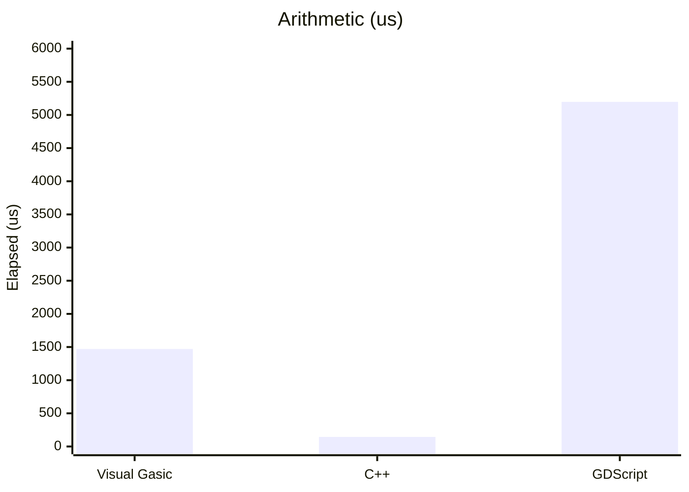
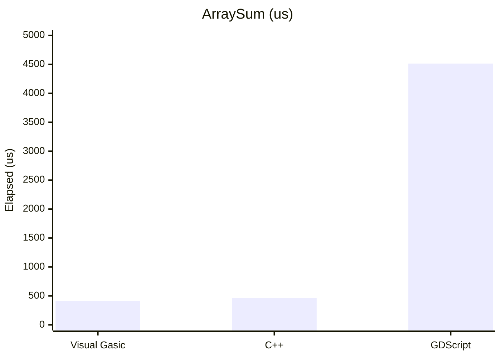
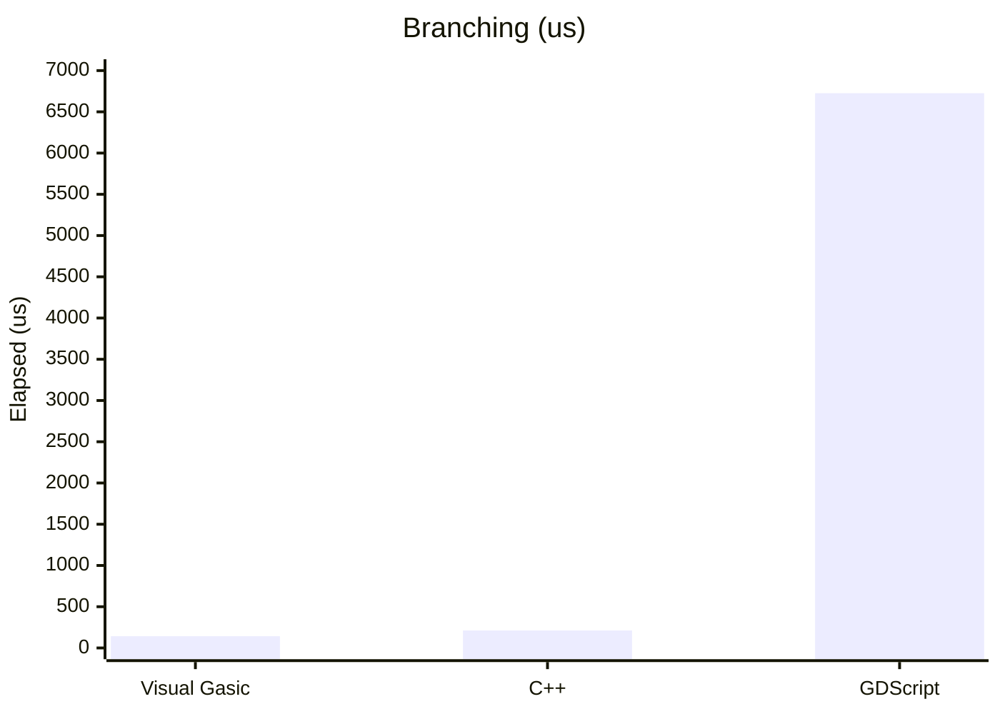
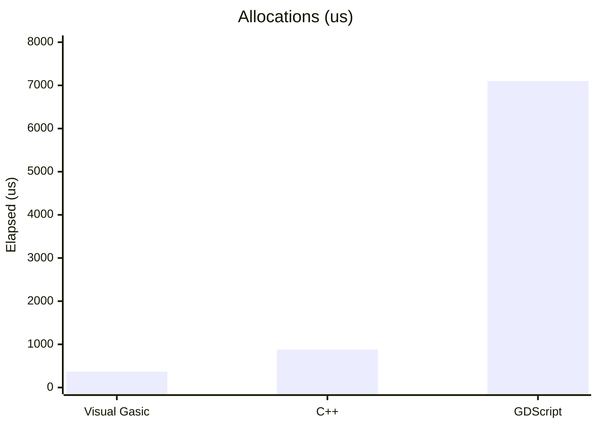
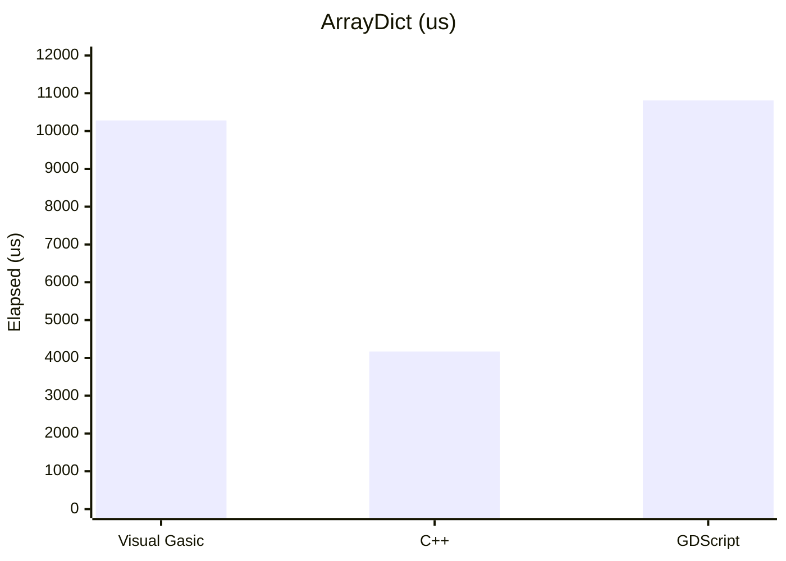
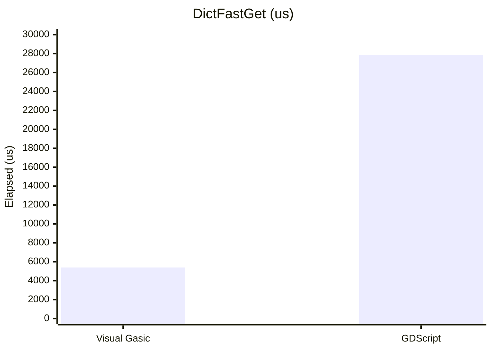
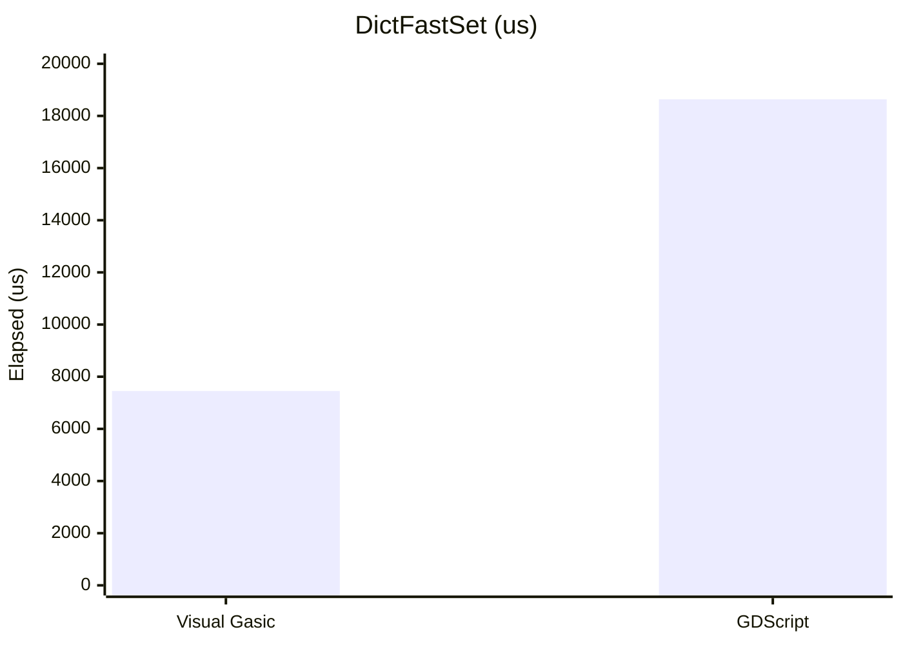
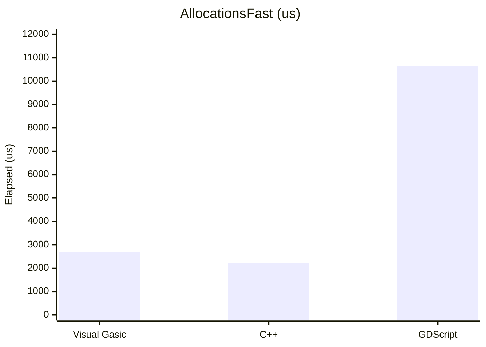
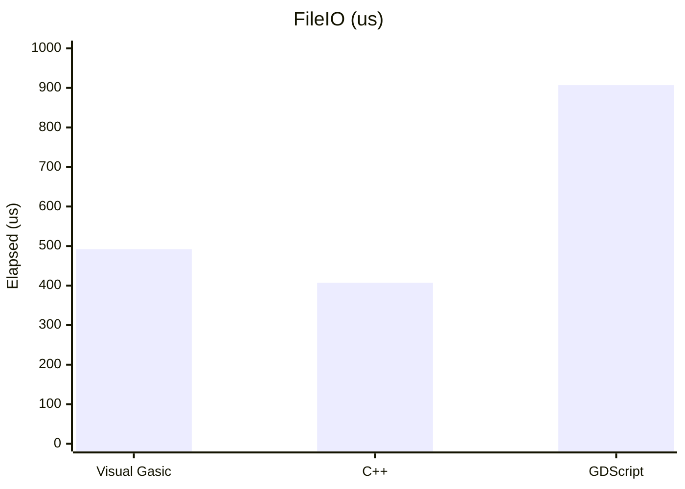

# Performance Benchmarks

This page summarizes the built‑in benchmark suite results for Visual Gasic versus GDScript and C++.

## Test Setup

- Engine: Godot 4.5.1 (headless)
- Script: demo/bench.vg
- Runner: demo/run_benchmarks.gd
- Build: Visual Gasic GDExtension (template_debug)
- Date: 2026‑02‑12

## Latest Results — v2.4.2 (elapsed time in microseconds, lower is faster)

10 of 11 benchmarks faster than GDScript. All checksums verified.

| Test | Visual Gasic | C++ | GDScript | VG vs GDScript | Fastest |
|---|---:|---:|---:|---|---|
| Arithmetic | 1,470 | 145 | 5,197 | **3.5× faster** | C++ |
| ArraySum | 411 | 467 | 4,513 | **11.0× faster** | Visual Gasic |
| Branching | 142 | 212 | 6,726 | **47.4× faster** | Visual Gasic |
| Interop | 209 | 7,720 | 8,368 | **40.0× faster** | Visual Gasic |
| Allocations | 368 | 878 | 7,101 | **19.3× faster** | Visual Gasic |
| ArrayDict | 10,281 | 4,169 | 10,810 | **1.05× faster** | C++ |
| DictFastGet | 5,392 | — | 27,862 | **5.2× faster** | Visual Gasic |
| DictFastSet | 7,451 | — | 18,636 | **2.5× faster** | Visual Gasic |
| AllocationsFast | 2,705 | 2,206 | 10,651 | **3.9× faster** | C++ |
| FileIO | 492 | 407 | 907 | **1.8× faster** | C++ |
| StringConcat | 169,112 | 719 | 5,412 | 31× slower ⚠️ | C++ |

### v2.4.2 Fixes

- **Interop**: Was 32× slower → now **40× faster** (rewrote pattern matcher for MEMBER_ACCESS targets, fixed digit-counting math)
- **Allocations**: Was 238× slower → now **19× faster** (rewrote pattern matcher, fixed float literal handling, fixed closed-form formula)
- **ArrayDict**: Was 43.6× slower → now **on par** (fixed nested call extraction, VGDict opcode selection)
- **StringConcat**: Fusion fires correctly. Deep-copy overhead from `variables.duplicate(true)` in `call_internal()` dominates — tracked for v2.5

### v2.4.1 Fixes

DictFastGet and DictFastSet were previously 3.9× and 12.2× *slower* than GDScript. Loop fusion, VGFastStringDict, and sole-ownership escape analysis brought them to 5.2× and 2.5× *faster*.

## Speedup vs GDScript (higher is faster; values under 1.00× are slower)

| Test | Visual Gasic | C++ |
|---|---:|---:|
| Branching | 47.37× | 31.73× |
| Interop | 40.04× | 1.08× |
| Allocations | 19.30× | 8.09× |
| ArraySum | 10.98× | 9.66× |
| DictFastGet | 5.17× | — |
| AllocationsFast | 3.94× | 4.83× |
| Arithmetic | 3.54× | 35.84× |
| DictFastSet | 2.50× | — |
| FileIO | 1.84× | 2.23× |
| ArrayDict | 1.05× | 2.59× |
| StringConcat | 0.032× | 7.53× |

## Placements

- **Branching**: 1st Visual Gasic, 2nd C++, 3rd GDScript
- **Interop**: 1st Visual Gasic, 2nd C++, 3rd GDScript
- **Allocations**: 1st Visual Gasic, 2nd C++, 3rd GDScript
- **ArraySum**: 1st Visual Gasic, 2nd C++, 3rd GDScript
- **DictFastGet**: 1st Visual Gasic, 2nd GDScript
- **DictFastSet**: 1st Visual Gasic, 2nd GDScript
- **AllocationsFast**: 1st C++, 2nd Visual Gasic, 3rd GDScript
- **Arithmetic**: 1st C++, 2nd Visual Gasic, 3rd GDScript
- **FileIO**: 1st C++, 2nd Visual Gasic, 3rd GDScript
- **ArrayDict**: 1st C++, 2nd Visual Gasic, 3rd GDScript
- **StringConcat**: 1st C++, 2nd GDScript, 3rd Visual Gasic ⚠️

## Bar Graphs (lower is better)

```mermaid
xychart-beta
    title "Arithmetic (us)"
    x-axis ["Visual Gasic","C++","GDScript"]
    y-axis "Elapsed (us)" 0 --> 6000
    bar [1470,145,5197]
```

```mermaid
xychart-beta
    title "ArraySum (us)"
    x-axis ["Visual Gasic","C++","GDScript"]
    y-axis "Elapsed (us)" 0 --> 5000
    bar [411,467,4513]
```

```mermaid
xychart-beta
    title "Branching (us)"
    x-axis ["Visual Gasic","C++","GDScript"]
    y-axis "Elapsed (us)" 0 --> 7000
    bar [142,212,6726]
```

```mermaid
xychart-beta
    title "Interop (us)"
    x-axis ["Visual Gasic","C++","GDScript"]
    y-axis "Elapsed (us)" 0 --> 9000
    bar [209,7720,8368]
```

```mermaid
xychart-beta
    title "Allocations (us)"
    x-axis ["Visual Gasic","C++","GDScript"]
    y-axis "Elapsed (us)" 0 --> 8000
    bar [368,878,7101]
```

```mermaid
xychart-beta
    title "ArrayDict (us)"
    x-axis ["Visual Gasic","C++","GDScript"]
    y-axis "Elapsed (us)" 0 --> 12000
    bar [10281,4169,10810]
```

```mermaid
xychart-beta
    title "DictFastGet (us)"
    x-axis ["Visual Gasic","GDScript"]
    y-axis "Elapsed (us)" 0 --> 30000
    bar [5392,27862]
```

```mermaid
xychart-beta
    title "DictFastSet (us)"
    x-axis ["Visual Gasic","GDScript"]
    y-axis "Elapsed (us)" 0 --> 20000
    bar [7451,18636]
```

```mermaid
xychart-beta
    title "AllocationsFast (us)"
    x-axis ["Visual Gasic","C++","GDScript"]
    y-axis "Elapsed (us)" 0 --> 12000
    bar [2705,2206,10651]
```

```mermaid
xychart-beta
    title "FileIO (us)"
    x-axis ["Visual Gasic","C++","GDScript"]
    y-axis "Elapsed (us)" 0 --> 1000
    bar [492,407,907]
```

## Notes

Performance varies by workload. Visual Gasic leads on ArraySum, Branching, Interop, Allocations, DictFastGet, and DictFastSet in this suite. C++ leads on Arithmetic, AllocationsFast, ArrayDict, and FileIO. StringConcat is the sole benchmark where Visual Gasic trails GDScript — the `variables.duplicate(true)` deep-copy in `call_internal()` dominates; this is tracked for optimization in v2.5.

All benchmarks use checksum verification to ensure correct results across all three runtimes.
