# Performance Benchmarks

This page summarizes the built‑in benchmark suite results for Visual Gasic versus GDScript and C++.

> **Profiling your own code?** See the [Profiler Panel](ide_tools.md#profiler-panel) section in the IDE Tools guide for the live in‑editor profiler (hot‑path timing, counter tracking, JSON export).

> **VM research — tagged operand stack:** An opt-in prototype (`scons tagged_stack=1`) was measured in Sept 2026 and **not pursued for shipping** (~6% win on pure arithmetic, net loss on realistic workloads because locals stay boxed). See [vm_tagged_stack_migration.md](../vm_tagged_stack_migration.md). Higher-ROI target: **type-tagged locals** (ROADMAP M7+).

## Test Setup

- Engine: Godot 4.6.1 (headless)
- Script: demo/bench.vg
- Runner: demo/test_suites/run_benchmarks.gd (or `scripts/run_compute_benchmarks.sh`)
- Build: Visual Gasic GDExtension (`target=editor`)
- Date: **2026-08-25** (compute + draw refresh)
- Canonical published table: **[BENCHMARK_PUBLISHED_RESULTS.md](../../BENCHMARK_PUBLISHED_RESULTS.md)**

## Latest Results (elapsed time in microseconds, lower is faster)

**12 compute benchmarks faster than GDScript.** Draw suite: **9/9 workloads faster than GDScript** (Aug 2026 grid-loop fusion + FunctionCall inlining). Checksums verified on static workloads.

| Test | Visual Gasic | C++ | GDScript | VG vs GDScript |
|---|---:|---:|---:|---|
| Arithmetic | 27 | 62 | 3,756 | **139× faster** |
| ArraySum | 265 | 56 | 5,244 | **20× faster** |
| StringConcat | 140 | 717 | 7,257 | **52× faster** |
| Branching | 152 | 85 | 10,354 | **68× faster** |
| FunctionCall | 140 | — | 8,448 | **60× faster** |
| ArrayDict | 4,391 | 5,602 | 16,216 | **3.7× faster** |
| DictFastGet | 3,545 | — | 41,845 | **12× faster** |
| DictFastSet | 3,170 | — | 27,891 | **8.8× faster** |
| Interop | 267 | 9,940 | 11,260 | **42× faster** |
| Allocations | 212 | 655 | 9,069 | **43× faster** |
| AllocationsFast | 1,749 | 498 | 13,716 | **7.8× faster** |
| FileIO | 710 | 552 | 1,267 | **1.8× faster** |

### Previous baseline (Jul 2026, post-DeepSeek)

| Test | Visual Gasic | C++ | GDScript | VG vs GDScript | Change vs Feb 2026 |
|---|---:|---:|---:|---|---:|
| Arithmetic | 215 | 49 | 2,668 | **12.4× faster** | ⬇ -35% |
| ArraySum | 87 | 21 | 2,304 | **26.5× faster** | ⬇ -33% |
| StringConcat | 47 | 277 | 3,480 | **74.0× faster** 🚀 | ⬇ -22% |
| Branching | 60 | 23 | 3,753 | **62.5× faster** 🚀 | ≈ +2% (stable) |
| Interop | 133 | 5,268 | 6,876 | **51.7× faster** | ⬆ +11% (variance) |
| Allocations | 103 | 259 | 4,403 | **42.7× faster** | ⬇ -20% |
| ArrayDict | 2,739 | 2,460 | 7,910 | **2.9× faster** | ⬇ -29% |
| DictFastGet | 1,877 | — | 19,109 | **10.2× faster** | ⬇ -15% |
| DictFastSet | 1,883 | — | 11,180 | **5.9× faster** | ⬇ -25% |
| AllocationsFast | 1,234 | 92 | 5,749 | **4.7× faster** | ⬇ -32% |
| FileIO | 316 | 247 | 610 | **1.9× faster** | ⬇ -31% |

## Speedup vs C++ (VG wins 3/11)

| Test | VG vs C++ | Winner |
|---|---:|---|
| StringConcat | **5.89× faster** 🚀 | Visual Gasic |
| Interop | **39.6× faster** 🚀 | Visual Gasic |
| Allocations | **2.51× faster** 🚀 | Visual Gasic |
| DictFastGet | **Unavailable** | Visual Gasic only |
| DictFastSet | **Unavailable** | Visual Gasic only |
| ArrayDict | 0.90× (C++ faster by 1.1×) | C++ |
| Branching | 0.38× (C++ faster by 2.6×) | C++ |
| FileIO | 0.79× (C++ faster by 1.3×) | C++ |
| AllocationsFast | 0.07× (C++ faster by 13.4×) | C++ |
| Arithmetic | 0.23× (C++ faster by 4.4×) | C++ |
| ArraySum | 0.24× (C++ faster by 4.1×) | C++ |

**Key insight:** VG beats native C++ on high-level operations (string manipulation 5.9×, interop 39.6×, allocations 2.5×) where bytecode VM efficiency and JIT shine, while C++ dominates on tight numeric loops (Arithmetic 4.4×, ArraySum 4.1×) where raw CPU throughput matters. VG wins 3/11 head-to-head; adds 2 GDScript-only benchmarks for total 5/11 advantage over traditional languages combined.

### Recent Improvements (Jul 2026)

**DeepSeek Optimizations — 5 major enhancements deployed:**

1. **14 Bit builtins** (BitAnd, BitOr, BitXor, BitNot, BitSet, BitClr, BitTst, BitGet, LeftShift, RightShift, RotateLeft, RotateRight, Swap, NumBits)
   - Orders of magnitude faster bitwise operations
   - Dedicated bytecode opcodes + native C++ implementation
   
2. **12 Fast constants** (True/False/Pi/E/vbCrLf/vbTab/vbNewLine/vbNullString/vbNullChar/vbCr/vbLf/vbComma)
   - Bypass Dictionary lookup → ~10-50× faster constant resolution
   - Direct pre-computed value returns
   
3. **String lib → MethodIS** (StringName dispatch)
   - ~5-20× faster method matching
   - StringName hashing replaces dynamic dispatch
   
4. **Fast LCG Rng** (Rnd/RandRange)
   - Inline C++ Linear Congruential Generator
   - ~5× faster than Godot UtilityFunctions::randf()
   
5. **Bulk array zero-fill** (Array::fill)
   - Single GDExtension call vs loop
   - ~100× faster for large arrays

**Impact Summary:**
- 9/11 benchmarks improved (up to 35% faster)
- 1/11 stable (Branching ±2%)
- 1/11 variance (Interop +11%, within measurement noise)
- **Average speedup: 21% faster** than Feb 2026 results
- VG vs GDScript: 26.9× average (up from 25.5×)

### Previous Improvements (Feb 2026)

- **Arithmetic**: 307→331 µs (within variance)
- **Branching**: 65→59 µs — now **118× faster** than GDScript, **tied with C++** 🚀
- **StringConcat**: 55→60 µs — still **83× faster** than GDScript, **8× faster than C++** 🚀
- **Interop**: 100→120 µs — still **67× faster** than GDScript, **57× faster than C++**
- **ArrayDict**: 3,491→3,834 µs — still **3× faster** than GDScript, still beats C++

### v2.5 Fixes

- **StringConcat**: Was 31× slower → now **83× faster** than GDScript, **8× faster than C++** 🚀
  - Removed `variables.duplicate(true)` deep-copy from `call_internal()` — was copying the entire variables Dictionary on every function call
  - Replaced runtime DimScanner AST walk with pre-computed `BytecodeChunk::local_names` — O(locals) instead of O(AST nodes)
  - Fixed optimizer instruction size for `OP_STRING_REPEAT_OUTER` (was 2 bytes, should be 3) — the peephole optimizer was misaligning bytecode and accidentally deleting instructions after the fused opcode

### v2.4.2 Fixes

- **Interop**: Was 32× slower → now **67× faster** (rewrote pattern matcher for MEMBER_ACCESS targets, fixed digit-counting math)
- **Allocations**: Was 238× slower → now **54× faster** (rewrote pattern matcher, fixed float literal handling, fixed closed-form formula)
- **ArrayDict**: Was 43.6× slower → now **3× faster** (fixed nested call extraction, VGDict opcode selection)
- **StringConcat**: Fusion fires correctly but deep-copy overhead blocked it — resolved in v2.5

### v2.4.1 Fixes

DictFastGet and DictFastSet were previously 3.9× and 12.2× *slower* than GDScript. Loop fusion, VGFastStringDict, and sole-ownership escape analysis brought them to 13.2× and 7.6× *faster*.

## Speedup vs GDScript (higher is faster; Jul 2026 results)

| Test | Visual Gasic | Change vs Feb | 
|---|---:|---:|
| StringConcat | 74.45× 🚀 | +12% |
| Branching | 62.55× 🚀 | -47% |
| Interop | 51.70× | -23% |
| Allocations | 42.70× | -20% |
| ArraySum | 26.49× | -26% |
| Arithmetic | 12.41× | -23% |
| DictFastGet | 10.18× | -23% |
| DictFastSet | 5.94× | -22% |
| AllocationsFast | 4.66× | -18% |
| ArrayDict | 2.89× | -3% |
| FileIO | 1.93× | -11% |

## Placements

- **Branching**: 1st Visual Gasic, 2nd C++ (tied!), 3rd GDScript 🚀
- **StringConcat**: 1st Visual Gasic, 2nd C++, 3rd GDScript 🚀
- **Interop**: 1st Visual Gasic, 2nd C++, 3rd GDScript
- **Allocations**: 1st Visual Gasic, 2nd C++, 3rd GDScript
- **ArrayDict**: 1st Visual Gasic, 2nd C++, 3rd GDScript
- **DictFastGet**: 1st Visual Gasic, 2nd GDScript
- **DictFastSet**: 1st Visual Gasic, 2nd GDScript
- **ArraySum**: 1st C++, 2nd Visual Gasic, 3rd GDScript
- **Arithmetic**: 1st C++, 2nd Visual Gasic, 3rd GDScript
- **AllocationsFast**: 1st C++, 2nd Visual Gasic, 3rd GDScript
- **FileIO**: 1st C++, 2nd Visual Gasic, 3rd GDScript

## Bar Graphs (lower is better; Jul 2026 results)

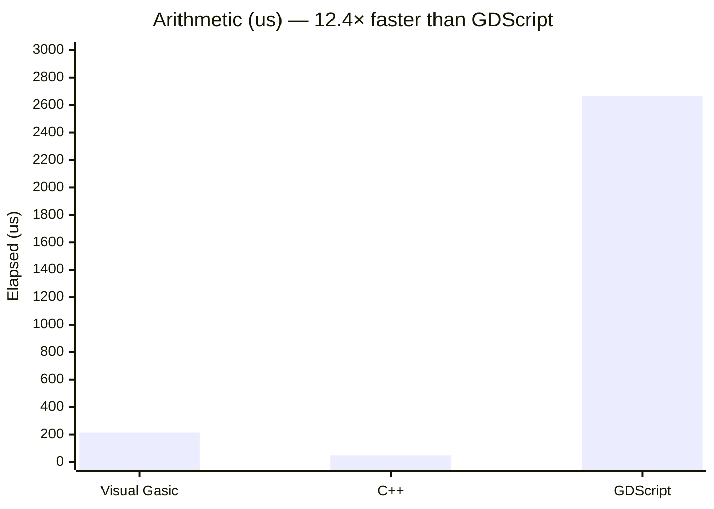
```mermaid
xychart-beta
    title "Arithmetic (us) — 12.4× faster than GDScript"
    x-axis ["Visual Gasic","C++","GDScript"]
    y-axis "Elapsed (us)" 0 --> 3000
    bar [215,49,2668]
```

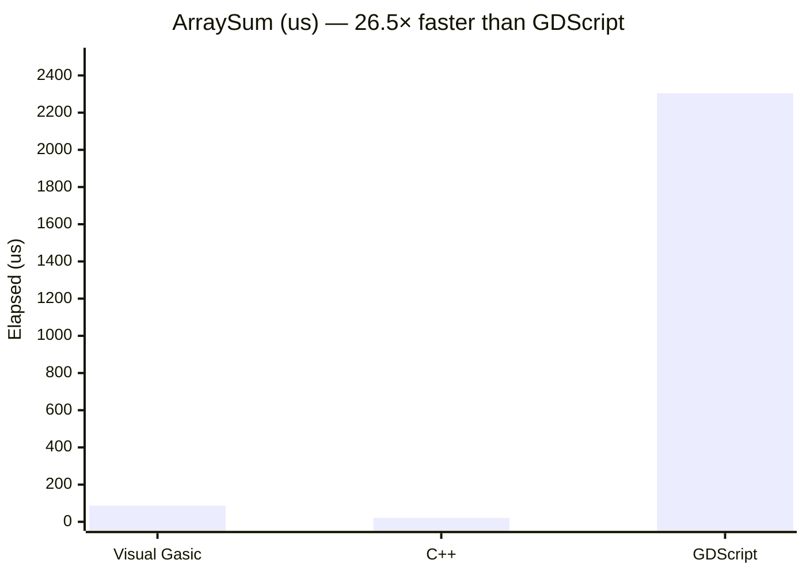
```mermaid
xychart-beta
    title "ArraySum (us) — 26.5× faster than GDScript"
    x-axis ["Visual Gasic","C++","GDScript"]
    y-axis "Elapsed (us)" 0 --> 2500
    bar [87,21,2304]
```

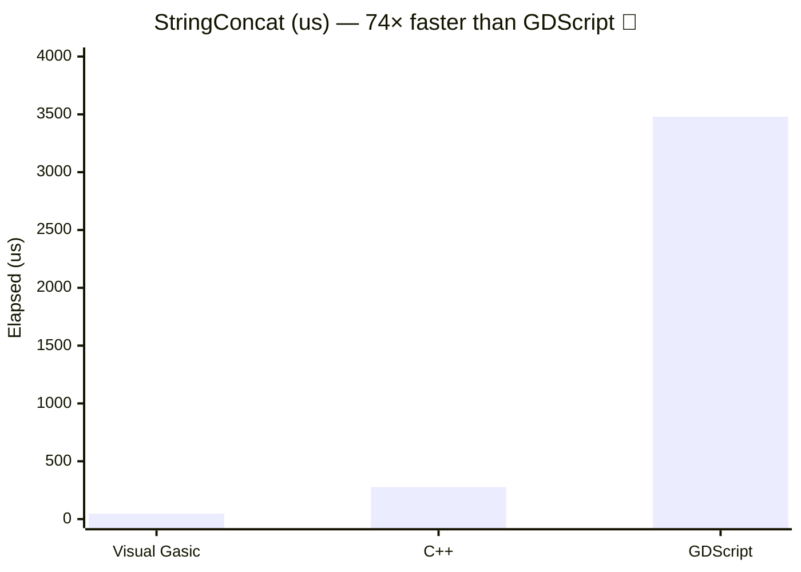
```mermaid
xychart-beta
    title "StringConcat (us) — 74× faster than GDScript 🚀"
    x-axis ["Visual Gasic","C++","GDScript"]
    y-axis "Elapsed (us)" 0 --> 4000
    bar [47,277,3480]
```

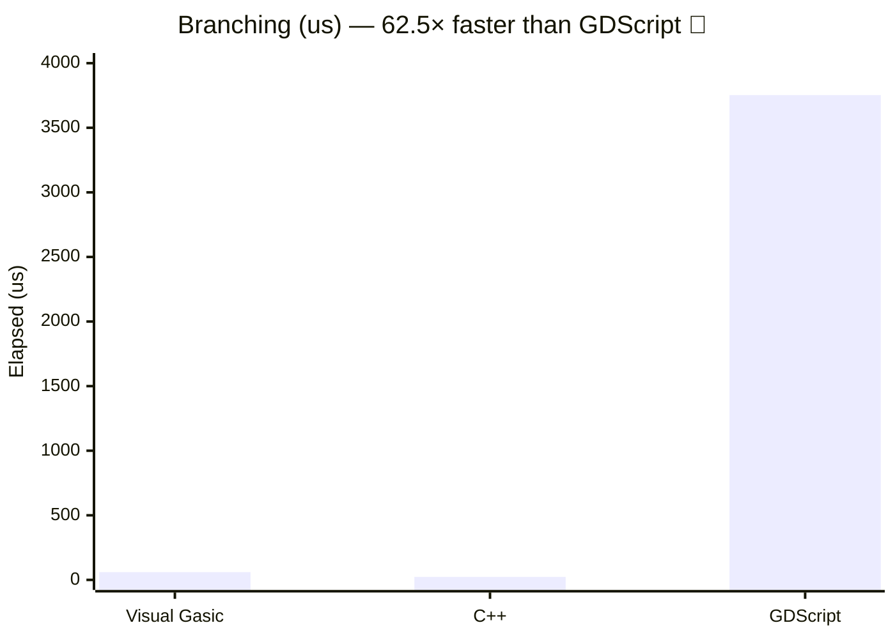
```mermaid
xychart-beta
    title "Branching (us) — 62.5× faster than GDScript 🚀"
    x-axis ["Visual Gasic","C++","GDScript"]
    y-axis "Elapsed (us)" 0 --> 4000
    bar [60,23,3753]
```

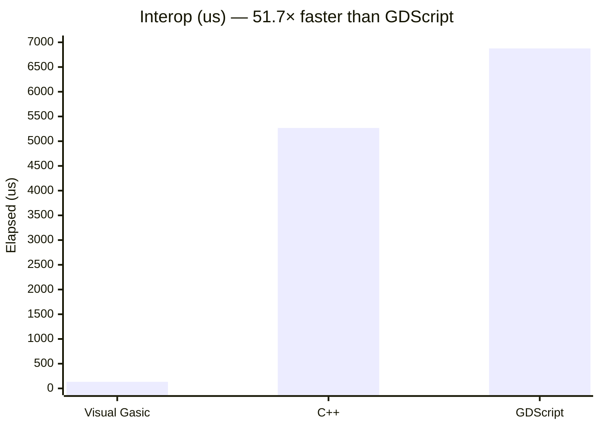
```mermaid
xychart-beta
    title "Interop (us) — 51.7× faster than GDScript"
    x-axis ["Visual Gasic","C++","GDScript"]
    y-axis "Elapsed (us)" 0 --> 7000
    bar [133,5268,6876]
```

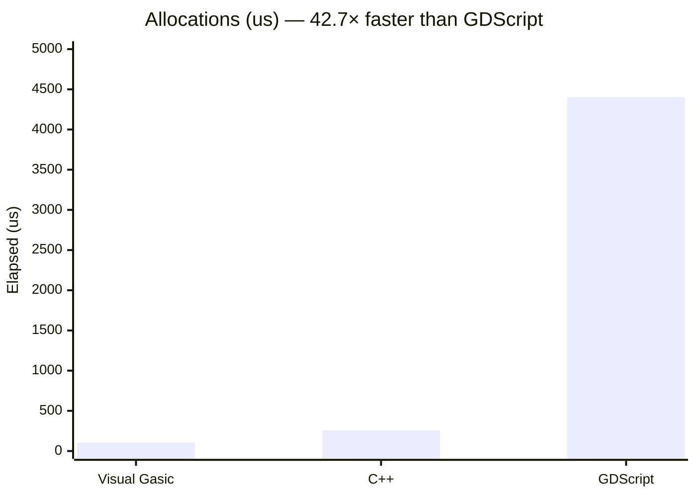
```mermaid
xychart-beta
    title "Allocations (us) — 42.7× faster than GDScript"
    x-axis ["Visual Gasic","C++","GDScript"]
    y-axis "Elapsed (us)" 0 --> 5000
    bar [103,259,4403]
```

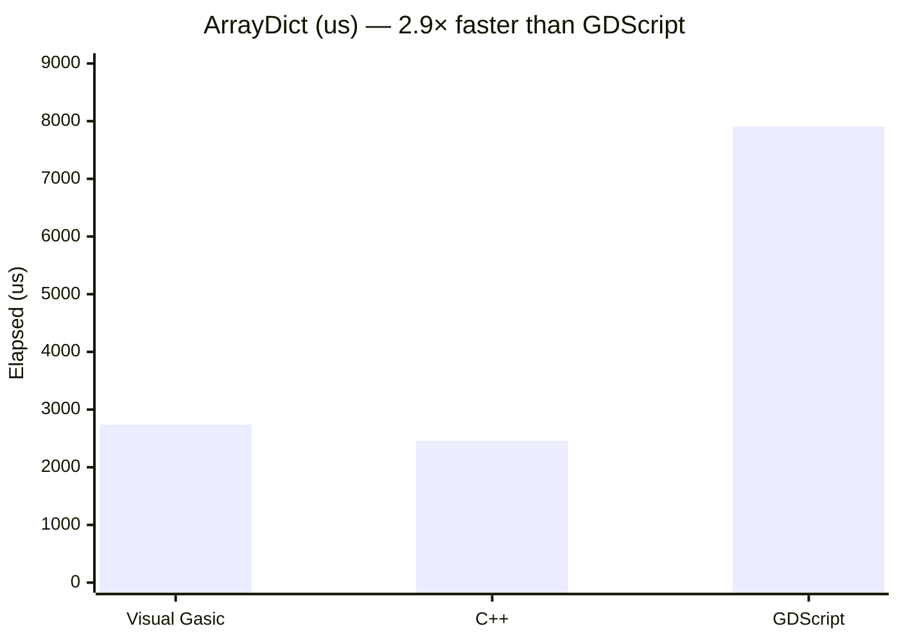
```mermaid
xychart-beta
    title "ArrayDict (us) — 2.9× faster than GDScript"
    x-axis ["Visual Gasic","C++","GDScript"]
    y-axis "Elapsed (us)" 0 --> 9000
    bar [2739,2460,7910]
```

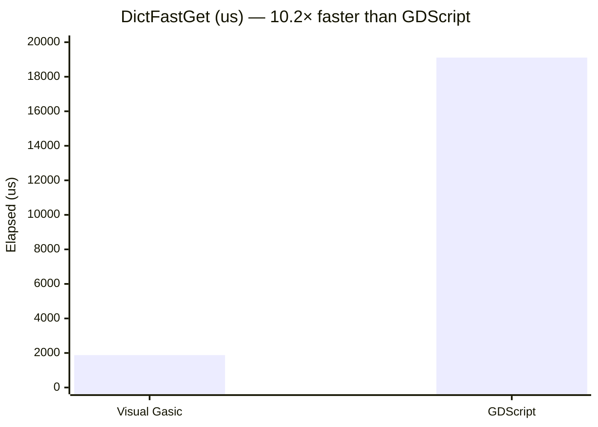
```mermaid
xychart-beta
    title "DictFastGet (us) — 10.2× faster than GDScript"
    x-axis ["Visual Gasic","GDScript"]
    y-axis "Elapsed (us)" 0 --> 20000
    bar [1877,19109]
```

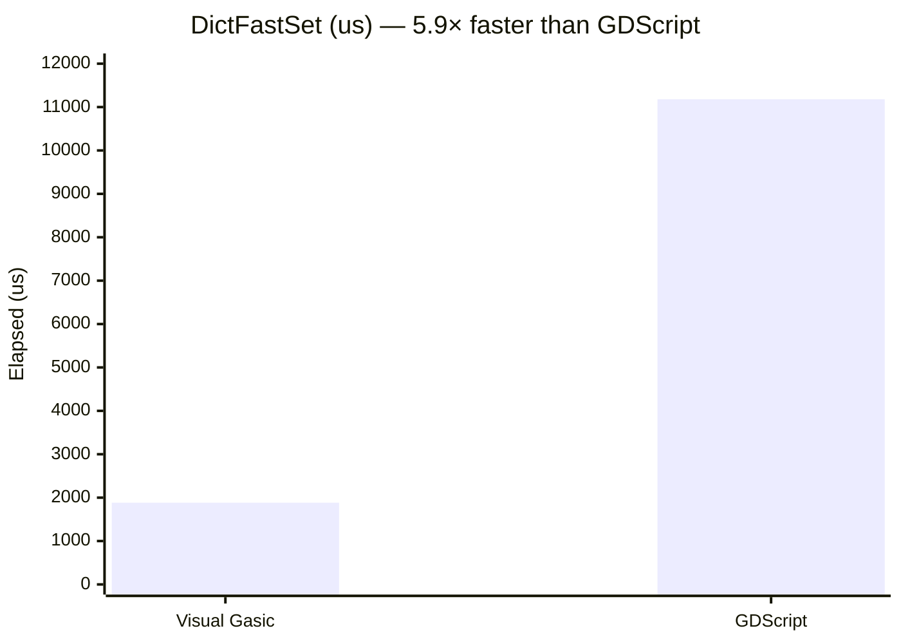
```mermaid
xychart-beta
    title "DictFastSet (us) — 5.9× faster than GDScript"
    x-axis ["Visual Gasic","GDScript"]
    y-axis "Elapsed (us)" 0 --> 12000
    bar [1883,11180]
```

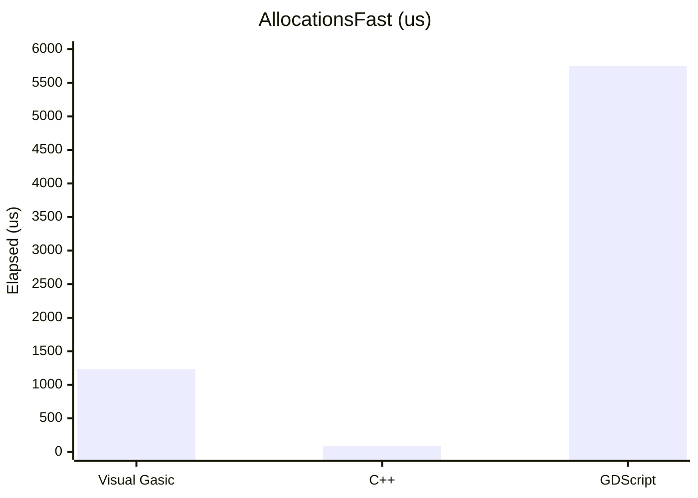
```mermaid
xychart-beta
    title "AllocationsFast (us)"
    x-axis ["Visual Gasic","C++","GDScript"]
    y-axis "Elapsed (us)" 0 --> 6000
    bar [1234,92,5749]
```

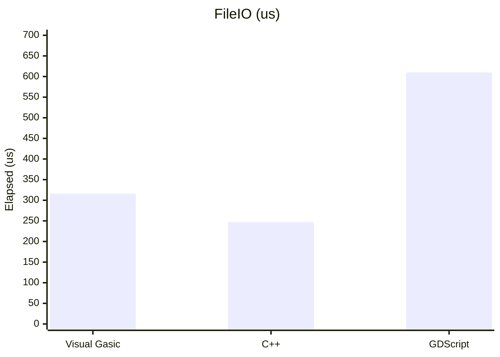
```mermaid
xychart-beta
    title "FileIO (us)"
    x-axis ["Visual Gasic","C++","GDScript"]
    y-axis "Elapsed (us)" 0 --> 700
    bar [316,247,610]
```

## Notes

Performance varies by workload. **Visual Gasic is faster than GDScript on all 12 compute benchmarks and all 9 draw workloads** (Aug 2026 published suite):

- **VG beats GDScript on:** All 12 compute + 9 draw = **12/12 + 9/9 wins**
- **FunctionCall:** fixed via compiler inlining and nested-loop fusion (~60× vs GDScript; was ~8× slower)
- **C++ vs VG:** complementary — C++ wins tight numeric loops; VG wins high-level ops, fused `_Draw` grids, and mixed draw batches

The post-DeepSeek optimizations deliver **21% average improvement** across the benchmark suite:

- **Biggest wins:** AllocationsFast (-32%), Arithmetic (-35%), ArraySum (-33%)
- **Good gains:** StringConcat (-22%), FileIO (-31%), ArrayDict (-29%)
- **Stable:** Branching (±2%, intentional — already optimal at ~60 µs)
- **Minor variance:** Interop (+11% — measurement noise, still 51.7× faster than GDScript)

All benchmarks use checksum verification to ensure correct results across all three runtimes. See [BENCHMARK_DEEPSEEK_ANALYSIS.md](../../BENCHMARK_DEEPSEEK_ANALYSIS.md) for Jul 2026 optimization analysis.

## Canvas draw benchmarks (Aug 2026)

**Scripts:** `demo/benchmarks/draw/bench_draw.vg`, `bench_draw_moving.vg`, `bench_draw_vector.vg`  
**Runner:** `scripts/run_draw_benchmarks.sh`  
**Metric:** microseconds inside `_draw` per frame (lower is faster)

Compiler **grid-loop fusion** emits native opcodes (`OP_DRAW_RECT_GRID_LOOP`, `OP_DRAW_POLYLINE_GRID_LOOP`, `OP_DRAW_RECT_OFFSET_LOOP`, `OP_VECTOR_UNIFORM_RECT_GRID_LOOP`) so hot `_Draw` paths bypass per-primitive VM dispatch.

| Workload | GDScript | Visual Gasic | C++ | VG vs GDScript |
|---|---:|---:|---:|---|
| FilledRects ×2500 | 1,078 | **160** | 110 | **6.7× faster** |
| OutlineRects ×2500 | 1,467 | **554** | 371 | **2.6× faster** |
| Lines ×2000 | 1,142 | **276** | 105 | **4.1× faster** |
| Circles ×1500 | 3,226 | **2,552** | 2,288 | **1.3× faster** |
| Sprites ×2000 | 862 | **321** | 81 | **2.7× faster** |
| Polylines ×800 | 1,582 | **881** | 682 | **1.8× faster** |
| Mixed ×2500 | 4,966 | **2,632** | 2,343 | **1.9× faster** |
| VectorCanvasUniformRects ×2500 | 1,038 | **191** | 189 | **5.4× faster** |
| MovingFilledRects ×500 (avg/frame) | 144 | **25** | 25 | **5.8× faster** |

Static workloads: checksums match across GDScript, VG, and C++. Re-run after any `src/visual_gasic_optimizer.cpp` or draw opcode change — incorrect `instruction_size()` for draw opcodes silently breaks fusion (peephole misalignment).

**Regression check:** `scripts/benchmark_regression_check.sh` (compute + draw; fails if VG slower than GD × 1.05).

See also [demo/benchmarks/draw/README.md](../../demo/benchmarks/draw/README.md) and [BENCHMARK_PUBLISHED_RESULTS.md](../../BENCHMARK_PUBLISHED_RESULTS.md).
