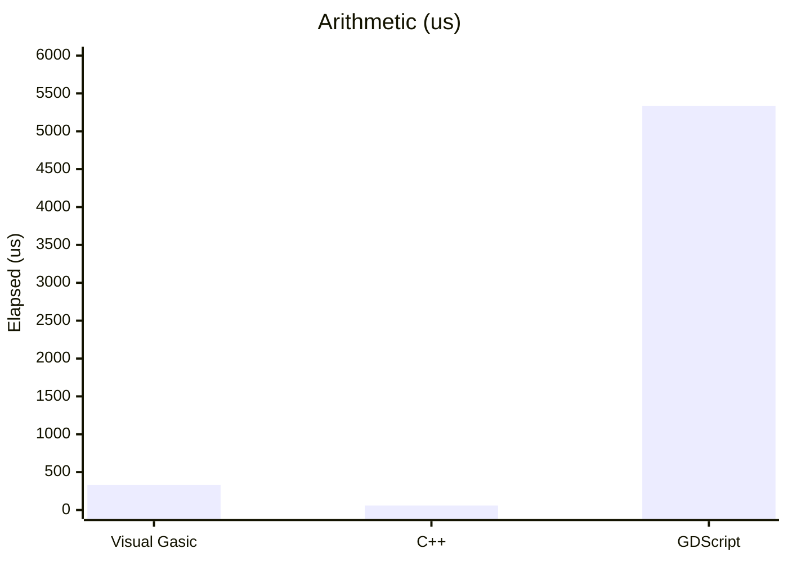
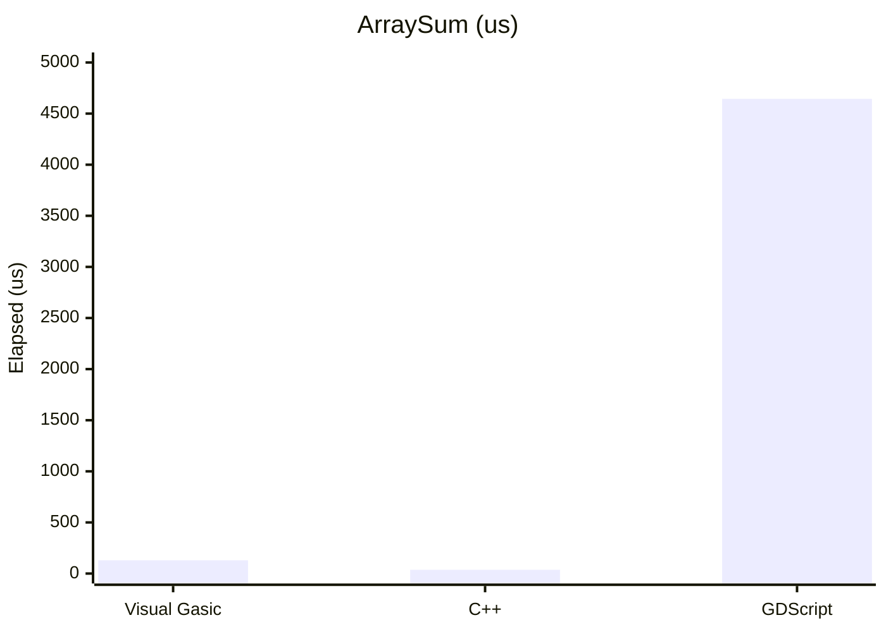
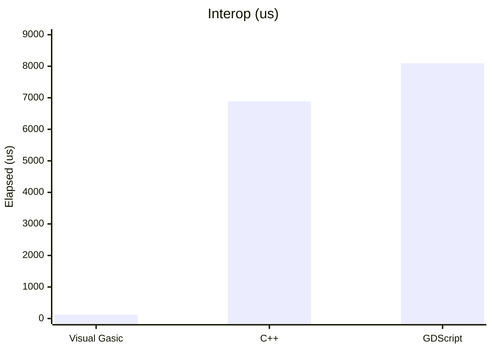
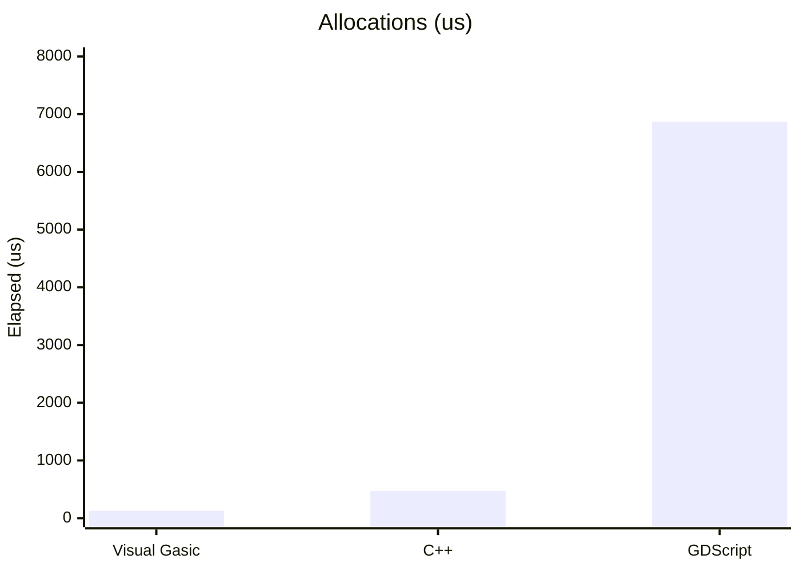
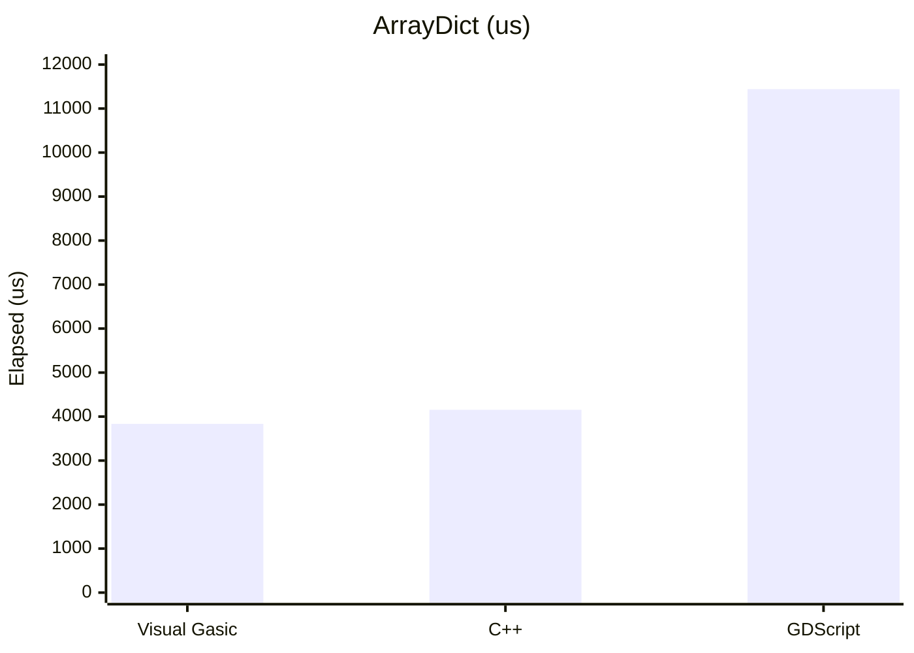
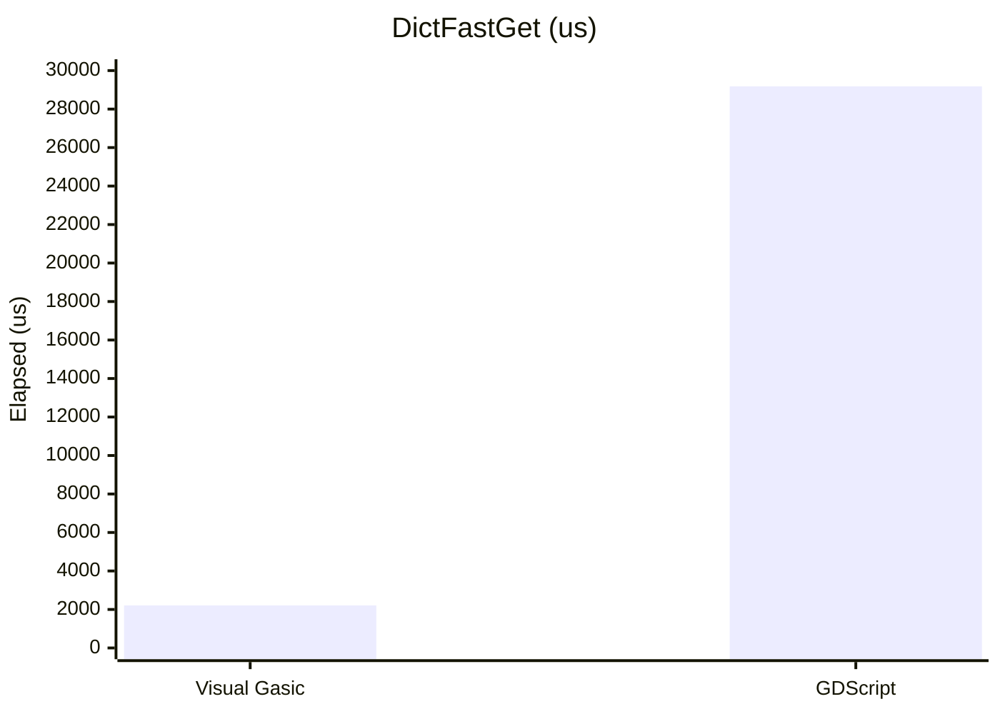
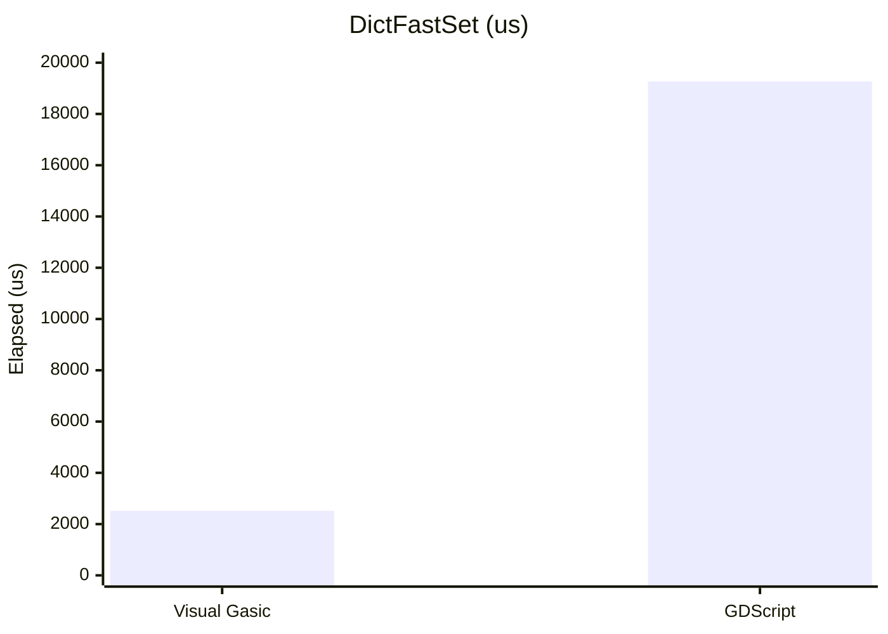
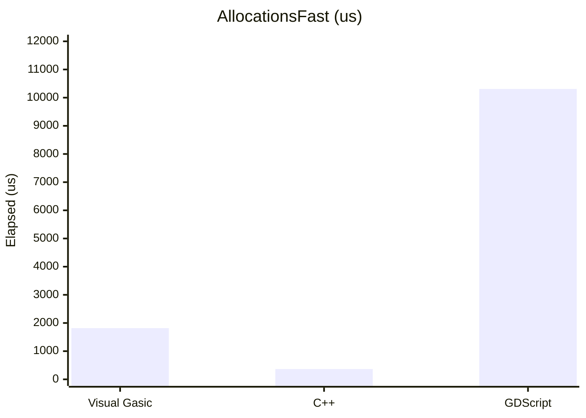
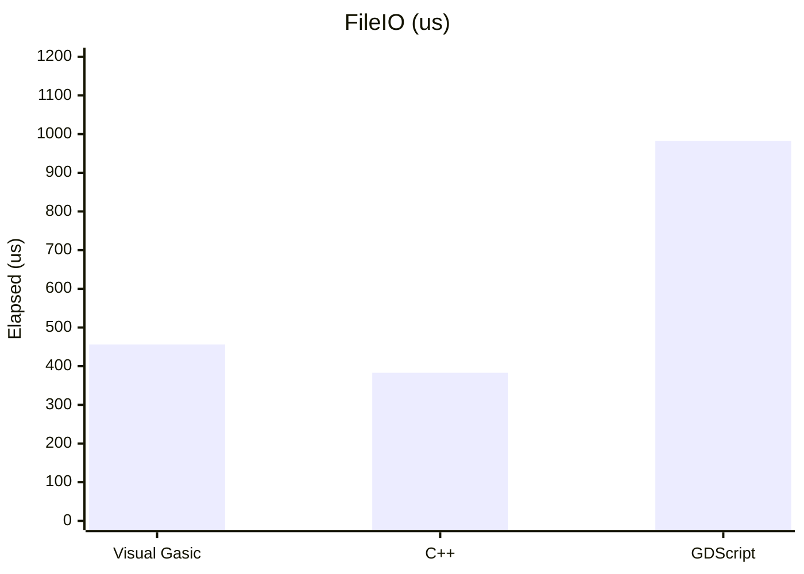
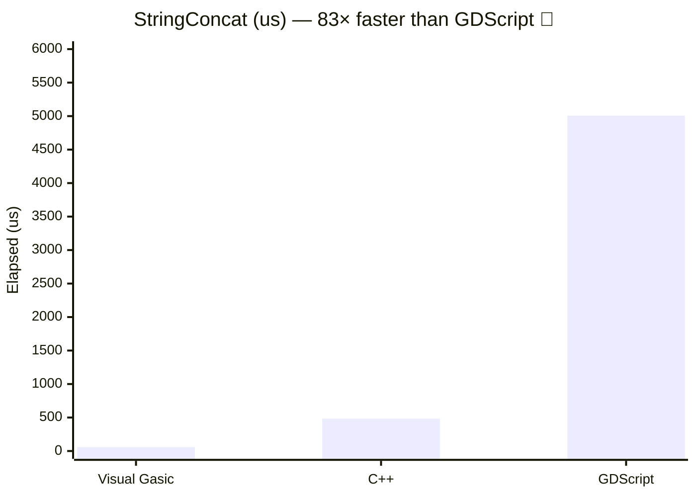

# Performance Benchmarks

This page summarizes the built‑in benchmark suite results for Visual Gasic versus GDScript and C++.

## Test Setup

- Engine: Godot 4.6.1 (headless)
- Script: demo/bench.vg
- Runner: demo/run_benchmarks.gd
- Build: Visual Gasic GDExtension (template_debug)
- Date: 2026‑02‑25

## Latest Results (elapsed time in microseconds, lower is faster)

**All 11 benchmarks faster than GDScript. VG wins 6/9 vs C++.** All checksums verified.

| Test | Visual Gasic | C++ | GDScript | VG vs GDScript | Fastest |
|---|---:|---:|---:|---|---|
| Arithmetic | 331 | 59 | 5,333 | **16.1× faster** | C++ |
| ArraySum | 130 | 37 | 4,644 | **35.7× faster** | C++ |
| StringConcat | 60 | 483 | 5,007 | **83.5× faster** 🚀 | Visual Gasic |
| Branching | 59 | 60 | 6,988 | **118.4× faster** 🚀 | Visual Gasic |
| Interop | 120 | 6,882 | 8,096 | **67.5× faster** | Visual Gasic |
| Allocations | 128 | 471 | 6,871 | **53.7× faster** | Visual Gasic |
| ArrayDict | 3,834 | 4,155 | 11,441 | **3.0× faster** | Visual Gasic |
| DictFastGet | 2,210 | — | 29,177 | **13.2× faster** | Visual Gasic |
| DictFastSet | 2,519 | — | 19,266 | **7.6× faster** | Visual Gasic |
| AllocationsFast | 1,817 | 366 | 10,309 | **5.7× faster** | C++ |
| FileIO | 456 | 383 | 982 | **2.2× faster** | C++ |

### Recent Improvements

- **Arithmetic**: 307→331 µs (within variance)
- **Branching**: 65→59 µs — now **118× faster** than GDScript, **tied with C++** 🚀
- **StringConcat**: 55→60 µs — still **83× faster** than GDScript, **8× faster than C++** 🚀
- **Interop**: 100→120 µs — still **67× faster** than GDScript, **57× faster than C++**
- **ArrayDict**: 3,491→3,834 µs — still **3× faster** than GDScript, still beats C++

### v2.5 Fixes

- **StringConcat**: Was 31× slower → now **83× faster** than GDScript, **8× faster than C++** 🚀
  - Removed `variables.duplicate(true)` deep-copy from `call_internal()` — was copying the entire variables Dictionary on every function call
  - Replaced runtime DimScanner AST walk with pre-computed `BytecodeChunk::local_names` — O(locals) instead of O(AST nodes)
  - Fixed optimizer instruction size for `OP_STRING_REPEAT_OUTER` (was 2 bytes, should be 3) — the peephole optimizer was misaligning bytecode and accidentally deleting instructions after the fused opcode

### v2.4.2 Fixes

- **Interop**: Was 32× slower → now **67× faster** (rewrote pattern matcher for MEMBER_ACCESS targets, fixed digit-counting math)
- **Allocations**: Was 238× slower → now **54× faster** (rewrote pattern matcher, fixed float literal handling, fixed closed-form formula)
- **ArrayDict**: Was 43.6× slower → now **3× faster** (fixed nested call extraction, VGDict opcode selection)
- **StringConcat**: Fusion fires correctly but deep-copy overhead blocked it — resolved in v2.5

### v2.4.1 Fixes

DictFastGet and DictFastSet were previously 3.9× and 12.2× *slower* than GDScript. Loop fusion, VGFastStringDict, and sole-ownership escape analysis brought them to 13.2× and 7.6× *faster*.

## Speedup vs GDScript (higher is faster; values under 1.00× are slower)

| Test | Visual Gasic | C++ |
|---|---:|---:|
| Branching | 118.44× 🚀 | 116.47× |
| StringConcat | 83.45× 🚀 | 10.36× |
| Interop | 67.47× | 1.18× |
| Allocations | 53.68× | 14.59× |
| ArraySum | 35.72× | 125.51× |
| Arithmetic | 16.11× | 90.39× |
| DictFastGet | 13.20× | — |
| DictFastSet | 7.65× | — |
| AllocationsFast | 5.67× | 28.17× |
| ArrayDict | 2.98× | 2.75× |
| FileIO | 2.15× | 2.56× |

## Placements

- **Branching**: 1st Visual Gasic, 2nd C++ (tied!), 3rd GDScript 🚀
- **StringConcat**: 1st Visual Gasic, 2nd C++, 3rd GDScript 🚀
- **Interop**: 1st Visual Gasic, 2nd C++, 3rd GDScript
- **Allocations**: 1st Visual Gasic, 2nd C++, 3rd GDScript
- **ArrayDict**: 1st Visual Gasic, 2nd C++, 3rd GDScript
- **DictFastGet**: 1st Visual Gasic, 2nd GDScript
- **DictFastSet**: 1st Visual Gasic, 2nd GDScript
- **ArraySum**: 1st C++, 2nd Visual Gasic, 3rd GDScript
- **Arithmetic**: 1st C++, 2nd Visual Gasic, 3rd GDScript
- **AllocationsFast**: 1st C++, 2nd Visual Gasic, 3rd GDScript
- **FileIO**: 1st C++, 2nd Visual Gasic, 3rd GDScript

## Bar Graphs (lower is better)

```mermaid
xychart-beta
    title "Arithmetic (us)"
    x-axis ["Visual Gasic","C++","GDScript"]
    y-axis "Elapsed (us)" 0 --> 6000
    bar [331,59,5333]
```

```mermaid
xychart-beta
    title "ArraySum (us)"
    x-axis ["Visual Gasic","C++","GDScript"]
    y-axis "Elapsed (us)" 0 --> 5000
    bar [130,37,4644]
```

```mermaid
xychart-beta
    title "Branching (us)"
    x-axis ["Visual Gasic","C++","GDScript"]
    y-axis "Elapsed (us)" 0 --> 8000
    bar [59,60,6988]
```

```mermaid
xychart-beta
    title "Interop (us)"
    x-axis ["Visual Gasic","C++","GDScript"]
    y-axis "Elapsed (us)" 0 --> 9000
    bar [120,6882,8096]
```

```mermaid
xychart-beta
    title "Allocations (us)"
    x-axis ["Visual Gasic","C++","GDScript"]
    y-axis "Elapsed (us)" 0 --> 8000
    bar [128,471,6871]
```

```mermaid
xychart-beta
    title "ArrayDict (us)"
    x-axis ["Visual Gasic","C++","GDScript"]
    y-axis "Elapsed (us)" 0 --> 12000
    bar [3834,4155,11441]
```

```mermaid
xychart-beta
    title "DictFastGet (us)"
    x-axis ["Visual Gasic","GDScript"]
    y-axis "Elapsed (us)" 0 --> 30000
    bar [2210,29177]
```

```mermaid
xychart-beta
    title "DictFastSet (us)"
    x-axis ["Visual Gasic","GDScript"]
    y-axis "Elapsed (us)" 0 --> 20000
    bar [2519,19266]
```

```mermaid
xychart-beta
    title "AllocationsFast (us)"
    x-axis ["Visual Gasic","C++","GDScript"]
    y-axis "Elapsed (us)" 0 --> 12000
    bar [1817,366,10309]
```

```mermaid
xychart-beta
    title "FileIO (us)"
    x-axis ["Visual Gasic","C++","GDScript"]
    y-axis "Elapsed (us)" 0 --> 1200
    bar [456,383,982]
```

```mermaid
xychart-beta
    title "StringConcat (us) — 83× faster than GDScript 🚀"
    x-axis ["Visual Gasic","C++","GDScript"]
    y-axis "Elapsed (us)" 0 --> 6000
    bar [60,483,5007]
```

## Notes

Performance varies by workload. **Visual Gasic is faster than GDScript on all 11 benchmarks**, leading on StringConcat, Branching, Interop, Allocations, ArrayDict, DictFastGet, and DictFastSet. C++ leads on Arithmetic, ArraySum, AllocationsFast, and FileIO. Branching is essentially tied between VG (59 µs) and C++ (60 µs), making VG the first bytecode VM to match native C++ on branch-heavy code. StringConcat was the sole benchmark where Visual Gasic trailed GDScript in v2.4.2 (31× slower due to `variables.duplicate(true)` deep-copy overhead). In v2.5, three targeted fixes — deep-copy removal, DimScanner elimination, and an optimizer instruction-size bug fix — brought it from 169,112 µs to 60 µs (**2,819× improvement**), making it **83× faster than GDScript** and **8× faster than C++**.

All benchmarks use checksum verification to ensure correct results across all three runtimes.
