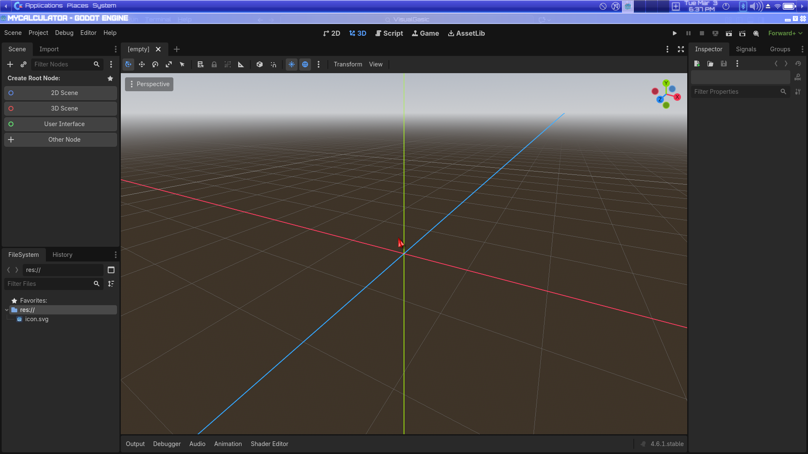
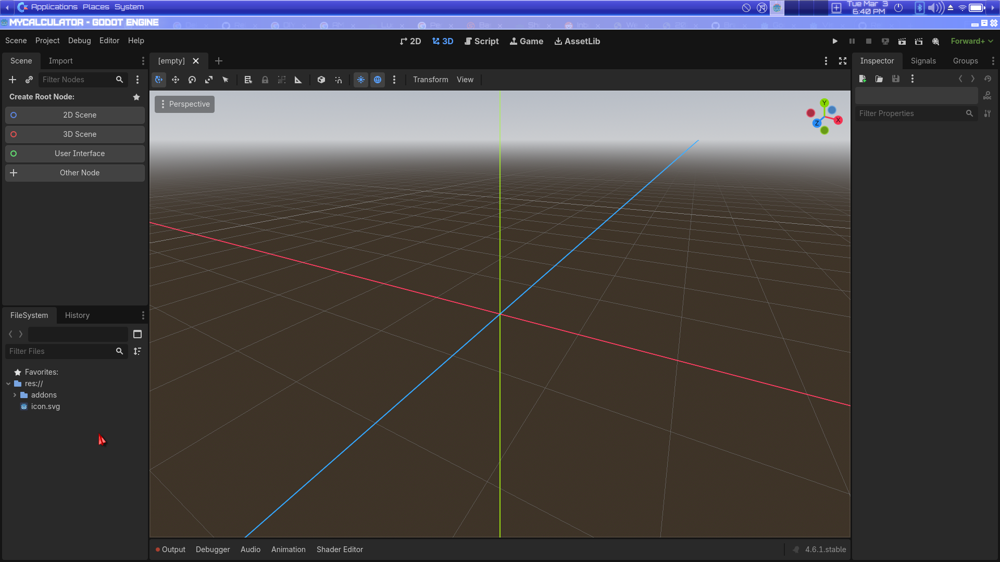
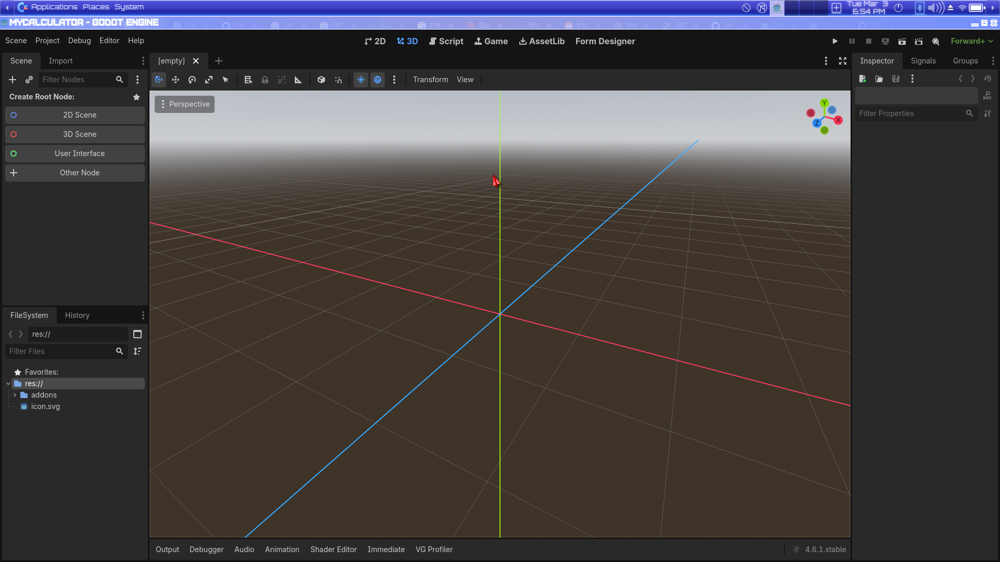
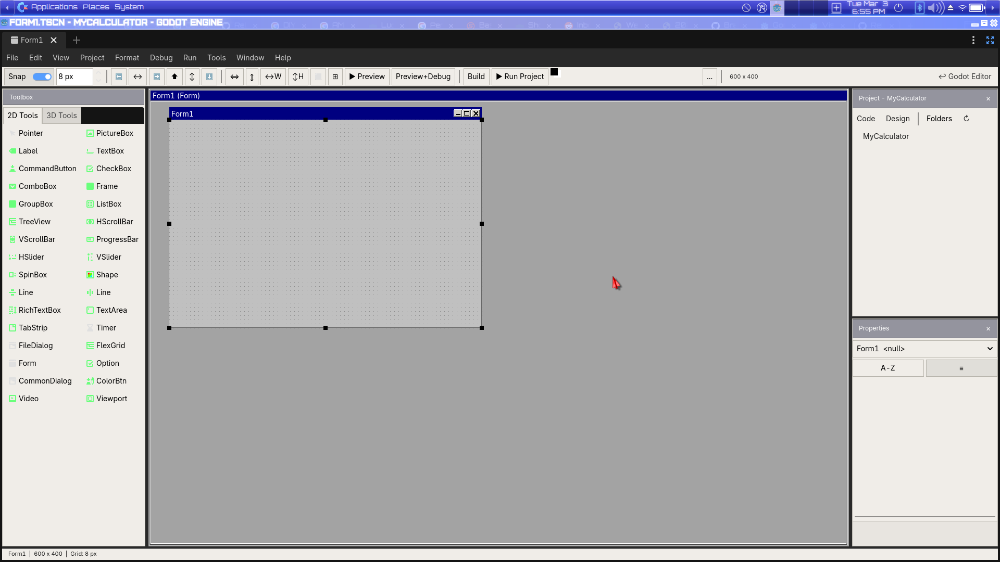
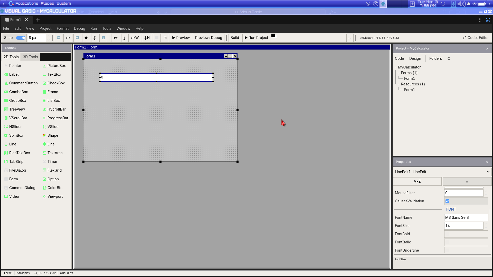

# Build a Calculator with the Visual Gasic IDE

*A step-by-step beginner tutorial — from empty project to working app.*

---

## What You'll Build

A simple four-function calculator with a display and digit/operator buttons — designed entirely with the Visual Gasic IDE, exactly like you'd build one in VB6.

**Time:** ~20 minutes

**Prerequisites:** Godot 4.5+ installed, VisualGasic release ZIP downloaded.


<!-- TODO: Capture screenshot of the running calculator showing "42" — reuse for hero and Step 8 -->

---

## Step 1 — Create a New Godot Project

1. Launch **Godot 4.5+** (4.6.1 recommended).
2. In the **Project Manager**, click **New Project**.
3. Set the project name to `MyCalculator`.
4. Choose a folder to save it in.
5. Click **Create & Edit**.

Godot opens the editor with an empty project.



---

## Step 2 — Install the VisualGasic Addon

1. Open a file manager and navigate to the VisualGasic release ZIP you downloaded.
2. Extract the ZIP. Inside you'll find an `addons/` folder.
3. Copy the **entire `addons/visual_gasic/` folder** into your `MyCalculator` project directory so the path is:
   ```
   MyCalculator/
     addons/
       visual_gasic/
         bin/
         prototypes/
         visual_gasic_plugin.gd
         ...
   ```
4. Back in Godot, click somewhere in the **FileSystem** dock at the bottom-left. You should see the `addons` folder appear. If not, click **Project → Reload Current Project** to refresh.



---

## Step 3 — Enable the Plugin

1. Go to **Project → Project Settings**.
2. Click the **Plugins** tab at the top.
3. Find **VisualGasic** in the list.
4. Check the **Enable** checkbox.
5. Close the Project Settings window.

You should now see a **Visual Gasic IDE** button in the top toolbar, next to **2D**, **3D**, **Script**, and **AssetLib**.



---

## Step 4 — Create a New Form

1. Click the **Visual Gasic IDE** button in the toolbar. The editor switches to the VB6-style IDE layout:
   - **Toolbox** on the left (list of controls)
   - **Canvas** in the center (where you design your form)
   - **Project Explorer** on the upper-right
   - **Properties** panel on the lower-right

2. Go to **File → New Form** in the VB6 menu bar (at the top of the Visual Gasic IDE, *not* Godot's menu).

3. A **New Form** dialog appears with templates. Select **Blank Form** under the "VB6 Classic" tab and click **OK**.

A blank form named **Form1** appears on the canvas. Two files are created automatically:
- `Form1.tscn` — the visual layout (Godot scene)
- `Form1.vg` — the code behind it (VisualGasic script)

**Tip:** You can resize the form by dragging the small black **resize handles** on its edges and corners — just like resizing a window. The status bar at the bottom shows the current dimensions (e.g., `600 x 400`).




---

## Step 5 — Design the Calculator Layout

Now we'll place controls on the form. The workflow is: **click a tool in the Toolbox → click on the canvas to place it**.

### 5a — Add the Display

1. In the **Toolbox** on the left, click **LineEdit** (this is a single-line text box — perfect for a calculator display).
2. Click on the canvas near the **top** of the form to place it.
3. The control appears selected. In the **Properties** panel on the right, set:
   - **(Name)**: `txtDisplay`
   - **Text**: `0`
   - **Alignment**: `1 - Right` (numbers display right-aligned, like a real calculator)
   - **Locked**: `true` (the user shouldn't type into it directly)
   - **FontSize**: `14` (makes the display easier to read)
4. Drag the edges of the control to make it wider — stretch it across most of the form width.

**Tip:** For numeric properties like **FontSize**, **Width**, and **Height**, use the **Up/Down arrow keys** to adjust by 1, or **Shift+Up/Down** to jump by 10.



### 5b — Add the Digit Buttons

Now we'll add buttons for the digits **0–9** and the decimal point. For each button:

1. Click **Button** in the Toolbox.
2. Click on the canvas to place it.
3. In the Properties panel, set the **(Name)** and **Caption** (the visible text).

Place them in a grid layout like a real calculator:

| Row | Buttons to add (Name → Caption) |
|-----|----------------------------------|
| Row 1 | `btn7` → `7` · `btn8` → `8` · `btn9` → `9` · `btnDivide` → `/` |
| Row 2 | `btn4` → `4` · `btn5` → `5` · `btn6` → `6` · `btnMultiply` → `*` |
| Row 3 | `btn1` → `1` · `btn2` → `2` · `btn3` → `3` · `btnSubtract` → `-` |
| Row 4 | `btn0` → `0` · `btnDecimal` → `.` · `btnEquals` → `=` · `btnAdd` → `+` |

**Tip:** After placing the first button, you can place the next one by clicking **Button** in the Toolbox again and clicking the canvas. The Toolbox resets to the pointer after each placement.

**Tip:** Use the snap grid to keep buttons aligned. You can drag buttons to reposition them, and drag their edges to resize.

**Tip:** For pixel-perfect positioning, use **Ctrl+Arrow** to nudge a selected control by exactly 1 pixel. Use **Shift+Ctrl+Arrow** to nudge by the grid size.

**Tip:** The Properties panel has a **🔍 Filter** box at the top — type a property name to instantly find it. Hover over any property label to see a **tooltip** describing what it does.


<!-- TODO: Capture screenshot of the 4×4 button grid below the display -->

### 5c — Add the Clear Button

1. Click **Button** in the Toolbox.
2. Place it somewhere convenient (e.g., to the right of the display, or in a row above the grid).
3. Set:
   - **(Name)**: `btnClear`
   - **Caption**: `C`


<!-- TODO: Capture screenshot of the completed calculator layout -->

### 5d — Rename the Form

1. Click on the **form background** (not on any control) to select the form itself.
2. In the Properties panel, change **Caption** to `Calculator`.

**Tip:** If buttons overlap, right-click a control and choose **Bring to Front** or **Send to Back** to adjust the Z-order. You can also **Lock Position** on controls you've finished placing to prevent accidental moves.

---

## Step 6 — Write the Calculator Code

Now for the fun part: double-click a button to jump to its code.

**Tip:** In the code editor, press **Ctrl+G** to open a **Go To Line** dialog and jump to any line number. Use **Ctrl+Shift+S** to **Save All** (form + code) at any time. The status bar shows a `*` when you have unsaved changes.

### 6a — Set Up the Variables

1. **Double-click** any button (say `btn1`). The editor switches to the **Script** view and opens `Form1.vg`. A stub like this is created:

   ```vb
   Sub btn1_Click()

   End Sub
   ```

2. Scroll to the **top** of the file. You'll see the template code that was generated. Add these variables near the top, after `Option Explicit`:

   ```vb
   Option Explicit

   Dim currentDisplay As String
   Dim storedValue As Double
   Dim pendingOp As String
   Dim startNewNumber As Boolean
   ```

   These track the calculator state:
   - `currentDisplay` — what's shown in the display
   - `storedValue` — the value saved when an operator is pressed
   - `pendingOp` — which operator (`+`, `-`, `*`, `/`) is pending
   - `startNewNumber` — whether the next digit should replace the display

### 6b — Initialize in Form_Load

Find the `Form_Load` sub (it was auto-generated) and set it up:

```vb
Sub Form_Load()
    currentDisplay = "0"
    storedValue = 0
    pendingOp = ""
    startNewNumber = True
    txtDisplay.Text = "0"
    Me.Caption = "Calculator"
End Sub
```

### 6c — Write a Helper for Digit Buttons

Instead of writing separate code for every digit, we'll write one helper Sub and call it from each button:

```vb
Sub AppendDigit(digit As String)
    If startNewNumber Then
        currentDisplay = digit
        startNewNumber = False
    Else
        If currentDisplay = "0" And digit <> "." Then
            currentDisplay = digit
        Else
            currentDisplay = currentDisplay & digit
        End If
    End If
    txtDisplay.Text = currentDisplay
End Sub
```

### 6d — Wire Up the Digit Buttons

Now go back to the Visual Gasic IDE (click the **Visual Gasic IDE** button in the toolbar) and **double-click each digit button** to create its handler. Fill in each one:

```vb
Sub btn0_Click()
    AppendDigit "0"
End Sub

Sub btn1_Click()
    AppendDigit "1"
End Sub

Sub btn2_Click()
    AppendDigit "2"
End Sub

Sub btn3_Click()
    AppendDigit "3"
End Sub

Sub btn4_Click()
    AppendDigit "4"
End Sub

Sub btn5_Click()
    AppendDigit "5"
End Sub

Sub btn6_Click()
    AppendDigit "6"
End Sub

Sub btn7_Click()
    AppendDigit "7"
End Sub

Sub btn8_Click()
    AppendDigit "8"
End Sub

Sub btn9_Click()
    AppendDigit "9"
End Sub

Sub btnDecimal_Click()
    If InStr(currentDisplay, ".") = 0 Then
        AppendDigit "."
    End If
End Sub
```

### 6e — Write the Operator Logic

Add a helper that executes the pending operation:

```vb
Sub Calculate()
    Dim displayVal As Double
    displayVal = CDbl(currentDisplay)

    Select Case pendingOp
        Case "+"
            storedValue = storedValue + displayVal
        Case "-"
            storedValue = storedValue - displayVal
        Case "*"
            storedValue = storedValue * displayVal
        Case "/"
            If displayVal <> 0 Then
                storedValue = storedValue / displayVal
            Else
                txtDisplay.Text = "Error"
                startNewNumber = True
                pendingOp = ""
                Exit Sub
            End If
        Case ""
            storedValue = displayVal
    End Select

    currentDisplay = CStr(storedValue)
    txtDisplay.Text = currentDisplay
    startNewNumber = True
End Sub
```

### 6f — Wire Up the Operator Buttons

Double-click each operator button from the Visual Gasic IDE and add:

```vb
Sub btnAdd_Click()
    Calculate
    pendingOp = "+"
End Sub

Sub btnSubtract_Click()
    Calculate
    pendingOp = "-"
End Sub

Sub btnMultiply_Click()
    Calculate
    pendingOp = "*"
End Sub

Sub btnDivide_Click()
    Calculate
    pendingOp = "/"
End Sub

Sub btnEquals_Click()
    Calculate
    pendingOp = ""
End Sub
```

### 6g — Wire Up the Clear Button

```vb
Sub btnClear_Click()
    currentDisplay = "0"
    storedValue = 0
    pendingOp = ""
    startNewNumber = True
    txtDisplay.Text = "0"
End Sub
```

---

## Step 7 — Set the Main Scene

Before you can run the project, Godot needs to know which scene to launch:

1. Go back to the Godot editor (click the **↩ Godot Editor** button in the Visual Gasic IDE toolbar, or press the **2D** / **3D** / **Script** tabs).
2. Go to **Project → Project Settings → General** tab.
3. Under **Application → Run**, set **Main Scene** to `Form1.tscn`.
4. Close Project Settings.

Alternatively, just press **F5** (Run Project) — Godot will ask you to select a main scene. Choose `Form1.tscn`.

---

## Step 8 — Run It!

Press **F5** (or the ▶ Play button in the top-right).

Your calculator window opens. Click the buttons — it works!

Try: `7` → `*` → `6` → `=` → the display shows `42`.


<!-- TODO: Same screenshot as the hero image at the top -->

---

## The Complete Code

Here's the full `Form1.vg` for reference:

```vb
' Form1.vg - Calculator
' Built with the Visual Gasic IDE
Option Explicit

Dim currentDisplay As String
Dim storedValue As Double
Dim pendingOp As String
Dim startNewNumber As Boolean

Sub Form_Load()
    currentDisplay = "0"
    storedValue = 0
    pendingOp = ""
    startNewNumber = True
    txtDisplay.Text = "0"
    Me.Caption = "Calculator"
End Sub

Sub Form_Unload(Cancel As Integer)
    ' Clean up before the form closes
End Sub

' ========== Helper Subs ==========

Sub AppendDigit(digit As String)
    If startNewNumber Then
        currentDisplay = digit
        startNewNumber = False
    Else
        If currentDisplay = "0" And digit <> "." Then
            currentDisplay = digit
        Else
            currentDisplay = currentDisplay & digit
        End If
    End If
    txtDisplay.Text = currentDisplay
End Sub

Sub Calculate()
    Dim displayVal As Double
    displayVal = CDbl(currentDisplay)

    Select Case pendingOp
        Case "+"
            storedValue = storedValue + displayVal
        Case "-"
            storedValue = storedValue - displayVal
        Case "*"
            storedValue = storedValue * displayVal
        Case "/"
            If displayVal <> 0 Then
                storedValue = storedValue / displayVal
            Else
                txtDisplay.Text = "Error"
                startNewNumber = True
                pendingOp = ""
                Exit Sub
            End If
        Case ""
            storedValue = displayVal
    End Select

    currentDisplay = CStr(storedValue)
    txtDisplay.Text = currentDisplay
    startNewNumber = True
End Sub

' ========== Digit Buttons ==========

Sub btn0_Click()
    AppendDigit "0"
End Sub

Sub btn1_Click()
    AppendDigit "1"
End Sub

Sub btn2_Click()
    AppendDigit "2"
End Sub

Sub btn3_Click()
    AppendDigit "3"
End Sub

Sub btn4_Click()
    AppendDigit "4"
End Sub

Sub btn5_Click()
    AppendDigit "5"
End Sub

Sub btn6_Click()
    AppendDigit "6"
End Sub

Sub btn7_Click()
    AppendDigit "7"
End Sub

Sub btn8_Click()
    AppendDigit "8"
End Sub

Sub btn9_Click()
    AppendDigit "9"
End Sub

Sub btnDecimal_Click()
    If InStr(currentDisplay, ".") = 0 Then
        AppendDigit "."
    End If
End Sub

' ========== Operator Buttons ==========

Sub btnAdd_Click()
    Calculate
    pendingOp = "+"
End Sub

Sub btnSubtract_Click()
    Calculate
    pendingOp = "-"
End Sub

Sub btnMultiply_Click()
    Calculate
    pendingOp = "*"
End Sub

Sub btnDivide_Click()
    Calculate
    pendingOp = "/"
End Sub

Sub btnEquals_Click()
    Calculate
    pendingOp = ""
End Sub

' ========== Clear ==========

Sub btnClear_Click()
    currentDisplay = "0"
    storedValue = 0
    pendingOp = ""
    startNewNumber = True
    txtDisplay.Text = "0"
End Sub
```

---

## What You Learned

- ✅ How to **install VisualGasic** into a Godot project
- ✅ How to **enable the plugin** and access the Visual Gasic IDE
- ✅ How to **create a new form** from a blank template
- ✅ How to **place and name controls** (LineEdit, Button)
- ✅ How to **set properties** in the Properties panel
- ✅ How to **double-click a control** to jump to its event handler
- ✅ How to write **event-driven code** with the `ControlName_Click()` naming convention
- ✅ How to **run the project** from Godot
- ✅ How to **resize the form** by dragging edge handles
- ✅ How to **nudge controls** with Ctrl+Arrow for pixel-perfect placement
- ✅ How to **filter and search** properties in the Properties panel
- ✅ How to use **keyboard shortcuts** (Ctrl+G, Ctrl+Shift+S, Ctrl+Scroll, etc.)

---

## Next Steps

- **Add keyboard support** — handle `Form_KeyPress` to let users type numbers
- **Add a backspace button** — use `Left(currentDisplay, Len(currentDisplay) - 1)` to trim the last digit
- **Add memory buttons** (M+, M-, MR, MC) — store values in extra variables
- **Try the other templates** — File → New Form has game HUDs, dialog boxes, menus, and more
- **Explore the 66 demos** included with VisualGasic for more examples
- **Learn all shortcuts** — see the [IDE Keyboard Shortcuts](../manual/IDE_SHORTCUTS.md) reference for every shortcut and feature
