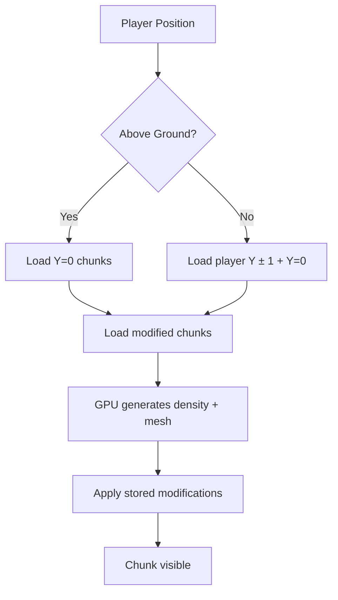

# 3D Chunk System Architecture

## Overview

The terrain system uses **GPU-accelerated Marching Cubes** with a 3D chunk grid that supports unlimited vertical exploration (digging and building).

---

## Core Concepts

### Chunk Coordinates
- **Vector3i(x, y, z)** - each chunk is a 32×32×32 voxel cube
- **CHUNK_STRIDE = 31** - chunks overlap by 1 voxel for seamless mesh connections
- **World Position** = `coord * CHUNK_STRIDE`

### Y-Layer System
| Layer | World Y Range | Purpose |
|-------|---------------|---------|
| Y=-20 to Y=-1 | -620 to -1 | Underground (caves, tunnels) |
| Y=0 | 0 to 30 | **Surface terrain** (always loaded) |
| Y=1 to Y=40 | 31 to 1240 | Sky (player builds, mountains) |

---

## How Loading Works



### Loading Rules
1. **Initial Load**: Only Y=0 (fast startup)
2. **Exploration**: Y=0 + any chunks in `stored_modifications` 
3. **Underground**: Y=0 + player's current Y layer ± 1

### Unloading Rules
- Chunks unload when player moves `render_distance + 2` away
- Surface layers (Y=-1 to Y=1) are protected from vertical unload

---

## How Modifications Work

When player digs or places terrain:

1. **Store modification** in `stored_modifications[Vector3i]`
2. **If chunk is loaded**: Apply immediately via GPU shader
3. **If chunk is NOT loaded**: Queue chunk generation with high priority
4. **When chunk regenerates**: Replay all stored modifications

```gdscript
# Modifications are stored forever (until save/load implemented)
stored_modifications = {
    Vector3i(0, -1, 0): [
        { brush_pos, radius, value, shape, layer }
    ],
    Vector3i(0, 1, 0): [...]
}
```

---

## Why This Works

| Concern | Solution |
|---------|----------|
| Performance on surface | Only Y=0 loads by default |
| Underground digging | Dig triggers chunk generation with mods |
| Building upward | Mods stored, chunks reload with builds |
| Chunk boundaries | CHUNK_STRIDE overlap ensures seamless mesh |
| Memory | Chunks unload when far, mods stay in memory |

---

## Current Limitations

1. **In-memory only** - Modifications lost on game restart (need save system)
2. **Large builds** - Many modified chunks = memory usage grows
3. **Vertical flight** - Flying quickly through Y layers loads many chunks

---

## File Structure

| File | Purpose |
|------|---------|
| [chunk_manager.gd](file:///c:/Users/Windows10_new/Documents/gpu-marching-cubes/marching_cubes/chunk_manager.gd) | Core chunk system, loading, modifications |
| [gen_density.glsl](file:///c:/Users/Windows10_new/Documents/gpu-marching-cubes/marching_cubes/gen_density.glsl) | GPU terrain density generation |
| [modify_density.glsl](file:///c:/Users/Windows10_new/Documents/gpu-marching-cubes/marching_cubes/modify_density.glsl) | GPU modification shader |
| [marching_cubes.glsl](file:///c:/Users/Windows10_new/Documents/gpu-marching-cubes/marching_cubes/marching_cubes.glsl) | GPU mesh generation |

---

## Summary

This is a **production-viable architecture** used by games like Minecraft and No Man's Sky. The key insight is:

> **Don't load everything. Store changes. Replay on demand.**

The complexity you've experienced is normal for infinite terrain systems. Each "fire" we put out was a real issue that needed solving - not a sign of broken design.
