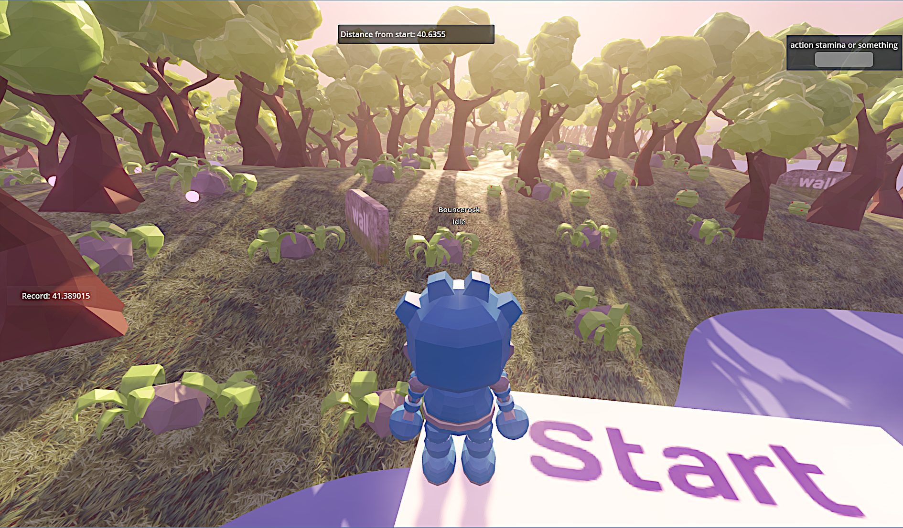
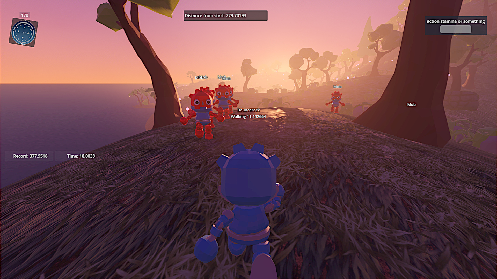
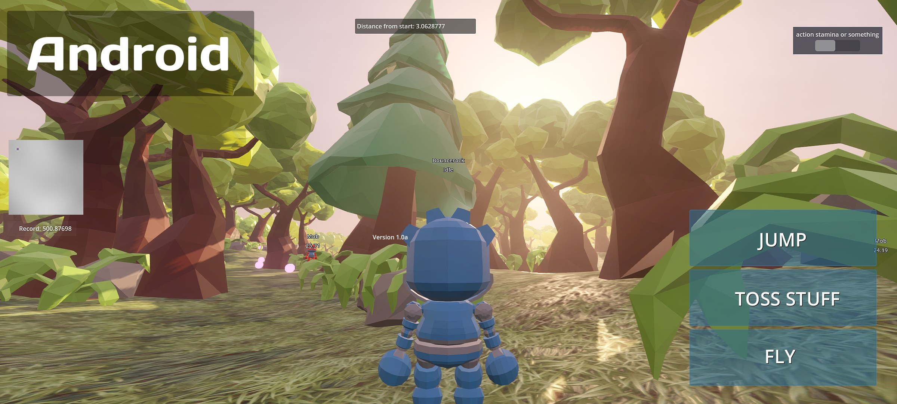
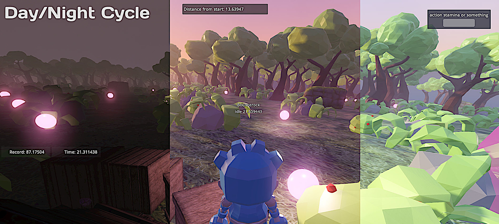

# Infinite Runner - Godot Procedural World Generation Demo Project

New! Winter 2025 Update: A new Tower and optimization updates!

Full Godot C# project for procedural infinite terrain generation, including random items or obstacles spreading throughout the map, and physics enabled. 
Contains a dynamic day/night cycle, simulating day light and sky color.  
Mesh generation logic based on Sebastian Lague's Procedural Landmass Generation, optimized and customized to work in Godot 4.4 and lower. Works on PC and Android. Other platforms still untested, but probably work as well.

Playable executables here, available on Windows, Android and Linux: https://bouncerocksoftware.itch.io/infinite-runner

## Demo Project
In the demo, you can play a simple character in third person view. Obstacles are generated and randomized throughout the infinite map. Mindless mobs spawn randomly around the player and move toward him. Try to run away as far away as possible from the starting point, but if you let the mobs get too close, the distance counter resets.
This is a simple starter demo to showcase the project, but can be extended to support any actual gameplay.
How to Play:
- You start in a safe zone, once you get out, mobs start spawning.
- Move using WASD. On mobile, control buttons are available.
- Run using Shift. Consumes stamina.
- Throw crates with Left Click. Crates don't do anything special, it's just a demonstration of physics capabilities. Consumes stamina.
- Jump with Space
- Fly with F. You must be in the air. Consumes stamina.
- NEW！ Glide while in the air by pressing SHIFT.

Replenish your stamina by collecting pink orbs.

Mobs are constantly spawned around the player. NEW! The farther away, the more mobs will spawn, and they'll be faster !
Mobs are cleaned-up when they get too far.
Doing any sort of action will consume stamina, shown in the upper right bar. Once you're out of stamina, you can only walk. 
If any mob gets too close, the distance counter resets, the safe zone resets around you, and you need to start over.

## Key Features
- Terrain generation, by default using Godot's Simplex Perlin Noise, but fully extensible and allowing any type of blend or crazy stuff.
- Terrain LOD. Adjustable draw distance.
- Day/night dynamic cycle. 
- The mesh is generated around the player and cleaned depending on distance.
- Objects can be spawned throughout the map, customizable and randomizable.
- Physics enabled playable character and items.
- Water shader, adapting to sky color.
- Works on mobile, with adapted touch interface and UI.
- No external dependency, completely self-contained.
  
## Incomplete features
- NEW! Terrain shader now supports blended textures.
- There is the base code logic to create and save chunk files (FileWriter.cs), making it potentially possible to save chunks data on disk or transfer them to a remote server. This would allow persitent terrain deformation, but still untested.
- Water spawns at elevation 0, but it's a simple mesh with no logic. Although terrain objects will not spawn under elevation zero, the character and mobs will not drown or swim.
- For now there isn't any kind of variable exposed to customize generation, all must be done through code.

Overall, it would be super nice to turn this into a neat plugin, but I do lack the time to work more than a couple of minutes here and there, so if you would like to help or receive help, join our [Discord](https://discord.gg/JhnQwUpFBm)! 
